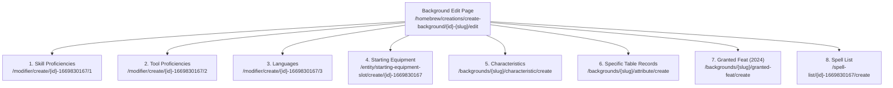

# D&D Beyond Homebrew Background Creation Reference Guide

A complete technical and design specification for creating homebrew backgrounds on D&D Beyond (both 5e 2014 and 2024 editions), covering design philosophy, DOM form structures, subforms, characteristics tables, Playwright automation patterns, and common pitfalls.

---

## 1. 5e Design Principles & Balance

### Core Philosophy (From James Introcaso's *Design Workshop: Backgrounds* & DMG Ch. 8)
A background provides a character with identity, history, and narrative context before their adventuring career began. When designing a background:

1. **Broad Concept, Generic Naming**:
   - Official backgrounds are deliberately broad (e.g., *Criminal*, *Noble*, *Hermit*, *Sailor* rather than *Waterdeep Jewel Thief* or *Cormyrian Courier*).
   - Broad names accommodate varied character concepts while fitting neatly into any setting.
2. **Three-Part Narrative Introduction**:
   - **Opening Flavor**: 2–3 paragraphs defining the archetype.
   - **Guiding Questions**: Questions prompting the player to flesh out their personal history (e.g., *"What terrible deeds did you commit? What magic transformed you into your new form?"*).
   - **Call to Adventure**: Clear story justification explaining why this character abandoned their former life to undertake perilous adventures.
3. **Reskinning & Tweaking**:
   - Always check if an existing official background can be reskinned (changing flavor, keeping mechanics) or tweaked (swapping 1 skill or tool) before building from scratch.

---

### The Standard 5e 2014 Budget
Every standard 5e background adheres to a strict mechanical budget:

| Component | Standard Allocation | Design Rules & Restrictions |
| :--- | :--- | :--- |
| **Skill Proficiencies** | Exactly **2** skills | All 5e skills are considered mathematically equal in budget. Select any two that fit the narrative archetype. |
| **Tools & Languages** | Total of **2** options | Must be one of: <br>• **2 Tool Proficiencies**, OR<br>• **2 Languages**, OR<br>• **1 Tool Proficiency + 1 Language**. |
| **Starting Equipment** | 4 standard components | 1. **Clothes**: Set of common, fine, traveler's, or costume clothes.<br>2. **Practical Adventuring Gear**: 1 to 3 items from PHB Ch. 5 (e.g., crowbar, holy symbol, artisan's tools).<br>3. **Unique Flavor Item**: A thematic token or memento (e.g., sketch of a monster form, trophy, signet ring).<br>4. **Starting Wealth**: Multiple of 5 gp between **5 gp and 25 gp** (Hermit: 5 gp, Soldier: 10 gp, Entertainer: 15 gp, Noble: 25 gp). |
| **Background Feature** | Exactly **1** feature | **Strictly a narrative ribbon** (see below). No numerical combat bonuses. |
| **Variant Feature / Background** | Optional (0–1) | Narrative alternate or replacement feature (e.g., *Noble* with *Retainers* variant). |
| **Background-Specific Table** | Optional (1) | Thematic d6 or d8 table adding granularity (e.g., *Criminal Specialty*, *Guild Business*). |
| **Characteristics** | 4 standard tables | • **8 Personality Traits** (d8)<br>• **6 Ideals** (d6)<br>• **6 Bonds** (d6)<br>• **6 Flaws** (d6) |

---

### Golden Rule of Background Features: Narrative Ribbons
> [!IMPORTANT]
> A background feature must **never grant numerical combat or mechanical advantages** (such as +1 AC, bonus damage, advantage on attack rolls, or extra spell slots).
> 
> Valid background features provide:
> - **Social Access & Lodging**: Free shelter and sustenance among peers or commoners (e.g., *Rustic Hospitality*, *Temple Services*).
> - **Contacts & Information**: Reliable informants, underworld contacts, or scholarly archives (e.g., *Criminal Contact*, *Researcher*).
> - **Societal Immunity / Quirk Acceptance**: People ignoring minor eccentricities (e.g., *All Eyes on You*, *A Little Off*).

---

### 5e 2014 vs. 5e 2024 Differences & DDB Hybrid Architecture

| Mechanical Feature | 5e (2014 Standard) | 5e (2024 Revised / One D&D) | D&D Beyond Support |
| :--- | :--- | :--- | :--- |
| **Ability Score Increases (ASI)** | Tied to **Species/Race** | Tied to **Background** (+2/+1 or +1/+1/+1 across 3 specific stats) | Supported via `ability-scores-description` and Modifiers |
| **Granted Feat** | None (unless DM variant) | **1st-Level Origin Feat** (e.g., *Alert*, *Tough*, *Magic Initiate*, *Skilled*) | Supported via `/granted-feat/create` subform & `feat-description` |
| **Tool Proficiencies** | 0 to 2 (shared with languages) | Exactly **1 Tool Proficiency** | Supported via `/modifier/create/.../2` |
| **Languages** | 0 to 2 (shared with tools) | Moved primarily to Species & general origin rules | Supported via `/modifier/create/.../3` |
| **Spell Lists** | Strixhaven / Ravnica only | Standard origin features for specific backgrounds | Supported via `/spell-list/.../create` subform |

D&D Beyond's homebrew builder uses a **hybrid architecture** that supports both 2014 classic backgrounds and 2024 origin backgrounds simultaneously.

---

## 2. D&D Beyond Form Structure & Field Specs

### Creation Flow Overview
Background creation is a **two-phase process**:
1. **Initial Creation Page (`/homebrew/creations/create-background/create`)**:
   - Establishes basic identity, narrative description textareas, and unlocks subforms.
2. **Edit Page (`/homebrew/creations/create-background/{id}-{slug}/edit`)**:
   - Exposes **8 mechanical subforms** for proficiencies, equipment, characteristics tables, granted feats, and spell lists.

---

### Base Form Fields (`#background-form`)

```
URL: https://www.dndbeyond.com/homebrew/creations/create-background/create
Form ID: #background-form
Form Class: ddb-homebrew-create-form
Method: POST
```

| Field Label (DOM) | Input ID | HTML Type | Required | Notes & Description |
| :--- | :--- | :--- | :---: | :--- |
| **NAME** | `#field-name` | `text` | **Yes** | Background name (e.g., "Grave Robber"). |
| **VERSION** | `#field-version` | `text` | **Yes** | Version number (default: `"1"`). |
| **INTRODUCTION** | `#field-short-description` | `textarea` (TinyMCE) | **Yes** | Primary narrative introduction and character hook. |
| **ABILITY SCORES DESCRIPTION** | `#field-ability-scores-description` | `textarea` (TinyMCE) | No | 2024 rules: describes recommended ASI (e.g., "Strength, Constitution"). |
| **FEAT DESCRIPTION** | `#field-feat-description` | `textarea` (TinyMCE) | No | 2024 rules: describes the granted Origin Feat (e.g., "Tough"). |
| **SKILL PROFICIENCIES DESCRIPTION** | `#field-skill-proficiencies-description` | `textarea` (TinyMCE) | No | Flavor text for granted skills. **Must also be added to subform 1**. |
| **TOOL PROFICIENCIES DESCRIPTION** | `#field-tool-proficiencies-description` | `textarea` (TinyMCE) | No | Flavor text for granted tools. **Must also be added to subform 2**. |
| **LANGUAGES DESCRIPTION** | `#field-languages-description` | `textarea` (TinyMCE) | No | Flavor text for languages. **Must also be added to subform 3**. |
| **EQUIPMENT DESCRIPTION** | `#field-equipment-description` | `textarea` (TinyMCE) | No | Flavor text for starting items. **Must also be added to equipment subform**. |
| **BACKGROUND-SPECIFIC TABLE NAME** | `#field-attribute-name` | `text` | No | Title of custom roll table (e.g., "Criminal Specialty"). |
| **BACKGROUND-SPECIFIC TABLE DESCRIPTION.** | `#field-attribute-description` | `textarea` (TinyMCE) | No | Narrative prompt for the custom table. Rows added via subform. |
| **FEATURE NAME** | `#field-feature-name` | `text` | No | Name of background ribbon feature. |
| **FEATURE DESCRIPTION** | `#field-feature-description` | `textarea` (TinyMCE) | No | Full narrative rules text for the ribbon feature. |
| **VARIANT NAME** | `#field-variant-name` | `text` | No | Optional variant title (e.g., "Spy"). |
| **VARIANT DESCRIPTION** | `#field-variant-description` | `textarea` (TinyMCE) | No | Narrative flavor for the variant. |
| **VARIANT FEATURE NAME** | `#field-variant-feature-name` | `text` | No | Alternate feature title. |
| **VARIANT FEATURE DESCRIPTION** | `#field-variant-feature-description` | `textarea` (TinyMCE) | No | Alternate feature rules text. |
| **SUGGESTED CHARACTERISTICS DESCRIPTION** | `#field-suggested-characteristics-description` | `textarea` (TinyMCE) | No | **CRITICAL**: If left blank, the Characteristics subform is locked out! |
| **SPELL LIST INTRODUCTION DESCRIPTION** | `#field-spell-list-pre-description` | `textarea` (TinyMCE) | No | Introductory text for expanded spell lists (Ravnica/Strixhaven). |
| **SPELL LIST EXTENDED DESCRIPTION** | `#field-spell-list-post-description` | `textarea` (TinyMCE) | No | Post-table spell notes. |
| **CONTACTS DESCRIPTION** | `#field-contacts-description` | `textarea` (TinyMCE) | No | Flavor text for guild/faction contacts. |
| **BACKGROUND TAGS** | `#field-background-tags-public` | `select[multiple]` (Select2) | No | Search tags for compendium browsing. |

> [!CAUTION]
> **The Characteristics Prerequisite Trap**:
> The live D&D Beyond tooltip states:
> *"Leave this blank if your background does not offer characteristics. You can add characteristic data after initial save, but **only if you have provided a description here**."*
> If you do not enter at least one sentence in `#field-suggested-characteristics-description` during initial creation, DDB will not display or link the Characteristics subform!

---

## 3. Subforms & Mechanical Configuration (Post-Initial-Save)

Upon submitting the base form, you are redirected to `/homebrew/creations/create-background/{id}-{slug}/edit`.
Backgrounds utilize **entityTypeId `1669830167`**.

### Overview of Subform Routes



---

### Detailed Subform Specifications

#### 1. Skill Proficiencies (`/modifier/create/{id}-1669830167/1`)
- **Form Action**: `POST /modifier/create/{id}-1669830167/1`
- **Fields**:
  - `#field-spell-modifier-default-sub-types` (`select[multiple]` with Select2)
- **Options**: All 18 5e skills (Athletics, Acrobatics, Sleight of Hand, Stealth, Arcana, History, Investigation, Nature, Religion, Animal Handling, Insight, Medicine, Perception, Survival, Deception, Intimidation, Performance, Persuasion).
- **Automation Tip**: Multiple skills can be selected simultaneously in a single submission by passing an array of values to the Select2 container.

#### 2. Tool Proficiencies (`/modifier/create/{id}-1669830167/2`)
- **Form Action**: `POST /modifier/create/{id}-1669830167/2`
- **Fields**:
  - `#field-spell-modifier-default-sub-types` (`select[multiple]` with Select2)
- **Options**: Artisan's tools (Alchemist, Brewer, Smith, etc.), kits (Disguise Kit, Forgery Kit, Herbalism Kit, Poisoner's Kit), Thieves' Tools, Musical Instruments, Gaming Sets, and Vehicles (Land/Water).

#### 3. Languages (`/modifier/create/{id}-1669830167/3`)
- **Form Action**: `POST /modifier/create/{id}-1669830167/3`
- **Fields**:
  - `#field-spell-modifier-default-sub-types` (`select[multiple]` with Select2)
- **Options**: Common, Dwarvish, Elvish, Giant, Gnomish, Goblin, Halfling, Orc, Abyssal, Celestial, Draconic, Deep Speech, Infernal, Primordial, Sylvan, Undercommon, etc.

#### 4. Starting Equipment (`/entity/starting-equipment-slot/create/{id}-1669830167`)
- **Form Action**: `POST /entity/starting-equipment-slot/create/{id}-1669830167`
- **Fields**:
  - `#field-name` (`input[type=text]`, maxlength 2048, *Required*)
- **Format**: Plain text item entry (e.g., `"A set of artisan's tools (one of your choice)"`, `"A crowbar"`, `"A pouch containing 15 gp"`).
- **Execution**: Submit once per discrete equipment line.

#### 5. Characteristics (`/backgrounds/{slug}/characteristic/create`)
- **Form Action**: `POST /backgrounds/{slug}/characteristic/create`
- **Fields**:
  - `#field-type` (`select`, *Required*):
    - `1`: Personality Trait
    - `2`: Ideal
    - `3`: Bond
    - `4`: Flaw
  - `#field-name` (`input[type=text]`, maxlength 256, *Required*): The trait/ideal/bond/flaw text.
- **Dynamic Table Rendering**: DDB calculates die sizes automatically based on row count:
  - 8 entries under type `1` ➔ Renders a **d8 Personality Trait** table (rows 1–8).
  - 6 entries under type `2` ➔ Renders a **d6 Ideal** table (rows 1–6).
  - 6 entries under type `3` ➔ Renders a **d6 Bond** table (rows 1–6).
  - 6 entries under type `4` ➔ Renders a **d6 Flaw** table (rows 1–6).
  - **No manual dice rolls or index numbers are entered by the user.**

#### 6. Background Specific Table (`/backgrounds/{slug}/attribute/create`)
- **Form Action**: `POST /backgrounds/{slug}/attribute/create`
- **Fields**:
  - `#field-name` (`input[type=text]`, maxlength 512, *Required*): Specific record entry (e.g., `"Smuggler"`, `"Highway Robber"`).
- **Dynamic Table**: Automatically groups under the title provided in `#field-attribute-name` and auto-indexes rows (`d6`, `d8`, etc.).

#### 7. Granted Feat (`/backgrounds/{slug}/granted-feat/create`)
- **Form Action**: `POST /backgrounds/{slug}/granted-feat/create`
- **Fields**:
  - `#field-name` (`input[type=text]`): Display label.
  - `#field-feat` (`select[multiple]` with Select2): Feat ID selector (e.g., *Alert*, *Tough*, *Magic Initiate*).

#### 8. Spell List (`/spell-list/{id}-1669830167/create`)
- **Form Action**: `POST /spell-list/{id}-1669830167/create`
- **Fields**:
  - `#field-name` (`input[type=text]`): List name.
  - `#field-spell-mapping` (`select[multiple]` with Select2): Mapped spells for class spell lists.

---

## 4. Characteristics Tables & Format

### Personality Traits (d8 Table)
- **Count**: Exactly 8 options.
- **Design Rule**: Must be **non-contradictory**. Players roll twice (`2d8`) on this table to build a personality; rolling conflicting traits creates cognitive dissonance.
- **Focus**: Habits, speech quirks, body language, daily routines, social attitudes.

### Ideals (d6 Table)
- **Count**: Exactly 6 options.
- **Design Rule**: Must include alignment tags in parentheses at the very end.
- **Format**: `Name. Description. (Alignment)`
- **Example**:
  - `Freedom. Chains are meant to be broken, both literal and metaphorical. (Chaotic)`
  - `Community. We are stronger together than we could ever be alone. (Good)`
  - `Greed. Gold makes the world turn; ensure you have enough to keep turning. (Evil)`
  - `Honor. A promise made is a bond that cannot be severed. (Lawful)`
  - `Balance. Nature requires both predator and prey; extremists upset the cycle. (Neutral)`
  - `Aspiration. I seek to prove that my humble beginnings do not dictate my destiny. (Any)`

### Bonds (d6 Table)
- **Count**: Exactly 6 options.
- **Focus**: Motivations tied to people, places, institutions, or personal quests.
- **Example**:
  - `My ancestral workshop was stolen by a rival; I will reclaim it.`
  - `I owe my life to the mentor who sheltered me when no one else would.`

### Flaws (d6 Table)
- **Count**: Exactly 6 options.
- **Focus**: Compulsions, vices, irrational fears, pride, or blind spots that complicate gameplay.
- **Example**:
  - `I cannot resist taking shiny objects, regardless of who owns them.`
  - `I am convinced that anyone offering praise has an ulterior motive.`

---

## 5. D&D Beyond Tooltip Tagging System

Embed interactive compendium links directly in description text using DDB's bracket syntax:

| Entity Type | DDB Tooltip Syntax | Example |
| :--- | :--- | :--- |
| **Skill** | `[skill]Skill Name[/skill]` | `[skill]Athletics[/skill]`, `[skill]Insight[/skill]` |
| **Tool** | `[tool]Tool Name[/tool]` | `[tool]Thieves' Tools[/tool]`, `[tool]Disguise Kit[/tool]` |
| **Equipment** | `[item]Item Name[/item]` | `[item]Crowbar[/item]`, `[item]Signet Ring[/item]` |
| **Spell** | `[spell]Spell Name[/spell]` | `[spell]Light[/spell]`, `[spell]Detect Magic[/spell]` |
| **Condition** | `[condition]Condition[/condition]` | `[condition]Poisoned[/condition]`, `[condition]Prone[/condition]` |
| **Sense** | `[sense]Sense[/sense]` | `[sense]Darkvision[/sense]` |
| **Action** | `[action]Action[/action]` | `[action]Dash[/action]`, `[action]Hide[/action]` |

---

## 6. Playwright Automation Guide & DOM Selectors

### Browser Setup & Authentication
Always load the persistent storage state:

```python
from playwright.sync_api import sync_playwright

STORAGE_STATE = "/home/karpiq/.gemini/antigravity-cli/dndbeyond_storage_state.json"

with sync_playwright() as p:
    browser = p.chromium.launch(headless=True)
    context = browser.new_context(storage_state=STORAGE_STATE)
    page = context.new_page()
```

---

### Removing Overlay Blockers
DDB frequently injects Vex modals, promotional dialogs, or cookie overlays that intercept clicks:

```python
def clear_overlays(page):
    page.evaluate("() => document.querySelectorAll('.vex, .vex-overlay, .vex-content, .modal-backdrop').forEach(el => el.remove())")
```

---

### Setting TinyMCE Content Safely
Background descriptions use TinyMCE editors. Interacting via pure Playwright typing often fails because the underlying `<textarea>` is not synced:

```python
def set_tinymce_content(page, textarea_id, html_content):
    wysiwyg_id = f"{textarea_id}-wysiwyg"
    page.evaluate("""([wId, tId, html]) => {
        if (typeof tinymce !== 'undefined' && tinymce.get(wId)) {
            tinymce.get(wId).setContent(html);
            tinymce.triggerSave();
        } else {
            const el = document.getElementById(wId) || document.getElementById(tId);
            if (el) el.value = html;
        }
    }""", [wysiwyg_id, textarea_id, html_content])
```

---

### Setting Select2 Multi-Selects (Skills, Tools, Languages)
DDB's multi-select dropdowns use jQuery Select2. Manipulating them through raw DOM options or clicks can be brittle. Use jQuery triggering:

```python
def set_select2_values(page, select_id, values_list):
    page.evaluate("""([selId, vals]) => {
        const $select = $('#' + selId);
        if ($select.length) {
            $select.val(vals).trigger('change');
        }
    }""", [select_id, values_list])
```

To select skills or tools by **text label**:

```python
def select_options_by_label(page, select_id, labels):
    page.evaluate("""([selId, labelArray]) => {
        const select = document.getElementById(selId);
        if (!select) return;
        const matchingValues = [];
        for (const opt of select.options) {
            if (labelArray.includes(opt.text.trim())) {
                matchingValues.push(opt.value);
            }
        }
        $('#' + selId).val(matchingValues).trigger('change');
    }""", [select_id, labels])
```

---

### Submitting Initial Background Form
```python
def create_base_background(page, bg_data):
    page.goto("https://www.dndbeyond.com/homebrew/creations/create-background/create", wait_until="networkidle")
    clear_overlays(page)

    page.fill("#field-name", bg_data["name"])
    page.fill("#field-version", str(bg_data.get("version", "1")))
    
    # Narrative introductions
    set_tinymce_content(page, "field-short-description", bg_data["introduction"])
    set_tinymce_content(page, "field-skill-proficiencies-description", bg_data.get("skills_text", ""))
    set_tinymce_content(page, "field-tool-proficiencies-description", bg_data.get("tools_text", ""))
    set_tinymce_content(page, "field-languages-description", bg_data.get("languages_text", ""))
    set_tinymce_content(page, "field-equipment-description", bg_data.get("equipment_text", ""))
    
    # Feature
    if "feature_name" in bg_data:
        page.fill("#field-feature-name", bg_data["feature_name"])
        set_tinymce_content(page, "field-feature-description", bg_data["feature_description"])

    # Characteristics Description (MANDATORY TO UNLOCK SUBFORMS)
    char_desc = bg_data.get("characteristics_intro", "Suggested characteristics for this background.")
    set_tinymce_content(page, "field-suggested-characteristics-description", char_desc)

    # Background-specific table header
    if "table_name" in bg_data:
        page.fill("#field-attribute-name", bg_data["table_name"])
        set_tinymce_content(page, "field-attribute-description", bg_data.get("table_desc", ""))

    # Save
    page.evaluate("if (typeof tinymce !== 'undefined') tinymce.triggerSave();")
    submit_btn = page.locator("button[type='submit']:has-text('CREATE BACKGROUND')").first
    submit_btn.click(force=True)
    page.wait_for_load_state("networkidle")
    
    # Redirects to /homebrew/creations/create-background/{id}-{slug}/edit
    edit_url = page.url
    return edit_url
```

---

### Adding Characteristics Batch (Traits, Ideals, Bonds, Flaws)
```python
def add_characteristics(page, base_slug, characteristics_list):
    """
    characteristics_list is a list of tuples: (type_id, text)
    type_id: "1"=Trait, "2"=Ideal, "3"=Bond, "4"=Flaw
    """
    char_url = f"https://www.dndbeyond.com/backgrounds/{base_slug}/characteristic/create"
    for c_type, c_text in characteristics_list:
        page.goto(char_url, wait_until="networkidle")
        clear_overlays(page)
        page.select_option("#field-type", value=str(c_type))
        page.fill("#field-name", c_text[:256])
        page.locator("button[type='submit']:has-text('Save'), button:has-text('SAVE')").first.click()
        page.wait_for_load_state("networkidle")
```

---

### Clean Up & Deletion Pattern
Homebrew creations must be cleaned up if test items are created. On the public view page (`/backgrounds/{id}-{slug}`), deleting triggers an AJAX post modal:

```python
def delete_background(page, bg_id_slug):
    view_url = f"https://www.dndbeyond.com/backgrounds/{bg_id_slug}"
    page.goto(view_url, wait_until="networkidle")
    clear_overlays(page)

    del_btn = page.locator("a.homebrew-creation-actions-item-delete, a:has-text('DELETE')").first
    if del_btn.count() == 0:
        print("Delete button not found or already deleted.")
        return False

    del_btn.click()
    page.wait_for_selector(".ddb-modal, .ddb-modal-form", timeout=5000)
    
    # Click confirmation button
    confirm_btn = page.locator(".ddb-modal a:has-text('Yes'), .ddb-modal .ajax-post").first
    confirm_btn.click()
    page.wait_for_timeout(3000)
    print(f"Background {bg_id_slug} successfully deleted.")
    return True
```

---

## 7. Common Pitfalls & Gotchas

1. **The "Double-Work" UI Trap**:
   - Filling out `SKILL PROFICIENCIES DESCRIPTION` or `EQUIPMENT DESCRIPTION` on the base form **only renders cosmetic paragraph text** on the compendium view.
   - It **does not connect to the character builder** or calculate on the character sheet!
   - You **must** navigate to `/modifier/create/...` and `/entity/starting-equipment-slot/create/...` after saving to populate the sheet mechanics.
2. **Missing Characteristics Subform**:
   - If `#field-suggested-characteristics-description` is left blank on the initial creation page, the Characteristics subform will not be rendered or linked on the edit page. Always provide at least a brief paragraph.
3. **Hardcoding Roll Numbers into Characteristics**:
   - Do **not** write `"1. I always tell jokes"` or `"d8 Personality Trait"`.
   - D&D Beyond automatically numbers entries sequentially and calculates dice headers (`d8`, `d6`, `d4`) based on the total number of items saved under each type.
4. **Contradictory Personality Traits**:
   - Characters roll **twice** on the personality table. Ensure traits do not directly contradict (e.g., *"I never back down from a fight"* vs. *"I run at the first sight of danger"*). Ideals, bonds, and flaws are rolled once each and can conflict across entries.
5. **Soft Deletion & RESTORE**:
   - When a homebrew background is deleted on D&D Beyond, it enters a soft-deleted state. The public view page will remain accessible to the author but will display a `RESTORE` button instead of `EDIT`/`DELETE`, and the background will no longer appear in character builder dropdowns.
