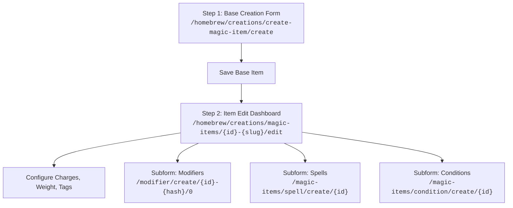

# D&D Beyond Magic Items: Comprehensive Design & Automation Reference

This document provides a complete technical, mechanical, and web-automation reference for creating and managing homebrew **Magic Items** on D&D Beyond (DDB). It incorporates official 5th Edition design guidelines (DMG & James Introcaso's *Design Workshop: Magic Items*), reverse-engineered DDB DOM structures, Select2 implementations, and Playwright recipes.

---

## 1. Overview & System Architecture

Magic items on D&D Beyond are distinct from character features or feats. While feats provide actions and level-scaling trackers, magic items utilize a dedicated **Charges & Spells** subsystem, **Base Item inheritance**, and a distinct **Two-Step Creation Flow**:



---

## 2. 5e Design Principles & Rarity Guidelines

### 2.1 Bounded Accuracy & The Core Philosophy
Fifth Edition is built on **bounded accuracy**: armor classes, attack bonuses, and saving throw DCs remain tightly constrained from level 1 to 20. The core math does **not** assume characters will receive numeric enhancement bonuses (+1, +2, +3). 
* **Attack & AC Bonuses:** Handing out +2 or +3 items early breaks bounded accuracy. A +1 bonus shifts encounter math significantly; +3 is near godlike.
* **The Three Questions Before Creation:**
  1. *What do I want to make?*
  2. *Does this item already exist in official 5e rules?*
  3. *Can I reskin or tweak an existing item instead of designing from scratch?*

### 2.2 Category & Form Breakdown
Magic items fall into 9 standardized categories:
* **Armor:** Light, medium, heavy armor, and shields. AC bonuses, passive resistances, or defensive reactions.
* **Weapon:** Melee, ranged, and ammunition. Attack/damage bonuses, extra damage dice on hit, or condition infliction on criticals/failed saves.
* **Wondrous Item:** General equipment, accessories, garments, footwear, headwear, jewelry, musical instruments, and containers.
* **Potion:** Consumable liquids. Usually grant temporary buffs or spell effects without attunement.
* **Ring:** Wearable jewelry, typically requiring attunement, granting active spellcasting or passive utility.
* **Rod:** Spellcasting focus, martial rod, or metamagic amplifier (e.g., *Rod of the Pact Keeper*).
* **Scroll:** Single-use consumable containing a spell. Cast once, then destroyed.
* **Staff:** Major spellcasting focus with multiple charges and a broad spell list. Typically restricted to spellcasters.
* **Wand:** Minor or specialized focus with 7 charges casting 1–3 themed spells.

> [!TIP]
> **Thematic Integrity:** Keep abilities anchored to what the mundane item does. Armor enhances AC/protection; weapons grant combat riders; boots affect movement and stealth; helms affect senses and mental defenses; staves amplify spellcasting.

### 2.3 Official Rarity Tiers & DMG Power Benchmarks

| Rarity | Character Tier | Weapon / Armor Enhancements | Max Spell Equivalent | DMG Value / Cost Benchmark | Example Items |
| :--- | :--- | :--- | :--- | :--- | :--- |
| **Common** | Tier 1 (Lv 1–4) | Flavor / ribbon only (no +1) | Cantrip or 1st-level | 50–100 gp | *Potion of Healing*, *Cloak of Billowing*, *Wand of Smiles* |
| **Uncommon** | Tier 1 (Lv 1–4) | +1 Weapon, +1 Shield (*no armor!*) | 1st–3rd level spells | 101–500 gp | *Weapon, +1*, *Shield, +1*, *Wand of Magic Missiles*, *Winged Boots* |
| **Rare** | Tier 2 (Lv 5–10) | +2 Weapon, +1 Armor (*all +1 armor begins here*) | 4th–5th level spells | 501–5,000 gp | *Armor, +1*, *Weapon, +2*, *Sun Blade*, *Ring of Protection*, *Flame Tongue* |
| **Very Rare** | Tier 3 (Lv 11–16) | +3 Weapon, +2 Armor | 6th–7th level spells | 5,001–50,000 gp | *Armor, +2*, *Weapon, +3*, *Staff of Power*, *Belt of Fire Giant Strength* |
| **Legendary** | Tier 4 (Lv 17–20) | +3 Armor, +3 Weapon + Major riders | 8th–9th level spells | 50,000+ gp | *Armor, +3*, *Holy Avenger*, *Staff of the Magi*, *Armor of Invulnerability* |
| **Artifact** | Unique / Plot | Unique, major/minor properties | 9th-level / Plot effect | Invaluable | *Eye of Vecna*, *Wand of Orcus*, *Axe of the Dwarvish Lords* |

### 2.4 Attunement Economy & Balancing Principles
A character has exactly **3 attunement slots** (unless modified by class features like the 14th/18th/20th level Artificer).

* **When to Require Attunement:**
  1. **Hot Potato Prevention:** If passing the item around the party would be disruptive or abusive (e.g., passing a stat-setting item to buff everyone during downtime, or sharing an item with passive healing/resistances).
  2. **Bonus Stacking:** If the item grants AC, saving throw bonuses, or spell attack/DC increases, require attunement to prevent stacking AC to untouchable levels.
  3. **High Impact & Flight:** Permanent flight, true sight, or high-tier spell pools.
* **When NOT to Require Attunement:**
  1. **Consumables:** Potions, scrolls, and magic ammunition **never** require attunement.
  2. **Baseline Enhancements:** Standard `+1`, `+2`, `+3` weapons and shields do not require attunement in core 5e.
* **Attunement Restrictions:**
  * **By Spellcaster:** Used for staves and wands to prevent martial characters from becoming pseudo-multiclass casters.
  * **By Specific Class:** E.g., *"requires attunement by a druid, sorcerer, warlock, or wizard"*.
  * **By Race / Species or Alignment:** E.g., *Moonblade* (*"requires attunement by an elf or half-elf of neutral good alignment"*), *Holy Avenger* (*"requires attunement by a paladin"*).

### 2.5 Charge Economy & Reset Mechanics
* **Standard Charges:** 
  * Wands typically have **7 charges**.
  * Staves typically have **10 to 50 charges** (e.g., Staff of Power has 20, Staff of the Magi has 50).
  * Rings and wondrous items typically have **3 to 5 charges**.
* **Recharge Formulas:**
  * Staves/Wands: Regains `1d6 + 1` or `1d4 + 1` expended charges daily at **dawn**.
  * Minor items: Regains `1d3` charges daily at **dawn**.
  * Rest-based: Regains all charges on a **Short Rest** or **Long Rest**.
* **The "Depletion Roll" Clause:**
  * Classic 5e wands/staves include: *"If you expend the wand's last charge, roll a d20. On a 1, the wand crumbles into ashes and is destroyed."*

---

## 3. DDB Form Structure & Field Specs

### 3.1 Base Creation Form
**URL:** `https://www.dndbeyond.com/homebrew/creations/create-magic-item/create`

| Field Label | Input ID | HTML Type | Required | Values / Options / Format |
| :--- | :--- | :--- | :--- | :--- |
| **Name** | `#field-name` | `text` | **Yes** | Item name (2–256 chars). Descriptive, unique. |
| **Version** | `#field-version` | `text` | No | Version string (`1`, `1.0`). |
| **Rarity** | `#field-rarity` | `select` | **Yes** | `1`=Common, `2`=Uncommon, `3`=Rare, `4`=Very Rare, `5`=Legendary, `7`=Artifact, `9`=Varies, `10`=Unknown |
| **Base Item Type** | `#field-item-base-type` | `select` | **Yes** | `""`=Item, `701257905`=Armor, `1782728300`=Weapon |
| **Magic Item Type** | `#field-type` | `select` | **Cond.** | Enabled when Base Item Type is `Item` (`""`). Values: `10`=Wondrous Item, `4`=Ring, `3`=Potion, `5`=Rod, `6`=Scroll, `7`=Staff, `8`=Wand. |
| **Base Armor** | `#field-base-armor` | `select` | **Cond.** | Enabled when Base Item Type is `Armor`. Values: `13`=Breastplate, `18`=Plate, `8`=Shield, `10`=Leather, etc. |
| **Dexterity Modifier** | `#field-dexterity-modifier`| `select` | No | `1`=Full Modifier, `2`=Max 2, `3`=None. Overrides default armor DEX cap if customized. |
| **Strength Requirement**| `#field-strength-requirement`| `text` | No | Numeric string (e.g. `13`, `15`). |
| **Stealth Check** | `#field-stealth-check` | `select` | No | `1`=None, `2`=Disadvantage. |
| **Base Weapon** | `#field-base-weapon` | `select` | **Cond.** | Enabled when Base Item Type is `Weapon`. Values: `4`=Longsword, `3`=Dagger, `19`=Battleaxe, `28`=Rapier, etc. |
| **Requires Attunement** | `#field-requires-attunement`| `checkbox` | No | Hidden inside `.fc-real`. Toggle via `#fc-fake-requires-attunement`. |
| **Attunement Description**| `#field-attunement-description`| `text` | No | Detailed requirement (e.g., `by a spellcaster`). |
| **Description** | `#field-item-description-wysiwyg`| `textarea/MCE`| **Yes** | HTML rules text formatted with DDB tooltip tags. |

### 3.2 Dynamic Behavior in Base Form
* Selecting **Armor** (`701257905`): Disables `#field-type`; enables `#field-base-armor`, `#field-dexterity-modifier`, `#field-strength-requirement`, and `#field-stealth-check`.
* Selecting **Weapon** (`1782728300`): Disables `#field-type`; enables `#field-base-weapon`.
* Selecting **Item** (`""`): Disables armor/weapon fields; enables `#field-type` (Wondrous Item, Ring, Rod, Staff, Wand, Potion, Scroll).

### 3.3 Edit Form (Post-Creation Fields)
**URL:** `https://www.dndbeyond.com/homebrew/creations/magic-items/{id}-{slug}/edit`

After submitting the base form, the user is redirected to the edit page where the following core fields become accessible:

| Field Label | Input ID | HTML Type | Description / Accepted Values |
| :--- | :--- | :--- | :--- |
| **Has Charges** | `#field-has-charges` | `checkbox` | Must be checked (`value="y"`) if the item uses charges. |
| **Number of Charges** | `#field-number-of-charges` | `text` | Integer maximum charges (e.g., `7`, `10`, `50`). |
| **Charge Reset Condition**| `#field-charge-reset-condition`| `select` | `1`=Short Rest, `2`=Long Rest, `3`=Dawn, `4`=None Consumable, `5`=Other. |
| **Charge Reset Description**| `#field-charge-reset-description`| `text/textarea`| Formula string (e.g., `1d6 + 1 charges daily at dawn`). |
| **Weight** | `#field-weight` | `text` | Decimal or integer in lbs. Overrides base item weight. |
| **Tags** | `#field-magic-item-tags-public`| `select2` | Public searchable tags (Combat, Damage, Control, Protection, Utility, Jewelry, etc.). |
| **Notes** | `#field-notes` | `textarea` | DM / private notes. |

---

## 4. Subforms Deep Dive

### 4.1 Subform: Modifiers
**URL:** `/modifier/create/{item_id}-{hash}/0`

Modifiers translate narrative descriptions into functional character sheet mechanics.

#### 1. Form Inputs

| Field Label | Input ID | HTML Type | Role |
| :--- | :--- | :--- | :--- |
| **Modifier Type** | `#field-spell-modifier-type` | Select2 | High-level effect category (Bonus, Damage, Immunity, etc.). |
| **Modifier Subtype**| `#field-spell-modifier-sub-type`| Select2 | Specific target (Armor Class, Magic, Thunder, etc.). Populated via AJAX. |
| **Ability Score** | `#field-rpg-stat` | `select` | Ability target if applicable (`STR`, `DEX`, `CON`, `INT`, `WIS`, `CHA`). |
| **Dice Count** | `#field-dice-count` | `text` | Integer dice count (e.g., `2` for 2d8). |
| **Die Type** | `#field-dice-value` | `select` | `d4`, `d6`, `d8`, `d10`, `d12`, `d20`. |
| **Fixed Value** | `#field-fixed-value` | `text` | Flat numerical bonus (e.g., `1`, `2`, `19`). |
| **Details / Restriction**| `#field-restriction` | `text` | Contextual conditions (e.g., *"Against stone or earth creatures"*). |
| **Requires Attunement**| `#field-requires-attunement` | `checkbox` | **CRITICAL:** Defaults to CHECKED. Must be unchecked if item does not require attunement! |

#### 2. Key Modifier Recipes for Magic Items

* **Enchanted Weapon (+1, +2, +3):**
  * `Modifier Type`: **`Bonus`**
  * `Modifier Subtype`: **`Magic`** *(Applies +N to BOTH attack and damage rolls)*
  * `Fixed Value`: `1`, `2`, or `3`
* **Enchanted Armor (+1, +2, +3 AC):**
  * `Modifier Type`: **`Bonus`**
  * `Modifier Subtype`: **`Armor Class`**
  * `Fixed Value`: `1`, `2`, or `3`
* **Additional Damage on Weapon Hit (e.g., +2d8 Thunder):**
  * `Modifier Type`: **`Damage`**
  * `Modifier Subtype`: **`Thunder`** (or `Fire`, `Radiant`, etc.)
  * `Dice Count`: `2`
  * `Die Type`: `d8`
* **Damage Resistance:**
  * `Modifier Type`: **`Resistance`**
  * `Modifier Subtype`: E.g., `Fire`, `Cold`, `Lightning`, `Poison`, or `Bludgeoning, Piercing, and Slashing from Nonmagical Attacks`
* **Condition Immunity:**
  * `Modifier Type`: **`Immunity`**
  * `Modifier Subtype`: E.g., `Poisoned`, `Prone`, `Frightened`, `Charmed`
* **Stat Setting (e.g., Gauntlets of Ogre Power, Headband of Intellect):**
  * `Modifier Type`: **`Set`**
  * `Modifier Subtype`: `Strength Score` (or `Intelligence Score`, etc.)
  * `Fixed Value`: `19`
* **Senses (e.g., Darkvision 60 ft):**
  * `Modifier Type`: **`Sense`**
  * `Modifier Subtype`: `Darkvision`
  * `Fixed Value`: `60`
* **Weapon Property Grant:**
  * `Modifier Type`: **`Weapon Property`**
  * `Modifier Subtype`: `Finesse`, `Thrown`, `Versatile`, etc.

---

### 4.2 Subform: Spells
**URL:** `/magic-items/spell/create/{item_id}`

Allows an item to grant or cast spells from charges or at will.

#### 1. Form Inputs

| Field Label | Input ID | HTML Type | Role |
| :--- | :--- | :--- | :--- |
| **Spell Name** | `#field-item-spell` | Select2 | Searchable dropdown containing all 890+ 5e spells. |
| **Min Charges** | `#field-min-charges` | `text` | Charges required to cast the baseline spell. |
| **Max Charges** | `#field-max-charges` | `text` | Max charges spendable (for upcasting). Set equal to Min Charges if fixed. |
| **Save DC** | `#field-save-dc` | `text` | Fixed DC (e.g. `15`). If left blank, defaults to character's spell save DC. |
| **Cast at Spell Level**| `#field-cast-at-level` | Select2 | Spell level cast at. Dynamically updates based on selected spell. |
| **Details / Restriction**| `#field-restriction` | `text` | E.g., *"Requires no material components"*, *"Self only"*. |

#### 2. Dynamic Upcasting Logic
When `#field-item-spell` is selected, DDB's AJAX populates `#field-cast-at-level` with available slot levels starting from the spell's minimum level up to 9th level. 
* If *Cure Wounds* (1st-level) is selected: Min Charges = 1, Max Charges = 4.
* If *Fireball* (3rd-level) is selected with fixed casting: Min Charges = 3, Max Charges = 3, Cast at Level = 3.

---

### 4.3 Subform: Conditions
**URL:** `/magic-items/condition/create/{item_id}`

> [!WARNING]
> **Condition Subform vs Immunity:** This subform is used when the magic item **imposes** or **inflicts** a condition on a target (e.g., a weapon that knocks targets *Prone*, or a wand that blinds). To grant a character *immunity* to a condition while wearing/attuned, use **Modifiers -> Immunity** instead!

#### Form Inputs
* **Condition (`#field-item-condition`):** Blinded (1), Charmed (2), Deafened (3), Exhaustion (4), Frightened (5), Grappled (6), Incapacitated (7), Invisible (8), Paralyzed (9), Petrified (10), Poisoned (11), Prone (12), Restrained (13), Stunned (14), Unconscious (15).
* **Condition Duration (`#field-condition-duration`):** Integer duration value.
* **Duration Unit (`#field-duration-unit`):** `1`=Round, `2`=Minute, `3`=Hour, `4`=Day, `5`=Until Dispelled, `6`=Special.
* **Details / Exception (`#field-condition-exception`):** E.g., *"DC 15 Strength saving throw negates"*, *"Beasts only"*.

---

## 5. Web Automation & DOM Guide (Playwright Recipes)

### 5.1 Storage State & Context Initialization
Always initialize Playwright with the user's stored authentication cookies:

```python
import os
from playwright.sync_api import sync_playwright

STORAGE_STATE = os.path.expanduser("~/.gemini/antigravity-cli/dndbeyond_storage_state.json")

def get_context(playwright):
    browser = playwright.chromium.launch(headless=True)
    ctx = browser.new_context(
        storage_state=STORAGE_STATE,
        user_agent="Mozilla/5.0 (X11; Linux x86_64) AppleWebKit/537.36 (KHTML, like Gecko) Chrome/128.0.0.0 Safari/537.36"
    )
    return browser, ctx
```

### 5.2 Waterdeep Fancy Checkbox Pattern
D&D Beyond hides native checkboxes inside `.hide.fc-real` and overlays a stylized `.fc-fake` wrapper. 
* To check **Requires Attunement** reliably:
```python
# Option A: Click the fake toggle
page.locator("#fc-fake-requires-attunement").click()

# Option B: Force check the real hidden input
page.check("#field-requires-attunement", force=True)
```

### 5.3 Select2 Custom Dropdowns Automation
Select2 dropdowns cannot be filled with standard `page.select_option()` when initialized with dynamic remote/AJAX datasets. Use the container click pattern:

```python
def select_select2(page, container_id, search_text, exact=True):
    # Click the visible select2 container
    page.locator(f"#{container_id}").click()
    page.wait_for_timeout(300)
    
    # Locate search input (can be top or bottom)
    search_input = page.locator(".select2-drop-active input.select2-input")
    if search_input.count() > 0 and search_input.is_visible():
        search_input.fill(search_text)
        page.wait_for_timeout(500)
        
    # Pick matching option from results list
    if exact:
        option = page.locator(".select2-results li").filter(has_text=search_text).first
    else:
        option = page.locator(f".select2-results li:has-text('{search_text}')").first
    option.click()
    page.wait_for_timeout(500)
```

### 5.4 TinyMCE Description Automation
To set formatted rules text without editor timing issues:

```python
def set_tinymce_content(page, html_content):
    page.evaluate("""(html) => {
        if (typeof tinymce !== 'undefined' && tinymce.get('field-item-description-wysiwyg')) {
            tinymce.get('field-item-description-wysiwyg').setContent(html);
            tinymce.triggerSave();
        } else {
            const ta = document.getElementById('field-item-description-wysiwyg') || 
                       document.getElementById('field-item-description');
            if (ta) ta.value = html;
        }
    }""", html_content)
```

### 5.5 Dismissing Modal & Cookie Overlays
Before clicking submit buttons or dropdowns, remove floating toast notifications and vex overlays:

```python
page.evaluate("() => document.querySelectorAll('.vex, .vex-overlay, .vex-content, .ddb-notification-toast').forEach(el => el.remove())")
```

### 5.6 Searching & Deleting Homebrew Items
When inspecting or cleaning up temporary test creations:

```python
def delete_homebrew_item(page, item_name):
    # 1. Navigate to My Creations with name filter
    page.goto(f"https://www.dndbeyond.com/my-creations?filter-name={item_name}", wait_until="networkidle")
    
    # 2. Expand the accordion row
    row = page.locator(".list-row-homebrew-creation").first
    if row.count() == 0:
        return False
    row.click()
    page.wait_for_timeout(1000)
    
    # 3. Click the revealed Delete link
    del_link = page.locator(".homebrew-creation-actions-item-delete").first
    del_link.click()
    page.wait_for_timeout(1000)
    
    # 4. Confirm in the modal dialog
    yes_btn = page.locator(".modal-dialog a:has-text('YES'), a.ajax-post:has-text('YES')").first
    yes_btn.click()
    page.wait_for_timeout(2000)
    return True
```

---

## 6. D&D Beyond Tooltip Tagging Reference

When writing descriptions into TinyMCE, use DDB tooltip shortcodes. DDB parses these into interactive hovering tooltips and database links:

| Entity Type | Tooltip Syntax | Example |
| :--- | :--- | :--- |
| **Magic Item** | `[magicitem]item name[/magicitem]` | `[magicitem]flame tongue[/magicitem]` |
| **Mundane Item** | `[item]item name[/item]` | `[item]plate armor[/item]`, `[item]longsword[/item]` |
| **Spell** | `[spell]spell name[/spell]` | `[spell]transmute rock[/spell]`, `[spell]fireball[/spell]` |
| **Condition** | `[condition]condition name[/condition]` | `[condition]prone[/condition]`, `[condition]poisoned[/condition]` |
| **Sense** | `[sense]sense name[/sense]` | `[sense]darkvision[/sense]`, `[sense]truesight[/sense]` |
| **Action** | `[action]action name[/action]` | `[action]dash[/action]`, `[action]disengage[/action]` |
| **Monster** | `[monster]monster name[/monster]` | `[monster]stone golem[/monster]`, `[monster]earth elemental[/monster]` |
| **Alias Display** | `[tag]real name|Display Text[/tag]` | `[spell]passwall|pass through stone[/spell]` |

---

## 7. Common Pitfalls & Traps

### ❌ Trap 1: The Modifier "Requires Attunement" Default Checkbox
In the **Modifier Subform**, `#field-requires-attunement` **defaults to checked (`True`)**.
* **The Problem:** If the item itself does *not* require attunement (e.g. a mundane +1 weapon or non-attunement boots), but the modifier has this checkbox left on, the modifier **never applies to the character sheet** because the character is not attuned!
* **The Fix:** If the magic item has no attunement requirement, **always uncheck** `#field-requires-attunement` on every modifier created.

### ❌ Trap 2: Weapon Enchantment (+N to hit and damage)
* **Incorrect:** Adding `Bonus -> Weapon Attack Rolls` (+1). *This only adds to the attack roll, not the damage roll!*
* **Correct:** Use `Modifier Type: Bonus` -> `Modifier Subtype: Magic` -> `Fixed Value: 1`. DDB's `Bonus: Magic` applies to both the attack roll and the damage roll of the parent weapon.

### ❌ Trap 3: Attunement Description Formatting Duplication
* When `Requires Attunement` is checked, DDB's rendering engine automatically wraps the field as: `(requires attunement {attunement-description})`.
* **Incorrect:** Entering `"requires attunement by a spellcaster"`. Renders as: `(requires attunement requires attunement by a spellcaster)`.
* **Correct:** Enter only the restriction phrase: `by a spellcaster`, `by a creature of good alignment`, `by a druid, sorcerer, warlock, or wizard`.

### ❌ Trap 4: Missing Base Weapon/Armor Selection
* If Base Item Type is set to `Weapon` or `Armor`, you **must** select a `Base Weapon` or `Base Armor`.
* **The Problem:** If omitted or left generic, the weapon has no attack damage die (defaults to 1d4 or unequipped unarmed strike), lacks properties like Finesse/Versatile, and does not register player weapon proficiencies properly.

### ❌ Trap 5: Spells Missing Save DC
* When adding a spell to an item, leaving `#field-save-dc` blank causes the spell to use the wielder's spellcasting DC.
* **The Problem:** If a non-caster wields the item (e.g., a Fighter with a *Ring of the Ram* or *Wand of Fear*), their spell save DC is 8 + 0 = 8.
* **The Fix:** If the item has a fixed DC in 5e rules (e.g. DC 15), always explicitly populate `#field-save-dc: 15`.

### ❌ Trap 6: Imposing Conditions vs Condition Immunity
* Do not use `/magic-items/condition/create/` to grant condition immunity.
* Use `Modifier Type: Immunity` -> `Modifier Subtype: Poisoned` to grant immunity. Use the Condition subform only to inflict a condition on others.
