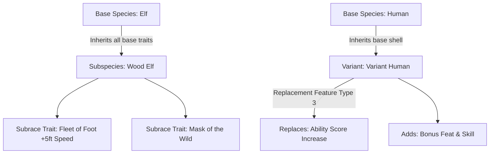

# D&D Beyond Species & Race Homebrew Reference

A complete engineering and design guide for creating, structuring, and automating **Species (Races)**, **Subspecies (Subraces)**, and **Variants** on D&D Beyond.

---

## Table of Contents
1. [5e Design Principles & Species Power Budget](#1-5e-design-principles--species-power-budget)
   - [Detect Balance Scale](#detect-balance-scale)
   - [Component Point Costs](#component-point-costs)
   - [2014 vs 2024 (5.5e) Species Architecture](#2014-vs-2024-55e-species-architecture)
   - [Combat Traits vs Ribbons](#combat-traits-vs-ribbons)
2. [DDB Creation Architecture & URL Routes](#2-ddb-creation-architecture--url-routes)
   - [Route Map](#route-map)
   - [Entity Type IDs Hierarchy](#entity-type-ids-hierarchy)
   - [The Three Creation Archetypes](#the-three-creation-archetypes)
3. [Base Species Form Fields & Selectors](#3-base-species-form-fields--selectors)
   - [Basic Information Fields](#basic-information-fields)
   - [The Critical Trait Introduction Requirement](#the-critical-trait-introduction-requirement)
4. [Racial Traits & Nested Subforms](#4-racial-traits--nested-subforms)
   - [Trait Creation Fields](#trait-creation-fields)
   - [Feature Types: Granted, Additional, Replacement](#feature-types-granted-additional-replacement)
   - [Modifiers Subform (`/modifier/create/`)](#modifiers-subform-modifiercreate)
   - [Spells Subform (`/entity/spell/create/`)](#spells-subform-entityspellcreate)
   - [Actions & Limited Use Trackers (`/entity/limited-use/create/`)](#actions--limited-use-trackers-entitylimited-usecreate)
   - [Options Subform (`/species-trait-option/create/`)](#options-subform-species-trait-optioncreate)
5. [Subspecies (Subraces) & Variants Guide](#5-subspecies-subraces--variants-guide)
   - [Parent-Child Linking](#parent-child-linking)
   - [Additive Subraces vs Replacement Variants](#additive-subraces-vs-replacement-variants)
   - [Trait Replacement Mechanics](#trait-replacement-mechanics)
6. [Playwright Automation Implementation Guide](#6-playwright-automation-implementation-guide)
   - [Session & Cookie Management](#session--cookie-management)
   - [Handling Select2 AJAX Dropdowns](#handling-select2-ajax-dropdowns)
   - [Handling TinyMCE Editors](#handling-tinymce-editors)
   - [Safe Deletion Protocol](#safe-deletion-protocol)
   - [End-to-End Automation Script Blueprint](#end-to-end-automation-script-blueprint)
7. [DDB Tooltip Tags & Snippet Formulae](#7-ddb-tooltip-tags--snippet-formulae)
   - [Rich Tooltip Tags](#rich-tooltip-tags)
   - [Dynamic Math Snippets](#dynamic-math-snippets)
8. [Common Pitfalls & Troubleshooting](#8-common-pitfalls--troubleshooting)

---

## 1. 5e Design Principles & Species Power Budget

### Detect Balance Scale
In 5e homebrew design, the community standard benchmark for racial balance is the **Detect Balance Scale** (created by Eleazzaar and widely adopted across D&D design spaces).

* **Target Score:** **24 to 27 points** (Average official race is ~25 points).
* **Acceptable Range:** **20 to 30 points**.
  * Below 20: Weak race (feels underwhelming, underperforms).
  * 24–27: Ideal balance point (matches PHB Dwarf, Elf, Half-Elf).
  * Above 30: Overpowered (crowds out other character options).

### Component Point Costs

| Trait Component | Point Value | Notes |
| :--- | :--- | :--- |
| **ASI: Standard (+2 / +1)** | **12 pts** | Default for 2014 design (+2 major stat = 8 pts, +1 minor stat = 4 pts). |
| **ASI: Flexible (+1 to any 3 or +2/+1 any)** | **12–14 pts** | Tasha / MotM style flexibility. |
| **Base Walking Speed: 30 ft** | **0 pts** | Baseline movement rate for Medium and modern Small species. |
| **Walking Speed: 35 ft** | **+2 pts** | Wood Elf, Leonin. |
| **Walking Speed: 25 ft (Legacy)** | **-2 pts** | 2014 Dwarf, Gnome, Halfling penalty. Avoid in modern 5e designs. |
| **Flying Speed (at 1st level)** | **8–12 pts** | High power cost; restricts light/medium armor to maintain balance. |
| **Swimming / Climbing Speed (30 ft)** | **2 pts** | Situational mobility; add amphibious/underwater breathing for +1. |
| **Darkvision: 60 ft** | **3 pts** | Standard sensory trait. |
| **Superior Darkvision: 120 ft** | **4 pts** | Drow, Deep Gnome (often paired with Sunlight Sensitivity: -3 pts). |
| **Damage Resistance (Common: Fire, Poison)**| **3–4 pts** | Fire or Poison damage is frequent across monster stat blocks. |
| **Damage Resistance (Uncommon: Cold, Acid)**| **3 pts** | Moderate frequency. |
| **Damage Resistance (Rare: Psychic, Radiant)**| **2 pts** | Infrequent in early/mid tiers; balances well with extra utility. |
| **Damage Immunity** | **8–12 pts** | Highly disruptive at 1st level; almost never given to player races. |
| **Skill Proficiency (Fixed)** | **2 pts** | Perception (2.5 pts), Stealth (2 pts), other skills (2 pts). |
| **Skill Proficiency (Choice of 1 from list)** | **2.5 pts** | Flexibility increases utility. |
| **Tool / Weapon Proficiency Pack** | **1–2 pts** | Martial weapon training or specialized artisan tools. |
| **Innate Spellcasting Suite** | **5–6 pts** | Cantrip at 1st (2 pts) + 1st-level spell at 3rd (1.5 pts) + 2nd-level spell at 5th (2 pts). |
| **Major Combat Ability** | **4–6 pts** | E.g., Halfling *Lucky* (6), Half-Orc *Relentless Endurance* (4), Breath Weapon (4). |
| **Ribbon Traits** | **1 pt each** | Flavor, social, or highly situational exploration traits (e.g., *Stonecunning*, *Speak with Small Beasts*, *Powerful Build*). |

---

### 2014 vs 2024 (5.5e) Species Architecture

When building homebrew species on D&D Beyond, it is vital to know which system generation you are targeting:

#### 2014 Legacy Design
* **ASIs on the Race:** Every race or subrace grants a fixed +2 / +1 Ability Score Increase (or variant human +1/+1 + feat).
* **Fixed Speeds:** Small races often suffered 25 ft speeds.
* **Cultural Traits Attached:** Races granted weapon proficiencies (Elf weapon training, Dwarf weapon training) and specific languages tied to biology.
* **Restricted Innate Magic:** Spells cast once per Long Rest, with a fixed casting ability (e.g. Charisma for Tieflings).

#### 2024 Modern Design (PHB 2024 / 5.5e)
* **NO ASIs on Species:** Ability Score Increases have moved completely to **Backgrounds**! A 2024-compatible species does **not** contain Ability Score Modifiers.
* **Uniform Speeds:** All playable species have a base walking speed of **30 feet**, regardless of whether they are Small or Medium.
* **Size Choice:** Many humanoid species (e.g., Tiefling, Aasimar, Harengon) permit choosing **Medium or Small** during character creation.
* **Modern Spellcasting Standard:**
  * Player selects their spellcasting ability score (**Intelligence, Wisdom, or Charisma**).
  * 1st/2nd level spells can be cast once per Long Rest for free, **and** can also be cast using any spell slots of the appropriate level.
* **No Culture-Coded Proficiencies:** Weapon/armor proficiencies and cultural languages are decoupled from species and given to backgrounds and classes.

---

### Combat Traits vs Ribbons
As emphasized in James Introcaso's *Design Workshop: Races*:
1. **The Four-Section Story Template:**
   - **Introduction:** General overview of the race and their origin.
   - **Physical Description (H2 Header):** Height, weight, skin/hair/eye tones, distinctive anatomy (e.g. *Slender and Graceful*).
   - **Attitudes & Philosophies (H2 Header):** Worldview, moral tendencies, religion, reason for adventuring.
   - **Names:** Cultural naming patterns, sounds, family prefixes, and 10–12 sample male/female/clan names.
2. **The Golden Rule of Ribbons:**
   - Never build a race composed solely of combat math (+AC, +hit, +damage, resistances).
   - A well-designed species **must** feature at least one or two **ribbon traits** (utility, roleplay, non-combat sensory perks) that give the player something interesting to do during social interaction and wilderness exploration.
   - If a trait has high combat impact (e.g. flying speed, damage resistance), balance it by keeping the remaining traits focused on utility and ribbons rather than stacking additional combat buffs.

---

## 2. DDB Creation Architecture & URL Routes

### Route Map

```
Landing Page
└── https://www.dndbeyond.com/homebrew/creations/create-species
    ├── Create Species (Scratch)
    │   └── GET /homebrew/creations/create-species/create
    │       └── POST (Submits to /homebrew/creations/create-species/create)
    │           └── Redirects to: /homebrew/creations/species/{species_id}-{slug}/edit
    │
    ├── Racial Traits
    │   ├── Create Trait: GET /entity/species-trait/create/{species_id}-1743923279
    │   │   └── POST -> Redirects to: /entity/species-trait/{trait_id}/edit
    │   │
    │   ├── Subforms on Trait Edit:
    │   │   ├── Modifiers:   GET /modifier/create/{trait_id}-1960452172/0
    │   │   ├── Spells:      GET /entity/spell/create/{trait_id}-1960452172
    │   │   ├── Actions:     GET /entity/limited-use/create/{trait_id}-1960452172
    │   │   │   └── Limited Uses: GET /entity/limited-use/{action_id}/level-scale/create
    │   │   ├── Creature:    GET /creature-rule/create/{trait_id}-1960452172
    │   │   └── Options:     GET /entity/species-trait/{trait_id}/species-trait-option/create
    │   │       └── Option Edit: /entity/species-trait/{trait_id}/species-trait-option/{opt_id}/edit
    │   │           ├── Option Modifiers: /modifier/create/{opt_id}-306912077/0
    │   │           ├── Option Spells:    /entity/spell/create/{opt_id}-306912077
    │   │           └── Option Actions:   /entity/limited-use/create/{opt_id}-306912077
    │
    └── Subspecies / Variants
        └── Create Subrace: GET /homebrew/creations/species/{species_id}-{slug}/create-species-options/create
            └── POST -> Redirects to: /homebrew/creations/species/{subspecies_id}-{slug}/edit
```

### Entity Type IDs Hierarchy

D&D Beyond uses internal numeric `entityTypeId` parameters to route nested forms:

| Entity Level | Entity Type ID | Description |
| :--- | :--- | :--- |
| **Base Species** | `1743923279` | Top-level race entity container. |
| **Species Trait** | `1960452172` | Individual racial trait nested under species. |
| **Trait Option** | `306912077` | Player selection choice nested under a trait. |
| **Action / Limited Use** | `2043694291` | Base action nested under trait or option. |

---

### The Three Creation Archetypes

1. **Base Species (`create-species/create`):**
   - The parent race (e.g. *Elf*, *Dwarf*, or a standalone species like *Farfolk* or *Tortle*).
   - If the species will have subraces, check the `WILL HAVE SPECIES OPTIONS?` box.
2. **Species Option (Subrace):**
   - Belongs to an existing base species (e.g. *Wood Elf*, *Hill Dwarf*).
   - Inherits all traits from the base species, and adds subrace-specific traits.
3. **Variant Race:**
   - Based on an existing species but allows swapping or replacing core traits (e.g. *Variant Human*, *Feral Tiefling*).
   - Uses `field-is-variant` (checkbox checked) and sets trait `Feature Type` to `Replacement`.

---

## 3. Base Species Form Fields & Selectors

### Basic Information Fields

Form selector: `#race-form` at `/homebrew/creations/create-species/create`

| Field Label | DOM Element ID | Type | Description & Values |
| :--- | :--- | :--- | :--- |
| **Name \*** | `#field-name` | `input[type="text"]` | Required. The public name of the species. |
| **Version** | `#field-version` | `input[type="text"]` | Defaults to `1`. Increment when publishing updates. |
| **Size \*** | `#field-size` | `select` | Values: `Tiny`, `Small`, `Medium or Small`, `Medium`, `Large`, `Huge`, `Gargantuan`. |
| **Speed Walking \*** | `#field-speed-walking` | `input[type="text"]` | Base walking speed in feet (typically `30`). |
| **Speed Burrowing** | `#field-speed-burrowing` | `input[type="text"]` | Burrowing speed in feet (leave blank if none). |
| **Speed Climbing** | `#field-speed-climbing` | `input[type="text"]` | Climbing speed in feet (leave blank if none). |
| **Speed Flying** | `#field-speed-flying` | `input[type="text"]` | Flying speed in feet (leave blank if none). |
| **Speed Swimming** | `#field-speed-swimming` | `input[type="text"]` | Swimming speed in feet (leave blank if none). |
| **Short Description** | `#field-short-description-wysiwyg` | TinyMCE editor | Condensed 1-2 sentence summary displayed in builder list. |
| **Species Group** | `#field-race-group` | Select2 (`#s2id_field-race-group`) | Base lineage / group classification. |
| **Description** | `#field-description-wysiwyg` | TinyMCE editor | Full narrative writeup: Introduction, Physical, Attitudes, Names. |
| **Hide Traits Heading?** | `#field-hide-traits-heading` | `input[type="checkbox"]` | Omits the generic "Traits" H2 in sheet view. |
| **Species Trait Introduction \*** | `#field-racial-trait-introduction` | `input[type="text"]` | **CRITICAL REQUIRED FIELD!** (See below). |
| **Will Have Species Options?** | `#field-supports-subrace` | `input[type="checkbox"]` | Check if this species will have subraces or variants. |
| **Large Avatar** | `#field-large-avatar` | `input[type="file"]` | Recommended 1000x1000 px. |
| **Portrait Avatar** | `#field-portait-avatar` | `input[type="file"]` | Recommended 128x128 px. |
| **Submit Button** | `#race-form button[type="submit"]` | `button` | Text: `CREATE SPECIES`. |

---

### The Critical Trait Introduction Requirement

> [!CAUTION]
> **The Most Common Silent Failure Point on D&D Beyond Species Creation:**
> `#field-racial-trait-introduction` (**Species Trait Introduction**) is a **mandatory** field.
> If this text input is omitted or left empty, D&D Beyond **will not save the species** and silently bounces the user back to the form with an inline validation error: `"This field is required."`
>
> **Standard Phrasing:**
> * `"Your [Species Name] character has a variety of natural abilities, the result of thousands of years of refinement."`
> * `"Members of the [Species Name] race share certain physical and magical traits."`

---

## 4. Racial Traits & Nested Subforms

### Trait Creation Fields
Route: `/entity/species-trait/create/{species_id}-1743923279`

| Field Label | DOM Element ID | Type | Description |
| :--- | :--- | :--- | :--- |
| **Name \*** | `#field-name` | `input[type="text"]` | Name of the trait (e.g. *Darkvision*, *Fey Ancestry*). |
| **Snippet** | `#field-snippet` | `textarea` | Summary shown in tooltips and character sheet (< 250 chars). Supports snippet math codes. |
| **Description \*** | `#field-racial-trait-mapping-description-wysiwyg` | TinyMCE editor | Complete rules text of the trait. |
| **Display Order** | `#field-display-order-field` | `input[type="text"]` | Integer (`1`, `2`, `3`...) determining trait order. |
| **Hide in Builder** | `#field-hide-in-builder` | `input[type="checkbox"]` | Hides trait during character creation. |
| **Hide in Sheet** | `#field-hide-in-sheet` | `input[type="checkbox"]` | Hides trait on generated character sheet. |
| **Hide on Details Page** | `#field-hide-on-details-page` | `input[type="checkbox"]` | Hides trait on public/private species view. |
| **Is Called Out?** | `#field-is-called-out` | `input[type="checkbox"]` | Puts visual emphasis on this trait in builder. |
| **Feature Type \*** | `#field-feature-type` | `select` | `1` = Granted, `2` = Additional, `3` = Replacement. |
| **Species Traits to Replace** | `#field-racial-traits-to-replace` | Select2 | Required if Feature Type is `Replacement` (`3`). |
| **Levels Where Options Known** | `#field-racial-trait-option-known` | `input[type="text"]` | Set to `1` (or level) if this trait contains sub-options! |
| **Required Character Level** | `#field-required-character-level` | `input[type="text"]` | Minimum level to gain this trait (e.g. `3` or `5`). |

---

### Feature Types: Granted, Additional, Replacement

1. **Granted (`1`):** The default setting for standard traits. Automatically active on any character who selects this species.
2. **Additional (`2`):** Optional features (akin to Tasha's Cauldron optional class features) enabled via character builder toggles.
3. **Replacement (`3`):** Specifically used for **Variants** and **Subraces** that swap out a base race feature.
   * *Example:* Variant Human takes Replacement for the base Human +1 to all ability scores.
   * When `3` is selected, `#field-racial-traits-to-replace` must be populated with the target base trait.

---

### Modifiers Subform (`/modifier/create/`)
Route: `/modifier/create/{trait_id}-1960452172/0`

To apply mechanical engine changes to the character sheet, text descriptions alone are insufficient. Modifiers must be explicitly declared.

#### Select2 Implementation Pattern
Selecting `#field-spell-modifier-type` triggers an AJAX request that loads 140+ options into `#field-spell-modifier-sub-type`.

#### Common Species Modifiers Matrix

| Trait Purpose | Modifier Type (`#s2id_field-spell-modifier-type`) | Modifier Subtype (`#s2id_field-spell-modifier-sub-type`) | Form Fields & Values |
| :--- | :--- | :--- | :--- |
| **Fixed ASI (+2 Strength)** | `Bonus` | `Strength Score` | Fixed Value: `2` |
| **Fixed ASI (+1 Charisma)** | `Bonus` | `Charisma Score` | Fixed Value: `1` |
| **Flexible ASI (+1 Any)** | `Bonus` | `Choose an Ability Score to increase by 1` | Fixed Value: `1` |
| **Flexible ASI (+2 Any)** | `Bonus` | `Choose an Ability Score to increase by 2` | Fixed Value: `2` |
| **Flexible ASI (+1 Choice of 2)**| `Bonus` | `Choose Constitution or Wisdom` | Fixed Value: `1` |
| **Darkvision (60 ft)** | `Sense` | `Darkvision` | Fixed Value: `60` |
| **Superior Darkvision (120 ft)**| `Sense` | `Darkvision` | Fixed Value: `120` |
| **Speed Bonus (+5 ft)** | `Bonus` | `Speed (Walking)` | Fixed Value: `5` |
| **Damage Resistance** | `Resistance` | `Fire` (or `Cold`, `Poison`, etc.) | Fixed Value: empty |
| **Damage Immunity** | `Immunity` | `Poison` | Fixed Value: empty |
| **Skill Proficiency** | `Proficiency` | `Perception` (or `Stealth`, `Athletics`) | Fixed Value: empty |
| **Weapon Proficiency** | `Proficiency` | `Martial Weapons` or `Longsword` | Fixed Value: empty |
| **Armor Proficiency** | `Proficiency` | `Light Armor` or `Medium Armor` | Fixed Value: empty |
| **Standard Language** | `Language` | `Elvish` (or `Draconic`, `Dwarvish`) | Fixed Value: empty |
| **Flexible Language** | `Language` | `Choose a Language` | Fixed Value: empty |
| **Advantage on Saves** | `Advantage` | `Saving Throws` | Restriction: e.g. "against being charmed" |

---

### Spells Subform (`/entity/spell/create/`)
Route: `/entity/spell/create/{trait_id}-1960452172`

Used for innate racial magic (e.g. High Elf cantrip, Tiefling Infernal Legacy, Drow Magic).

| Field Label | DOM Element ID | Type | Configuration & Best Practice |
| :--- | :--- | :--- | :--- |
| **Spell \*** | `#field-spell` | Select2 | Type the spell name (e.g. *Thaumaturgy*, *Misty Step*). |
| **Ability Score \*** | `#field-ability-score` | `select` | Select casting stat: `INT`, `WIS`, or `CHA`. (MotM allows player choice). |
| **Number of Uses** | `#field-number-of-uses` | `input[type="text"]` | Number of free castings (e.g. `1`). |
| **Reset Type** | `#field-reset-type` | `select` | `Long Rest` or `Short Rest`. |
| **Cast at Level** | `#field-cast-at-level` | `select` | Base level of spell or upcast level. |
| **Available at Level** | `#field-available-at-character-level` | `input[type="text"]` | Character level required: `1` (cantrip), `3` (1st-lvl), `5` (2nd-lvl). |
| **Is Infinite?** | `#field-is-infinite` | `input[type="checkbox"]` | **Check for Cantrips** (infinite at-will casting). |
| **Use Proficiency Bonus** | `#field-use-proficiency-bonus` | `input[type="checkbox"]` | Check for modern 2024/MotM designs where uses = PB! |
| **Save DC** | `#field-save-dc` | `input[type="text"]` | Leave blank to automatically calculate as 8 + PB + Mod. |

---

### Actions & Limited Use Trackers (`/entity/limited-use/create/`)
Route: `/entity/limited-use/create/{trait_id}-1960452172`

For non-spell active racial abilities (e.g. Dragonborn *Breath Weapon*, Aasimar *Healing Hands*, Goblin *Fury of the Small*).

#### Two-Step Implementation Workflow
1. **Create Base Action:**
   - Select `#field-action-type` **FIRST** (`General`, `Spell`, `Weapon`) to reveal hidden dynamic fields.
   - Set Name (`#field-name-field`).
   - Set Activation (`#field-activation`: `Action`, `Bonus Action`, `Reaction`, or `Special`).
   - Set Reset Type (`#field-reset-type`: `Long Rest`, `Short Rest`).
   - Set Dice Count and Die Type (e.g. `2` and `d6`).
   - Save base action -> redirects to action edit page.
2. **Add Limited Use Data (The Interactive Checkbox Tracker):**
   - Click `ADD LIMITED USE DATA` (URL: `/entity/limited-use/{action_id}/level-scale/create`).
   - Set `#field-number-of-uses` (e.g. `1` or `PB`).
   - Save. This renders the clickable checkboxes on the DDB character sheet.

---

### Options Subform (`/species-trait-option/create/`)
Route: `/entity/species-trait/{trait_id}/species-trait-option/create`

Used whenever a racial trait requires the player to choose from a list (e.g., Draconic Ancestry color, Half-Elf Skill Versatility, Elf Cantrip choice).

#### How to Configure Options
1. On the parent trait form (`/entity/species-trait/create/...`), set:
   * **`CHARACTER LEVELS WHERE OPTIONS KNOWN` (`#field-racial-trait-option-known`):** Set to `1`.
2. Save the parent trait.
3. On the trait edit screen, click **`ADD AN OPTION`**.
4. In the option form, provide:
   * **Name (`#field-name`):** E.g. *Red - Fire Damage*, *Blue - Lightning Damage*, or *Perception Proficiency*.
   * **Snippet (`#field-snippet`):** Short summary of the option.
   * **Description (`#field-class-feature-option-description-wysiwyg`):** Rules text for this option.
5. Save the option.
6. **Attach Subforms to the Option:**
   * On the Option Edit screen (`/species-trait-option/{opt_id}/edit`), you can attach:
     * **Modifiers (`/modifier/create/{opt_id}-306912077/0`):** E.g. attach `Resistance -> Fire` to the *Red Dragon* option.
     * **Spells (`/entity/spell/create/{opt_id}-306912077`):** E.g. attach a specific cantrip to an *Elf Magic* option.
     * **Actions (`/entity/limited-use/create/{opt_id}-306912077`):** E.g. attach the specific breath weapon damage action.

---

## 5. Subspecies (Subraces) & Variants Guide

### Parent-Child Linking

To create a Subspecies or Variant for a species:
1. Ensure the parent species has **`WILL HAVE SPECIES OPTIONS?`** (`#field-supports-subrace`) checked.
2. Navigate to the parent species edit screen: `/homebrew/creations/species/{parent_id}-{slug}/edit`.
3. Click **`ADD A VARIANT`** / **`ADD A SPECIES OPTION`**.
   * URL: `/homebrew/creations/species/{parent_id}-{slug}/create-species-options/create`
4. Form Fields:
   * **Name (`#field-name`):** Full subrace name (e.g. *High Elf* or *Hill Dwarf*).
   * **Description (`#field-item-description-wysiwyg`):** Lore and flavor for the subrace.
   * **Is Variant (`#field-is-variant`):**
     * **Unchecked:** Standard Subrace (additive, stacks onto base race).
     * **Checked:** Variant (allows replacing parent traits).

---

### Additive Subraces vs Replacement Variants



### Trait Replacement Mechanics
When configuring a Variant that removes a base trait:
1. Create a trait on the Variant.
2. Set **`FEATURE TYPE`** to **`Replacement` (`3`)**.
3. In **`SPECIES TRAITS TO REPLACE`** (`#field-racial-traits-to-replace`), select the exact base trait from the dropdown.
4. When a player selects this variant in the Character Builder, the chosen base trait is cleanly suppressed and replaced by the variant trait.

---

## 6. Playwright Automation Implementation Guide

### Session & Cookie Management
* D&D Beyond enforces Cloudflare Turnstile bot protection on full interactive browser sessions.
* Reuse existing authenticated credentials via:
  ```python
  storage_state = '/home/karpiq/.gemini/antigravity-cli/dndbeyond_storage_state.json'
  context = browser.new_context(storage_state=storage_state)
  ```
* Always dismiss modal overlays upon navigation:
  ```python
  page.evaluate("() => document.querySelectorAll('.vex, .vex-overlay, .vex-content').forEach(el => el.remove())")
  ```

---

### Handling Select2 AJAX Dropdowns
D&D Beyond uses jQuery Select2 for all dynamic dropdowns (Species Group, Modifier Type, Modifier Subtype, Spells, Traits to Replace).

```python
def select2_choose(page, container_id, visible_text):
    """
    Select an option from a DDB Select2 container.
    Example container_id: '#s2id_field-spell-modifier-type'
    """
    # 1. Click the Select2 container to open the dropdown
    page.locator(container_id).click()
    page.wait_for_timeout(500)

    # 2. If a search input exists, filter the results
    search_input = page.locator(".select2-drop-active .select2-input")
    if search_input.count() > 0 and search_input.is_visible():
        search_input.fill(visible_text)
        page.wait_for_timeout(500)

    # 3. Click the matching option
    option = page.locator(".select2-drop-active .select2-result-label", has_text=visible_text).first
    option.click()
    page.wait_for_timeout(1000)
```

---

### Handling TinyMCE Editors
D&D Beyond embeds TinyMCE rich text areas for descriptions. Direct `.fill()` calls on `<textarea>` will fail or get overwritten by TinyMCE on form submit.

```python
def set_tinymce_content(page, element_id, html_content):
    """
    Safely inject HTML content into a TinyMCE instance and sync to form.
    Example element_id: 'field-description-wysiwyg'
    """
    page.evaluate(f"""() => {{
        if (typeof tinymce !== 'undefined') {{
            const ed = tinymce.get('{element_id}');
            if (ed) {{
                ed.setContent({json.dumps(html_content)});
                ed.save();
            }}
        }} else {{
            const ta = document.getElementById('{element_id}');
            if (ta) ta.value = {json.dumps(html_content)};
        }}
    }}""")
```

---

### Safe Deletion Protocol
When automating homebrew cleanup or test removal:
1. Navigate directly to the species view page:
   `https://www.dndbeyond.com/species/{id}-{slug}`
2. Locate the delete link:
   `a[href*='/homebrew/creations/delete?entityTypeId=1743923279&id={id}']`
3. Click the delete link to trigger the `.ddb-modal` dialog.
4. Click the confirmation link inside the modal:
   ```python
   page.locator(".ddb-modal a.ajax-post:has-text('Yes')").click()
   page.wait_for_timeout(2000)
   ```

---

### End-to-End Automation Script Blueprint

```python
#!/usr/bin/env python3
"""
Production blueprint for automating complete D&D Beyond Species creation.
"""
import json
import os
import sys
import time
from playwright.sync_api import sync_playwright

STORAGE_STATE = os.path.expanduser("~/.gemini/antigravity-cli/dndbeyond_storage_state.json")

def create_homebrew_species(species_data):
    with sync_playwright() as p:
        browser = p.chromium.launch(headless=True)
        context = browser.new_context(storage_state=STORAGE_STATE)
        page = context.new_page()
        page.set_default_timeout(30000)

        # ---------------------------------------------------------
        # Step 1: Create Base Species
        # ---------------------------------------------------------
        print(f"Creating Species: {species_data['name']}...")
        page.goto("https://www.dndbeyond.com/homebrew/creations/create-species/create", wait_until="domcontentloaded")
        time.sleep(2)
        page.evaluate("() => document.querySelectorAll('.vex, .vex-overlay, .vex-content').forEach(el => el.remove())")

        # Fill Basic Information
        page.fill("#field-name", species_data["name"])
        page.fill("#field-version", str(species_data.get("version", "1")))
        page.select_option("#field-size", label=species_data.get("size", "Medium"))
        page.fill("#field-speed-walking", str(species_data.get("speed_walking", 30)))

        # Mandatory Trait Introduction
        intro = species_data.get("trait_intro", f"Members of the {species_data['name']} race share certain traits.")
        page.fill("#field-racial-trait-introduction", intro)

        # Will have subraces?
        if species_data.get("has_subraces", False):
            page.check("#field-supports-subrace")

        # Inset TinyMCE descriptions
        set_tinymce_content(page, "field-short-description-wysiwyg", species_data.get("short_description", ""))
        set_tinymce_content(page, "field-description-wysiwyg", species_data.get("description", ""))

        # Submit Base Species
        with page.expect_navigation():
            page.locator("#race-form button[type='submit']").click()
        
        species_edit_url = page.url
        species_id = species_edit_url.split("/species/")[1].split("-")[0]
        print(f"[SUCCESS] Species created! ID: {species_id} at {species_edit_url}")

        # ---------------------------------------------------------
        # Step 2: Add Racial Traits
        # ---------------------------------------------------------
        for order, trait in enumerate(species_data.get("traits", []), start=1):
            trait_create_url = f"https://www.dndbeyond.com/entity/species-trait/create/{species_id}-1743923279"
            page.goto(trait_create_url, wait_until="domcontentloaded")
            time.sleep(2)
            page.evaluate("() => document.querySelectorAll('.vex, .vex-overlay, .vex-content').forEach(el => el.remove())")

            page.fill("#field-name", trait["name"])
            page.fill("#field-snippet", trait.get("snippet", ""))
            page.fill("#field-display-order-field", str(order))
            page.select_option("#field-feature-type", value=str(trait.get("feature_type", 1)))

            # If trait offers choices, configure options known
            if trait.get("options"):
                page.fill("#field-racial-trait-option-known", "1")

            set_tinymce_content(page, "field-racial-trait-mapping-description-wysiwyg", trait.get("description", ""))

            # Save Trait
            with page.expect_navigation():
                page.locator("button.button:has-text('SAVE')").last.click()

            trait_edit_url = page.url
            trait_id = trait_edit_url.split("/species-trait/")[1].split("/")[0]
            print(f"  -> Trait '{trait['name']}' saved (ID: {trait_id})")

            # -----------------------------------------------------
            # Step 2A: Trait Modifiers
            # -----------------------------------------------------
            for mod in trait.get("modifiers", []):
                mod_url = f"https://www.dndbeyond.com/modifier/create/{trait_id}-1960452172/0"
                page.goto(mod_url, wait_until="domcontentloaded")
                time.sleep(2)
                page.evaluate("() => document.querySelectorAll('.vex, .vex-overlay, .vex-content').forEach(el => el.remove())")

                select2_choose(page, "#s2id_field-spell-modifier-type", mod["type"])
                select2_choose(page, "#s2id_field-spell-modifier-sub-type", mod["subtype"])

                if mod.get("fixed_val") is not None:
                    page.fill("#field-fixed-value", str(mod["fixed_val"]))
                if mod.get("ability"):
                    page.select_option("#field-rpg-stat", value=mod["ability"])

                page.locator("button.button:has-text('SAVE')").last.click()
                page.wait_for_load_state("networkidle")
                print(f"     [Mod] Added {mod['type']} -> {mod['subtype']}")

            # -----------------------------------------------------
            # Step 2B: Trait Spells
            # -----------------------------------------------------
            for sp in trait.get("spells", []):
                spell_url = f"https://www.dndbeyond.com/entity/spell/create/{trait_id}-1960452172"
                page.goto(spell_url, wait_until="domcontentloaded")
                time.sleep(2)
                page.evaluate("() => document.querySelectorAll('.vex, .vex-overlay, .vex-content').forEach(el => el.remove())")

                select2_choose(page, "#s2id_field-spell", sp["name"])
                if sp.get("ability"):
                    page.select_option("#field-ability-score", label=sp["ability"])
                if sp.get("is_cantrip"):
                    page.check("#field-is-infinite")
                else:
                    page.fill("#field-number-of-uses", str(sp.get("uses", 1)))
                    page.select_option("#field-reset-type", label=sp.get("reset", "Long Rest"))

                if sp.get("available_level"):
                    page.fill("#field-available-at-character-level", str(sp["available_level"]))

                page.locator("button.button:has-text('SAVE')").last.click()
                page.wait_for_load_state("networkidle")
                print(f"     [Spell] Added {sp['name']}")

        browser.close()
        print("\n[ALL DONE] Species creation completed successfully.")
```

---

## 7. DDB Tooltip Tags & Snippet Formulae

### Rich Tooltip Tags
Always embed standard DDB tooltip tags into trait rules HTML so character sheet readers can hover over terms:

* **Spells:** `[spell]thaumaturgy[/spell]`, `[spell]misty step[/spell]`
* **Magic Items:** `[magicitem]potion of healing[/magicitem]`
* **Conditions:** `[condition]charmed[/condition]`, `[condition]frightened[/condition]`, `[condition]poisoned[/condition]`
* **Senses:** `[sense]darkvision[/sense]`, `[sense]blindsight[/sense]`
* **Actions:** `[action]dash[/action]`, `[action]disengage[/action]`, `[action]hide[/action]`
* **Rules & Skills:** `[skill]perception[/skill]`, `[skill]stealth[/skill]`

---

### Dynamic Math Snippets
In the **Snippet** field of traits and actions (< 250 characters), use curly bracket formula tags to dynamically calculate character values:

| Snippet Tag | Output on Character Sheet | Example Use Case |
| :--- | :--- | :--- |
| `{{proficiency}}` | Displays character's proficiency bonus (+2, +3, etc.) | *You can use this trait {{proficiency}} times per Long Rest.* |
| `{{modifier:con}}` | Displays character's Con modifier (+3) | *You heal 1d8 + {{modifier:con}} hit points.* |
| `{{modifier:cha}}` | Displays character's Cha modifier | *Save DC is 8 + {{proficiency}} + {{modifier:cha}}.* |
| `{{savedc:wis}}` | Automatically formats full DC formula (e.g. DC 14) | *Creatures must succeed on a DC {{savedc:wis}} save.* |
| `{{characterlevel}}` | Character's total level across all classes | *Deals extra damage equal to your character level ({{characterlevel}}).*|
| `{{classlevel}}` | Current class level | For class traits. |
| `{{fixedvalue}}` | Pulls the fixed value configured on the modifier | Useful for static numeric scaling. |

---

## 8. Common Pitfalls & Troubleshooting

### 1. Missing "Species Trait Introduction"
* **Symptom:** Submitting the initial species creation form reloads the page with no redirection, and no error banner appears at the top.
* **Root Cause:** `#field-racial-trait-introduction` is empty.
* **Fix:** Always provide a 1-sentence trait intro (e.g., `"Members of this species share the following traits."`).

### 2. Sheet Mechanics Not Updating (Text vs Modifiers)
* **Symptom:** The trait description says *"You gain darkvision out to 60 feet and resistance to fire damage"*, but the sheet shows 0 ft darkvision and no resistance.
* **Root Cause:** D&D Beyond is a database-driven system. Text descriptions are purely visual.
* **Fix:** Add a `Sense -> Darkvision` (Fixed Value: `60`) modifier and a `Resistance -> Fire` modifier under the trait.

### 3. ASI Math Not Stacking Correctly
* **Symptom:** Ability score increases are not reflected or set the stat to an invalid number.
* **Root Cause:** Using `Set` instead of `Bonus`.
* **Fix:**
  * To add to a stat: Type `Bonus` -> Subtype `Constitution Score` -> Fixed Value: `2`.
  * To raise the 20 maximum cap: Type `Bonus` -> Subtype `Ability Score Maximum` -> Stat: `CON` -> Fixed Value: `2`.

### 4. Limited-Use Checkboxes Missing on Sheet
* **Symptom:** An action was created with `Long Rest` reset type, but no interactive tracker checkboxes appear on the character sheet.
* **Root Cause:** Base action was saved, but **Limited Use Data** was never configured.
* **Fix:** Navigate to `/entity/limited-use/{action_id}/level-scale/create` and enter the number of uses (`#field-number-of-uses`).

### 5. Infinite Loading / NetworkIdle Timeout in Playwright
* **Symptom:** Automation scripts hang indefinitely on `page.wait_for_load_state("networkidle")`.
* **Root Cause:** D&D Beyond continuously polls analytics, real-time campaign sockets, and telemetry endpoints.
* **Fix:** Do not rely on bare `networkidle`. Use `page.wait_for_load_state("domcontentloaded")` paired with explicit selector waits (`page.wait_for_selector(...)`) or `page.expect_navigation()`.
