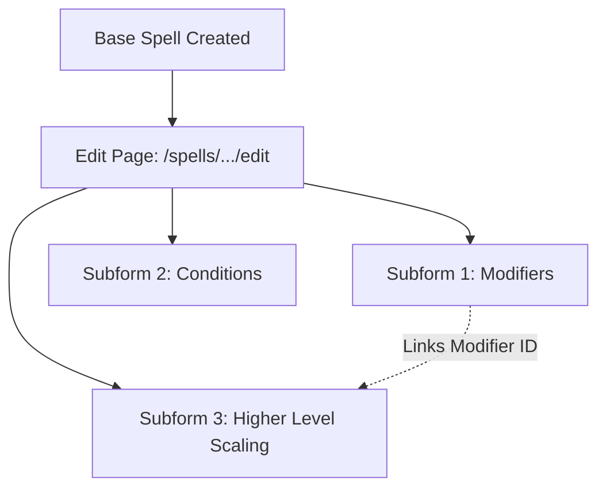

# D&D Beyond Homebrew Spell Creation Reference

A comprehensive guide to 5e spell design principles, D&D Beyond form architecture, mechanical subforms, automation recipes, and platform quirks.

---

## 1. 5e Design Principles & Spell Balancing

Spell design in D&D 5e relies on strict benchmarks defined in the *Dungeon Master's Guide* (Chapter 9: Workshop) and expanded in official Wizards of the Coast design workshops. Every spell must find equilibrium across **Action Economy**, **Concentration Economy**, **Damage/Healing Curves**, and **Component Restrictions**.

### 1.1 DMG Spell Damage Guidelines

The DMG establishes base damage budgets according to spell level, distinguishing between single-target and area-of-effect (AoE) spells.

| Spell Level | Single-Target Damage | Single-Target Avg | Multiple Targets / AoE | AoE Avg | Iconic Benchmark Spells |
| :--- | :--- | :--- | :--- | :--- | :--- |
| **Cantrip** | 1d10 | 5.5 | 1d6 | 3.5 | *Fire Bolt* (1d10), *Acid Splash* (1d6), *Toll the Dead* (1d8/1d12) |
| **1st** | 2d10 (or 3d8) | 11.0 / 13.5 | 2d6 (or 3d6) | 7.0 / 10.5 | *Guiding Bolt* (4d6 = 14), *Burning Hands* (3d6 = 10.5) |
| **2nd** | 3d10 | 16.5 | 4d6 | 14.0 | *Scorching Ray* (3x 2d6 = 21), *Shatter* (3d8 = 13.5) |
| **3rd** | 5d10 | 27.5 | 6d6 | 21.0 | *Fireball* / *Lightning Bolt* (8d6 = 28, iconic exception!) |
| **4th** | 6d10 | 33.0 | 7d6 | 24.5 | *Blight* (8d8 = 36), *Ice Storm* (2d8+4d6 = 23) |
| **5th** | 8d10 | 44.0 | 8d6 | 28.0 | *Cone of Cold* (8d8 = 36), *Synaptic Static* (8d6 = 28) |
| **6th** | 10d10 | 55.0 | 11d6 | 38.5 | *Disintegrate* (10d6+40 = 75, save-or-suck), *Chain Lightning* (10d8 = 45) |
| **7th** | 11d10 | 60.5 | 12d6 | 42.0 | *Finger of Death* (7d8+30 = 61.5), *Delayed Blast Fireball* (12d6 = 42) |
| **8th** | 12d10 | 66.0 | 13d6 | 45.5 | *Sunburst* (12d6 = 42 + Blinded), *Abi-Dalzim's Horrid Wilting* (12d8 = 54) |
| **9th** | 14d10 | 77.0 | 14d6 | 49.0 | *Meteor Swarm* (40d6 = 140, 4x 40-ft spheres, capstone exception) |

> [!NOTE]
> **Iconic Spell Exceptions:** *Fireball* and *Lightning Bolt* deal 8d6 (28 average) at 3rd level, intentionally exceeding the recommended 6d6 (21 average) by 33%. They were balanced higher for historical D&D legacy reasons. Do **not** use *Fireball* as the baseline for homebrew 3rd-level spells unless the spell deals a heavily resisted damage type, has a smaller radius, or lacks secondary benefits.

### 1.2 Save-for-Half vs. Save-or-Suck

* **Save-for-Half (Reliable Throughput):** Standard damage spells deal half damage on a successful saving throw. These conform directly to the DMG damage table.
* **Save-or-Suck (All-or-Nothing):** If a successful saving throw completely negates damage (e.g., *Disintegrate*), increase the spell's damage by **25%** compared to the baseline.
* **Secondary Riders / Conditions:** If a damaging spell applies a rider (push, prone, restrained, blinded, movement penalty):
  * Reduce damage by 1–2 dice tiers (e.g., *Thunderwave* is 2d8 with push, *Rime's Binding Ice* is 3d8 cold with speed 0).
  * Or restrict the area/range (e.g., self-centered cone/cube vs 120-ft range sphere).
* **Pure Condition Spells (Non-damaging):**
  * Spells inflicting strong conditions (*Blindness/Deafness*, *Hold Person*, *Hypnotic Pattern*) must grant a **saving throw at the end of each turn** to end the effect, OR require **concentration**, OR both.

### 1.3 Action Economy

| Casting Time | Design Profile & Balance Impact |
| :--- | :--- |
| **1 Action** | Standard baseline for ~85% of all spells. Safe default for combat spells. |
| **1 Bonus Action** | Preserves the caster's action for a cantrip, weapon attack, or object interaction. **Must have reduced throughput.** Compare *Healing Word* (1d4 + mod, bonus action) to *Cure Wounds* (1d8 + mod, action). |
| **1 Reaction** | Must have an explicit, unambiguous trigger condition. Defensive (*Shield*, *Absorb Elements*), retaliatory (*Hellish Rebuke*), or interruption (*Counterspell*). |
| **1 Minute+ (Out of Combat)** | Dramatically increases power budget because it cannot be deployed dynamically in combat rounds. Compare *Prayer of Healing* (2nd level, 10 min cast, heals up to 6 creatures 2d8+mod) to *Cure Wounds* upcast to 2nd level (2d8+mod for 1 target). |

### 1.4 Concentration Economy

* **The Sacred Rule:** Characters have exactly **one** concentration slot.
* **When Concentration is Mandatory:**
  * Any buff to AC, attack rolls, damage, or saving throws lasting > 1 round (*Bless*, *Haste*, *Shield of Faith*).
  * Continuous crowd control or area denial (*Web*, *Spirit Guardians*, *Wall of Fire*, *Hold Person*).
  * Continuous summons (*Conjure Animals*, *Summon Celestial*).
* **Spells Without Concentration:** Extremely rare and tactical (*Spiritual Weapon*, *Blindness/Deafness*, *Mirror Image*, *Plant Growth*, *Aid*, *Death Ward*). They allow stacking with another concentration spell; design them cautiously.

### 1.5 Component Economy & Rituals

* **V (Verbal):** Audible chant. Denied by *Silence*, underwater drowning, or gagging.
* **S (Somatic):** Hand gestures. Requires at least one free hand (unless using a focus/shield with spellcasting focus rules or *War Caster*).
* **M (Material):**
  * **Costless:** Replaced by an Arcane Focus or Component Pouch.
  * **Costly, Reusable:** Acts as an access key (e.g., *Identify* needs a 100 gp pearl; *Scrying* needs a 1,000 gp focus).
  * **Costly, Consumed:** Prevents spamming high-impact spells (e.g., *Revivify* eats 300 gp diamonds; *Heroes' Feast* eats 1,000 gp chalice).
* **Ritual Tag:**
  * Only ~33 official spells are rituals.
  * Must be utility or narrative facilitation (*Detect Magic*, *Water Breathing*, *Tiny Hut*, *Comprehend Languages*).
  * **Never make a spell a ritual if casting it unlimited times without cost or slots breaks downtime or local economies** (e.g., never allow infinite creation of resources or permanent illusions as rituals).

---

## 2. D&D Beyond Form Architecture & Field Details

Homebrew spell creation on D&D Beyond operates in **two sequential phases**:
1. **Initial Creation Form (`/homebrew/creations/create-spell/create`):** Captures essential identification, casting rules, primary duration, description, and class assignment.
2. **Post-Save Edit Page (`/homebrew/creations/spells/<id>-<slug>/edit`):** Reveals advanced combat metadata (AoE shapes, Attack Type, Save DC, Miss/Success effects, public tags) and hosts the three post-save subforms.

### 2.1 Initial Creation Form Elements

The form element is `#spell-form` (class `ddb-homebrew-create-form`).

| Label | Input Element | ID | Name | Type / Values | Validation / Notes |
| :--- | :--- | :--- | :--- | :--- | :--- |
| **Spell Name** | `<input>` | `field-Name` | `Name` | `text` (2–256 chars) | **Required.** Primary identifier. |
| **Version** | `<input>` | `field-version` | `version` | `text` | Optional. Default `1` or `1.0`. |
| **Spell Level** | `<select>` | `field-spell-level` | `spell-level` | `0`=Cantrip, `1`=1st ... `9`=9th | **Required.** Determines base slot. |
| **Spell School** | `<select>` | `field-spell-school` | `spell-school` | `3`=Abj, `4`=Conj, `5`=Div, `6`=Ench, `7`=Evo, `8`=Ill, `9`=Necro, `10`=Trans | **Required.** Select2 dropdown. |
| **Casting Time** | `<input>` | `field-spell-casting-time` | `spell-casting-time` | `text` (e.g., `1`, `10`) | **Required.** Numeric portion. |
| **Activation Type** | `<select>` | `field-spell-activation` | `spell-activation` | `1`=Action, `3`=Bonus Action, `4`=Reaction, `6`=Minute, `7`=Hour, `2`=No Action, `8`=Special | **Required.** Select2 dropdown. |
| **Reaction Condition** | `<input>` | `field-spell-casting-time-description` | `spell-casting-time-description` | `text` (max 256 chars) | **Conditionally Required** if Activation = Reaction (`4`). Disabled otherwise. |
| **Verbal (V)** | `<input>` | `field-verbal-field` | `verbal-field` | `checkbox` | Wrapped in fancy button `.spell-component-selector-item-verbal`. |
| **Somatic (S)** | `<input>` | `field-somatic-field` | `somatic-field` | `checkbox` | Wrapped in fancy button `.spell-component-selector-item-somatic`. |
| **Material (M)** | `<input>` | `field-material-field` | `material-field` | `checkbox` | Wrapped in fancy button `.spell-component-selector-item-material`. |
| **Material Description** | `<input>` | `field-spell-components` | `spell-components` | `text` | Enabled only when Material checkbox is true. Put costly/consumed text here! |
| **Spell Range Type** | `<select>` | `field-origin` | `origin` | `1`=Self, `2`=Touch, `3`=Ranged, `4`=Sight, `9`=Unlimited | **Required.** Select2 dropdown. |
| **Range Distance** | `<input>` | `field-spell-range` | `spell-range` | `text` (distance in feet) | Enabled only when Range Type = Ranged (`3`). |
| **Duration Type** | `<select>` | `field-spell-duration` | `spell-duration` | `1`=Instantaneous, `2`=Concentration, `3`=Time, `4`=Special, `5`=Until Dispelled, `7`=Until Dispelled or Triggered | **Required.** Select2 dropdown. |
| **Duration Interval** | `<input>` | `field-spell-duration-interval` | `spell-duration-interval` | `text` (e.g. `1`, `8`, `24`) | Enabled when Duration is Concentration, Time, or Special. |
| **Duration Unit** | `<select>` | `field-spell-duration-unit` | `spell-duration-unit` | `1`=Round, `2`=Minute, `3`=Hour, `4`=Day | Enabled when Duration is Concentration, Time, or Special. |
| **Description** | `<textarea>` | `field-spell-description-wysiwyg` | `spell-description-wysiwyg` | TinyMCE editor | **Required.** Formatted rules text & "At Higher Levels" narrative text. |
| **Ritual Spell?** | `<input>` | `field-can-cast-as-ritual` | `can-cast-as-ritual` | `checkbox` | Enables ritual casting mechanics on character sheets. |
| **At Higher Levels?** | `<input>` | `field-can-cast-at-higher-level` | `can-cast-at-higher-level` | `checkbox` | Enables upcast mechanics on character sheet. |
| **Scaling Type** | `<select>` | `field-higher-level-scale` | `higher-level-scale` | `1`=Character Level, `2`=Spell Scale, `3`=Spell Level | Enabled when Higher Levels checkbox is checked. |
| **Available for Classes** | `<select>` | `field-class-mapping` | `class-mapping` | `select-multiple` (400+ IDs) | **Required.** Multi-select Select2 of classes & subclasses. |

---

### 2.2 Post-Save Primary Edit Page Elements

Once saved, the browser redirects to `/homebrew/creations/spells/<id>-<slug>/edit`. This page retains all fields above and adds the following sections:

| Field Label | Selector ID | Values & Notes |
| :--- | :--- | :--- |
| **Avatar** | `#field-large-avatar` | File upload for custom spell card artwork. |
| **Area of Effect Type** | `#field-spell-aoe` | `1`=Cone, `2`=Cube, `3`=Cylinder, `14`=Emanation (2024 rules), `4`=Line, `5`=Sphere, `9`=Square, `13`=Square Feet. |
| **Area of Effect Size** | `#field-spell-aoe-size` | Numeric dimension in feet (e.g., `20` for a 20-foot radius sphere or 15-foot cone). |
| **AoE Special Flag** | `#field-aoe-special-description` | Checkbox indicating custom or non-standard geometry. |
| **As Part of Weapon Attack**| `#field-as-part-of-weapon-attack` | Checkbox for spells like *Booming Blade*, *Green-Flame Blade*, or Smite spells. |
| **Attack Type** | `#field-attack-type` | `1`=Melee, `2`=Ranged. |
| **Effect on Miss** | `#field-on-miss` | Textarea detailing what occurs on missed attack (e.g. *Acid Arrow* half damage). Enabled when Attack Type is chosen. |
| **Save Type** | `#field-spell-save-type` | `1`=STR, `2`=DEX, `3`=CON, `4`=INT, `5`=WIS, `6`=CHA. |
| **Effect on Save Success** | `#field-spell-save-success`| Textarea (e.g., "Half damage", "No effect"). Enabled when Save Type is chosen. |
| **Effect on Save Fail** | `#field-spell-save-fail` | Textarea detailing consequences of a failed saving throw. |
| **Spell Effect Tags** | `#field-spell-tags-public` | Multi-select Select2 container (45 public search and filter tags). |

---

## 3. Subforms Architecture & Post-Save Configuration

The core mechanical power of D&D Beyond homebrew spells lives in **three subforms** located in collapsible accordion sections on the post-save edit page:



### 3.1 Subform 1: Modifiers (`/spells/modifier/create/<id>`)

Used to register damage, healing, ability boosts, and advantage/disadvantage directly onto the character sheet roll calculators.

* **Modifier Type (`#field-spell-modifier-type`):**
  * `2`: Damage
  * `1`: Bonus
  * `3`: Advantage
  * `4`: Disadvantage
  * `5`: Resistance
  * `6`: Immunity
  * `7`: Vulnerability
  * `8`: Sense
  * `9`: Set
* **Modifier Subtype (`#field-spell-modifier-sub-type`):** Loaded dynamically via AJAX depending on the chosen Modifier Type!
  * **Damage Subtypes (`Type = 2`):**
    * `Acid` (`48`), `Bludgeoning` (`49`), `Cold` (`50`), `Fire` (`51`), `Force` (`52`), `Lightning` (`53`), `Necrotic` (`54`), `Piercing` (`55`), `Poison` (`56`), `Psychic` (`57`), `Radiant` (`58`), `Slashing` (`59`), `Thunder` (`60`).
    * Attack-scoped: `Melee Weapon Attacks` (`1687`), `Ranged Weapon Attacks` (`2413`), `Wizard Spell Attacks` (`2139`), etc.
  * **Bonus Subtypes (`Type = 1`):**
    * Healing: `Hit Points` (`192`), `Temporary Hit Points` (`193`), `Hit Points per Level` (`752`).
    * Defenses: `Armor Class` (`1`), `Saving Throws` (by stat or general).
* **Modifier Formula Fields:**
  * **Dice Count (`#field-dice-count`):** Number of dice (e.g. `8` for *Fireball*).
  * **Die Type (`#field-dice-value`):** Select options (`1`=d4, `2`=d6, `3`=d8, `4`=d10, `5`=d12, `6`=d20, `7`=d100).
  * **Fixed Value (`#field-fixed-value`):** Flat bonus (e.g. `4` for `2d8 + 4`).
  * **Use Primary Stat (`#field-primary-stat`):** Checkbox. Automatically adds the caster's spellcasting ability modifier (INT, WIS, or CHA) to the healing/damage rolls!
  * **Details (`#field-restriction`):** Contextual qualifier (e.g. "against fiends and undead").

---

### 3.2 Subform 2: Conditions (`/spells/condition/create/<id>`)

Applies, removes, or suppresses 5e status conditions on the character sheet or target trackers.

* **Condition Effect (Radio buttons):**
  * Apply: `#field-condition-effect-apply`
  * Remove: `#field-condition-effect-remove`
  * Suppress: `#field-condition-effect-suppress`
* **Condition Dropdown (`#field-condition`):** Select2 dropdown containing official 5e conditions:
  * Blinded, Charmed, Deafened, Frightened, Grappled, Incapacitated, Invisible, Paralyzed, Petrified, Poisoned, Prone, Restrained, Stunned, Unconscious, Exhaustion.
* **Duration (`#field-condition-duration`) & Unit (`#field-duration-unit`):** Duration during which the condition persists.
* **Details (`#field-condition-exception`):** Exceptions or qualifiers (e.g. "Creature can repeat save at end of turn").

---

### 3.3 Subform 3: Higher Level Scaling (`/spells/additional/create/<id>`)

Controls how D&D Beyond increases dice or targets when the spell is cast using a higher-level spell slot or scaled by character level.

> [!CRITICAL]
> **Three-Tier Requirement:** For higher level scaling to function:
> 1. In the base form, check **At Higher Levels Scaling?** (`#field-can-cast-at-higher-level`).
> 2. Select **Higher Level Scaling Type** (`#field-higher-level-scale`):
>    * `1` (**Character Level**): For cantrips (*Fire Bolt* scaling at 5th, 11th, 17th).
>    * `2` (**Spell Scale**): For spells that gain dice/targets every +1 slot level above base (*Fireball*, *Cure Wounds*).
>    * `3` (**Spell Level**): For spells whose effects step up at discrete slot thresholds (*Hex*, *Bestow Curse*).
> 3. Add an entry in the **Add a Higher Level** subform (`/spells/additional/create/<id>`).

* **Scaling Level Value (`#field-level`):**
  * If *Spell Scale*: enter `1` (increases every 1 spell slot level above base).
  * If *Character Level*: create separate rows for `5`, `11`, `17`.
  * If *Spell Level*: enter the specific slot level target (e.g., `5`).
* **Modifier to Scale (`#field-modifier`):** A select dropdown that lists the **existing Modifiers** configured in Subform 1 (e.g. `Damage - Fire (8d6)`).
* **Scale Effect (`#field-effect-type`):**
  * `15`: **Additional Points** (increases damage dice or healing dice).
  * `1`: **Additional Targets** (e.g., *Charm Person*, *Hold Person*).
  * `11`: **Additional Creatures** (e.g., *Fly*, *Invisibility*).
  * `16`: **Additional Count**.
  * `3`: **Extended Duration** (e.g., *Hex* lasting 8 or 24 hours).
  * `9`: **Extended Area**.
  * `17`: **Extended Range**.
  * `12`: **Special** (refer to description).
* **Dice Count (`#field-dice-count`) & Die Type (`#field-dice-value`):** The increment added per scaling step (e.g. `1` die of type `d6` for *Fireball*).

---

## 4. Complete List of Spell Tags (Public Tags)

Available in `#field-spell-tags-public`:

| Tag ID | Name | Tag ID | Name | Tag ID | Name |
| :--- | :--- | :--- | :--- | :--- | :--- |
| `16` | Banishment | `6` | Control | `568` | Foresight |
| `652` | Biomancy | `1` | Creation | `2` | Healing |
| `11` | Buff | `687` | Curse | `619` | Illumination |
| `108` | Charmed | `5` | Damage | `621` | Liminal |
| `662` | Chronomancy | `13` | Debuff | `17` | Movement |
| `694` | Circle spell | `24` | Deception | `18` | Negation |
| `22` | Combat | `15` | Detection | `737` | Osteomancy |
| `10` | Communication | `697` | Dragonmark | `301` | Psionic |
| `66` | Compulsion | `326` | Dunamancy | `566` | Sangromancy |
| `570` | Contaminated | `138` | Elemental | `14` | Scrying |
| `20` | Environment | `21` | Exploration | `620` | Shadow |
| `137` | Fey | `25` | Foreknowledge | `23` | Shapechanging |
| `12` | Social | `187` | Special | `3` | Summoning |
| `4` | Teleportation | `709` | Transforming | `19` | Utility |
| `622` | Void | `26` | Warding | `618` | Weather |

---

## 5. D&D Beyond Tooltip Tags & Snippet Code

Use these shortcodes in spell descriptions and snippets to render interactive tooltips on DDB character sheets:

### 5.1 Interactive Tooltip Tags

```markdown
[spell]fireball[/spell]
[condition]paralyzed[/condition]
[magicitem]flame tongue[/magicitem]
[item]longsword[/item]
[monster]adult red dragon[/monster] (or [mon]goblin[/mon])
[sense]darkvision[/sense]
[action]dash[/action]
[skill]athletics[/skill]
```

### 5.2 Dynamic Math Snippets (for Tooltips & Summaries)

DDB replaces these expressions dynamically on the character sheet based on the character's stats:
* `{{modifier:spell}}` — Spellcasting ability modifier (+3, +4, etc.)
* `{{savedc:wis}}` — Caster's Wisdom spell save DC (8 + prof + WIS)
* `{{scalevalue}}` — Current level scaling value of the spell or feature
* `{{fixedvalue}}` — The fixed value configured in the modifier

---

## 6. Playwright Automation Recipes

Below are field-tested automation patterns for orchestrating spell creation via Playwright.

### 6.1 Authentication & Context Setup

```python
from playwright.sync_api import sync_playwright

STORAGE_STATE = "/home/karpiq/.gemini/antigravity-cli/dndbeyond_storage_state.json"

with sync_playwright() as p:
    browser = p.chromium.launch(headless=True)
    ctx = browser.new_context(storage_state=STORAGE_STATE)
    page = ctx.new_page()
    page.goto("https://www.dndbeyond.com/homebrew/creations/create-spell/create", wait_until="networkidle")
```

### 6.2 Dismissing Overlays & Vex Modals

DDB often renders background modals or cookie notices that intercept pointer clicks:

```python
page.evaluate("() => document.querySelectorAll('.vex, .vex-overlay, .vex-content').forEach(el => el.remove())")
```

### 6.3 Handling Select2 Dropdowns & Multi-Select via jQuery

DDB runs jQuery 1.8.2. While Playwright UI clicks work, setting Select2 values directly via jQuery triggers internal event listeners cleanly and instantly:

```python
def select_spell_classes(page, class_ids):
    """
    class_ids: list of string IDs, e.g. ['2190876'] (Wizard)
    Common Base Class IDs:
      Bard: 2190876 | Cleric: 2190877 | Druid: 2190878 | Paladin: 2190879
      Ranger: 2190880 | Sorcerer: 2190881 | Warlock: 2190882 | Wizard: 2190883
    """
    page.evaluate("""(ids) => {
        $('#field-class-mapping').val(ids).trigger('change');
    }""", class_ids)

def select_select2(page, select_id, value):
    page.evaluate("""([id, val]) => {
        $('#' + id).val(val).trigger('change');
    }""", [select_id, value])
```

### 6.4 Setting Component Flags (V, S, M)

DDB uses custom `.fc-fake` click targets for V, S, M buttons. Triggering both the underlying checkbox and UI ensures form validity:

```python
def set_components(page, verbal=True, somatic=True, material=False, material_desc=""):
    page.evaluate("""([v, s, m, desc]) => {
        $('#field-verbal-field').prop('checked', v).trigger('change');
        if (v) $('.spell-component-selector-item-verbal').addClass('fc-selected');
        
        $('#field-somatic-field').prop('checked', s).trigger('change');
        if (s) $('.spell-component-selector-item-somatic').addClass('fc-selected');
        
        $('#field-material-field').prop('checked', m).trigger('change');
        if (m) {
            $('.spell-component-selector-item-material').addClass('fc-selected');
            $('#field-spell-components').val(desc).removeClass('disabled').prop('disabled', false).trigger('change');
        }
    }""", [verbal, somatic, material, material_desc])
```

### 6.5 Setting TinyMCE Description Text

```python
def set_description(page, html_content):
    page.evaluate("""(html) => {
        if (typeof tinymce !== 'undefined' && tinymce.get('field-spell-description-wysiwyg')) {
            tinymce.get('field-spell-description-wysiwyg').setContent(html);
            tinymce.triggerSave();
        } else {
            const ta = document.getElementById('field-spell-description-wysiwyg') || document.getElementById('field-spell-description');
            if (ta) ta.value = html;
        }
    }""", html_content)
```

### 6.6 Clean Deletion Recipe

The homebrew deletion endpoint requires an `entityTypeId` parameter.
* **Spell Entity Type ID:** `1118725998`
* **Delete URL Pattern:** `https://www.dndbeyond.com/homebrew/creations/delete?entityTypeId=1118725998&id=<spell_id>`

```python
def delete_homebrew_spell(ctx, spell_id):
    """Deletes a homebrew spell via direct authenticated POST."""
    url = f"https://www.dndbeyond.com/homebrew/creations/delete?entityTypeId=1118725998&id={spell_id}"
    resp = ctx.request.post(url)
    return resp.status == 200
```

---

## 7. Common Traps, Gotchas & Quirks

1. **Concentration is a Duration Type, NOT a Checkbox:**
   * In monster stat blocks, concentration is a checkbox. In Spells, it is an option in the **Duration Type** dropdown (`field-spell-duration`, value `2`).
   * When Concentration is selected, the form requires a Duration Interval (e.g., `1`) and Unit (e.g., `Minute`).
2. **No Dedicated Checkboxes for Costly or Consumed Components:**
   * DDB does **not** have checkboxes for "Costly" or "Consumed".
   * The cost and consumption rule must be written explicitly in the **Material Components Description** (`#field-spell-components`), e.g., *"a powdered black pearl worth at least 500 gp, which the spell consumes"*.
3. **Mandatory Reaction Condition Box:**
   * If **Activation Type** is set to `Reaction` (`4`), DDB JavaScript validation disables the submit button unless text is provided in `#field-spell-casting-time-description` (e.g., *"which you take when a creature you can see within 60 feet casts a spell"*).
4. **Ritual Tag vs. Ritual Property:**
   * Checking **Ritual Spell?** (`#field-can-cast-as-ritual`) provides the mechanical ritual tag on character sheets.
   * However, you should also add the public search tag if you want it filtered in homebrew listings.
5. **The Three Layers of Upcasting ("At Higher Levels"):**
   * **Narrative Layer:** Text written in the Description editor starting with `<p><strong>At Higher Levels.</strong> ...</p>`.
   * **Base Setting Layer:** The **At Higher Levels Scaling?** checkbox (`#field-can-cast-at-higher-level`) and dropdown (`#field-higher-level-scale` = `2` for Spell Scale).
   * **Mechanical Layer:** The entry in the **Add a Higher Level** subform (`/spells/additional/create/<id>`), which links to the specific damage/healing modifier. If this subform is omitted, the character sheet will not automatically add dice when selecting a higher-level slot!
6. **Select2 AJAX Timing:**
   * Subform dropdowns (like Modifier Subtype) load asynchronously after Modifier Type is selected. Automation scripts must wait ~1–2 seconds for the AJAX request to complete before querying or clicking `#field-spell-modifier-sub-type`.
