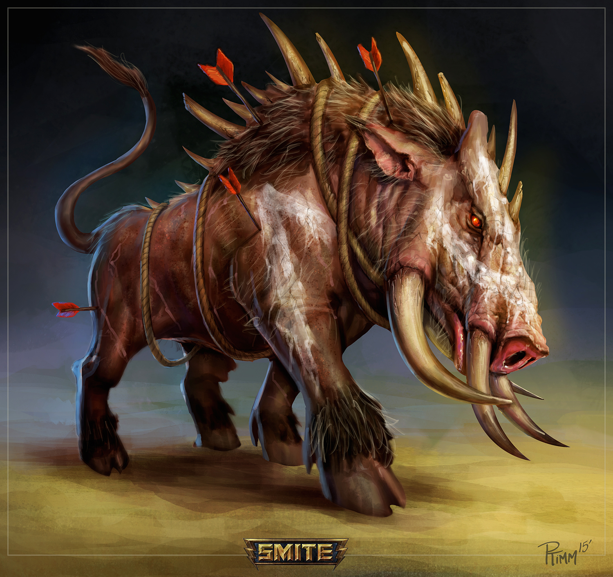

# Sesja 1: Wielki Dzik

**Data:** 15.01.2024

## Podsumowanie

Bohaterowie zostali zgromadzeni w gospodzie [[Kwaśny Rocznik]] przez [[Kyrah]], wysłanniczkę [[Versi|Wyroczni]]. [[Kyrah]] zleciła bohaterom upolowanie straszliwego dzika, który siał spustoszenie pośród okolicznych ziem. Bohaterowie pokonali dzika, po czym złożyli go w ofierze [[Volkan|Volkanowi]]. Po drodze do [[Świątynia Wyroczni]], bohaterowie natknęli się na [[Obóz wojskowy Mytros|obóz wojskowy]] dowodzony przez [[Hileas|Dowódcę Hileasa]]. W obozie znajdował się minotaur [[Braz]], który wydawał się być pogodzony z losem niewolnika.

## Kluczowe wydarzenia / decyzje

* Bohaterowie przyjęli zlecenie upolowania dzika.
* Zabili dzika i złożyli go w ofierze [[Volkan|Volkanowi]].
* Bohaterowie wyruszyli w kierunku [[Świątynia Wyroczni]]

## Postacie Niezależne (NPC)

* [[Kyrah]]
* [[Aetala]]
* [[Taneias]]
* [[Javon]]
* [[Braz]]
* [[Hileas]]

## Lokacje

* [[Kwaśny Rocznik]]
* [[Obóz wojskowy Mytros]]

## Szczegółowy opis wydarzeń

[[Kyrah]] zebrała bohaterów w gospodzie [[Kwaśny Rocznik]] i zleciła im upolowanie dzika, który siał postrach pośród okolicznych ziem. Poinformowała ich, że dzik został wysłany przez [[Bliźniaczy Tytani|Bliźniaczych Tytanów]] i jest to jeden z wielu znaków świadczących o tym, że znowu knują oni wojnę. Bohaterowie przyjęli zlecenie i wyruszyli na polowanie.

Następnego dnia, na godzinę przed świtem, dołączyło do nich dwóch myśliwych zatrudnionych przez [[Kyrah]] - [[Taneias]] i [[Javon]]. Po wielu godzinach poszukiwań, bohaterowie dotarli do jaskini, w której przebywał dzik. Po krótkiej walce, udało im się go zabić. [[Kyrah]] przypomniała wtedy bohaterom, że należy złożyć dzika w ofierze bogom. Bohaterowie zdecydowali się złożyć go w ofierze [[Volkan|Volkanowi]].

Po drodze do [[Świątynia Wyroczni]], bohaterowie natknęli się na [[Obóz wojskowy Mytros]] dowodzony przez [[Hileas|Dowódcę Hileasa]]. W obozie bohaterowie spotkali minotaura o imieniu [[Braz]]. [[Braz]] nie kwestionował swojego losu jako niewolnik.
