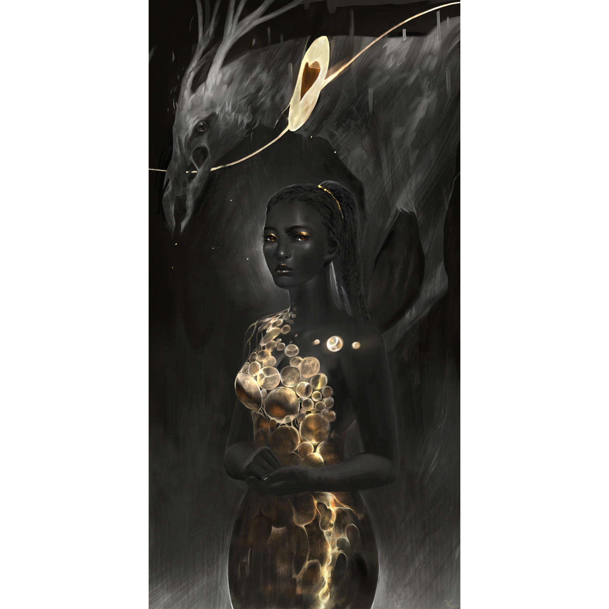

# Sesja 10: Świątynia Heliosa i Jaskinie Troglodytów

**Data:** 15.04.2024

## Podsumowanie

Bohaterowie zeszli z [[Góra Telamok|góry Telamok]] i wyruszyli na poszukiwanie [[Mithralowa Kuźnia|mithralowej kuźni]]. Po drodze spotkali nimfę [[Euria|Eurię]] w [[Świątynia Heliosa|świątyni Heliosa]], która opowiedziała im o swoim życiu i fascynacji bogiem słońca, [[Helios|Heliosem]]. Niestety, doszło do walki, w której [[Orestes]] został zauroczony i prawie zabił [[Versir|Versira]]. Bohaterowie musieli zabić [[Euria|Eurię]]. Następnie udali się do [[Mithralowa Kuźnia|kuźni Vulkana]], gdzie po drodze spotkali 12 centaurów, na czele z [[Hukar|Hukarem]]. [[Hukar]] ostrzegł ich przed troglodytami, którzy pojmali dwójkę z nich. Bohaterowie weszli do [[Jaskinie Troglodytów|jaskiń]], pokonali troglodytów i uratowali centaury. Na końcu usłyszeli głos zapraszający ich na audiencję.

## Kluczowe wydarzenia / decyzje

* Zejście z [[Góra Telamok|góry Telamok]].
* Spotkanie z nimfą [[Euria|Eurią]] w [[Świątynia Heliosa|świątyni Heliosa]].
* Walka z [[Euria|Eurią]] i [[Orestes|Orestesem]].
* Spotkanie z centaurami i [[Hukar|Hukarem]].
* Wejście do [[Jaskinie Troglodytów|jaskiń]] i walka z troglodytami.
* Uratowanie centaurów.
* Zaproszenie na audiencję.

## Postacie Niezależne (NPC)

* [[Euria]] (nimfa)
* [[Hukar]] (centaur)

## Lokacje

* [[Świątynia Heliosa]]
* [[Jaskinie Troglodytów]]
* [[Mithralowa Kuźnia]]

## Szczegółowy opis wydarzeń

Bohaterowie zeszli z [[Góra Telamok|góry Telamok]] i wyruszyli na poszukiwanie [[Mithralowa Kuźnia|mithralowej kuźni]]. Po drodze usłyszeli piękną melodię, która zaprowadziła ich do [[Świątynia Heliosa|świątyni Heliosa]]. Tam spotkali nimfę [[Euria|Eurię]], która opowiedziała im o swoim życiu i fascynacji bogiem słońca, [[Helios|Heliosem]]. Niestety, doszło do walki, w której [[Orestes]] został zauroczony i prawie zabił [[Versir|Versira]]. Bohaterowie musieli zabić [[Euria|Eurię]].

Po opuszczeniu świątyni, bohaterowie udali się w kierunku [[Mithralowa Kuźnia|Mithralowej Kuźni]]. Po drodze spotkali 12 centaurów, na czele z [[Hukar|Hukarem]]. [[Hukar]], który miał na czole oko [[Sydon|Sydona]], ostrzegł ich przed troglodytami, którzy pojmali dwójkę z nich.

Bohaterowie weszli do [[Jaskinie Troglodytów|jaskiń]], gdzie stoczyli walkę z troglodytami. Po pokonaniu ich, udali się wgłąb jaskiń, gdzie znaleźli uwięzionych centaurów. Po uratowaniu ich, usłyszeli głos zapraszający ich na audiencję.
