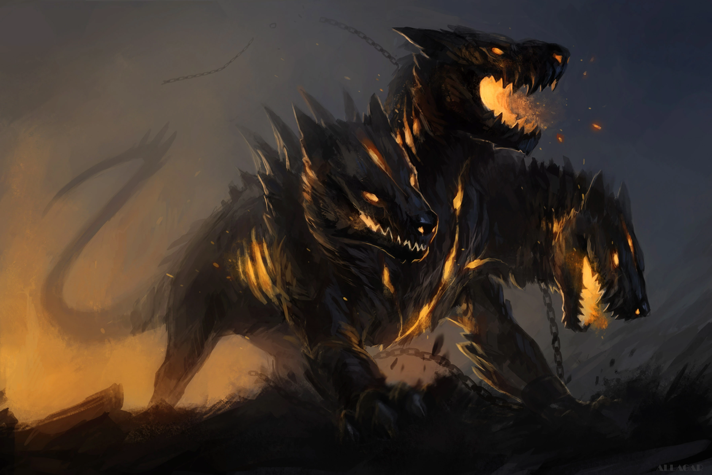

# Sesja 11: Mithralowa Kuźnia

**Data:** 22.04.2024

## Podsumowanie

Drużyna kontynuuje swoją misję odnalezienia [[Mithralowa Kuźnia|mithralowej kuźni]] w głębinach [[Jaskinie Troglodytów|jaskiń troglodytów]]. Po drodze stawili czoła śmiertelnym pułapkom i potworom, a także zawarli układ z potężnym [[Strażniczka Kuźni|żywiołakiem ognia]]. Sesja zakończyła się dramatycznym spotkaniem z samym [[Pythor|Pythorem]], który przybył pomścić śmierć swojego syna.

## Kluczowe wydarzenia / decyzje

* Drużyna zdecydowała się zejść głębiej w [[Jaskinie Troglodytów|jaskinie troglodytów]], aby odnaleźć [[Mithralowa Kuźnia|mithralową kuźnię]].
* Zawarli układ z żywiołakiem ognia, [[Strażniczka Kuźni|The Forge Keeper]], uwalniając ją w zamian za rok służby.
* W trakcie eksploracji kuźni, drużyna uruchomiła pułapkę, którą cudem udało im się unieszkodliwić.
* Śmierć [[Orion Xul|Oriona]]

## Postacie Niezależne (NPC)

* [[Król Troglodytów|Król troglodytów]]
* [[Strażniczka Kuźni|The Forge Keeper]]
* [[Pythor]]

## Lokacje

* [[Jaskinie Troglodytów]]
* [[Mithralowa Kuźnia]]

## Szczegółowy opis wydarzeń

Drużyna, kontynuując swoją misję odnalezienia [[Mithralowa Kuźnia|mithralowej kuźni]], zapuściła się głębiej w [[Jaskinie Troglodytów|jaskinie troglodytów]]. [[Król Troglodytów|Król troglodytów]] ostrzegł ich o straszliwym niebezpieczeństwie, które zabiło nawet cerbera strzegącego przejścia. Zignorowawszy przestrogę, bohaterowie zeszli windą w głąb jaskiń. Tam natknęli się na truchło cerbera i skamieniałe szczątki małych, dwugłowych psów, zabitych przez cockatrice. Winda nagle ruszyła w dół, a bohaterowie zostali zaatakowani przez młodego cerbera. W heroicznej walce poległ [[Orion Xul]], syn [[Pythor|Pythora]].

W końcu drużyna dotarła do [[Mithralowa Kuźnia|mithralowej kuźni]], gdzie spotkali uwięzionego żywiołaka ognia, [[Strażniczka Kuźni|The Forge Keeper]]. Żywiołak zgodził się im służyć przez rok w zamian za uwolnienie. Po uwolnieniu [[Strażniczka Kuźni|The Forge Keeper]], bohaterowie usłyszeli ciężkie kroki zbliżającego się [[Pythor|Pythora]].
