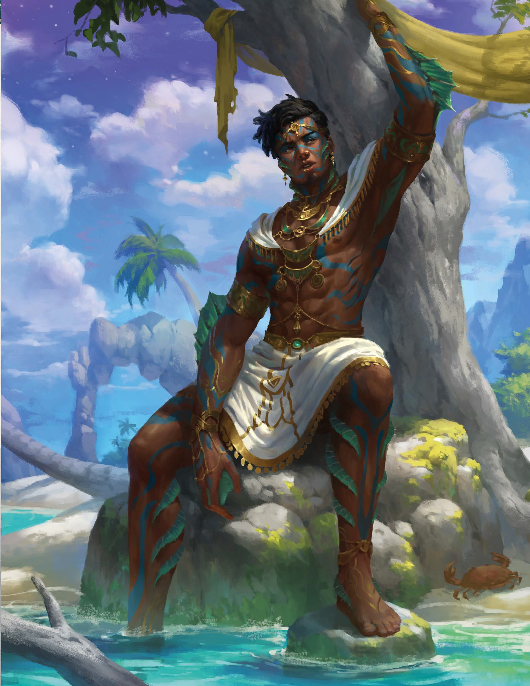

# Sesja 12: Furia Boga Bitwy

**Data:** 06.05.2024

## Podsumowanie

Dwunasta sesja rozpoczęła się od tragicznej straty [[Orion Xul|Oriona Xula]], a następnie wskrzeszenia go przez boską interwencję [[Pythor|Pythora]]. W międzyczasie drużyna musiała stawić czoła atakom [[Król Troglodytów|troglodytów]] i samego [[Pythor|Pythora]], a także zmierzyć się z bolesną decyzją o zabiciu [[Zephyrus|byłego Kyrah]].

## Kluczowe wydarzenia / decyzje

* Drużyna została zdradziecko zaatakowana przez [[Król Troglodytów|króla troglodytów]].
* [[Pythor]], w akcie desperacji, poświęcił część swojej boskiej mocy, aby wskrzesić syna.
* Drużyna zabiła [[Zephyrus|byłego Kyrah]], który nie chciał pogodzić się z utratą ukochanej.

## Postacie Niezależne (NPC)

* [[Król Troglodytów|Król troglodytów]]
* [[Pythor]]
* [[Kyrah]]
* [[Zephyrus]] (Wiosenny Wiatr)

## Lokacje

* [[Mithralowa Kuźnia|Mithralowa kuźnia]]

## Szczegółowy opis wydarzeń

Drużyna opłakiwała śmierć [[Orion Xul|Oriona Xula]], gdy nagle zaatakowali ich troglodyci, prowadzeni przez swojego [[Król Troglodytów|króla]]. W wirze walki włączył się sam [[Pythor]], zaślepiony żalem i gniewem po stracie syna. Po pokonaniu przeciwników, [[Kyrah]] i [[Pythor]] zastanawiali się nad konsekwencjami ingerencji boga w losy śmiertelników w związku z [[10 Przysięga Pokoju|Przysięgą Pokoju]].

W [[Mithralowa Kuźnia|mithralowej kuźni]] drużyna odnalazła potężny miecz Mithral Xiphos +1. W drodze powrotnej napotkali [[Zephyrus|byłego Kyrah]], który nie mógł pogodzić się z utratą ukochanej. Niestety, bohaterowie musieli go zabić.
