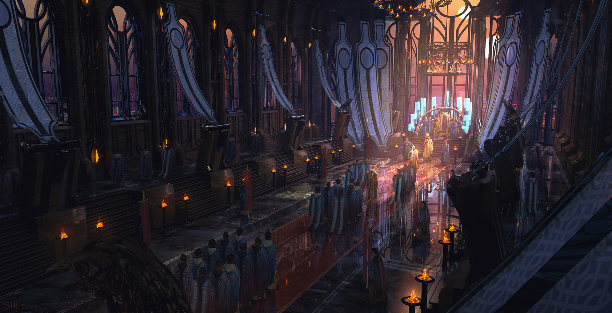

# Sesja 13: Wezwani przez Króla

**Data:** 13.05.2024

## Podsumowanie

W drodze powrotnej napotkali kamienne posągi, przypominające [[Kentimane|Kentimane'a]].
[[Orestes]] miał wizję podróży statkiem na [[Wyspa Mojr|Wyspę Mojr]].
[[Kyrah]] zasugerowała, że [[Mojry]] mogą być odpowiedzialne za klątwę [[Orestes|Orestesa]].
W [[Mytros]] bohaterowie spotkali króla [[Acastus|Acastusa]].
Zostali poproszeni o pomoc w powstrzymaniu burzy nękającej miasto.
[[Kyrah]] i [[Vallus]] zasugerowały, że mogą to zrobić, jeśli uda im się odzyskać [[Notos Letni Wiatr|instrumenty Notos]].

## Kluczowe wydarzenia / decyzje

* Wizja [[Orestes|Orestesa]] o podróży na [[Wyspa Mojr|Wyspę Mojr]].
* Uratowanie [[Filip|Filipa]].
* Wysłanie listów do rodziny i [[Akademia Mytros|Akademii w Mytros]].
* Wykucie [[Odkupienie Pythora|magicznej włóczni]].
* Przybycie do [[Mytros]] i spotkanie z królem [[Acastus|Acastusem]].
* Decyzja o pomocy w powstrzymaniu burzy.

## Postacie Niezależne (NPC)

* [[Alexandros]] (NPC)
* [[Apasia]] (NPC)
* [[Acastus|Król Acastus]]
* [[Strażniczka Kuźni|The Forge Keeper]] (żywiołak ognia)
* Król Troglodytów
* [[Melania Twardowska]]
* [[Tarchon]]
* [[Vallus]]
* [[Volkan]]

## Lokacje

* [[Jaskinie Troglodytów|Jaskinie]]
* Las
* [[Mithralowa Kuźnia|Mithralowa kuźnia]]
* [[Mytros]]
* Rosos
* [[Świątynia Heliosa]]
* [[Super Bar|Warlock Circus Super Bar]]

## Szczegółowy opis wydarzeń

Bohaterowie wyruszyli do [[Mithralowa Kuźnia|mithralowej kuźni]], aby naprawić artefakty. W międzyczasie [[Felicjan Janus Twardowski|Felicjan]] wysłał list do swojej rodziny i [[Akademia Mytros|Akademii w Mytros]].
W drodze powrotnej bohaterowie napotkali kamienne posągi, bardzo podobne do [[Kentimane|Kantimane'a]].
[[Orestes|Orestesowi]] przyśniła się wyprawa statkiem na [[Wyspa Mojr|Wyspę Mojr]]. [[Kyrah]] podpowiedziała, że [[Mojry]] mogą być odpowiedzialne za klątwę [[Orestes|Orestesa]].
W [[Mytros]] bohaterowie spotkali się z królem [[Acastus|Acastusem]], który zaprosił ich na audiencję. Król okazał się dupkiem i wraz z dowódcą [[Gaius|Gaiusem]] i [[Bella|Bellą]] chcieli zrzucić na bohaterów winę za klęski.
Bohaterowie zgodzili się pomóc w sprawie burzy nękającej [[Mytros]]. [[Kyrah]] wraz ze swoją siostrą [[Vallus]] twierdzą, że mogą powstrzymać burzę, jeśli uda im się odzyskać [[Notos Letni Wiatr|instrumenty Notos]].
W międzyczasie [[Orion Xul]] wraz z [[Volkan|Volkanem]] wykuli magiczną włócznię "[[Odkupienie Pythora]]".
