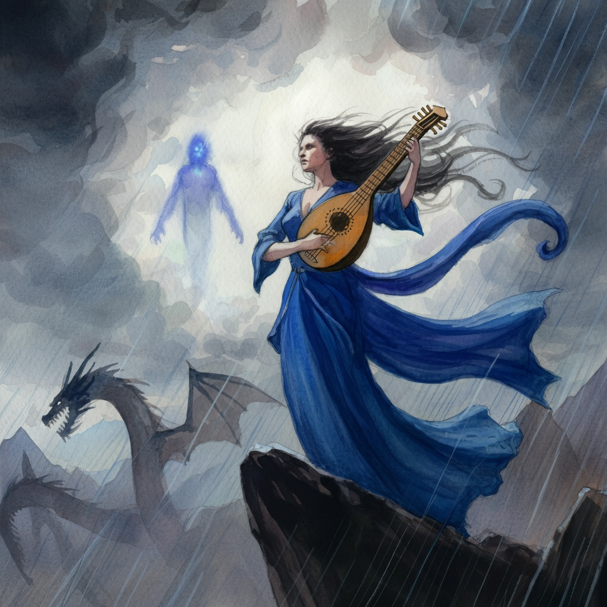

# Sesja 14: Burza nad Mytros

**Data:** 20.05.2024

## Podsumowanie

Bohaterowie znajdują [[Boreas|Boreasa]], ostatniego z Czterech Wiatrów, i przekonują go, by pomógł im w powstrzymaniu burzy.
Razem udaje im się odeprzeć atak tytanów i przywrócić spokój w [[Mytros]].
Król [[Acastus]] nagradza bohaterów mapą prowadzącą do [[Ultros|Ultrosa]], legendarnego statku [[Estor Arkelander|Estora Arkelandera]].
[[Vallus]] zdradza, że na wyspie [[Wyspa Yonder|Yonder]] znajduje się starożytna biblioteka, która może pomóc [[Arevon Elorrenthi|Arevonowi]] w odnalezieniu drogi do domu.
[[Vallus]] wyjawia, że żałuje poślubienia [[Acastus|Acastusa]].
Bohaterowie otrzymują również szereg zadań pobocznych, w tym oczyszczenie [[Mytros]] z korupcji i rozwiązanie problemu targu niewolników.

## Kluczowe wydarzenia / decyzje

* Bohaterowie odnajdują [[Boreas|Boreasa]] i przekonują go do pomocy.
* Wspólnymi siłami udaje się powstrzymać burzę i odeprzeć atak tytanów.
* Król [[Acastus]] nagradza bohaterów mapą do [[Ultros|Ultrosa]].
* [[Vallus]] zdradza informacje o wyspie [[Wyspa Yonder|Yonder]] i zleca bohaterom zadania poboczne.

## Postacie Niezależne (NPC)

* [[Acastus|Acastus Arkelander]], król Mytros
* [[Bella]]
* [[Boreas]], Północny Wiatr Zimy
* [[Chalcia]] (tytanka)
* [[Chondrus]]
* [[Gaius]]
* [[Goloron]] (tytan)
* [[Hergeron]] (tytan)
* [[Icarus]] (smok)
* [[Kyrah]]
* [[Makhaila]]
* [[Moxena]] (Pani Monet)
* [[Talieus]] (tytan)
* [[Vallus]]
* [[Varkon]]
* [[Yala]] (tytanka)

## Lokacje

* [[Kuźnia Volkana|Góra Volkana]]
* [[Mytros]]
* [[Winnice Mytros]]

## Szczegółowy opis wydarzeń

Bohaterowie odnaleźli [[Boreas|Boreasa]], ostatniego z Czterech Wiatrów, i przekonali go, by pomógł im w powstrzymaniu burzy.
Razem z [[Vallus]] i [[Kyrah]], bohaterowie udali się na [[Kuźnia Volkana|Górę Volkana]], gdzie przeprowadzili rytuał, który miał na celu powstrzymanie burzy.
Rytuał ten ściągnął na nich uwagę piątki tytanów, ale ostatecznie udało się im odeprzeć atak i przywrócić spokój w [[Mytros]].
Król [[Acastus]] nagrodził bohaterów mapą prowadzącą do [[Ultros|Ultrosa]], legendarnego statku [[Estor Arkelander|Estora Arkelandera]], i zasugerował im, aby opuścili miasto.
Od [[Vallus]] bohaterowie dowiedzieli się, że na wyspie [[Wyspa Yonder|Yonder]] znajduje się starożytna biblioteka, która może pomóc [[Arevon Elorrenthi|Arevonowi]] w odnalezieniu drogi do domu.
Otrzymali również szereg zadań pobocznych, w tym oczyszczenie [[Mytros]] z korupcji i rozwiązanie problemu targu niewolników.
