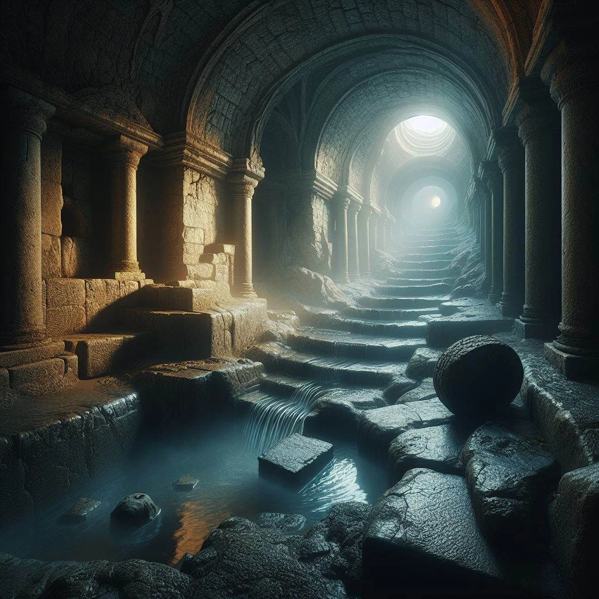

# Sesja 15: W kanałach Mytros

**Data:** 27.05.2024

## Podsumowanie

[[Felicjan]] dowiedział się trochę o swojej prababce [[Despina|Despinie]]. Mistrz [[Chalcodon]] znał ją osobiście ponad 100 lat temu i przekazał informacje na jej temat. Następnie drużyna udała się do [[Kanały Mytros|kanałów Mytros]], gdzie spotkała społeczność [[Gniazdo Zapomnianych|Zapomnianych]] i otrzymała zadanie odnalezienia zaginionej tieflinga o imieniu [[Archadina]]. W trakcie poszukiwań, drużyna stoczyła walkę z ghulami i ich [[Król Ghouli|królem]], a także z żywiołakiem wody [[Fekaliusz|Fekaliuszem]], który niestety zabił [[Hoobert|Hooberta]].

## Kluczowe wydarzenia / decyzje

* [[Felicjan]] dowiedział się więcej o swojej prababce [[Despina|Despinie]], tajemniczej kobiecie z Wybrzeża Mieczy.
* Drużyna zeszła do [[Kanały Mytros|kanałów Mytros]] i spotkała społeczność [[Gniazdo Zapomnianych|Zapomnianych]].
* Drużyna stoczyła walkę z ghulami i ich [[Król Ghouli|królem]].
* Drużyna stoczyła walkę z żywiołakiem wody [[Fekaliusz|Fekaliuszem]], w której zginął [[Hoobert]].

## Postacie Niezależne (NPC)

* [[Epikur]]
* Mistrz [[Chalcodon]]
* [[Despina]]
* [[Anteia]]
* [[Jankas]]
* [[Telekles]]
* [[Chremon]]
* [[Halie]]
* [[Król Ghouli|Król ghouli]]
* [[Fekaliusz|Żywiołak Fekaliusz]]

## Lokacje

* [[Kanały Mytros]]
* [[Gniazdo Zapomnianych]]

## Szczegółowy opis wydarzeń

[[Epikur]] przybył z informacją o [[Despina|Despinie]], tajemniczej prababce [[Felicjan|Felicjana]] kobiecie, którą Mistrz [[Chalcodon]] znał osobiście ponad 100 lat temu. [[Chalcodon]] przekazał drużynie informacje na temat [[Despina|Despiny]], jej zainteresowań i historii.

Drużyna zeszła do [[Kanały Mytros|kanałów Mytros]], gdzie spotkała społeczność [[Gniazdo Zapomnianych|Zapomnianych]], złożoną z meduz, tieflingów, pół-orków i minotaurów. Wśród nich była młoda meduza o imieniu [[Halie]], która poprosiła drużynę o pomoc w odnalezieniu jej przyjaciółki, niebieskiej tieflinga o imieniu [[Archadina]], która zaginęła w [[Kanały Mytros|kanałach]].

Drużyna wyruszyła na poszukiwania [[Archadina|Archadinay]]. Najpierw udali się na południe kanałów, gdzie napotkali ghule i ich [[Król Ghouli|króla]]. Po stoczeniu walki, znaleźli [[Podkowy Prędkości]]. Następnie udali się na północ, gdzie napotkali żywiołaka wody. Niestety, w trakcie walki z żywiołakiem, [[Hoobert]] zginął.
