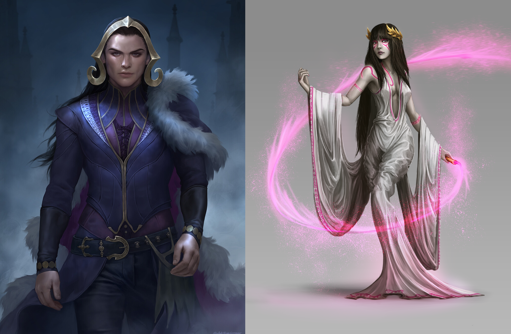

# Sesja 16: Świątynia Lutherii

**Data:** 03.06.2024

## Podsumowanie

Po rozmowie z [[Vallus|Vallusem]] o sytuacji w kanałach i obecności chimery w [[Świątynia Lutherii|Świątyni Lutherii]], drużyna przeprowadziła rekonesans i znalazła drugie wejście do świątyni.

Drużyna postanowiła dostać się do środka przez [[Kanały Mytros|kanały]]. Po drodze natknęła się na salę tortur i martwych więźniów. W końcu dotarli do głównej sali świątyni, gdzie stoczyli walkę z chimerą, [[Septia|Septią]] (Kapłanką Snów), [[Trellus|Trellusem]] (Kapłanem Śmierci) i wieloma [[Kult Lutherii|kultystami Lutherii]]. Pokonali ich wszystkich. Drużyna znalazła grupę więzionych dzieci i uratowała je.

## Kluczowe wydarzenia / decyzje

- Pogadanka z [[Vallus]].
- Rekonesans i odnalezienie drugiego wejścia do świątyni.
- Wejście do świątyni przez [[Kanały Mytros|kanały]].
- Odkrycie sali tortur.
- Walka w świątyni i pokonanie przeciwników.
- Uratowanie dzieci

## Postacie Niezależne (NPC)

- [[Vallus]]
- [[Septia]], Kapłanka Snów
- [[Trellus]], Kapłan Śmierci

## Lokacje

- [[Kanały Mytros]]
- [[Świątynia Lutherii]]
