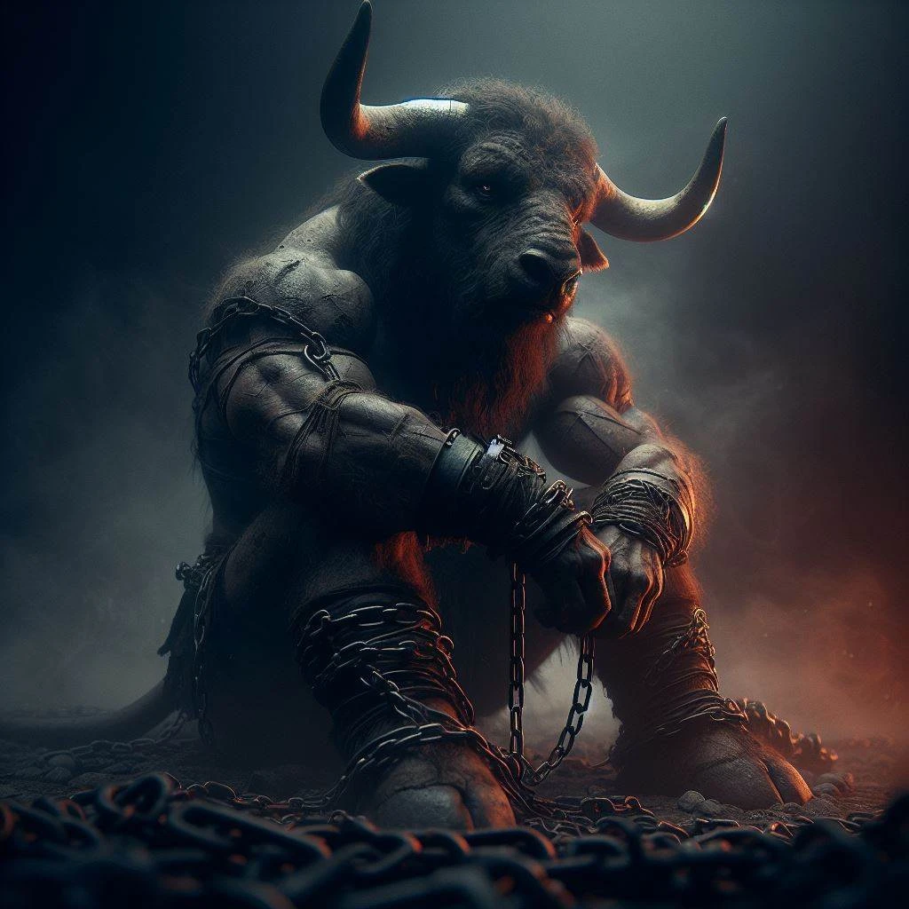

# Sesja 17: Targ Minotaurów

**Data:** 08.07.2024

## Podsumowanie

Drużyna przeszukała [[Świątynia Lutherii|Świątynię Lutherii]], znajdując spellbooka, gwizdek przywołujący piekielne psy, papiery z imionami dzieci i informacje o ich podatności na indoktrynację oraz meteorytową stal.

Z uratowanymi dziećmi udali się do [[Świątynia Pięciu|Świątyni Piątki]], ignorując po drodze straż miejską. W świątyni spotkali się z [[Melania Twardowska|Melanią Twardowską]] i zgromadzonym tłumem, który z zainteresowaniem słuchał o wydarzeniach w [[Świątynia Lutherii|Świątyni Lutherii]]. 

Na spotkanie przybyli również [[Vallus]] (przyprowadzona przez [[Hoobert|Hooberta]]), [[Gaius]] i [[Acastus]] (król [[Mytros]]) na smokach ([[Icarus]] i [[Argyn]]). Rzut Detect Thoughts na  [[Gaius|Gaiusa]] ujawnił jego obojętność wobec [[Lutheria|Lutherii]], skupienie na poparciu dla [[Sydon|Sydona]] i nienawiść do [[Chondrus|Chondrusa]].

[[Orion Xul]], [[Orestes]] i [[Versir]] udali się do "[[Syrenie Gniazdo|Syreniego Gniazda]]". [[Orestes]] miał sen, [[Mojry]] wzywają go na swoją wyspę. [[Kyrah]] przekazała informację o Igrzyskach w [[Mytros]], które mają się odbyć za 4 tygodnie.

Na [[Targ Minotaurów|targu niewolników]] drużyna spotkała [[Maximus|Maximusa]] i [[Bullbug]]. Bogata [[Nephele]] szukała minotaura. [[Orestes]] walczył z [[Bullbug]] na jej prośbę i wygrał, ale odmówił zabicia jej. [[Hoobert]]... zrobił coś niestosownego [[Nephele]]. Drużyna odkupiła [[Bullbug]] i zwolniła ją z przysięgi. [[Bullbug]] chce pomóc im z [[Maximus|Maximusem]].

## Kluczowe wydarzenia / decyzje

- Przeszukanie [[Świątynia Lutherii|Świątyni Lutherii]] i znalezienie cennych przedmiotów
- Wizyta w "[[Syrenie Gniazdo|Syrenim Gnieździe]]"
- Sen [[Orestes|Orestesa]]
- Walka [[Orestes|Orestesa]] z [[Bullbug]]

## Postacie Niezależne (NPC)

- [[Vallus]]
- [[Gaius]]
- [[Acastus]], król [[Mytros]]
- [[Kyrah]]
- [[Maximus]]
- [[Bullbug]]
- [[Nephele]]

## Lokacje

- [[Świątynia Lutherii]]
- [[Świątynia Pięciu]]
- [[Syrenie Gniazdo|"Syrenie Gniazdo"]] 
- [[Targ Minotaurów|Targ niewolników]]
