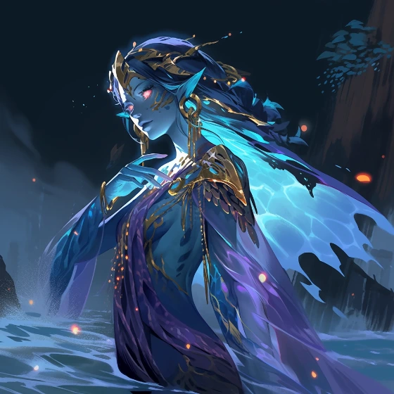

# Sesja 2: Przepowiednia

**Data:** 22.01.2024

## Podsumowanie

Bohaterowie, po zabiciu [[Sesja 1 - Wielki Dzik|Mrocznego Dzika]], przybywają do [[Świątynia Wyroczni]], aby poznać swoje przeznaczenie. Na miejscu odkrywają, że [[Versi|Wyrocznia]] została uwięziona przez wiedźmę [[Heleka|Helekę]] na rozkaz [[Sydon|Sydona]]. Uwalniają ją i wysłuchują przepowiedni.

## Kluczowe wydarzenia / decyzje

* Bohaterowie docierają do [[Świątynia Wyroczni]].
* Wewnątrz świątyni napotykają żołnierzy [[Zakon Sydona]], którzy próbują uniemożliwić im wejście.
* Bohaterowie uwalniają [[Versi|Wyrocznię]] z rąk wiedźmy [[Heleka|Heleki]].
* [[Versi]] przepowiada przyszłość [[Kontynent Thylea|Thylei]] i wyznacza bohaterom trzy zadania.
* Bohaterowie otrzymują od [[Kyrah]] złote strzały.
* [[Kyrah]] wyjaśnia zasady działania Chwały i zachęca bohaterów do złożenia Przysięgi Braterstwa.

## Postacie Niezależne (NPC)

* [[Kyrah]]
* [[Proteus]]
* [[Versi]]
* [[Heleka]]
* [[Braeca]]

## Lokacje

* [[Świątynia Wyroczni]]

## Szczegółowy opis wydarzeń

Po zabiciu [[Sesja 1 - Wielki Dzik|Mrocznego Dzika]] bohaterowie wyruszają do [[Świątynia Wyroczni]], aby poznać swoje przeznaczenie. Na miejscu okazuje się, że nimfa [[Versi]], córka [[Sydon|Sydona]], jest przetrzymywana przez złą wiedźmę [[Heleka|Helekę]]. Bohaterowie uwalniają ją, a [[Versi]] wyjawia im przepowiednię. Mówi o trzech zadaniach, które muszą wykonać, aby zapobiec zagładzie [[Kontynent Thylea|Thylei]].

**Zadania do wykonania:**

1.  Zdobyć broń [[Smoczy Lordowie|Smoczych Lordów]].
2.  Rozpalić [[Mithralowa Kuźnia|Mithralową Kuźnię]].
3.  Wypić z [[Róg Balmytrii]].

[[Kyrah]] wręcza bohaterom obiecane złote strzały. [[Kyrah]] wyjaśnia im zasady działania Sławy i zachęca do złożenia Przysięgi Braterstwa.
