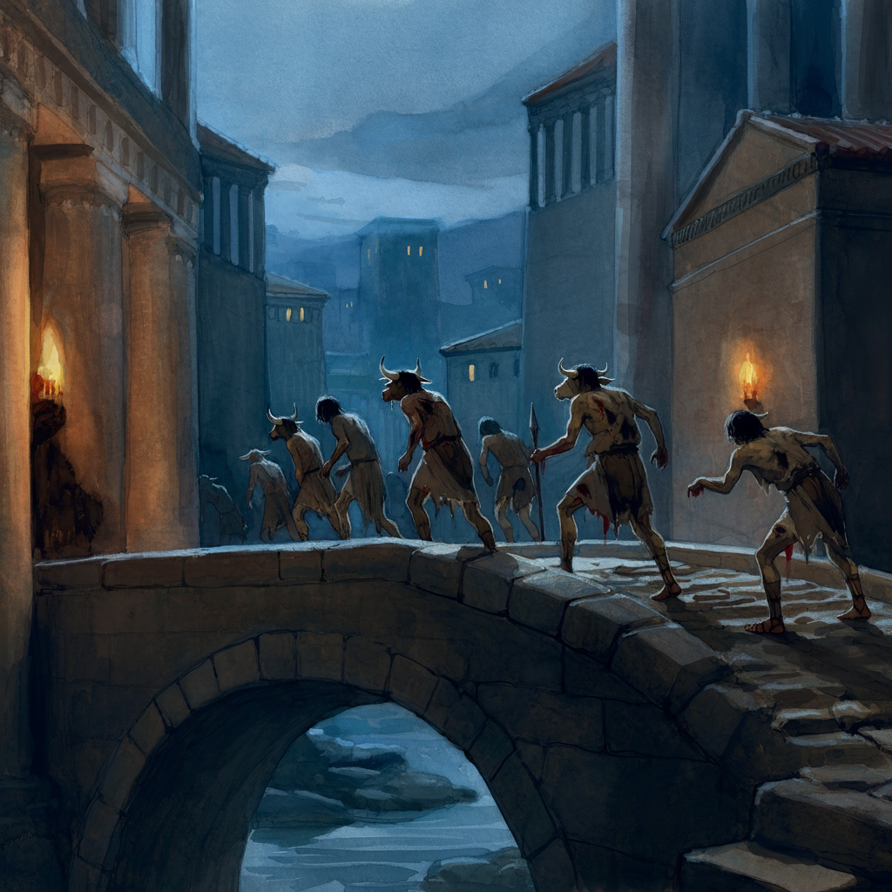

# Sesja 20: Noc Długich Rogów

**Data:** 12.08.2024

## Podsumowanie

Spotkanie z [[Maximus|Maximusem]] w kanałach przybrało oczekiwany obrót. Kiedy tylko zobaczył [[Felicjan Janus Twardowski|Felicjana]] w towarzystwie [[Orion Xul|Oriona Xula]] i [[Orestes|Orestesa]], stał się podejrzliwy. Szybko wywiązała się walka, w której [[Maximus]] poległ wraz z dwoma ochroniarzami. Przy ciele Maximusa znaleziono magiczny pierścień i kiścień.

Nagle do drużyny podszedł cyborg ([[Bioautomaton Soldier]]) i powiedział "pomóżcie mi", po czym zaatakował [[Arevon Elorrenthi|Arevona]]. W mieście wybuchła panika, słychać było krzyki. Na ulicach pojawiły się zakrwawione minotaury, jeden z nich niósł głowę elfki. 

Drużyna udała się do magazynów, w których [[Maximus]] trzymał minotaury. Znaleźli tam ciała strażników, ale na ich ciałach nie było śladów rogów, tylko precyzyjne cięcia. Podejrzenia padły na [[Kult Węża]] i [[Moxena|Moxenę]].

Mieszkanie Maximusa zostało podpalone, a jego żona zabita. W środku nie było kosztowności - ktoś zdążył je już wynieść.

Podążając śladami oleju pozostawionego przez [[Bioautomaton Soldier]], drużyna dotarła pod siedzibę [[Taran Neurdagon|Tarana Neurdagon]]. W ścianie kanałóweszli ukryte za iluzją drewniane drzwi.

Wbrew oczekiwaniom, w posiadłości [[Taran Neurdagon|Tarana Neurdagon]] panował spokój, mimo uwolnienia minotaurów.

[[Felicjan Janus Twardowski|Felicjan]] wrócił do domu, aby sprawdzić, czy u [[Melania Twardowska|Melanii Twardowskiej]] wszystko w porządku. Po drodze spotkał rozpłaszczonego [[Sędzia Enops|Sędziego Enopsa]]. Na szczęście u [[Melania Twardowska|Melanii]] wszystko było dobrze. Felicjan poprosił ją, aby nie wychodziła z domu i czekała na niego.

Następnie [[Felicjan Janus Twardowski|Felicjan]] udał się do magazynu drużyny, gdzie [[Bullbug]] zebrała 24 minotaury. Próbowała je opanować i wyprowadzić z miasta. 

Kruk [[Arevon Elorrenthi|Arevona]] śledził dwie kobiety prowadzące minotaury z magazynu. Pobiegły one na południe, do [[Kolos Pythora]], gdzie weszły do ukrytych drzwi.

Drużyna wyprowadziła łącznie 36 minotaurów kanałami przez wschodnią bramę.

Po ciężkiej nocy drużyna udała się na spoczynek. Nad ranem do magazynu przyszła syrena, która dostarczyła im meteorytową stal.

Okazało się, że [[Maximus]] miał przy sobie [[Ring of Manipulation]] i [[Tormentor's Flail]].

Drużyna chciała pójść do łaźni, ale strażnicy ich zawrócili. Najbogatsza część miasta, w tym siedziba [[Taran Neurdagon|Tarana Neurdagon]], została zamknięta.

Drużyna wykąpała się w rzece, gdzie spotkała [[Apasia|Apasię]], której [[Acastus|Acastus Arkelander]], król [[Mytros]], powierzył zbadanie sprawy zamieszek.

Na koniec udali się do pałacu, aby porozmawiać z [[Vallus]]. Była ona na spotkaniu rady. Po krótkim oczekiwaniu udało im się dostać na audiencję.

Dowiedzieli się, że [[Ismene Neurdagon]] studiowała w [[Akademia Mytros|Akademii w Mytros]].

## Kluczowe wydarzenia / decyzje

- Walka i śmierć [[Maximus|Maximusa]].
- Pojawienie się [[Bioautomaton Soldier]] i odkrycie ukrytych drzwi pod siedzibą [[Taran Neurdagon|Tarana Neurdagon]].
- Chaos w mieście i ucieczka minotaurów.
- Syrena dostarcza meteorytową stal.
- Zamknięcie najbogatszej części miasta.
- Spotkanie z [[Apasia|Apasią]] nad rzeką.
- Audiencja u [[Vallus]] w pałacu.

## Postacie Niezależne (NPC)

- [[Maximus]]
- [[Moxena]]
- [[Sędzia Enops]]
- [[Bullbug]]
- [[Apasia]]
- [[Vallus]]
- [[Ismene Neurdagon]]
- [[Acastus|Acastus Arkelander]]

## Lokacje

- Kanały
- Magazyn Maximusa
- Posiadłość Maximusa
- Magazyn drużyny
- [[Kolos Pythora]]
- Pałac
- [[Akademia Mytros]]
