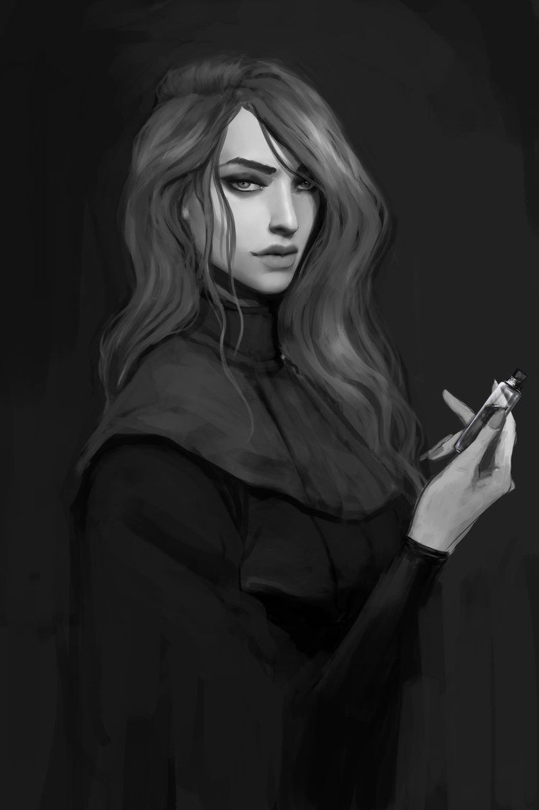

# Sesja 21: Ukryte pragnienia Ismene

**Data:** 19.08.2024

## Podsumowanie

Drużyna udała się do [[Akademia Mytros|Akademii w Mytros]], kompleksu imponujących marmurowych budynków, w skład którego wchodzą biblioteka, planetarium, hala debaty i akademik. W bibliotece [[Felicjan Janus Twardowski|Felicjan]] znalazł zwój o tytanach, zawierający drzewo genealogiczne z dopiskami. Od driady dowiedzieli się, że [[Sydon]] i [[Lutheria]] nadali swoim dzieciom imiona pokonanych przez siebie tytanów. [[Arevon Elorrenthi|Arevon]] znalazł książkę "Golemy i Automatony" autorstwa [[Volkan|Volkana]], w której znalazł informacje o [[Keledone]]. Okazało się, że [[Ismene Neurdagon]] wcześniej wypożyczała tę książkę. Skończyła studia, ale nadal odwiedza Akademię. [[Felicjan Janus Twardowski|Felicjan]] pytał o [[Xanderiada|Xanderiadę]] i [[Helios|Heliosa]]. O tym drugim nic nie znalazł, ale [[Xanderiada|Xanderiadę]] udało mu się wypożyczyć.

Na studenckiej imprezie [[Orestes]] zebrał plotki: wojownicy z [[Arezja|Arezji]] chcą upokorzyć wojowników z [[Mytros]], do miasta przybyła delegacja [[Amazonki|Amazonek]] (po raz pierwszy w historii Igrzysk), a [[Lord Starvos]], najbogatszy kupiec z [[Arezja|Arezji]], został wygnany na [[Wyspa Wygnańców|wyspę wygnańców]] za próbę otrucia syna [[Taran Neurdagon|Tarana Neurdagon]].

[[Felicjan Janus Twardowski|Felicjan]] przeprowadził zwiad w piwnicy pod [[Posiadłość Neurdagonów|posiadłością Neurdagonów]], gdzie widział korytarz w kształcie litery T. Drużyna wróciła do Akademii, aby odwiedzić półorka [[Machaon|Machaona]], który wykładał o automatonach i którego zajęcia uczęszczała [[Ismene Neurdagon]]. Interesowała się ona nekromancją i tworzeniem protez do amputowanych części ciała. Nekromancji uczyła ją [[Avys]].

Do [[Versir|Versira]] przyszła zakapturzona kobieta, [[Astra]]. Powiedziała mu, że [[Moxena]] zawarła układ z [[Hexia|Hexią]]. Porywa i sprzedaje jej skamieniałych artystów, za pośrednictwem półorka [[Varkon|Varkona]], przesiadującego w tawernie "[[Satyrzy Ogon]]". Dla [[Moxena|Moxeny]] pracuje również [[Rhea]], władająca magią. Współpraca [[Moxena|Moxeny]] z [[Hexia|Hexią]] nie jest znana nawet w szeregach [[Kult Węża|Kultu Węża]].

W tawernie "[[Satyrzy Ogon]]" przebywały [[Greciosa]] i [[Nera]], a także satyr-bard [[Fryxon]]. [[Felicjan Janus Twardowski|Felicjan]] dogadał się z [[Varkon|Varkonem]], że zabierze ich na [[Wyspa Smoka|Smoczą Wyspę]] za 20 tysięcy sztuk złota. [[Varkon]] powiedział im, gdzie jest statek. Skorzystali z nieobecności załogi i poszli na statek. [[Nera]] i [[Greciosa]] śledziły ich. Drużyna złapała je i zaczęła przesłuchiwać.

Okazało się, że [[Versir]] współpracuje z [[Moxena|Moxeną]]. Kobiety oskarżyły go o zdradę. [[Moxena]] jest meduzą!

## Kluczowe wydarzenia / decyzje

- Wizyta w [[Akademia Mytros|Akademii w Mytros]].
- Zwiad w piwnicy pod [[Posiadłość Neurdagonów|posiadłością Neurdagonów]].
- [[Astra]] informuje [[Versir|Versira]] o układzie [[Moxena|Moxeny]] z [[Hexia|Hexią]].
- Wejście na statek [[Varkon|Varkona]].
- Złapanie i przesłuchanie [[Nera|Nery]] i [[Greciosa|Greciosy]].
- Odkrycie powiązań [[Versir|Versira]] z [[Kult Węża|Kultem Węża]] i prawdziwej natury [[Moxena|Moxeny]].

## Postacie Niezależne (NPC)

- [[Ismene Neurdagon]]
- [[Machaon]]
- [[Avys]]
- [[Astra]]
- [[Moxena]]
- [[Hexia]]
- [[Varkon]]
- [[Rhea]]
- [[Greciosa]]
- [[Nera]]
- [[Fryxon]]

## Lokacje

- [[Akademia Mytros]]
- Tawerna "[[Satyrzy Ogon]]"
- Statek [[Varkon|Varkona]]
