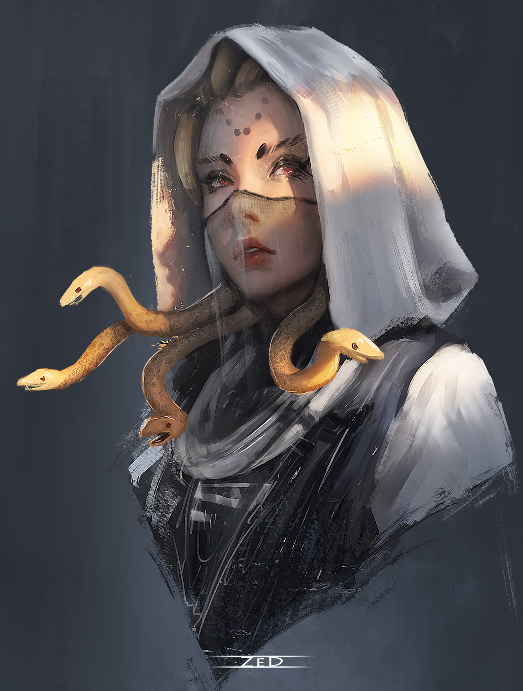

# Sesja 22: Taniec z Meduzą

**Data:** 26.08.2024

## Podsumowanie

[[Versir]] wyznał, że [[Moxena]] wkrótce go dopadnie i ukara za zdradę. Chciał uwolnić [[Astra|Astrę]]. Drużyna odprowadziła [[Nera|Nerę]] i [[Greciosa|Greciosę]] do [[Vallus]], która obiecała przetrzymać je z dala od króla [[Acastus|Acastusa]]. W tym czasie [[Hoobert]] doniósł [[Felicjan Janus Twardowski|Felicjanowi]], że załoga statku wróciła i przygotowuje go do odpłynięcia. [[Felicjan Janus Twardowski|Felicjan]] i [[Orion Xul]] nie byli w stanie pokonać kilkunastu marynarzy, więc [[Felicjan Janus Twardowski|Felicjan]] użył Alter Self i Fireball, aby unieruchomić statek i siać popłoch.

Kiedy reszta drużyny wróciła, przeszukała statek. [[Arevon Elorrenthi|Arevon]] znalazł w kajucie kapitana złoty płaszcz, sakiewkę złota i mapy gwiazd, ale nie [[Antikythera|Antikytherę]]. [[Orestes]] znalazł 4 posągi, w tym córkę [[Maximus|Maximusa]], po czym wyrąbał dziurę w dnie statku i uciekł.

[[Moxena]] zaproponowała spotkanie w siedzibie [[Kult Węża|Kultu Węża]], ale drużyna nalegała na [[Kanały Mytros|kanały]]. Złożyli przysięgę, że nie wyjawią jej motywów żadnemu słudze [[Lutheria|Lutherii]]. [[Moxena]] ujawniła, że jest w potrzasku i zaproponowała układ. Drużyna dowiedziała się, że [[Moxena]] potrzebuje sojuszników i zasobów do swojej misji, która ma "najszlachetniejsze cele". Nie mogła zdradzić szczegółów, aby [[Lutheria]] ich nie poznała. W końcu [[Moxena]] zdradziła część informacji. Chce wrócić na [[Themis]], aby obalić fałszywą królową, która uzurpuje władzę. Zasugerowała, że drużyna mogłaby jej w tym pomóc. Wyjawiła, że w młodości popełniła wielką krzywdę i chce ją naprawić. W zamian za pomoc, zobowiązała się natychmiast zaprzestać porywania artystów w Mytros oraz obiecała, że w przyszłości pomoże rozprawić się z [[Hexia|Hexią]]. [[Moxena]] pochodzi z [[Themis|Wyspy Themis]], gdzie kilkanaście lat temu wraz z siostrami dokonała przewrotu i przejęła władzę.

[[Versir]] nie chciał pertraktować i rzucił Vortex Warp, na co [[Rhea]] odpowiedziała Counterspell.

## Kluczowe wydarzenia / decyzje

- Drużyna oddaje [[Nera|Nerę]] i [[Greciosa|Greciosę]] [[Vallus]].
- [[Felicjan Janus Twardowski|Felicjan]] i [[Orion Xul]] atakują statek [[Varkon|Varkona]].
- [[Orestes]] zatapia statek.
- Spotkanie z [[Moxena|Moxeną]] w [[Kanały Mytros|kanałach]].

## Postacie Niezależne (NPC)

- [[Moxena]]
- [[Astra]]
- [[Nera]]
- [[Greciosa]]
- [[Vallus]]
- [[Acastus|Acastus Arkelander]]
- [[Hoobert]]
- [[Rhea]]
- [[Hexia]]

## Lokacje

- Statek [[Varkon|Varkona]]
- [[Kanały Mytros|Kanały]]
- [[Themis|Wyspa Themis]] (wspomniana)
