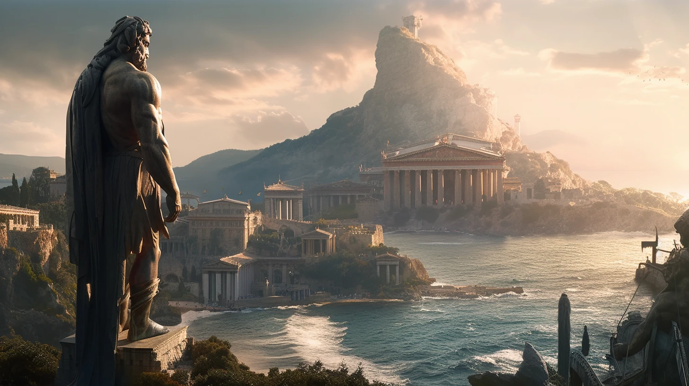

# Sesja 23: Nowe Przymierze

**Data:** 16.09.2024

## Podsumowanie

Drużyna rozeszła się z [[Moxena|Moxeną]], unikając walki. Po przedyskutowaniu sytuacji [[Versir]] zgodził się na nowe warunki: jeśli [[Moxena]] pomoże im ze smokiem [[Hexia|Hexii]], jest gotów na układ.

Udali się do siedziby [[Kult Węża|Kultu Węża]] w [[Kolos Pythora|Kolosie Pythora]], gdzie [[Moxena]] ostatecznie zaakceptowała ich propozycję. Dała im mapę [[Posiadłość Neurdagonów|Posiadłości Neurdagonów]].

Po powrocie do [[Vallus]], poinformowali ją, że [[Moxena]] nie będzie już zagrażać [[Mytros]]. [[Vallus]] zgodziła się odnaleźć [[Varkon|Varkona]] w nadziei, że ma przy sobie [[Antikythera|Antikytherę]]. Drużyna wyruszyła na poszukiwania [[Ultros|Ultrosa]].

[[Kyrah]] opowiedziała im historię o przybyciu bogów do [[Kontynent Thylea|Thylei]] ("Wezwanie nowych bogów").

W trakcie podróży spotkali dziwnego cyklopa (Blemys). Otrzymali od syreny [[Tarcza Xandera|Tarczę Xandera]].

## Kluczowe wydarzenia / decyzje

* Nowe warunki układu z [[Moxena|Moxeną]].
* Początek Poszukiwań [[Ultros|Ultrosa]].

## Postacie Niezależne (NPC)

* [[Moxena]]
* [[Vallus]]
* [[Varkon]]
* [[Kyrah]]

## Lokacje

* [[Kolos Pythora]]
