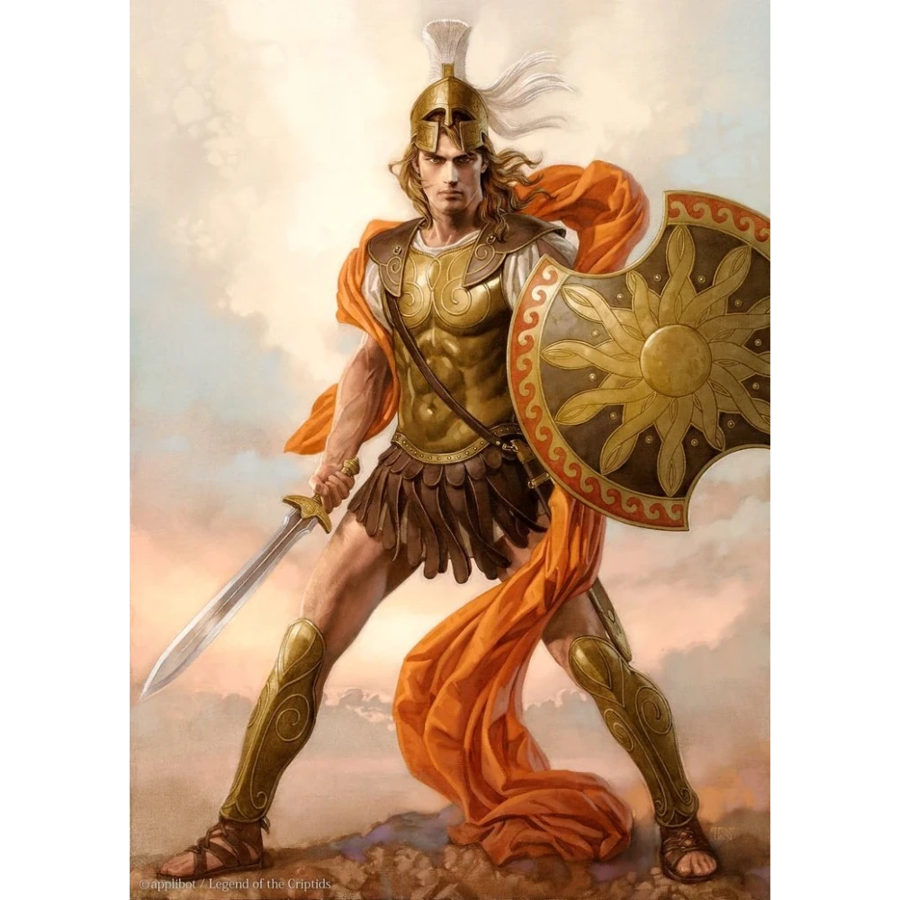

# Sesja 24: Ultros

**Data:** 29.09.2024

## Podsumowanie

Drużyna podążała za mapą otrzymaną od króla [[Acastus|Acastusa]], prowadzącą do ostatniego znanego miejsca pobytu legendarnego statku [[Ultros]]. Mapa doprowadziła ich do [[Martwe Wodospady|Martwych Wodospadów]] na wschodzie Heartlands. Po drodze zatrzymali się w gospodzie "[[Kwaśny Rocznik]]", gdzie zebrali plotki o [[Ultros|Ultrosie]] i wodospadach.

Dotarłszy do wodospadów, drużyna odnalazła [[Ultros]] zacumowany przy brzegu. Na statku spotkali ducha driady [[Delphia|Delphiny]], która wyjawiła, że jest związana ze statkiem i opowiedziała o tragicznych wydarzeniach z przeszłości, kiedy to [[Estor Arkelander]] zabił ją i jej siostrę [[Demetria|Demetria]], a następnie użył drzewa, z którym była związana, do stworzenia masztu [[Ultros|Ultrosa]].

Następnie drużyna spotkała kolejnych członków załogi:

* **[[Davos]]:** kwatermistrz, krasnolud, który opowiedział o historii powstania [[Ultros|Ultrosa]] i jego związku z [[Estor Arkelander|Estorem]] i [[Lutheria|Lutherią]].
* **[[Metron]]:** nawigator, otyły duch, który opisał, jak [[Estor Arkelander|Estor]] zawarł pakt z [[Lutheria|Lutherią]] i zabił całą załogę, po czym sami powstali jako duchy.
* **[[Skathon]]:** elf, historyk i naukowiec, który zaoferował [[Orestes|Orestesowi]] naukę.

W końcu drużyna spotkała się z [[Estor Arkelander|Estorem Arkelanderem]], kapitanem [[Ultros|Ultrosa]]. Zaproponował im układ - pomoc w opętaniu króla [[Acastus|Acastusa]] w zamian za pożyczenie statku. Drużyna odmówiła i doszło do walki. 

Podczas walki, [[Estor Arkelander|Estor]], który wydawał się być nieśmiertelny, skupił się na [[Astra|Astrze]] i [[Arevon|Arevonie]], zabijając ich.  W miarę jak walka się przedłużała, a sytuacja stawała się coraz bardziej rozpaczliwa, [[Kyrah]] wkroczyła do akcji. 

"Estor, już wystarczy!" - krzyknęła. "Nie będziesz już obrażać bogini ani Smoczych Lordów. Mam tego dosyć. Zdecydowanie nie ma dla ciebie szansy na odkupienie."

[[Estor Arkelander|Estor]] zareagował śmiechem. "To wszystko twoja wina. Gdybyś nie odeszła, [[Lutheria]] by mnie nie oszukała. Klątwa, to co stało się z załogą – to wszystko twoja wina! A teraz odbiorę ci wszystko, co kochasz, jednego za drugim. Będę łamać ci serce raz po raz. A potem złamię ciebie."

"Nie, Estorze, mam tego dosyć." - odparła [[Kyrah]] z determinacją. "Twierdziłeś, że nie masz już nic wspólnego z nami ani z Tytanami, więc przypuszczam, że Furie nie mogą uważać cię za chronionego Przysięgą Pokoju." 

[[Kyrah]] złożyła ręce, które zaczęły błyszczeć. "Zbyt długo czułam się winna z twojego powodu. Nie skrzywdzisz już nikogo, kogo kocham. Nigdy. Więcej."  Z siłą rozdarła swoje ręce, a jasne światło otoczyło wszystkich, lecząc ich rany.

Gdy światło zgasło, [[Estor Arkelander|Estor]] zmienił się nie do poznania. W miejscu, w którym przed chwilą stał imponująco wyglądający mężczyzna, była teraz rozpadająca się, szkieletowa zjawa. Jego oczy świeciły złowieszczym czerwonym światłem, a on sam zdawał się utrzymywać formę jedynie siłą własnej nienawiści. "Co zrobiłaś KURWO?!" - ryknął.

Osłabiony [[Estor Arkelander|Estor]] został ostatecznie pokonany przez drużynę, [[Felicjan Janus Twardowski|Felicjan]] zadał ostateczny cios. 

Po śmierci [[Estor Arkelander|Estora]], [[Orestes]] został mianowany nowym kapitanem [[Ultros|Ultrosa]]. [[Delphia]] dała mu wybór między ścieżką żywych a ścieżką umarłych. [[Orestes]] wybrał ścieżkę żywych, w wyniku czego cała nieumarła załoga opuściła statek, a drużyna potrzebuje teraz nowej załogi.

## Kluczowe wydarzenia / decyzje

* Podróż do [[Martwe Wodospady|Martwych Wodospadów]].
* Spotkanie załogi [[Ultros|Ultrosa]] i poznanie historii statku.
* Odmowa przyjęcia oferty [[Estor Arkelander|Estora Arkelandera]].
* Walka z [[Estor Arkelander|Estorem]], śmierć [[Astra|Astry]] i [[Arevon|Arevona]], interwencja [[Kyrah]].
* [[Orestes]] zostaje nowym kapitanem [[Ultros|Ultrosa]].
* Wybór ścieżki żywych i utrata nieumarłej załogi.

## Postacie Niezależne (NPC)

* [[Delphia]]
* [[Davos]]
* [[Metron]]
* [[Skathon]]
* [[Estor Arkelander]]
* [[Kyrah]]

## Lokacje

* [[Martwe Wodospady]]
* Gospoda "[[Kwaśny Rocznik]]"
* [[Ultros]]
