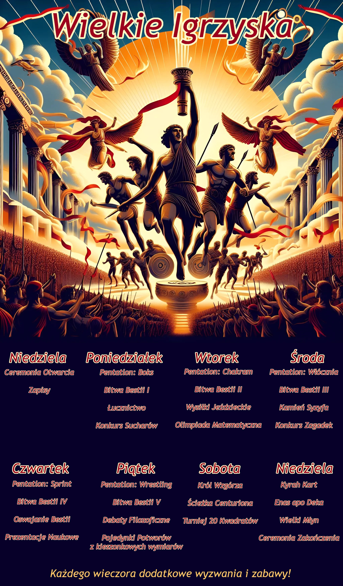

---
tags:
  - Sesja
  - Mytros
  - Igrzyska
---

# Sesja 25 - Inauguracja Wielkich Igrzysk

**Data:** 07.10.2024

## Podsumowanie

Po przybyciu do [[Mytros]], drużynę powitał [[Tarchon]] na smoku, gratulując im sukcesu i lecąc poinformować króla [[Acastus|Acastusa]]. [[Vallus]] wyraziła zaniepokojenie losem [[Kyrah]], niepewna, czy tym razem się odrodzi. Król [[Acastus]] zorganizował paradę na cześć drużyny, choć zaproszenie na nią przekazano w ostatniej chwili.

Rozpoczęcie Wielkich Igrzysk odbyło się z wielką pompą. Procesja wyruszyła ze [[Świątynia Pięciu|Świątyni Pięciu]] na [[Stadion Mytros]], witana entuzjastycznie przez tłumy. Na stadionie pojawili się [[Vallus]], [[Volkan]], [[Pythor]], [[Kyrah]], [[Chondrus]] i [[Bella]]. [[Vallus]] wygłosiła mowę inaugurującą, po czym król [[Acastus]] i Smoczy Lordowie zrobili imponujące wejście.

Uczestnicy złożyli przysięgę fair play, a kapłani Piątki rozpoczęli składanie ofiar bogom. Niespodziewanie pojawiła się nowa tradycja - walka z minotaurem, co wywołało konsternację wśród Piątki.

Na stadionie pojawił się [[Sydon]], Tytan Burz, a [[Lutheria]], Tytan Śmierci, przyprowadzając ze sobą nieumarłych czempionów. Król [[Acastus]], początkowo zaskoczony, szybko odzyskał panowanie nad sobą i powitał wszystkich zgromadzonych.

## Kluczowe wydarzenia / decyzje

* Powitanie w [[Mytros]] przez [[Tarchon|Tarchona]].
* Zaniepokojenie [[Vallus]] losem [[Kyrah]].
* Parada na cześć drużyny zorganizowana przez króla [[Acastus|Acastusa]].
* Uroczyste rozpoczęcie Wielkich Igrzysk.
* Pojawienie się [[Sydon|Sydona]] i [[Lutheria|Lutherii]].

## Postacie Niezależne (NPC)

* [[Tarchon]]
* [[Acastus|Król Acastus]]
* [[Vallus]]
* [[Volkan]]
* [[Pythor]]
* [[Kyrah]]
* [[Chondrus]]
* [[Bella]]
* [[Sydon]]
* [[Lutheria]]

## Opis Ceremonii Otwarcia

Gdy słońce zaczyna zaglądać nad [[Mytros]], powietrze wypełnia szum podniecenia. Obywatele ze wszystkich zakątków nie tylko miasta, ale i całej Thylei zaczynają wylewać się na ulice ubrani w swoje najlepsze stroje i przyozdobieni girlandami kwiatów. Wy, wraz z resztą uczestników, czekacie wewnątrz [[Świątynia Pięciu|Świątyni Pięciu]]. Widzicie sztandary z [[Estoria|Estorii]], [[Arezja|Arezji]] i [[Mytros]], [[Themis]], a nawet [[Praxys]].

Rozlega się dźwięk rogu i procesja opuszcza świątynię, by rozpocząć wędrówkę na szczyt góry [[Kuźnia Volkana|Volkan]]. Gdy się wyłaniacie, tłumy zaczynają wiwatować. Kwiaty są rzucane w stronę sportowców, a mieszkańcy miasta oferują wino. Widać dzieci wspinające się na szczyty budynków, by mieć dobry widok, a w powietrzu czuć radość i oczekiwanie. Słychać okrzyki „Naprzód [[Estoria]]!”. Grupa młodych mężczyzn, najwyraźniej już pijanych, z twarzami pomalowanymi na niebiesko, skanduje: „[[Mytros]] [[Mytros]] [[Mytros]]!”. Jeszcze więcej głosów krzyczy: „Czy to Amazonka?”. Inny: „10 złotych monet na [[Gaius|Gaiusa]]!!!”.

Procesja przechodzi obok pałacu i w końcu dociera do podnóża góry [[Kuźnia Volkana|Volkan]], a atmosfera staje się niemal uroczysta. Tłumy przerzedzają się, stając za wami i rozciągając się w kierunku miasta, gdy zaczynacie wspinać się w górę. Wspinaczka, choć stroma, została dobrze przetarta przez pokolenia sportowców i widzów. Nie kierujecie się na szczyt, odbijacie na północ. W końcu wchodzicie na wielki [[Stadion Mytros|stadion Mytros]], a spokojną atmosferę przerywa ryk tłumów, gdy wy i inni uczestnicy wchodzicie na stadion. Tysiące obywateli wypełnia wykute w kamieniu siedzenia, a ich głosy zlewają się w falę oczekiwania, która zalewa arenę. Słońce skąpało scenę w złotym świetle, sprawiając, że marmurowe posągi wyłożone na krawędziach stadionu lśnią czymś, co wydaje się boską energią. Banery w każdym możliwym kolorze powiewają na delikatnym wietrze, widzowie machają flagami pokazującymi ich przynależność.

Balkon na północnej ścianie areny ozdobiono świeżymi kwiatami i tkanymi gobelinami, które przedstawiają legendarne wyczyny z poprzednich igrzysk. W powietrzu unosi się zapach polnych kwiatów i kadzideł, a niewidoczni muzycy grają melodię. Nagle w tłumie zapada cisza, gdy kilka znajomych postaci pojawia się na królewskim balkonie.

[[Vallus]], ubrana w olśniewające szaty z błyszczącego błękitu i srebra, niesie pochodnię, która migocze na wietrze. [[Volkan]] staje obok niej, jego ciemna broda spleciona jest w misterne warkocze, a mithralowa zbroja lśni w słońcu. [[Pythor]] wygląda lepiej, niż kiedykolwiek wcześniej. Jego dzikie włosy i broda zostały okiełznane i jesteście prawie pewni, że naoliwił swoje mięśnie tak, żeby błyszczały w słońcu. Uśmiecha się i macha do tłumu, wywołując ryk aprobaty. [[Kyrah]] stoi obok niego, a jej czarne włosy mienią się niemal jak skrzydła szpaka. Jej strój jest zwyczajnie biały, ale brzegi wyhaftowane są metaliczną brązową nicią, która łapie promienie słońca. Spotkaliście już każdego z tych bogów, jedliście z nimi, piliście z nimi, śmialiście się z nimi, walczyliście z nimi. Kiedy jednak pojawiają się na balkonie, nagle uderza was otaczająca ich boska atmosfera, tym bardziej oczywista dzięki dwóm kolejnym postaciom na balkonie. [[Chondrus]] w czarnym eleganckim stroju i [[Bella]] jak zwykle ubrana trochę zbyt lubieżnie.

Wszyscy zajmują miejsce, a [[Kyrah]] zdaje się podnosi się na palcach z psotnym spojrzeniem odnajduje was wzrokiem, jakby chciała się przywitać. [[Vallus]] zaczyna przemawiać, a jej czysty głos odbija się echem w tłumie.

„Mieszkańcy [[Mytros]], szlachetni zawodnicy i szanowni goście z dalekich i bliskich krain, zebraliśmy się dziś, by rozpocząć świętą tradycję - Wielkie Igrzyska! Te igrzyska to nie tylko zawody sprawności fizycznej, ale także święto intelektu, kreatywności i niezłomnego ducha naszego ukochanego miasta. Niech mądrość wieków kieruje waszymi poczynaniami, siła bohaterów napędza waszą determinację, kreatywność kuźni kształtuje wasze przeznaczenie, a harmonia muzyki podnosi na duchu. Niech rozpoczną się Wielkie Igrzyska!”

W tym momencie zauważacie kilka kształtów na niebie. To Król [[Acastus]] i jego tak zwani Smoczy Lordowie. Miedziane smoki razem z jeźdźcami wykonują w powietrzu imponujące manewry aż w końcu lądują przed wami. Icarus, srebrny smok króla przelatuje obok balkonu, a król wykonuje epicki wyskok i ląduje na balkonie. Tłum szaleje. Słychać okrzyki i oklaski.

Król podnosi pięć w powietrze i cały stadion wydaje się wstrzymywać oddech. Przez chwilę nic się nie dzieje. Potem ziemia zaczyna drżeć, a z ukrytych mechanizmów wyrastają wysokie marmurowe filary. Kolorowe płomienie wirują w powietrzu, wokół nich. Tłum wybucha wiwatami i oklaskami, a z miasta poniżej rozlegają się dźwięki rogów i bębnów, sygnalizując rozpoczęcie igrzysk.

[[Acastus]] unosi ręce, uciszając tłum. [[Pythor]], wychodzi na przód:

„Nadszedł czas, aby zawodnicy złożyli przysięgę, tak jak robili to od samego początku. Ci, którzy nie złożą przysięgi, zostaną zdyskwalifikowani z tych i przyszłych igrzysk”.

Zawodnicy wokół was prostują kręgosłupy i patrzą na boga bitwy z determinacją i jako jedność powtarzają słowa, które wypowiada [[Pythor]]:

„Przysięgam rywalizować uczciwie i sprawiedliwie przez cały czas trwania igrzysk [pauza, aby zawodnicy mogli złożyć przysięgę] i traktować innych zawodników z szacunkiem, na jaki zasługują”.

Zauważasz spojrzenie [[Pythor|Pythora]] rzucone królowi, który wydaje się niezbyt zadowolony z końcowego oświadczenia i macie wrażenie, że jest to nowy dodatek do przysięgi.

Ci, którzy siedzą na trybunach, zajmują swoje miejsca, podczas gdy kapłani Piątki rozpoczynają składanie ofiar. Najpierw zaprezentowana jest szklana kula wypełniona magicznym tańczącym srebrnym płomieniem i umieszczana na piedestale pod balkonem.

Następnie wypuszczane są dziesiątki białych gołębi dla [[Vallus]], każdy z nich z modlitwą przywiązaną do nogi, a ona zatrzymuje jednego, którego pióra wydają się mienić w słońcu.

Następnie tancerze ognia i połykacze mieczy wypełniają arenę, występując dla [[Volkan|Volkana]], który otrzymuje narzędzia rzemieślnicze wykonane przez śmiertelnych mistrzów.

Beczki z winem są wtaczane na arenę i rozdawane tłumowi, który wiwatuje. Jedna z nich zostaje wręczona [[Pythor|Pythorowi]], który kiwa głową w podziękowaniu i nalewa sobie trunku.

[[Arevon Elorrenthi|Arevon]], dzięki swojej spostrzegawczości, widzi, jak [[Kyrah]] subtelnie zamienia jego puchar na swój, a on nieznacznie kiwa głową.

Następnie wchodzą muzycy, a ich symfonia odbija się echem w powietrzu, szybka i jasna melodia, przy której [[Kyrah]] kiwa głową.

A potem... tłum milknie, gdy na stadion wkraczają ubrane na czarno postacie. Trzymają w rękach kadzielnice i poruszają się w dziwnym tańcu, kołysząc nimi w przód i w tył, intonując niezrozumiałe słowa, wypełniając powietrze słodko pachnącym dymem, od którego kręci się w głowie.

W końcu słychać skrzypienie drewnianych kół, gdy wjeżdża kilka klatek, z których każda zawiera uzbrojonego minotaura. Z tłumu dobiegają pomruki, a na twarzach Piątki można dostrzec spojrzenia dezaprobaty, choć żaden z nich się nie odzywa. [[Gaius]] wychodzi przed szereg i woła: „Władca Burz zażądał nowej tradycji, walki jeden na jednego w celu zabicia minotaura. Ci, którzy chcą złożyć ofiarę, niech wystąpią naprzód i pokażą swoją potęgę i moc”.

Natychmiast ci pod sztandarem [[Praxys]] wystąpili naprzód, a [[Gaius]] spogląda na was z przebiegłym uśmieszkiem.

…

Czujecie zapach. Ozon. Po chwili słyszycie grzmot, a wszyscy spoglądają w górę. Ciemne chmury zebrały się nad stadionem. Po chwili z chmur wyłania się ogromna postać. To [[Sydon]]. Leci wokół stadionu na wielkich orlich skrzydłach aby w końcu wylądować na balkonie. [[Acastus]] wstaje i wita [[Sydon|Sydona]]:

"Ach, [[Sydon|Sydon]] jestem szczęśliwy, że przyjąłeś moje osobiste zaproszenie. Minęło zbyt wiele czasu od kiedy ostatnio Tytani zaszczycili swoją obecnością Wielkie Igrzyska. Mam nadzieję, że wizyta w [[Mytros]] sprawi ci wiele radości."

[[Sydon]] wzdycha i nie odpowiada. "Eh… No, skoro już dotarłeś to możemy zaczynać!" W tym momencie słyszycie niepokojący kobiecy śmiech wdzierający się do waszych umysłów. Widzicie krystaliczne ostrze przecinające rzeczywistość, a przez wyciętą dziurę widzicie [[Lutheria|Lutherię]]. Spogląda na swojego męża, który jest również jest bratem - nie ma w tym nic dziwnego… Skina głową w jego kierunki. [[Sydon]] odpowiada jej skinieniem głowy. Spogląda prosto na was, uśmiecha się i macha wam. Wyrwa w rzeczywistości wycięta przez krystaliczną kosę powoli leczy się by w końcu zniknąć. Kosa lewitująca za [[Lutheria|Lutherią]] też zaczyna znikać.

[[Orestes]], zanim kosa zniknęła słyszysz znajome głosy. Głosy, których nie słyszałeś od lat. Głosy wołają o pomoc z wnętrza kosy. Pamiętasz szorstki, niski głos swojego ojca. Pamiętasz delikatny, uspokajający głos swojej matki.

[[Acastus]] odzywa się do [[Lutheria|Lutherii]]: "Moja pani! Cieszę się, że również ty przyjęłaś moje zaproszenie!" Odpowiada: "Mam nadzieję, że nie masz nic przeciwko wspaniały królu, ale przyprowadziłam własną drużynę czempionów. Przepraszam, że nie zdążyli na oficjalne zapisy, ale jestem pewna, że jesteś w stanie znaleźć dla nich miejsce?" [[Acastus]] odpowiada: "Eee, oczywiście… Gdzie oni są?"

Ziemia za wami zaczyna się gotować. Trzy istoty prosto z horroru wdrapują się na powierzchnie. W tłumie widać zdenerwowanie na widok ewidentnie nieumarłych istot. Król wydaje się być chwilowo zaskoczony ale szybko dochodzi do siebie.

"Ludu [[Mytros]]… nie! Ludu Thylei! Ja Król [[Acastus]], Najwspanialszy Król Thylei, Pierwszy wśród Smoczych Lordów, Przystojny, Silny i Mądry witam was w moim mieście! Spójrzcie na tych najlepszych atletów z całego świata. Przez następne dni doświadczycie niesamowitych widowisk. Ujrzycie pokazy siły, zwinności i sprytu. Z dumą zapraszam uczestników do udziału w pierwszym wyzwaniu!"
