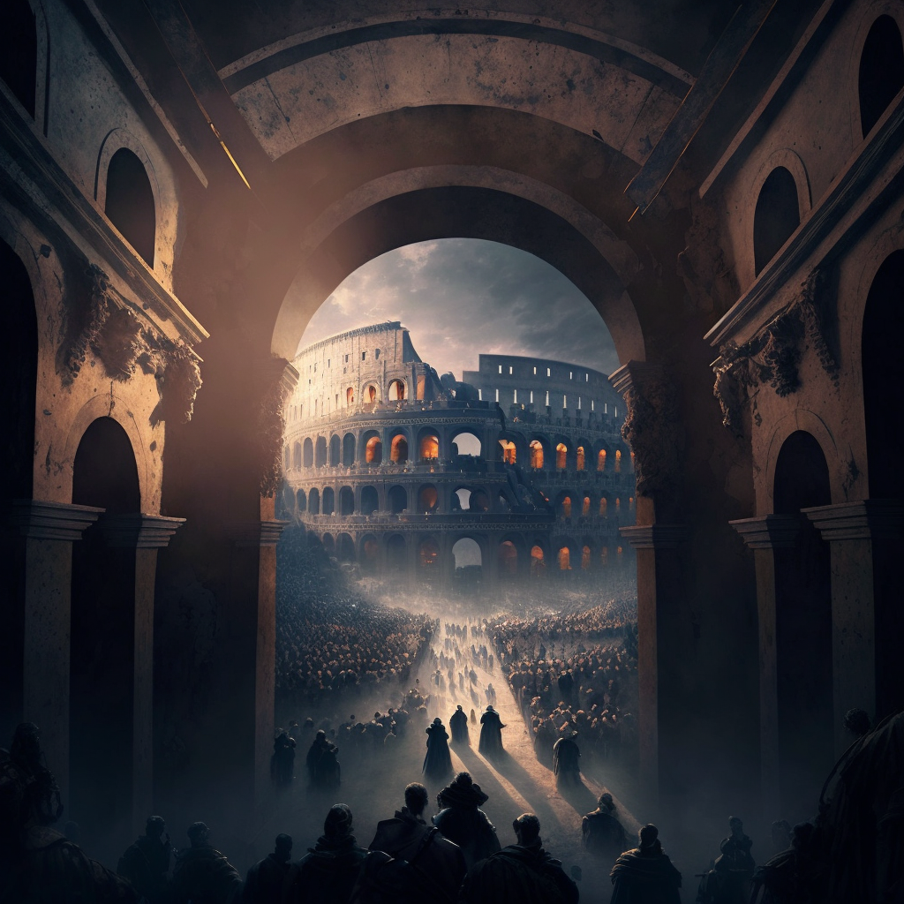

**Data:** 14.10.2024

## Podsumowanie

Na Igrzyskach w [[Mytros]] odbyły się kolejne zawody. Podczas walk [[Hoobert]] poświęcił się, aby ratować [[Felicjan Janus Twardowski|Felicjana]].

## Postacie Niezależne (NPC)

* [[Yala]]
* [[Hoobert]]

### Lokacje

* [[Stadion Mytros|Koloseum w Mytros]]
