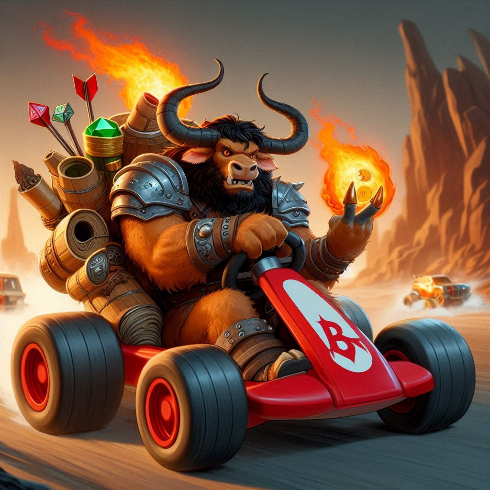

---
tags:
  - Sesja
  - Igrzyska
---

# Sesja 29 - Rydwany i Jeden z Dziesięciu

**Data:** 04.11.2024

## Podsumowanie

Podczas igrzysk odbył się wyścig rydwanów. [[Felicjan Janus Twardowski|Felicjan]], po awarii własnego rydwanu, wskoczył na rydwan [[Democedes|Democedesa]]. Na ostatniej prostej wyrzucił go z pojazdu za pomocą telekinezy i przejął kontrolę, wygrywając wyścig tuż przed metą. [[Arevon Elorrenthi]] próbował go powstrzymać, teleportując się na rydwan, ale mu się nie udało. Wieczorem odbył się konkurs wiedzy Enas apo Deka prowadzony przez [[Thadeus Sznukides|Thadeusa Sznukidesa]]. Konkurs wiedzy również został wygrany przez [[Felicjan Janus Twardowski|Felicjana]].

## Kluczowe wydarzenia / decyzje

* Wyścig rydwanów.
* Enas apo Deka.

## Postacie Niezależne (NPC)

* [[Thadeus Sznukides]]
* [[Democedes]]
