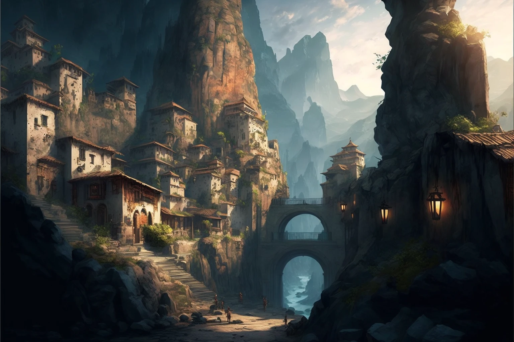

# Sesja 3: Skradziony Róg

**Data:** 29.01.2024

## Podsumowanie

Bohaterowie wyruszają do [[Estoria|Estorii]], gdzie dowiadują się o straszliwej suszy i żądaniu złożenia ofiary z córki króla [[Pythor|Pythora]]. Próbują znaleźć rozwiązanie dla kryzysu.

## Kluczowe wydarzenia / decyzje

* Bohaterowie opuszczają [[Świątynia Wyroczni|Świątynię Wyroczni]] i udają się do [[Estoria|Estorii]].
* W [[Estoria|Estorii]] dowiadują się o suszy i żądaniu złożenia ofiary z [[Anora|Anory]].
* Bohaterowie dowiadują się, że podróżująca z nimi [[Kyrah]] faktycznie jest Boginią Muzyki.
* Bohaterowie rozważają różne sposoby rozwiązania problemu.
* Postanawiają ukraść róg.

## Postacie Niezależne (NPC)

* [[Kyrah]]
* [[Pythor]]
* [[Anora]]

## Lokacje

* [[Estoria]]
* [[Karczma Smoczy Ząb|Karczma "Smoczy Ząb"]]
* [[Super Bar]]
* [[Pałac Królewski w Estorii]]
* [[Skała Estora]]

## Szczegółowy opis wydarzeń

Po opuszczeniu [[Świątynia Wyroczni|Świątyni Wyroczni]] bohaterowie wyruszają do [[Estoria|Estorii]]. W mieście dowiadują się o suszy i żądaniu złożenia ofiary z [[Anora|Anory]], córki króla [[Pythor|Pythora]]. Rozważają różne sposoby rozwiązania problemu. Ostatecznie ruszają tropem skradzionego [[Róg Balmytrii|rogu Balmytrii]].
