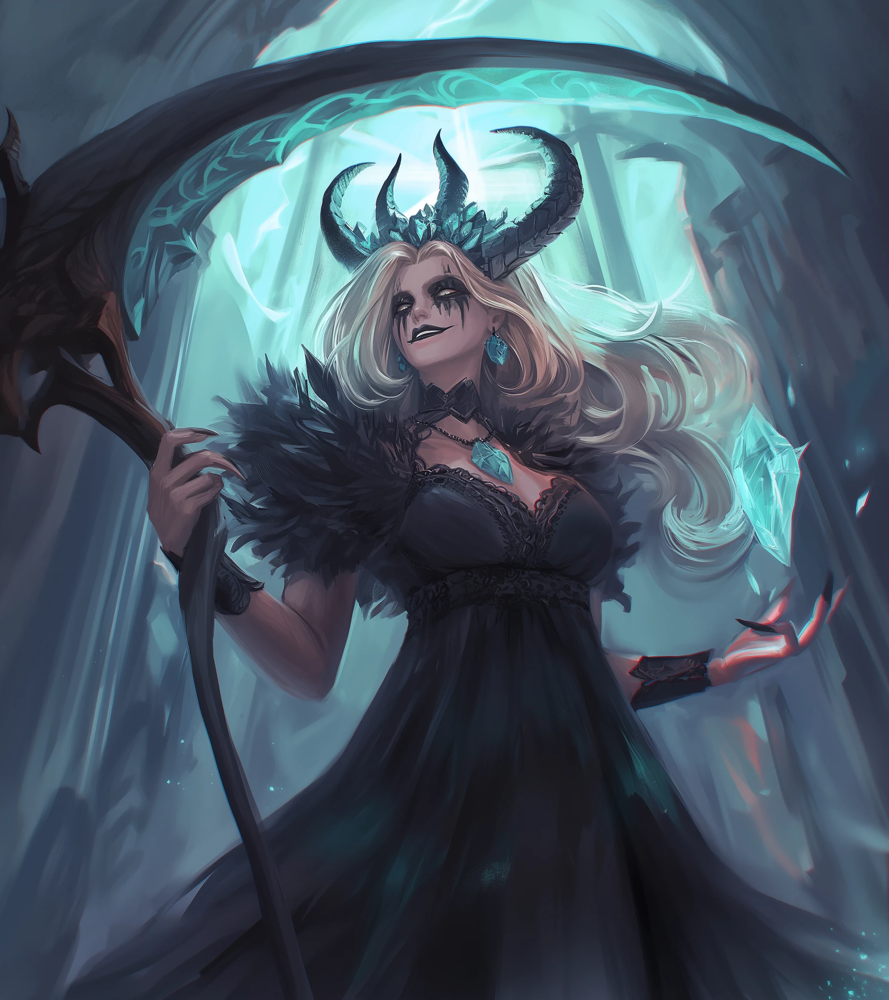

---
tags:
  - Sesja
  - Igrzyska
  - Mytros
---

# Sesja 30 - Zakończenie Igrzysk

**Data:** 12.11.2024

## Podsumowanie

Ostatni dzień Igrzysk kończył się Wielkim Młynem, walką do której przystąpili wszyscy uczestnicy, ale zwycięzca mógł być tylko jeden. [[Yala]] okazała się trudnym przeciwnikiem, pokonując swojego brata [[Hergeron|Hergerona]], który prawie dobił [[Orion Xul|Oriona Xula]]. Ostatecznie [[Arevon Elorrenthi]] wygrał walkę, choć drużyna ponoć dała mu fory.

Po zakończeniu walk odbyła się ceremonia zakończenia Igrzysk. Król [[Acastus]] ogłosił zwycięzców, po czym zaprosił wszystkich na ucztę do [[Posiadłość Tarana Neurdagon|posiadłości Tarana Neurdagon]]. Na uczcie [[Taran Neurdagon|Taran]] wygłosił mowę, a [[Lutheria]] przemawiała w imieniu nieobecnego [[Sydon|Sydona]]. Podczas uczty [[Lutheria]] zatańczyła z królem [[Acastus|Acastusem]], a [[Versir]] z [[Astra|Astrą]]. [[Orestes]] zatańczył z [[Vallus]], a [[Felicjan Janus Twardowski|Felicjan]] z [[Melania Twardowska|Melanią Twardowską]].

Po uczcie [[Orestes]] miał koszmar, śniąc o [[Wyspa Mojr|Wyspie Mojr]] i trzech postaciach. [[Versir]] miał sen z [[Lutheria|Lutherią]], która wyraziła swoje niezadowolenie z jego zachowania. Złożyła mu ofertę, którą on wzgardził. [[Vallus]] poinformowała drużynę, że plany [[Antikythera|Antikythery]] powinny znajdować się w pałacu, ale doszło do włamania. [[Volkan]] może odtworzyć brakujący trybik, ale zajmie to trochę czasu.

## Kluczowe wydarzenia / decyzje

* Wielki Młyn i zwycięstwo [[Arevon Elorrenthi|Arevona Elorrenthi]].
* Ceremonia zakończenia Igrzysk.
* Uczta u [[Taran Neurdagon|Tarana Neurdagon]].

## Postacie Niezależne (NPC)

* [[Yala]]
* [[Gaius|Commander Gaius]]
* [[Hergeron]]
* [[Sydon]]
* [[Acastus|Król Acastus Arkelander]]
* [[Taran Neurdagon]]
* [[Lutheria]]
* [[Astra]]
* [[Vallus]]
* [[Melania Twardowska]]
* [[Ismene Neurdagon]]
* [[Volkan]]

## Lokacje

* [[Stadion Mytros|Koloseum w Mytros]]
* [[Posiadłość Tarana Neurdagon]]

## Ceremonia Zakończenia

Słońce chyli się ku zachodowi, barwiąc niebo odcieniami pomarańczu i purpury, gdy tłumy ponownie wypełniają stadion [[Mytros]]. Atmosfera jest jednak inna niż podczas otwarcia. W powietrzu unosi się nie tylko podniecenie, ale i nostalgia, zaduma nad minionymi dniami pełnymi zmagań i emocji.

Na arenie gromadzą się zawodnicy. Niektórzy z dumą oczekują wręczenia nagród, inni opatrują rany po ostatnich walkach, jeszcze inni wymieniają się uściskami i gratulacjami, zawierając nowe przyjaźnie zawiązane w ogniu rywalizacji.

Nagle rozlega się dźwięk trąb, a na królewskim balkonie pojawiają się [[Vallus]], [[Volkan]], [[Pythor]] i [[Kyrah]]. Miejsca za nimi zajmują [[Sydon]] i [[Lutheria]]. Król [[Acastus]] stoi dumnie pośrodku, trzymając w dłoni złoty kielich wypełniony winem.

**[[Acastus]]** (głośno i wyraźnie): "Ludu [[Mytros]]! Świadkowie chwały i potęgi! Nadszedł czas, by zamknąć te Wielkie Igrzyska, które na zawsze zapisały się w historii naszego miasta! Byliśmy świadkami niezwykłych wyczynów siły, zręczności i intelektu. Widzieliśmy herosów rodzących się na naszych oczach! Niech ich imiona rozbrzmiewają w pieśniach bardów przez pokolenia!"

Tłum wybucha okrzykami i aplauzem, a [[Acastus]] unosi rękę, uciszając zgromadzonych.

**[[Acastus]]:** "Zanim jednak ogień zgaśnie, zanim opadnie kurtyna, nadszedł czas, by uhonorować tych, którzy wznieśli się ponad przeciętność, którzy zapisali się złotymi zgłoskami w annałach Igrzysk!"

Rozpoczyna się ceremonia wręczenia nagród. Zwycięzcy poszczególnych konkurencji wstępują na podium.

Gdy wszyscy zwycięzcy zostają uhonorowani, [[Acastus]] ponownie zwraca się do tłumu.

**[[Acastus]]** (uśmiechając się szeroko): "Ale to nie koniec świętowania! Na cześć waszych niezwykłych dokonań, wspaniali atleci, mój najdroższy przyjaciel, szlachetny [[Taran Neurdagon]], otwiera przed wami bramy swojej wspaniałej posiadłości! [[Taran Neurdagon|Taran]] przygotował ucztę, jakiej Thylea jeszcze nie widziała, a wszyscy zawodnicy mogą czuć się zaproszeni!"

**[[Acastus]]:** "Nadszedł czas, by pożegnać się z tymi niezapomnianymi Igrzyskami. Niech ogień, który płonął tak jasno przez te dni, nadal rozpala wasze serca! Niech wspomnienia tych chwil dodają wam sił w trudnych chwilach! A teraz, z honorem i wdzięcznością, ogłaszam zakończenie Wielkich Igrzysk w [[Mytros]]!"

Król podnosi złoty kielich i wylewa wino na ziemię, by zaraz wziąć spory łyk. W tej samej chwili [[Vallus]] gasi święty ogień, a stadion pogrąża się w mroku. Na chwile zapada cisza, którą przerywa huk pirotechniki, które razem z iluzjami rozświetlają nocne niebo nad [[Mytros]]. Tłum wybucha radością, a w mieście rozpoczyna się wielka uczta i zabawa, która trwa do białego rana.

## Uczta u Tarana

**[[Taran Neurdagon]]** wstaje. W dłoni trzyma kielich z winem. Uśmiecha się szeroko, rozglądając po zgromadzonych.

"Moi drodzy, najprawdziwsi herosi, szlachetni goście! Witamy w moim skromnym przybytku! Wiem, wiem, to ostatnia noc naszego wspólnego świętowania, zanim wielu z was będzie musiało ruszyć w drogę powrotną do odległych domów. Lecz nie rozpaczajmy! Carpe diem, jak mawiał Horacy! Wykorzystajmy tę noc do cna, napełnijmy nasze brzuchy i kielichy, a nasze serca radością!"

[[Taran Neurdagon|Taran]] gestykuluje rozrzutnie ręką, wskazując na stoły.

"Specjalnie na tę okazję moi kucharze przygotowali prawdziwą ucztę dla bogów! Dziewięć dań głównych! Wyobraźcie sobie: pieczeń z wielkiej ośmiornicy w sosie z kawioru, faszerowane ślimaki, flaming w karmelu z płatkami złota... A do tego trzy zupy! I na zakończenie siedem deserów!"

[[Taran Neurdagon|Taran]] bierze głęboki oddech, a potem kontynuuje z uśmiechem.

"Dziękuję wam wszystkim, dzielni zawodnicy, za to wspaniałe widowisko, które daliście nam podczas Igrzysk! Wasze wyczyny na zawsze zapiszą się w pamięci [[Mytros]]! A teraz... zanim rzucimy się na to wszystko, jak sfora wilków na upolowaną gazelę..., [[Lutheria]], zechciałaby do was przemówić."

[[Taran Neurdagon|Taran]] ukłania się [[Lutheria|Lutherii]] i gestem zaprasza ją do zabrania głosu.

**[[Lutheria]]** podnosi się z gracją, jej czarne szaty migoczą w blasku świec. Jej głos jest melodyjny i hipnotyzujący, a uśmiech tajemniczy.

"Dziękuję ci, drogi Taranie, za tę niezwykłą gościnność. Twoja posiadłość to istny raj dla zmysłów! Dziękuję również królowi [[Acastus|Acastusowi]] za zaproszenie do tego wspaniałego miasta, a królowej [[Vallus]] za jej... cierpliwość."

"Niestety, mój brat, [[Sydon]], musiał nas wcześniej opuścić z powodu... pilnych spraw." ([[Lutheria]] na moment przerywa, jej wzrok przesuwa się po waszych twarzach, zatrzymując się na każdym z was przez ułamek sekundy). "Na pewno rozumiecie, że to bardzo ważna sprawa, skoro musiał odpuścić tak wspaniałą imprezę. Zrobię co w mojej mocy, by zabawić was w jego imieniu." ([[Lutheria]] uśmiecha się ciepło).

"Te Igrzyska były nie tylko świętem sportu i rozrywki. Były symbolem jedności wszystkich ludów Thylei, przypomnieniem, że pomimo naszej wspólnej historii, możemy dążyć do wspólnej kultury. W tych trudnych czasach, gdy nad naszym światem gromadzą się ciemne chmury, potrzebujemy takich wydarzeń, które dadzą nam nadzieję i siłę. Niech więc te Igrzyska będą dla nas wszystkich inspiracją do walki o lepsze jutro!"

[[Lutheria]] unosi kielich w geście toastu.

"Za Thyleę! Za bohaterów! Za przyszłość!"

Goście odpowiadają chóralnym "Za Thyleę!", a potem rozpoczyna się prawdziwa uczta.
