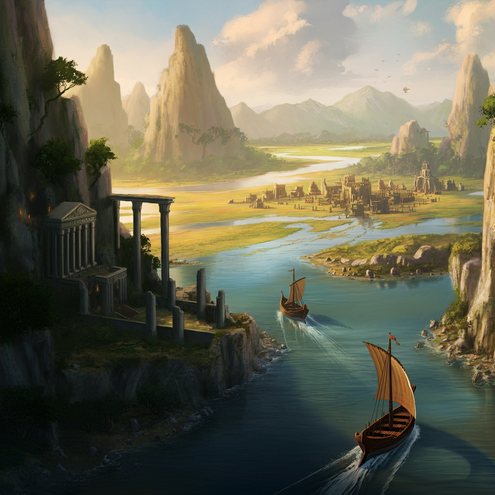

# Sesja 31: Wyprawa na Themis

**Data:** 18.11.2024

## Podsumowanie

Drużyna przygotowuje się do wyprawy na [[Themis|Wyspę Themis]]. [[Chondrus]] załatwia im wiele potrzebnych rzeczy, m.in. 3 beczki piwa, rufowe drzwi do ładowni i warsztat maga. Do drużyny dołączają: [[Melania Twardowska]], [[Astra]], [[Corinna]], [[Kalistor]], [[Lyra]], [[Moxena]], [[Greciosa]], [[Rhea]], [[Pythor]], [[Kyrah]], [[Versi]] i [[Keledone]]. [[Vallus]] udziela im błogosławieństwa i przekazuje dary od mieszkańców [[Mytros]], w tym mikstury i inne przydatne przedmioty.

W trakcie podróży na [[Themis]] drużyna napotyka [[Charybda]], potężny morski wir. Z wiru wyłania się [[Kentimane]], ogromny potwór morski, który uwalnia ich z pułapki. Następnie spotykają [[Merfolki]], a [[Iolaah]] prowadzi ich do swojego ojca [[Hywin|Hywina]]. [[Hywin]] opowiada im historię ludu Syren i obdarowuje ich koralowcami o magicznych właściwościach.

[[Pythor]] dzieli się swoimi doświadczeniami z [[Themis]], opowiadając o tym, jak amazonki go przegnały, gdy próbował znaleźć tam żonę. Drużyna dociera do [[Port Aella|Aella]], portu na [[Themis]], gdzie dowiadują się o dawnej fortecy Smoczych Lordów, w której amazonki prawdopodobnie przetrzymują księżniczkę Darien. [[Moxena]] i [[Astra]] wyruszają na poszukiwanie kontaktu do ruchu oporu.

## Kluczowe wydarzenia / decyzje

* Dołączenie nowych członków do załogi statku.
* Otrzymanie błogosławieństwa i darów od Vallus.
* Natknięcie się na Charybdis i Kentimane.
* Spotkanie z Merfolkami.
* Dotarcie do portu Aella.

## Postacie Niezależne (NPC)

* [[Chondrus]]
* [[Vallus]]
* [[Loreus]]
* [[Kentimane]]
* [[Iolaah]]
* [[Hywin]]
* [[Pythor]]
* [[Moxena]]
* [[Astra]]
* [[Hippolyta]]

## Lokacje

* [[Mytros]]
* [[Ultros]]
* [[Charybda]]
* [[Port Aella|Aella]] (port na Themis)
