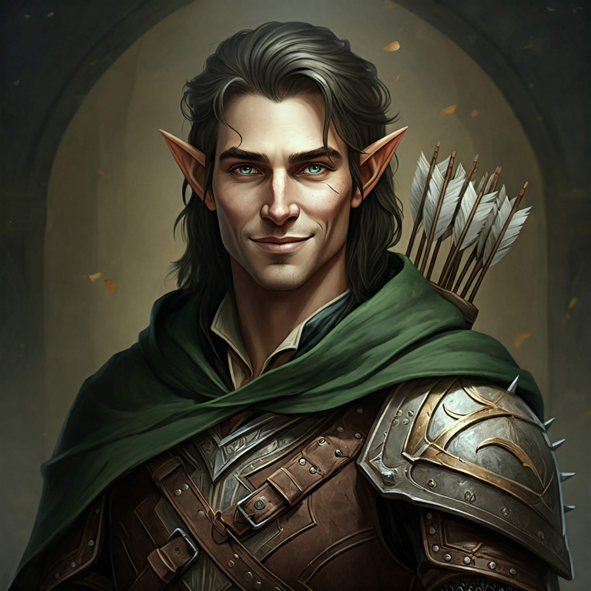

# Sesja 34: Ivello i Drapaczka do Pleców

**Data:** 16.12.2024

## Podsumowanie

Bohaterowie, w korytarzu fortecy napotykają grupę Amazonek, z którymi toczą zaciekłą walkę. Wśród przeciwników znajduje się ruda Amazonka, która, widząc, że nie ma szans w pojedynkę, wzywa posiłki. 

W trakcie walki, sytuacja staje się coraz bardziej napięta. Z głębi fortecy wyłaniają się kolejne istoty: dwa marmurowe golemy, nosorożec i bazyliszek. W trakcie walki, [[Orestes]] po raz kolejny popisuje się swoją nadludzką siłą, chwytając jednego golema i rzucając nim w drugiego.

Po walce, badają teren i odkrywają, że na zewnątrz fortecy znajdują się liczne posągi, będące prawdopodobnie spetryfikowanymi więźniami fortecy. [[Arevon Elorrenthi|Arevon]] odnajduje posąg [[Ivello Ostren|Ivello Ostrena]], członka swojej drużyny, zamienionego w kamień. [[Orestes]] postanawia zabrać ze sobą rękę i nogę golema, które odpadły w trakcie walki, aby zrobić z nich… drapaczkę do pleców.

Drużyna wraca po cyklopa [[Bront|Bronta]] i z pomocą zaklęć [[Arevon Elorrenthi|Arevona]] udaje się go przemieścić przez ciasne korytarze. [[Felicjan Janus Twardowski|Felicjan]] używa zaklęcia „fly”, aby przenieść posąg [[Ivello Ostren|Ivela]] na statek, gdzie [[Arevon Elorrenthi|Arevon]] używa „Oil of Softening”, aby ożywić [[Ivello Ostren|Ivella]]. 

Na statku, [[Ivello Ostren|Ivello]] opowiada o swoich przeżyciach na [[Themis]] i dopytuje się o los [[Baltia|Baltii]], razem z którą wylądował na tej wyspie. [[Arevon Elorrenthi|Arevon]] zapewnia go, że będą szukać sposobu na powrót do swojego świata i odnalezienie [[Baltia|Baltii]]. 

Drużyna wyrusza w dalszą podróż. Po drodze, [[Arevon Elorrenthi|Arevon]] rozmawia z [[Ivello Ostren|Ivello]] o zasadach panujących w tym świecie, o mocy przysiąg i o niebezpieczeństwie ich złamania. 

Statek zbliża się do wyspy. Drużyna kontaktuje się z [[Hippolyta|Hippolytą]] za pomocą magii. Kierują się na wschód wyspy, gdzie spotykają [[Focabe]], która zaprowadziła ich do [[Obóz Lwicy|obozu plemienia Lwicy]]. [[Hippolyta]] informuje ich o sytuacji w pałacu i prosi o pomoc w obaleniu fałszywej królowej (prawdopodobnie [[Thessilea]]). Twierdzi, że to amazonki muszą zdetronizować oszustkę, ale przyda się dywersja, która ograniczy siły w pałacu. Drugą kwestią jest [[Yala]], córka [[Sydon|Sydona]] i [[Lutheria|Lutherii]], nadal nie wiadomo po której stronie stanie. [[Hippolyta]] twierdzi, że [[Yala|Yalę]] widziano w okolicy pałacu podczas polowania. Prosi bohaterów, aby to oni zwrócili się do niej.

## Kluczowe wydarzenia / decyzje

* [[Arevon Elorrenthi|Arevon]] odnalazł członka dawnej załogi
* [[Bront]] został uwolniony z więzienia
* Drużyna omawia atak na fałszywą królową amazonek

## Postacie Niezależne (NPC)

* [[Bront]] (cyklop, kowal)
* [[Ivello Ostren]] (członek dawnej załogi Arevona)
* [[Hippolyta]] (Amazonka z plemienia Lwicy)

## Lokacje

* [[Więzienie Kieł|Więzienie Amazonek "Kieł"]]
* [[Obóz Lwicy|Obóz plemienia Lwicy]]
