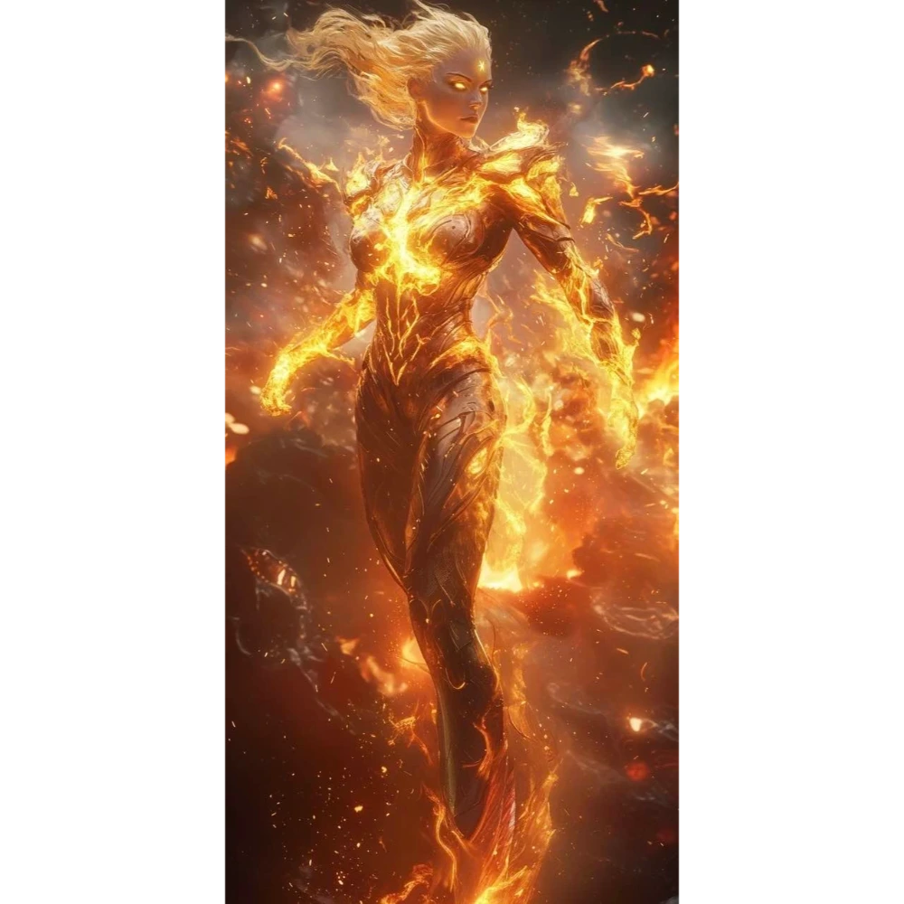

# Sesja 37: Próba Ognia

**Data:** 13.01.2025

## Podsumowanie

W głębi kajuty, pośród mroku rozświetlonego jedynie nikłym blaskiem księżyca, [[Arevon Elorrenthi|Arevon]], dochodził do siebie po zakończonej wizji. Nagle, wyłoniła się przed nim postać [[Estor Arkelander|Estora Arkelandera]], generała [[Smoczy Lordowie|Smoczych Lordów]]. Jego duchowa forma, ledwie widoczna w półmroku, zbliżyła się do elfa. [[Arevon Elorrenthi|Arevon]] poczuł na sobie jego zimne spojrzenie, a serce zabiło mu mocniej, gdy [[Estor Arkelander|Estor]] przemówił, oferując mu swoją pomoc w walce z tytanami. Propozycja była kusząca, zwłaszcza że [[Estor Arkelander|Estor]] znał lokalizację zaginionych skarbów [[Smoczy Lordowie|Smoczych Lordów]]. Duch generała chciał w zamian za tę wiedzę odzyskać swój miecz. [[Arevon Elorrenthi|Arevon]], choć nieufny, dostrzegł w propozycji szansę na zdobycie potężnych artefaktów, które mogłyby pomóc w nadchodzącej wojnie. Jednakże, świadom mrocznej natury [[Estor Arkelander|Estora]] i jego dawnych zbrodni, elf nie chciał pochopnie podejmować decyzji, która mogłaby wpłynąć na losy całej drużyny. Zdecydował się skonsultować tę propozycję z resztą kompanów, zanim podejmie ostateczną decyzję.

O świcie, gdy horyzont zabarwił się pierwszymi promieniami słońca, oczom załogi ukazała się [[Wyspa Ognia]]. Ta wulkaniczna kraina, spowita dymem i zapachem siarki, emanowała surowym pięknem. W centrum wyspy dominował potężny wulkan, z którego krateru unosiły się kłęby dymu. To właśnie tam, w kalderze wulkanu, znajdowała się wioska jaszczuroludzi, do której zmierzali bohaterowie.

Po przebudzeniu, [[Arevon Elorrenthi|Arevon]] zwołał naradę. W mesie, przy prostym drewnianym stole, zebrała się drużyna: [[Felicjan Janus Twardowski|Felicjan]], [[Orion]], [[Orestes]] i [[Versir]]. [[Arevon Elorrenthi|Arevon]], z powagą na twarzy, opowiedział im o nocnej wizycie [[Estor Arkelander|Estora]] i jego kuszącej propozycji. Zapadła cisza, przerywana jedynie szumem morza i skrzypieniem pokładu. Każdy z bohaterów rozważał w milczeniu słowa elfa. [[Felicjan Janus Twardowski|Felicjan]], zawsze ostrożny, nie ufał duchowi [[Estor Arkelander|Estora]] i obawiał się, że jego pomoc może mieć straszliwą cenę. [[Orion]], kierowany żądzą przygód, był skłonny zaryzykować i przyjąć ofertę. [[Orestes]], kierowany barbarzyńską logiką, uważał, że skarby [[Smoczy Lordowie|Smoczych Lordów]] są warte ryzyka, a miecz [[Estor Arkelander|Estora]] może się przydać. [[Versir]], kierujący się honorem, był przeciwny paktowaniu z mrocznym duchem. Długie godziny upłynęły na dyskusji. W końcu, po burzliwej wymianie zdań i rozważeniu wszystkich za i przeciw, bohaterowie podjęli decyzję, aby odmówić [[Estor Arkelander|Estorowi]], odrzucając jego propozycję.

Gdy słońce wspięło się już wysoko na nieboskłonie, "[[Ultros]]" zbliżył się do [[Wyspa Ognia|Wyspy Ognia]]. Po zacumowaniu statku u wybrzeży wyspy, bohaterowie, wraz z uwolnionym cyklopem [[Bront|Brontem]], zeszli na ląd. W trakcie wędrówki przez bujną, tropikalną roślinność, napotkali na swojej drodze gromadę wielkich jaszczurów, a kiedy zostały one pokonane, [[Orestes]] dojrzał swoim bystrym wzrokiem grupę ukrywających się jaszczuroludzi. Wśród nich była też [[Vytha]], królowa plemienia Łamaczy Fal. Okazało się, że jej plemie sprzeciwia się Chodzącym w Ogniu. Król [[Jankor]] porzucił dawne tradycje, pluje na smoki i Śpiącego Boga w wulkanie. Bohaterowie dowiedzieli się też, że [[Sydon]] dostarczył Chodzącym w Ogniu nowego kowala.

Po dotarciu do wioski, bohaterowie stanęli przed obliczem [[Jankor|Jankora]], potężnego jaszczura i wyznawcy [[Sydon|Sydona]], który dzierżył w dłoni imponujący oręż. Obok niego dreptał bardzo [[Chh'Krtak|młody mosiężny smok]]. Wódz jaszczuroludzi powitał ich chłodno, a rozmowa szybko zeszła na temat [[Bront|Bronta]] i jak się okazało jego syna, [[Steros|Sterosa]], który zajął jego miejsce jako kowal. [[Bront]] był wściekły, że jego syn jest zmuszony pracować w takim miejscu. W trakcie dyskusji, [[Versir]], powodowany dziwnym przeczuciem i wizją, którą otrzymał, zapytał [[Jankor|Jankora]] o boga śpiącego w wulkanie. Jaszczuroludzki wódz potwierdził, że według legend w wulkanie drzemie potężna istota, ale miała do być tylko bajka dla dzieci. [[Versir]], nie zważając na protesty, postanowił sprawdzić, czy legenda jest prawdziwa. Wskoczył do krateru wulkanu, wprost w płynną lawę. Ku zaskoczeniu wszystkich, [[Versir]] nie spłonął. Zamiast tego, z rękawicy [[Versir|Versira]] wyłoniła się gigantyczna dłoń, która chwyciła Aasimara i osłoniła go przed ogniem. Po chwili dłoń ponownie się wynurzyła i wyrzuciła [[Versir|Versira]] z powrotem na skraj krateru. Następnie z lawy zaczęła wyłaniać się potężna, humanoidalna istota, o ciele pokrytym płomieniami, z oczu i ust buchał ogień, a w dłoni dzierżyła wielki, opleciony ogniem młot. Istota spojrzała na [[Versir|Versira]] z dziką nienawiścią i ruszyła w jego stronę.

## Kluczowe wydarzenia / decyzje

* [[Estor Arkelander]], generał [[Smoczy Lordowie|Smoczych Lordów]], oferuje pomoc w zamian za odzyskanie swojego miecza.
* Bohaterowie przybywają na [[Wyspa Ognia|Wyspę Ognia]] i spotykają jaszczuroludzi, w tym królową [[Vytha|Vythę]].
* Drużyna dowiaduje się, że [[Bront]] nie jest już potrzebny jaszczuroludziom, a jego syn, [[Steros]], został nowym kowalem.
* [[Versir]] skacze do wulkanu.
* Z lawy wyłania się potężna istota, która atakuje [[Versir|Versira]].

## Postacie Niezależne (NPC)

* [[Estor Arkelander]]
* [[Vytha]]
* [[Bront]]
* [[Steros]]
* [[Jankor]]

## Lokacje

* [[Wyspa Ognia]]
* Kaldera wulkanu
