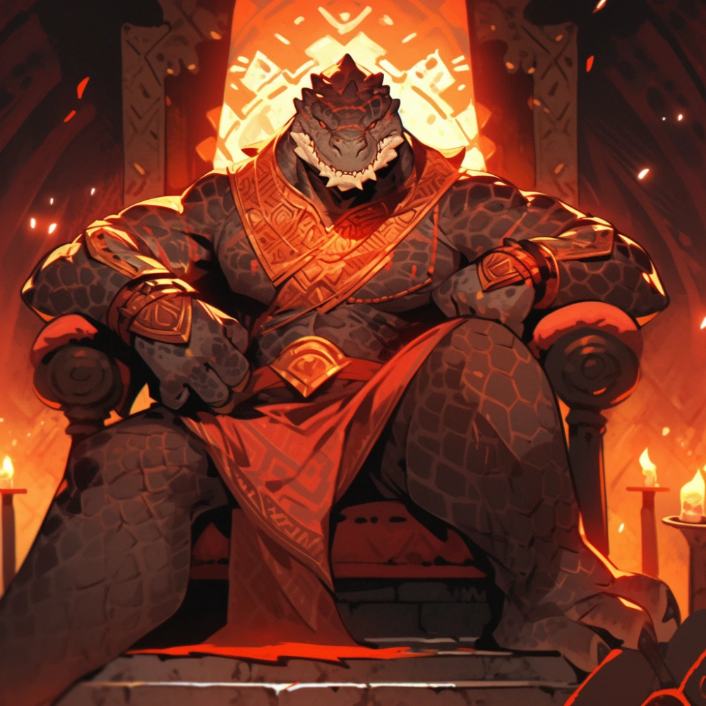

# Sesja 38: Bitwa w Kalderze

**Data:** 20.01.2025

## Podsumowanie

Wulkaniczna [[Wyspa Ognia]] spowita była mrokiem, gdy ognista istota wyłoniła się z buchającego lawą krateru. [[Versir]], który chwilę wcześniej skoczył w kipiącą czeluść, stał teraz twarzą w twarz z potężnym, humanoidalnym bytem, którego skóra zdawała się być utkana z żywego ognia, a oczy płonęły dziką nienawiścią. W dłoni istota dzierżyła ogromny, opleciony płomieniami młot, a z jej gardła wydobywał się złowieszczy ryk. W tym samym czasie, u stóp wulkanu, [[Orion]] z zaskakującą skutecznością cisnął falą uderzeniową, zrzucając do lawy króla [[Jankor|Jankora]], królową i jeszcze jednego jaszczuroludzia, wywołując tym samym wściekłość pozostałych jaszczurów. [[Chh'Krtak|Młody, mosiężny smok]], towarzyszący [[Jankor|Jankorowi]], zaatakował [[Arevon Elorrenthi|Arevona]], [[Orion Xul|Oriona]] i [[Felicjan Janus Twardowski|Felicjana]] smoczym oddechem, lecz atak okazał się niezbyt skuteczny. [[Felicjan Janus Twardowski|Felicjan]], wykorzystując nieuwagę przeciwników, rzucił ognistą kulą w dwóch jaszczuroludzi stojących najbliżej, a następnie zepchnął kolejnego, szamana, prosto w przepaść.

[[Orestes]], rozwścieczony barbarzyńca, ruszył do ataku na jaszczuroludzi, z furią wymachując swym potężnym toporem, który zdawał się wibrować żądzą krwi, kierując się w stronę ognistej istoty. Tymczasem król [[Jankor]], miotany w lawie, walczył o życie, podczas gdy jego żona spłonęła, nie mogąc się wydostać. [[Versir]], próbując uspokoić ognistą istotę, użył mocy perswazji, lecz jego słowa, choć bliskie celu, nie zdołały ugasić płomienia nienawiści. Istota zamachnęła się na Aasimara swym ognistym młotem, lecz ciosy odbiły się od jego tarczy. Salamandra, która pojawiła się w pobliżu, zaatakowała [[Orestes|Orestesa]], chwytając go w swe ogniste szpony, a [[Jankor]], wyczołgawszy się z lawy, cisnął piorunem w [[Felicjan Janus Twardowski|Felicjana]] i [[Orestes|Orestesa]], zadając im poważne obrażenia.

[[Versir]], ponownie próbując przemówić do ognistej istoty, w końcu odnalazł właściwe słowa, a gniew w jej oczach ustąpił miejsca dezorientacji. W tym czasie [[Felicjan Janus Twardowski|Felicjan]] podleciał w stronę [[Jankor|Jankora]], a [[Orestes]], zaatakowany przez salamandrę, zdołał się uwolnić, przeobrażając się w formę dzikiego zwierza. [[Arevon Elorrenthi|Arevon]], wykorzystując potężną magię, przywołał pnącza, które pochwyciły [[Jankor|Jankora]], a następnie uleczył [[Orestes|Orestesa]] i przeniósł się na bezpieczną pozycję. [[Orion]], korzystając z zamieszania, zaatakował [[Chh'Krtak|młodego smoka]], powalając go jednym ciosem, a następnie ruszył na pomoc [[Orestes|Orestesowi]], uwalniając go z uścisku salamandry i ciskając ją daleko od barbarzyńcy. [[Felicjan Janus Twardowski|Felicjan]], wykorzystując potężny czar, cisnął błyskawicą w stronę wroga, zabijając jednego jaszczuroludzia i węża, a raniąc salamandrę i kolejnego węża. [[Orestes]], odzyskawszy przytomność, ponownie ruszył do ataku, zabijając salamandrę, która wcześniej go schwytała.

W tym czasie ognista istota, w której [[Versir]] rozpoznał swoją ciotkę, [[Chalcia Pierwsza|Chalcię]], dołączyła do walki, masakrując jaszczuroludzi i znikając w płomieniach, by po chwili pojawić się w innym miejscu. Walka dobiegła końca. Smok, który wcześniej krążył nad polem bitwy, zaczął szukać [[Jankor|Jankora]], nie zdając sobie początkowo sprawy z jego śmierci. [[Versir]], rozmawiając z [[Chalcia Pierwsza|Chalcią]], dowiedział się o tragicznych losach swojej rodziny i zdradzie [[Sydon|Sydona]] i [[Lutheria|Lutherii]]. [[Chalcia Pierwsza|Chalcia]], osłabiona po długim uwięzieniu, poprosiła [[Versir|Versira]] o pomoc, oferując mu swoją moc w zamian za schronienie w jego rękawicy. [[Versir]], po krótkim wahaniu, zgodził się, a [[Chalcia Pierwsza|Chalcia]] zniknęła w płomieniach, pozostawiając po sobie tajemniczy klejnot.

[[Felicjan Janus Twardowski|Felicjan]], obserwując smoka, zastanawiał się nad możliwością oswojenia go, podczas gdy [[Arevon Elorrenthi|Arevon]] zajął się przeszukiwaniem pola bitwy w poszukiwaniu łupów. Wśród zdobyczy znalazła się laska miotająca piorunami podarowana [[Jankor|Jankorowi]] przez [[Sydon|Sydona]] oraz smocze jajo. Po bitwie bohaterowie, wraz z [[Bront|Brontem]] i jego synem, [[Steros|Sterosem]], udali się do wioski jaszczuroludzi, gdzie spotkali [[Vytha|Vythę]], która wyraziła wdzięczność i zaoferowała ucztę. Zmęczeni, ale zwycięscy, bohaterowie odpoczęli, zanim wyruszyli w dalszą podróż, by stawić czoła kolejnym wyzwaniom i odkryć tajemnice spowite mrokiem kontynentu [[Thylea|Thylei]].

Z powrotem na statku, wieczorem do bohaterów dotarła syrena z wiadomością od Strażnika [[Smocza Kaplica|Smoczej Kaplicy]], [[Aesop|Aesopa]]:

> Chwała Wybrańcom Wyroczni!
>
> Jako strażnik [[Smocza Kaplica|Smoczej Kaplicy]] mam do  Was prośbę. Wielu wierzy, że wszystkie smoki z potomstwa [[Balmytria|Balmytrii]]  zginęły wraz z nią podczas Pierwszej Wojny, pięćset lat temu. Jednakże  moje badania wskazują, że pozostałe cztery smoki mogły zostać schwytane  przez Tytanów. Jeśli to prawda, należy je odnaleźć i uratować.
>
> Błagam,  bądźcie czujni podczas Waszej podróży. Jako nieliczni Wybrańcy  Wyroczni, wierzę, że te smoki będą wam służyć, o ile będziecie trzymali  się ideałów ich dawnych panów. Niech Los was prowadzi.
>
> — [[Aesop]], Strażnik [[Smocza Kaplica|Smoczej Kaplicy]]

## Kluczowe wydarzenia / decyzje

* [[Orion Xul|Orion]] zrzucił króla [[Jankor|Jankora]], królową i jaszczuroludzia do lawy.
* [[Orion Xul|Orion]] prawie zabił młodego smoka.
* [[Versir]] dowiedział się więcej o losie swojej rodziny.
* Dusza [[Chalcia Pierwsza|Chalcii]] została wchłonięta w rękawice [[Versir|Versira]].
* Bohaterowie zdobyli smocze jajo.
* Bohaterowie otrzymali list od [[Aesop|Aesopa]].

## Postacie Niezależne (NPC)

* [[Chalcia Pierwsza|Chalcia]]
* [[Jankor]]
* [[Vytha]]
* [[Chh'Krtak|Młody mosiężny smok]]
* [[Bront]]
* [[Steros]]
* [[Aesop]]

## Lokacje

* Wulkaniczna [[Wyspa Ognia]]
* Krater wulkanu
* Wioska jaszczuroludzi

## Przedmioty

* Magiczny klejnot z rękawicy [[Versir|Versira]]
* [[Kostur Gromów i Błyskawic|Laska Piorunów Sydona]]
* Smocze jaja