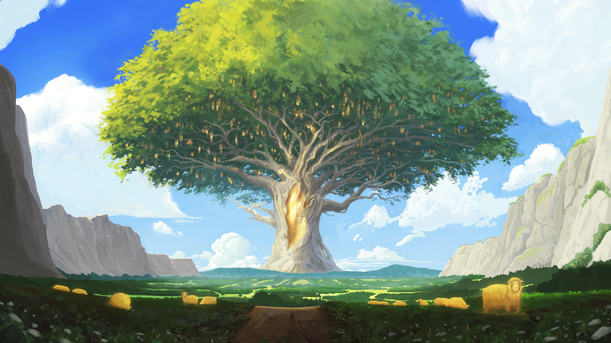

**Data:** 27.01.2025

## Podsumowanie

Wiatr gnał po [[Zatoka Cerulańska|Zatoce Cerulańskiej]], wzdymając fale, które z furią uderzały o burty [[Ultros|Ultrosa]]. Pośród szalejącego sztormu, [[Arevon Elorrenthi|Arevon]], niczym wytrawny tancerz na linie, z niesłychaną precyzją nawigował statkiem, unikając zdradliwych wirów i skalnych raf, a [[Orestes]], z niezachwianą determinacją, starał się utrzymać na pokładzie, podczas gdy błyskawice rozdzierały niebo, a grzmoty wtórowały rykowi fal. [[Sydon]], Pan Burz, w swej niepohamowanej złości ciskał w bohaterów wszystkim, co miał, ale jego wysiłki okazały się daremne wobec kunsztu elfiego nawigatora i wytrzymałości legendarnego statku. Po trzech godzinach zmagań, [[Ultros]] wypłynął ze strefy sztormu, a morze i niebo uspokoiły się, jakby na znak, że gniew tytana został wyczerpany.

Gdy nastała głęboka noc, załoga [[Ultros|Ultrosa]] mogła wreszcie odetchnąć i zregenerować siły po wyczerpującej walce z żywiołem. Kolejny dzień podróży minął pod znakiem rutynowych czynności. [[Arevon Elorrenthi|Arevon]] oddawał się ważeniu mikstur, korzystając z obfitych zapasów ziół, a załoga szeptała między sobą o odrodzeniu [[Smoczy Lordowie|Zakonu Smoczych Lordów]], pokładając nadzieję w bohaterach przepowiedni i smoku, który im towarzyszył. Nagle, w godzinach popołudniowych, nozdrza [[Orestes|Orestesa]] zaatakował nieznośny odór gnijących ryb. Na horyzoncie ukazały się szczątki ogromnego wieloryba, wokół którego krążyły rekiny, a w jego rozerwanej gardzieli błyszczał jakiś metalowy przedmiot.

[[Orestes]], zaintrygowany, nakłonił załogę do podpłynięcia bliżej. Pomimo smrodu i groźby ataku rekinów, bohaterowie postanowili zbadać zwłoki morskiego giganta. Wskoczyli do wody. [[Arevon Elorrenthi|Arevon]] odciągnął większość rekinów, a zresztą drużyna szybko się rozprawiła, dając [[Orestes|Orestesowi]] szansę na podpłynięcie do truchła wieloryba. Tam, wśród gnijących wnętrzności, [[Orestes]] dostrzegł zbroję, a dalsze oględziny ujawniły ciało mężczyzny. Ciało jednak okazało się tajemniczym [[Aegis|starcem]], który zwinnymi ruchami wszedł na statek, by następnie uciec i zamknąć się w kajucie [[Orestes|Orestesa]]. Po krótkiej szarpaninie, [[Orestes]] obezwładnił intruza i z pomocą załogi uwięził go. [[Aegis|Starzec]], który twierdził, że mieszkał w żołądku wieloryba, opowiadał niestworzone historie o walce z krakenem i siłowaniu się z [[Pythor|Pythorem]].

Bohaterowie kontynuowali podróż. Kolejnego dnia na horyzoncie pojawił się mały stateczek, a jego sternik poprosił o pomoc w zdobyciu owoców z [[Drzewo Serca|Drzewa Serca]], które miały uzdrowić jego chorą żonę. W końcu dotarli do [[Wyspa Złotego Serca|Wyspy Złotego Serca]], gdzie powitało ich stado jeleni i bujna roślinność. Podążając za złotym baranem, bohaterowie dotarli do polany, gdzie zostali otoczeni przez lwy, w tym jednego złotego. Po zaciętej walce, bohaterowie mogli kontynuować swoją podróż w kierunku [[Drzewo Serca|Drzewa Serca]]. W końcu dotarli do celu i ujrzeli ogromne drzewo, otoczone kamiennymi dłońmi i zwieńczone platformą, wokół której rosły [[Złote Owoce|złote owoce]].

Ręce [[Kentimane]] wyniosły drużynę na platformę, gdzie [[Versir]] ogłosił swoje przybycie. Wtedy gałęzie zaczęły się ruszać, ukazując portal, który zabrał bohaterów w podróż przez czas i przestrzeń, w wizję początków [[Kontynent Thylea|Thylei]]. Ujrzeli dziewiczą krainę strzeżoną przez sturękiego giganta, [[Kentimane]], który skuszony pięknem siedmiu owoców [[Drzewo Serca|Drzewa Serca]], zerwał je i pięćdziesiąt jego głów rozkoszowało się ich smakiem. Nasiona, które po nich zostały, dały początek ośmiorgu Tytanom - dzieciom [[Thylea|Thylei]] i [[Kentimane]]. Sześcioro z nich uosabiało pozytywne cechy swych rodziców, jednak siódme nasiono zrodziło bliźnięta - [[Sydon|Sydona]] i [[Lutheria|Lutherię]], bóstwa o mrocznych sercach, żądne władzy i zniszczenia.

Początkowo [[Tytani]] żyli w harmonii, jednak z czasem samotność skłoniła ich do stworzenia pomniejszych istot - centaurów, satyrów, nimf, cyklopów i gigantów. Tylko [[Sydon]] i [[Lutheria]], połączeni mroczną więzią, odrzucili ten pomysł. Wizja ukazała potem narodziny [[Myrmeki|myrmeków]], insektoidalnej rasy stworzonej przez [[Talieus Pierwszy|Talieusa]], omamionego przez przebiegłą [[Lutheria|Lutherię]]. [[Myrmeki]], podbijające kolejne wyspy, zmusiły [[Sydon|Sydona]] do interwencji, jednak nawet jego potęga nie zdołała ich całkowicie powstrzymać. Ostatecznie [[Kentimane]] uwięził ich na jednej z wysp, a moc [[Talieus Pierwszy|Talieusa]] przekazał [[Sydon|Sydonowi]]. [[Lutheria]], w akcie zemsty, oślepiła [[Talieus Pierwszy|Talieusa]] i zmusiła go do ciągnięcia jej okrętu flagowego. Wizja pokazała upadek [[Versi Pierwsza|Versi]], roztrzaskanej na kawałki przez meteoryt sprowadzony przez [[Lutheria|Lutherię]] - jej dusza została uwięziona w odłamkach [[Gwiezdny Metal|gwiezdnego metalu]]. Wizja ukazała także klęskę [[Hergeron Pierwszy|Hergerona]], uwięzionego pod wieżą. Pozostała trójka Tytanów, [[Yala Pierwsza|Yala]], [[Goloron Pierwszy|Goloron]] i [[Chalcia Pierwsza|Chalcia]], również padła ofiarą Bliźniąt - [[Yala Pierwsza|Yala]] trafiła do [[Hades|Hadesu]], [[Goloron Pierwszy|Goloron]] ukryty na wyspie gdzie powstało [[Królestwo Syren]], a [[Chalcia Pierwsza|Chalcia]] uwięziona pod wulkanem.

Po wizji, bohaterowie zerwali [[Złote Owoce|złote owoce]] i, ku ich zaskoczeniu, na pobliskiej gałęzi wylądował pegaz. [[Orestes]], z pomocą piwa i swojego uroku, zdołał przekonać do siebie latającego konia i dosiąść go. Po krótkim locie, pegaz odleciał, a bohaterowie, z pomocą magii [[Felicjan Janus Twardowski|Felicjana]], bezpiecznie wrócili na statek, gdzie rozpoczęli dyskusję nad dalszymi krokami. Ostatecznie, po naradzie, bohaterowie zdecydowali się obrać kurs na [[Wyspa Skorpiona|Wyspę Skorpiona]], gdzie, jak się dowiedzieli, mieszkała wiedźma, która mogła posiadać cenne informacje dla drużyny.

## Kluczowe wydarzenia / decyzje

* Sztorm na Morzu Zapomnianym
* Odkrycie zwłok wieloryba i tajemniczego starca ([[Aegis]])
* [[Laios]] prosi o pomoc w zdobyciu owocu z [[Drzewo Serca|Drzewa Serca]]
* Wizja o historii [[Kontynent Thylea|Thylei]] i [[Tytani|tytanów]]

## Postacie Niezależne (NPC)

* [[Aegis|Starzec z brzucha wieloryba (Aegis)]]
* [[Laios]]

## Lokacje

* [[Ultros]]
* [[Wyspa Złotego Serca]]

## Przedmioty

* Zbroja znaleziona w ciele wieloryba
* [[Złote Owoce|Złote owoce z Drzewa Serca]]
* [[Skora Zlotego Lwa|Skóra złotego lwa]]