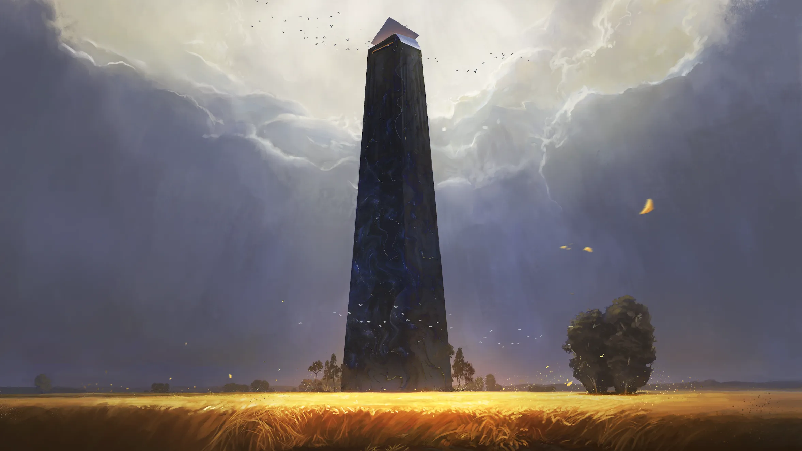
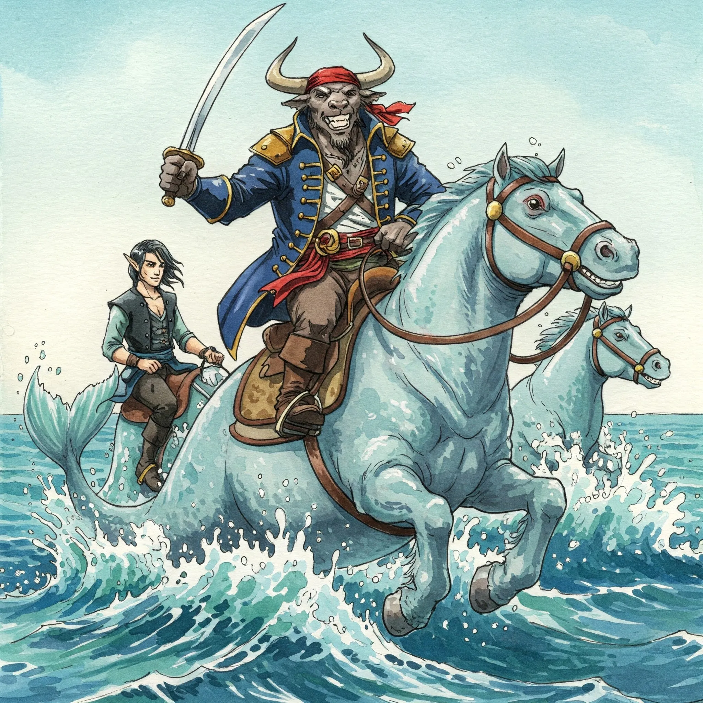
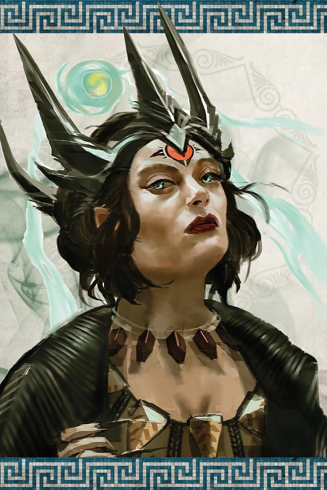
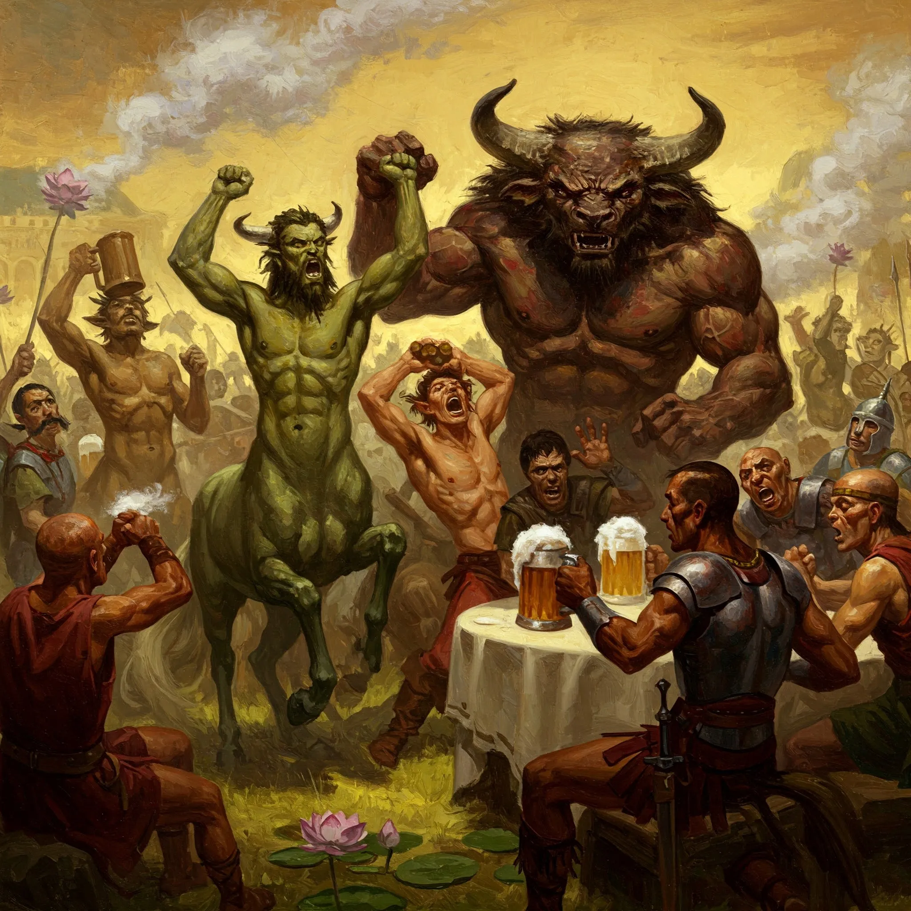

**Data:** 03.02.2025

## Podsumowanie

[[Ultros]], legendarny statek, pruł błękitne wody, niosąc na swym pokładzie niezwykłą załogę. Bohaterowie przepowiedni, prowadzeni przez przeznaczenie i żądzę przygód, zmierzali ku [[Wyspa Skorpiona|Wyspie Skorpiona]], skrywającej tajemnice, które mogły zaważyć na losach całego świata. [[Arevon Elorrenthi|Arevon]], elficki druid i doświadczony nawigator, z wprawą godną mistrza sterował statkiem, a pozostali członkowie załogi oddawali się swoim zajęciom. Wśród nich był kapitan [[Orestes]], potężny minotaur, którego mięśnie zdawały się być wykute z żelaza, a serce przepełniała dobroć. Tego dnia Orestes, chcąc umilić podróż towarzyszom, postanowił dać koncert na swoich dudach. Dźwięki, choć niezbyt harmonijne, niosły się po pokładzie, a minotaur z dumą prezentował swoje umiejętności. Wtem, wśród wesołej krzątaniny, dobiegł ich członka załogi, który doniósł o zbliżającym się stadzie hipokampów, rzadkich i szlachetnych morskich stworzeń. Orestes i Arevon, zaintrygowani, postanowili oswoić te piękne istoty. Orestes, nie szczędząc złocistego trunku, chiał jak to jest w jego zwyczaju przekonać do siebie to piękne stworzenie alkoholem. Morski koń wzgardził ten gest, ale mimo to podążył za Orestesem.

Po drodze na [[Wyspa Skorpiona|Wyspę Skorpiona]], załoga Ultrosa natknęła się na dryfującą na wodzie drewnianą statuę [[Sydon]]a. Na statule, ku ich zdziwieniu, znajdowała się grupa mieszkańców [[Mytros]], którzy przedstawili się jako kolektyw "Artyści w Służbie Sydona", w skrócie [[AWSS]]. Twierdzili, że fala zmiotła ich, razem ze statuą i cudem uniknęli śmierci. Po krótkiej rozmowie, załoga Ultrosa postanowiła wziąć ich na pokład. Artyści, po krótkiej rozmowie zdecydowali się zostać zagorzałymi wyznawcami Pięciu, co nieco uspokoiło załogę. Niedługo po tym na statku pojawił się mechaniczny konstrukt, który dostarczył Arevonowi zamówioną zbroję, a Orestesowi list od [[Volkan]]a. Bóg kowali informował Orestesa, że z chęcią zatrudni cyklopów Jankanów w swojej kuźni.

Wieczorem, gdy słońce chyliło się ku zachodowi, na pokładzie Ultrosa wylądowała tajemnicza postać. Była to [[Chalcia]], córka bliźniaków, kuzynka [[Versir]]a, istota o trzech oczach i mocy, która budziła respekt. Poruszała się po statku z gracją, ale widać w niej było drapieżnika. Chalcia, z wyższością i pewnym lekceważeniem, przyglądała się bohaterom, przepowiadając im porażkę. Stwierdziła, że kiedy przysięga dobiegnie końca, [[Thylea]] będzie należeć do tytanów. Sugerowała, że bohaterowie powinni się zastanowić jaką drogą podążają i czy na pewno podejmują własne decyzje. Chalcia, po wygłoszeniu swego mrocznego proroctwa, odleciała, pozostawiając załogę Ultrosa w niepewności.

W końcu, po długiej podróży, Ultros dotarł do [[Wyspa Skorpiona|Wyspy Skorpiona]]. Na horyzoncie widać było już zarys lądu, a w oddali majaczyła [[Wieża Wiedźmy Lotosu|wieża wiedźmy]]. Zanim jednak bohaterowie postawili stopę na wyspie, napotkali na swojej drodze statek [[Arezja|Arezyjczyków]], a na nim trójkę znajomych wojowników, których jakiś czas temu mieli okazje poznać podczas Wielkich Igrzysk. Po krótkiej wymianie zdań, Arezyjczycy zaprosili bohaterów do swojego obozu, aby wspólnie spędzić wieczór i powspominać dawne czasy. Orestes, chcąc nawiązać przyjazne stosunki, poczęstował ich piwem. Wojownicy wyjaśnili, że przybyli tu, aby nadzorować młodzików odbywających rytuał inicjacji, który polegał na pokonaniu wielkiego skorpiona. Opowiedzieli też o wiedźmie, która zamieszkiwała wyspę, przestrzegając przed nią bohaterów.

Rankiem, po nocy spędzonej na rozmowach i piciu piwa, bohaterowie postanowili wyruszyć na spotkanie z wiedźmą. Niespodziewanie usłyszeli odgłosy walki. Drużyna szybko ruszyła na jak się okazało potrzebujących pomocy młodych arezyjczyków otoczonych przez wielkie skorpiony. Kiedy prawie wszystkie stwory zostały pokonane, nagle zostali zaatakowani przez olbrzymiego, fioletowego robaka, który wyłonił się z ziemi. Wszczęła się zacięta walka. Potwór był silny i wytrzymały, a jego trująca aura okazała się śmiertelnie niebezpieczna. W pewnym momencie potwór spadł na [[Orion Xul|Oriona]], przygniatając go swym cielskiem i sprawiając, że ten nie mógł się ruszyć. Orion z trudem zdołał uwolnić się spod ogromnego cielska, a [[Versir]] w końcu resztkami sił zdołał dobić potwora. Wtedy z trochę spóźnioną odsieczą przybyła im [[Nessa]], kuzynka [[Pholon]]a z grupą centaurów. Bohaterowie zapoznali się z centaurami, a wkrótce wrócili do obozu Arezyjczyków na dalszą socjalizację.

Nessa ma wkrótce osiągnąć pełnoletność, a wtedy grozi jej przemiana w wielkiego skorpiona, jeśli do tego czasu nie znajdzie jeźdźca. Kuzynka [[Pholon]]a próbowała wykorzystywać swoje największe atuty, ale bohaterowie byli niewzruszeni na jej wdzięki. W końcu Orestes pchnął ją w kierunku swojego kuzyna [[Brax]]a, który wydawał się zainteresowany związkiem z uroczą centaurzycą. W obozie arezyjczyków rozpętała się szalona impreza, pełna piwa i palonego kwiatu lotosu. W pewnym momencie centaury zaczęły odchodzić na stronę, wtedy Pholon wyjawił Orestesowi informacje o dzikich orgiach centaurów. Orestes rzucił monetą i postanowił dołączyć.

Rano skacowani bohaterowie ruszyli ponownie w kierunku wieży. Tym razem dotarli tam bez przeszkód, droga wiodła przez pole kwiatów lotosu otaczających [[Wieża Wiedźmy Lotosu|wieżę wiedźmy]]. Nagle, gdy tylko wkroczyli na polanę, czas wokół nich oszalał. Dzień i noc zaczęły następować po sobie w zawrotnym tempie, a całe otoczenie stało się rozmyte i nierealne. Drużyna zdecydowała przeć do przodu i dotarła pod drzwi wieży, które same się im uchyliły. W środku bohaterowie ujrzeli statuę przedstawiającą sfinksa, a także gromadkę dzieci, która jak wyglądało pracowała nad produkcją narkotyków z kwiatu lotosu.

Zmęczeni i poobijani, ale i bogatsi o nowe doświadczenia, bohaterowie musieli podjąć decyzję, co robić dalej. Czy uda im się dotrzeć do [[Wiedźma Lotosu|wiedźmy]] i poznać jej tajemnice? Czy może los przygotował dla nich kolejne, niespodziewane wyzwania? Odpowiedzi na te pytania miały nadejść już wkrótce.

## Kluczowe wydarzenia / decyzje

* Spotkanie z hipokampami i oswojenie dwóch z nich.
* Przyjęcie na pokład artystów w służbie Sydona ([[AWSS]]).
* Wizyta [[Chalcia|Chalcii]] na statku.
* Dotarcie do [[Wyspa Skorpiona|Wyspy Skorpiona]] i spotkanie z [[Arezja|Arezyjczykami]].
* Atak fioletowego robaka i walka z nim.
* Impreza z centaurami

## Postacie Niezależne (NPC)

* [[Pholon]]
* [[Chalcia]]
* [[Arezja|Arezyjczycy]]
* [[Nessa]]
* [[Brax]]
* [[Wiedźma Lotosu]]

## Lokacje

* [[Wyspa Skorpiona]]
* [[Ultros]]
* [[Wieża Wiedźmy Lotosu]]

## Przedmioty

* Piwo