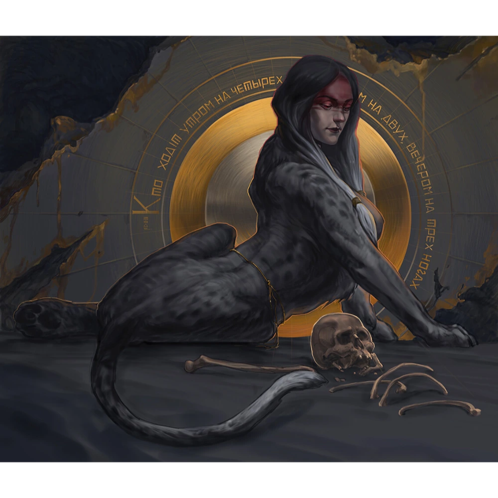
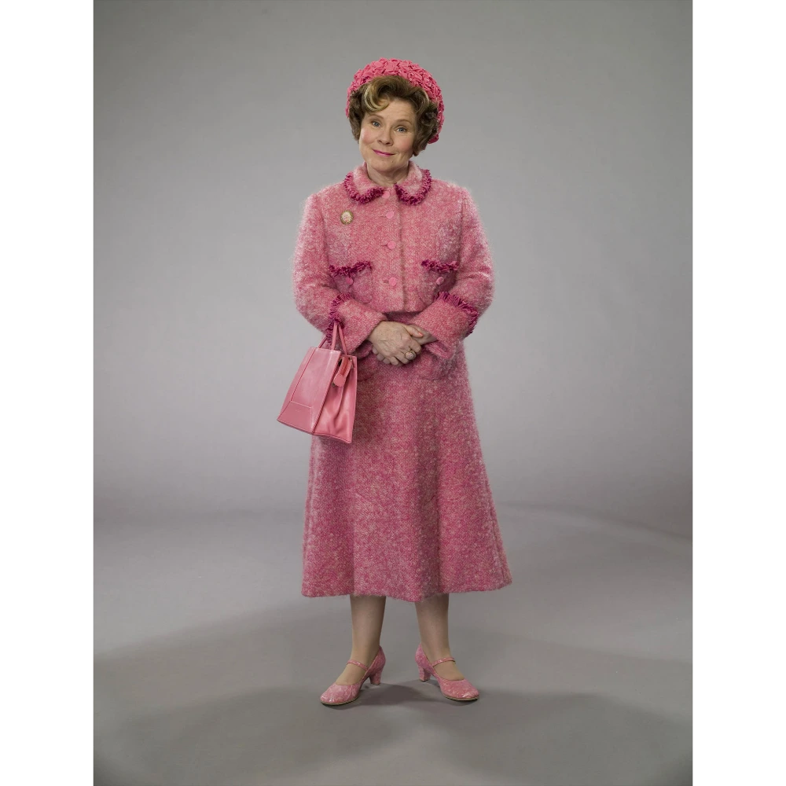

**Data:** 10.02.2025

## Podsumowanie

W głębi mrocznej wieży, pośród narkotycznych oparów i dziecięcych głosów, bohaterowie przepowiedni stanęli u progu kolejnej próby. Zamiana w dzieci, choć początkowo dezorientująca, okazała się zaledwie wstępem do tego, co miało nadejść. Wejście do [[Wieża Wiedźmy Lotosu|wieży Wiedźmy Lotosu]] zwiastowało niespodziewane wyzwania, a zamknięcie się drzwi i nagła ciemność spotęgowały atmosferę tajemnicy. Dwa jasne punkty, oczy kamiennego Sfinksa, były jedynymi drogowskazami w mroku, zanim świat wokół bohaterów powoli zaczął nabierać kształtów, choć wciąż naznaczony piętnem odmienności.

Zdezorientowani, z rozmazanymi wspomnieniami, odczuwając nieswojość, herosi spostrzegli, że zostali uwięzieni w ciałach i umysłach dzieci. Ich siła, wiedza i doświadczenie, zdobyte w licznych bitwach i niebezpiecznych przygodach, zdawały się ulecieć, zastąpione dziecięcą naiwnością. Jedynie przebłyski dawnej chwały pozwalały im zachować resztki świadomości w tym surrealistycznym koszmarze.

W tej nowej, niechcianej rzeczywistości, otoczeni przez inne dzieci, zmuszane do katorżniczej pracy przy produkcji narkotyków z kwiatów lotosu, bohaterowie próbowali odnaleźć się w sytuacji. Dziecięce przekomarzania, płacz i strach mieszały się z zapachem odurzających substancji, tworząc duszącą atmosferę. Wśród dziecięcej gawiedzi wyróżniał się Piotruś, faworyt Pani, chełpiący się swoją pozycją i zjadający na oczach spragnionych słodyczy towarzyszy ciasteczko. [[Orestes]], wciąż kierujący się szlachetnymi pobudkami, nie mógł znieść tej niesprawiedliwości i wymierzył Piotrusowi policzek, co wywołało jeszcze większy chaos.

W tej karkołomnej sytuacji, [[Felicjan Janus Twardowski|Felicjan]], próbując odnaleźć drogę ucieczki, wspiął się po schodach, które zdawały się nie mieć końca, wiodąc w pętlę. [[Arevon Elorrenthi|Arevon]], wykorzystując swój spryt, ukradł dzieciom kilka woreczków z narkotykami, a Orestes, w dziecięcym ciele, próbował oswoić potężnego Sfinksa, głaszcząc go po głowie i wciskając mu oczy. [[Versir]] zaś, dręczony żądzą ciasteczka, wpadł w szał, rozrzucając narkotyki i wywołując panikę wśród dzieci.

Wtem, z góry dobiegły kroki, zwiastujące przybycie Madame Dolores Umbridge, postaci złowrogiej i budzącej grozę. Jej wysokie obcasy stukały miarowo, a jej głos, pełen pogardy i okrucieństwa, rozbrzmiewał w pomieszczeniu. Pani Umbridge, była dyrektorka Hogwartu, a teraz prawą ręką Wiedźmy Lotosu, nie szczędziła gorzkich słów i gróźb. Zabrała Versirowi usta, karząc go za nieposłuszeństwo, a pozostałym dzieciom nakazała posłuszeństwo wobec Piotrusia. Jej odejście w górę schodów, w kierunku nieznanego, jeszcze bardziej spotęgowało strach i niepewność.

Wśród narastającego chaosu, Arevon, wykorzystując chwilową nieuwagę, przybrał postać dorosłego Halflinga, używając magicznego hełmu. Jednak próba wymknięcia się z wieży spełzła na niczym, schody ponownie okazały się magiczną pułapką, wiodącą w nieskończoną pętlę. W tym czasie, Orestes, w przypływie desperacji, ponownie uderzył Piotrusia, pozbawiając go przytomności. Arevon, wykorzystując swoje umiejętności medyczne, próbował przywrócić Piotrusia do życia. Wtedy dzieci zdecydowały się zaśpiewać piosenkę, według której klątwa może zostać odczyniona przez krew Pani. [[Orion Xul|Orion]], w akcie desperacji, nawoływał pozostałe dzieci do spróbowania krwi pani Umbridge, wierząc, że to może przywrócić im dorosłą postać.

Plan Oriona, choć makabryczny, okazał się skuteczny. Versir, korzystając z chaosu, zaatakował panią Umbridge kawałkiem szkła, zadając jej poważną ranę. Krew trysnęła, a Orion, nie wahając się, zaczął ją pić, a za nim podążyły inne dzieci. Efekt był natychmiastowy. Bohaterowie, a także inne dzieci, odzyskali swoje dorosłe postacie i wspomnienia, choć te z okresu dzieciństwa pozostały mgliste i surrealistyczne, jak senny koszmar. Wśród odmienionych dzieci, Arevon rozpoznał [[Garrick Vanalan|Garricka Vanalana]], gnoma z zaginionej załogi, co wzbudziło w nim jeszcze większe zdumienie.

Powrót do dorosłości nie oznaczał jednak końca kłopotów. Bohaterowie, odzyskawszy swoje moce i wspomnienia, stanęli przed trudnym wyborem. [[Wiedźma Lotosu]], tajemnicza i potężna, czekała na nich na szczycie wieży. Bohaterowie, nie zważając na niebezpieczeństwo, postanowili kontynuować swoją misję. Wspinając się po schodach, które tym razem zdawały się prowadzić do celu, dotarli do długiego korytarza, którego ściany pokrywały hieroglify, a liczne okna ukazywały widoki z innych światów.

Przemierzając [[Korytarz Światów|korytarz]], bohaterowie zaglądali do okien, podziwiając różnorodne krajobrazy i sceny z przeszłości, teraźniejszości i przyszłości. Widzieli Elysium, gdzie Zeus, otoczony aniołami, spoglądał na nich z zaciekawieniem. Zobaczyli zatopione królestwo syren, zniszczone przez gniew [[Sydon|Sydona]]. Ujrzeli astralny plan, gdzie Kapitan Bomba, w swoim niepowtarzalnym stylu, obrażał potężnego astralnego drapieżnika. Byli świadkami bitwy o Helmowy Jar w Śródziemiu, a także lewitującego miasta w Avernusie. Widzieli Hades, gdzie Charon pobierał opłatę od zmarłych, a Maximus, pozbawiony monet, został odesłany na koniec kolejki. Ujrzeli fabrykę Warforgedów, budzącą niepokój w sercu Arevona. W końcu, ich oczom ukazała się wizja płonącego [[Mytros]], gdzie martwy Felicjan i [[Melania Twardowska|Melania]] leżeli u stóp zapłakanej [[Kyrah]], a nad miastem górował potężny [[Behemot]], niszczyciel światów.

Wstrząśnięci wizjami, bohaterowie kontynuowali podróż, aż dotarli do okna ukazującego Bryn Shander, miasto z innego świata, gdzie doszło do epickiej bitwy z lodowym lichem. Ujrzeli również śpiącego Tarrasque'a, a także Avengersów walczących w Nowym Jorku. W końcu, korytarz spowiła ciemność, a przed bohaterami otworzyła się kolejna próba – teleturniej Familiada, prowadzony przez samego Karola Strasburgera, a w roli gospodyni – [[Wiedźma Lotosu]].

W absurdalnej grze, pełnej dziwacznych pytań i zaskakujących odpowiedzi, bohaterowie musieli wykazać się sprytem i wiedzą, aby zdobyć punkty. Pytania dotyczyły obozu bandytów, najpopularniejszych bóstw w [[Thylea|Thylei]], czarów ułatwiających zakupy, klas postaci i potworów. W ferworze rywalizacji, Orestes, nie mogąc powstrzymać się od żartów, opowiadał suchary, co spowodowało zastąpienie Karola w roli prowadzącego, a Strasburger, nie mogąc znieść napięcia, popełnił samobójstwo pistoletem Glock 17 9mm.

Po zakończeniu gry, Orestes podliczył punkty i wszyscy okazali się zwycięzcami, Wiedźma Lotosu zaoferowała bohaterom nagrodę – możliwość zakręcenia Kołem Fortuny, które mogło obdarzyć ich mocą, ale i wiązało się z pewnym ryzykiem. Orestes, wierząc w swoje szczęście, zakręcił kołem i zyskał umiejętność dowcipkowania. Versir, otrzymał moc prędkości. Orion, ku swemu przerażeniu, stracił całe swoje ubranie i ekwipunek. A Arevon, po zakręceniu Kołem Fortuny, zyskał umiejętność przemiany w drzewca. Felicjan po zakręceniu kołem stał się wytrzymalszy i inteligentniejszy.

W końcu, po serii absurdalnych i niebezpiecznych zdarzeń, bohaterowie stanęli przed Wiedźmą Lotosu, gotowi zadać jej pytania. Orestes, dręczony klątwą pecha, zapytał o sposób jej zdjęcia. Wiedźma ujawniła, że klątwa została rzucona przez [[Lutheria|Luterię]], a jej zdjęcie wymagałoby albo przebłagania bogini, albo zniszczenie jej.

Felicjan, zaintrygowany wizją Behemota, zapytał o potwora i sposób jego pokonania. Wiedźma wyjaśniła, że [[Behemot]] to istota stworzona przez starożytnych bogów, niszczyciel, którego można pokonać z pomocą boskiej mocy. Arevon, pragnąc powrócić do swojego świata, zapytał o drogę do Eberronu. Wiedźma ujawniła, że Thylea to kieszonkowy plan, odizolowany od reszty świata, a barierę można osłabić, skupiając boskie iskry w mniejszej ilości rąk.

Orion, pałający żądzą zemsty na [[Hexia|Hexii]], zapytał o jej słabości. Wiedźma ujawniła, że największą słabością smoczycy jest ojciec Oriona, bóg bitwy [[Pythor]]. Versir zaś, dręczony tęsknotą za matką, zapytał o sposób odzyskania jej cząstki duszy. Wiedźma wskazała na odłamki Gwiezdnej Skały, rozrzucone po całej Thylei, które Versir musiałby zebrać i wchłonąć.

Wiedźma Lotosu, w zamian za zdjęcie klątwy z centaurów, zażądała przeprosin od sfinksów z [[Wyspa Czasu|Wyspy Czasu]], swojego rodzeństwa, które wygnało ją za nadużywanie swoich mocy. Bohaterowie, po wysłuchaniu odpowiedzi i żądań wiedźmy, musieli podjąć decyzję, co robić dalej. Czy uda im się spełnić żądania wiedźmy i uwolnić centaury od klątwy? Czy Orestes zdoła zdjąć z siebie klątwę pecha? Czy Versir odnajdzie wszystkie odłamki duszy swojej matki? Czy Orion zemści się na Hexii? Czy Felicjan uratuje życie swoje i żony? I czy Arevon powróci do swojego świata? Odpowiedzi na te pytania miały nadejść wkrótce, a los bohaterów, a być może i całego świata, wisiał na włosku.

## Kluczowe wydarzenia / decyzje:

*   **Wejście do wieży Wiedźmy Lotosu:** Bohaterowie zostają zamienieni w dzieci i zmuszeni do pracy przy produkcji narkotyków.
*   **Konfrontacja z Piotrusiem i Madame Dolores Umbridge:** Próby negocjacji, użycie przemocy, utrata ust przez Versira.
*   **Odzyskanie dorosłych postaci:** Dzieci piją krew Umbridge, odzyskując swoje prawdziwe formy.
*   **Spotkanie z Garrickiem Vanalanem:** [[Arevon Elorrenthi|Arevon]] rozpoznaje zaginionego członka załogi.
*   **Przejście przez [[Korytarz Światów]]:** Bohaterowie oglądają wizje z różnych planów i czasów, w tym wizję własnej śmierci i zagłady [[Mytros]].
*   **Udział w Familiadzie:** Gra prowadzona przez Karola Strasburgera i [[Wiedźma Lotosu|Wiedźmę Lotosu]], samobójstwo Karola.
*   **Zakręcenie Kołem Fortuny:** Orestes zyskuje umiejętność dowcipkowania, Versir moc szybkości, Orion traci cały ekwipunek, Arevon zyskuje zdolność przemiany w drzewca., Felicjan jest wytrzymalszy i inteligentniejszy.
*   **Rozmowa z Wiedźmą Lotosu:** Bohaterowie zadają pytania dotyczące klątwy Orestesa, [[Behemot|Behemota]], drogi do Eberronu, słabości [[Hexia|Hexii]] i odzyskania cząstki duszy Versi.
*   **Żądanie Wiedźmy Lotosu:** Przeprosiny od sfinksów z [[Wyspa Czasu|Wyspy Czasu]] w zamian za zdjęcie klątwy z centaurów.

## Postacie Niezależne (NPC):

*   **[[Wiedźma Lotosu]]:** Potężna istota, władczyni wieży, siostra sfinksów z Wyspy Czasu.
*   **Madame Dolores Umbridge:** Była dyrektorka Hogwartu, teraz służąca Wiedźmy Lotosu. Okrutna i bezwzględna.
*   **Piotruś:** Dziecko, faworyt Pani Umbridge, zarządca innych dzieci.
*   **[[Garrick Vanalan]]:** Gnom, zaginiony członek załogi Arevona, odnaleziony w wieży.
*   **Karol Strasburger:** Prowadzący Familiadę, popełnia samobójstwo.
*	**Zeus:** Widziany w Korytarzu Światów, wykazuje zainteresowanie bohaterami.
*	**Charon:** Widziany w Korytarzu Światów, w Hadesie.
*	**[[Kyrah]]** Widziana w Korytarzu Światów, płacząca nad ciałem Felicjana.

## Lokacje:

*   **[[Wieża Wiedźmy Lotosu]]:** Tajemnicza wieża na Wyspie Skorpiona, miejsce produkcji narkotyków, pełne magicznych pułapek i iluzji.
*   **[[Korytarz Światów]]:** Długi korytarz z oknami ukazującymi wizje z różnych planów i czasów.
    *   **Elysium:** Miejsce pobytu Zeusa.
    *   **Zatopione Królestwo Syren:** Zniszczone przez Sydona.
    *   **Plan Astralny:** Gdzie przelatuje Kapitan Bomba.
    *   **Śródziemie:** Widok na Bitwę o Helmowy Jar.
    *   **Avernus:** Miasto ściągane łańcuchami do rzeki.
    *   **Hades:** Miejsce, gdzie Charon pobiera opłatę od zmarłych.
    *   **Fabryka Warforgedów:** Miejsce przypominające świat Arevona.
    *   **Płonące Mytros:** Wizja przyszłości, śmierć Felicjana, Melani i Kyrah, pojawienie się Behemota.
	*   **Bryn Shander** Wizja z mroźnej krainy Icewind Dale.
	*   **Śpiący Terrasque**
	*   **Nowy Jork** Wizja z Avengersami.
* **[[Ultros]]**

## Przedmioty:

*   **Magiczna różdżka:** Wykradziona przez Arevona.
*   **Kwiaty lotosu:** Rośliny używane do produkcji narkotyków.
*   **Woreczki z narkotykami:** Ukradzione przez Arevona.
*   **Glock 17 9mm:** Pistolet Karola Strassburgera
*   **Koło Fortuny:** Magiczny artefakt, który obdarza losowymi mocami i klątwami.

