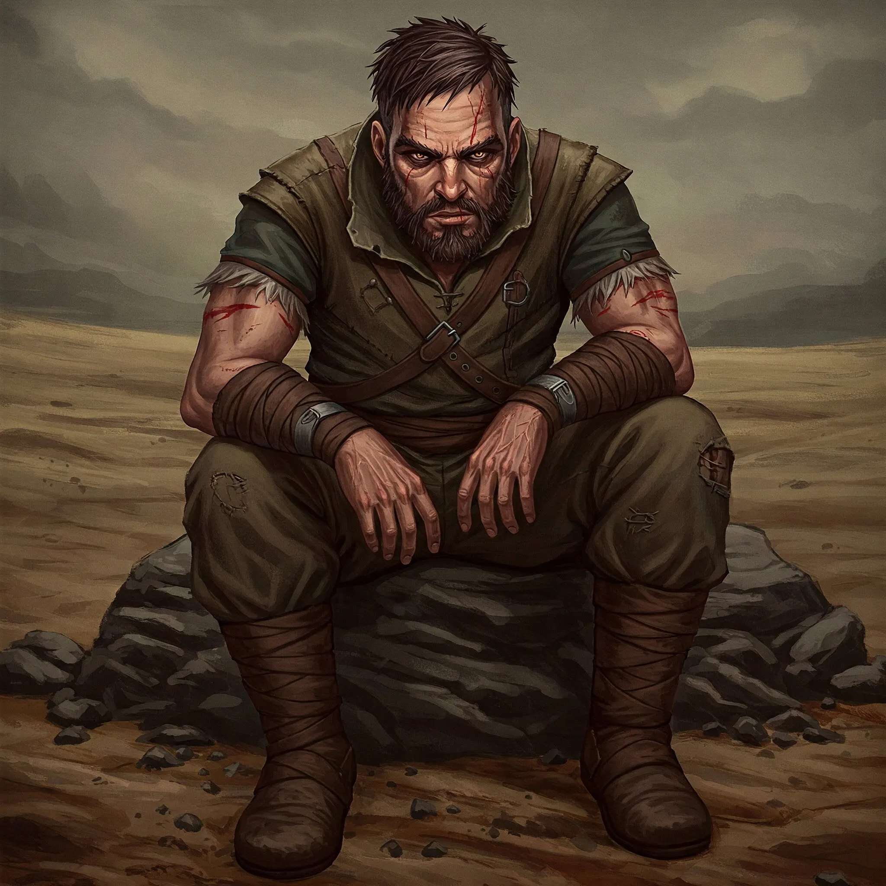
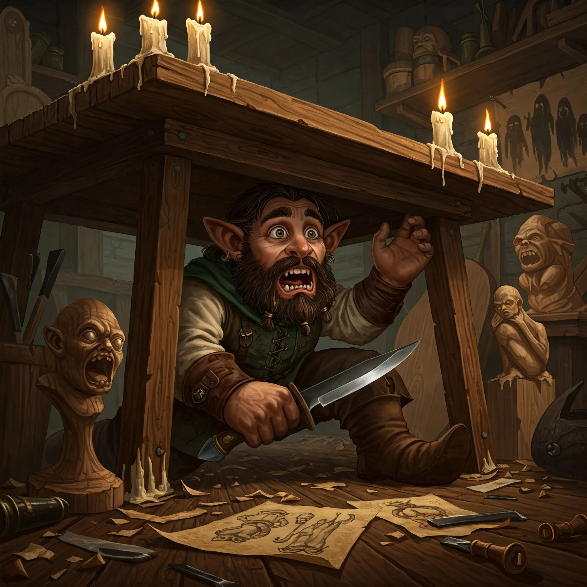
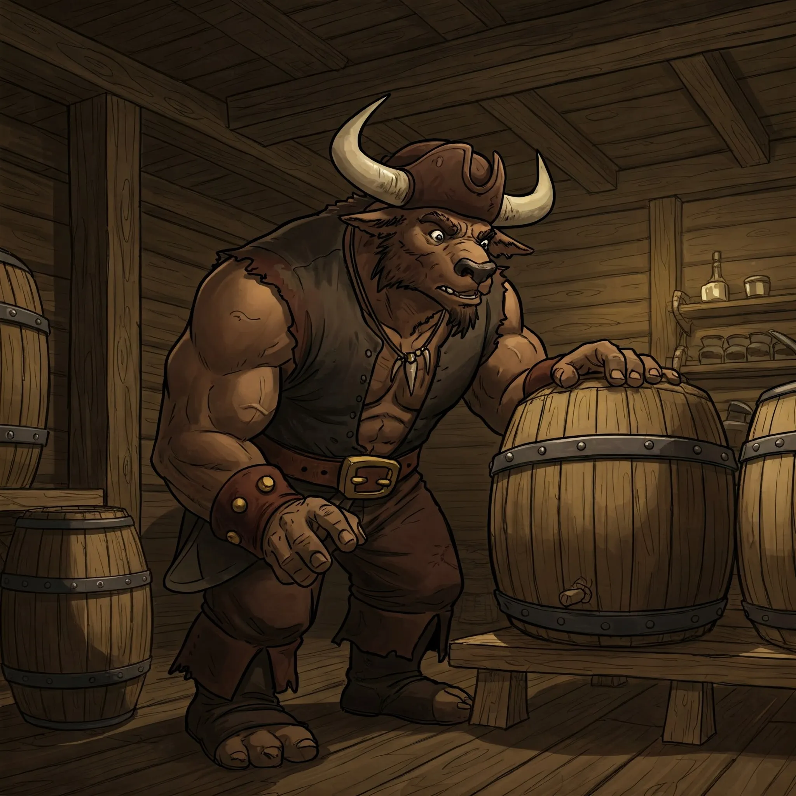
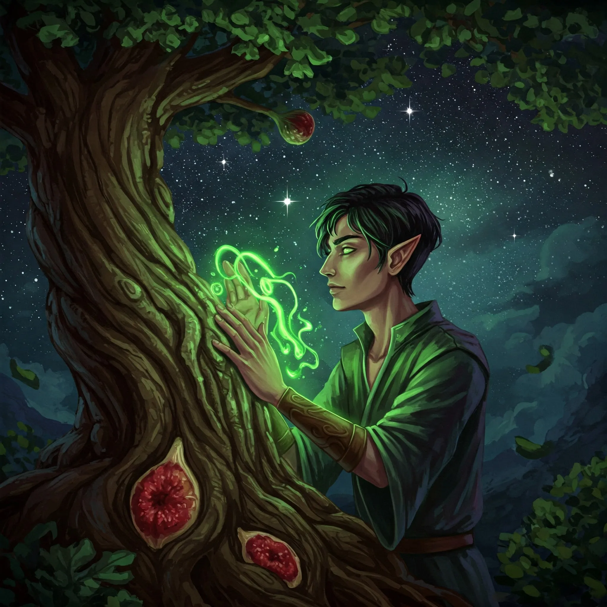
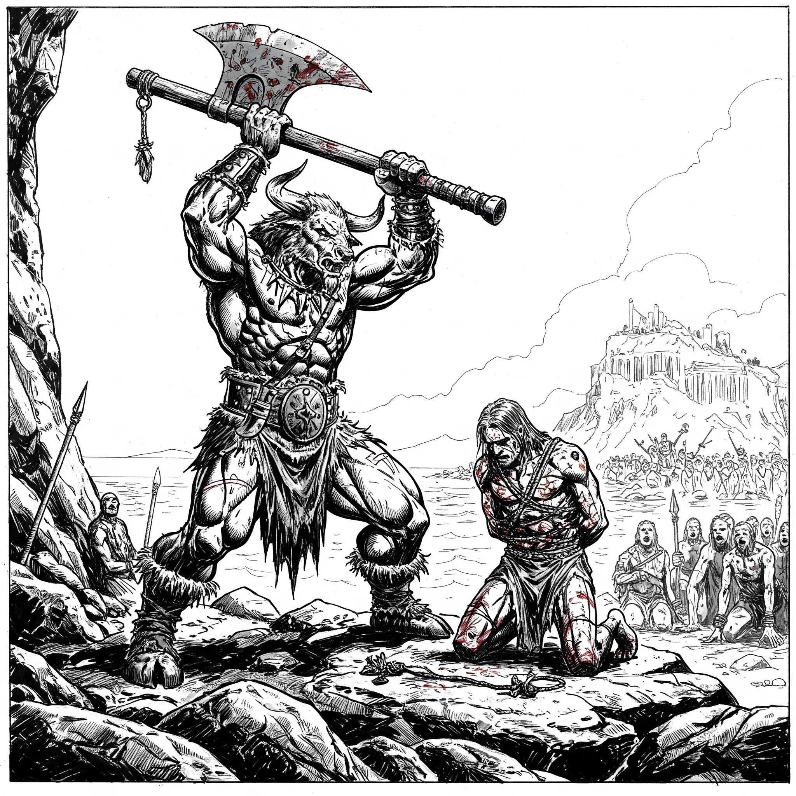
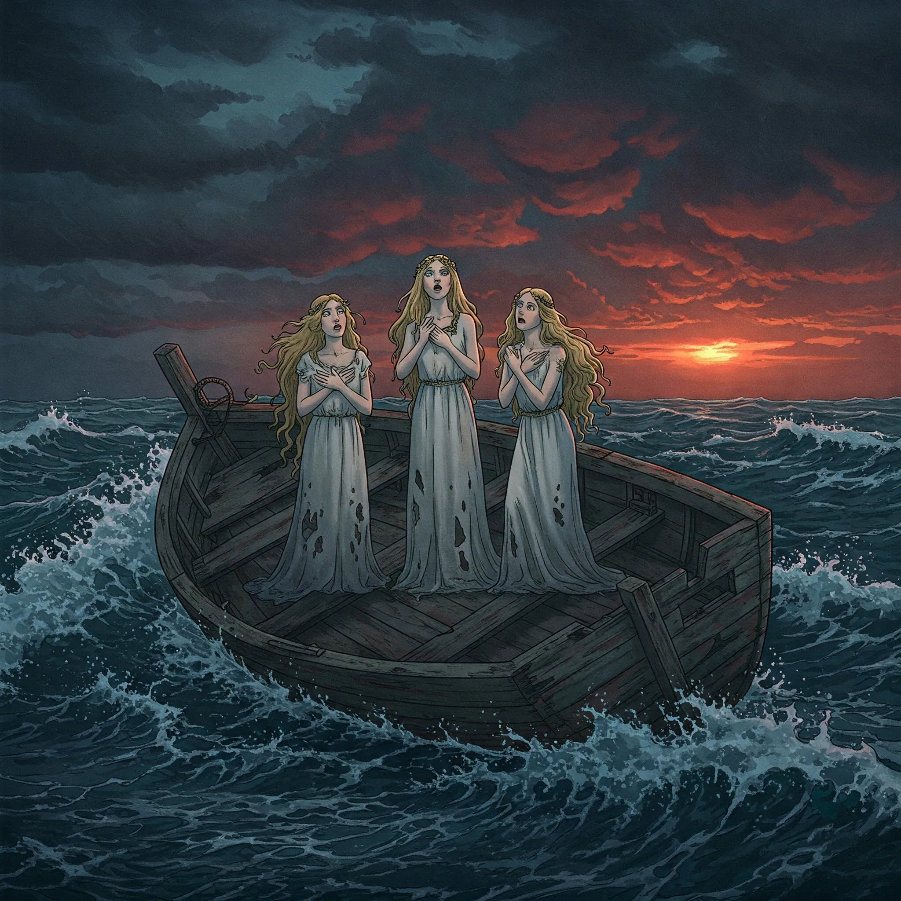
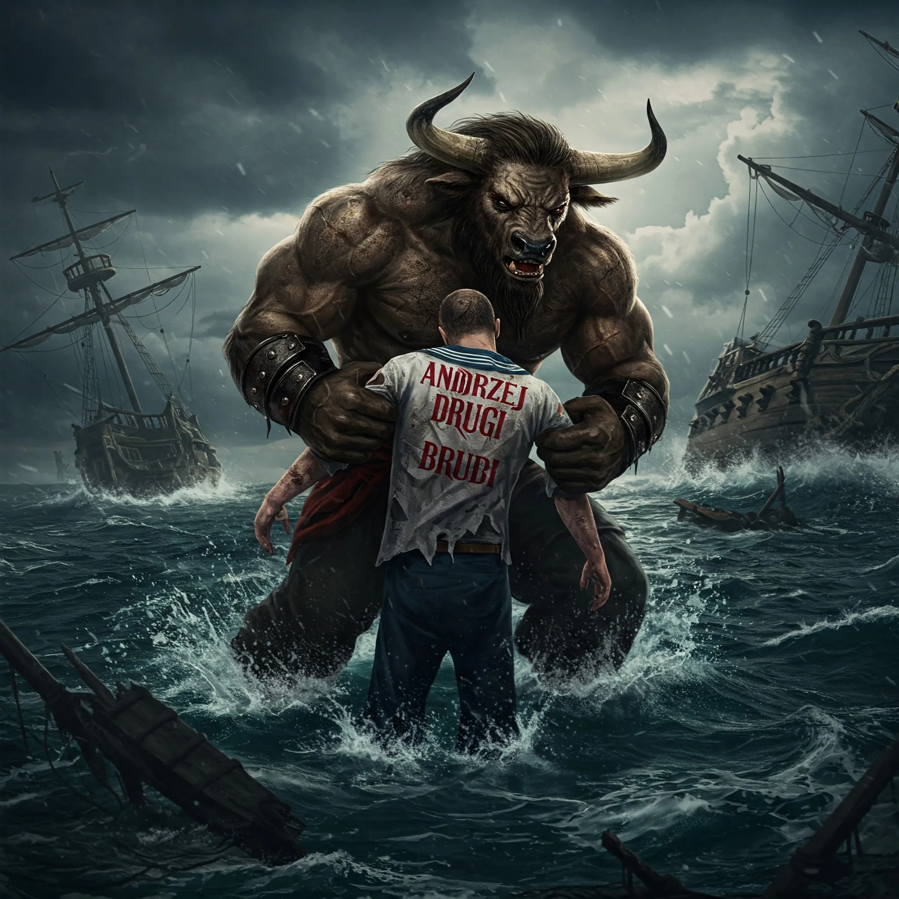

**Data:** 31.03.2025

## Podsumowanie

Świt na [[Wyspa Wygnańców|Wyspie Wygnańców]] zastał Bohaterów Przepowiedni w stanie czujnego wyczekiwania, które jednak nie przyniosło przełomu. Nocna obserwacja cmentarza okazała się jałowa – morderca nie powrócił, by dopełnić makabrycznego rytuału złożenia kolejnego palca w grobie [[Cronos|Cronosa]]. Poranne słońce, wschodząc nad skalistym brzegiem, zdawało się jedynie podkreślać ponurą tajemnicę, która spowijała to zapomniane przez bogów miejsce.

Nie tracąc czasu, drużyna postanowiła kontynuować śledztwo. [[Versir]], pamiętając o odkryciu [[Arevon Elorrenthi|Arevona]] w ogrodzie [[Idylla|Idylli]], postanowił odzyskać zakrwawiony but znaleziony poprzedniego dnia na skalnej półce. Wrócił nad urwisko i po chwili poszukiwań odnalazł zgubę, która mogła stanowić kluczowy dowód. Z butem w ręku, Aasimar udał się prosto do ogrodu matki króla [[Mytros]]. Tam, przy płocie, gdzie druid zauważył ślady wskazujące na czyjąś obecność, [[Versir]] przykucnął, porównując odcisk pozostawiony w miękkiej ziemi z kształtem i rozmiarem znalezionego obuwia. Choć bez absolutnej pewności, ślady wydawały się pasować – rozmiar był zbliżony, a charakterystyczne wgłębienie na podeszwie mogło odpowiadać znalezionemu butowi. To odkrycie rzucało cień podejrzenia na kogoś o podobnym rozmiarze stopy, kto niedawno przeskakiwał płot ogrodu [[Idylla|Idylli]].

W międzyczasie reszta drużyny – [[Orestes]], [[Felicjan Janus Twardowski|Felicjan]] i [[Orion Xul|Orion]], wraz z medytującym (choć bardziej drzemiącym po nieprzespanej nocy) [[Arevon Elorrenthi|Arevonem]] w pobliżu – postanowiła skonfrontować [[Stavros|Stavrosa]] w sprawie zaginionej beczki wina, o której wspomniał umierający [[Marius]]. Zastali króla wygnańców w jego skromnej siedzibie. [[Orestes]], wykorzystując swoje doświadczenie z rodzinnego browaru, podszedł do jedynej beczki stojącej w kącie izby. Po uzyskaniu zgody [[Stavros|Stavrosa]], powąchał jej zawartość. Wyczuł jedynie kwaśny zapach podłego wina, bez śladu słodkawej woni kwiatów [[Nightshade Whisper]]. [[Stavros]], zapytany wprost o wino i potencjalną truciznę, wydawał się autentycznie zdziwiony i zaniepokojony. Kategorycznie zaprzeczył, jakoby ktokolwiek mógł mu ukraść wino, twierdząc, że beczka jest prawie pełna i że jest to jego jedyny zapas, po który udaje się do [[Tyrone|Tyrona]], gdy ten się skończy. [[Felicjan Janus Twardowski|Felicjan]], używając subtelnej magii *Wykrycia Myśli*, potwierdził, że [[Stavros]] wydaje się mówić prawdę, przynajmniej jeśli chodzi o jego wiedzę na temat kradzieży czy zatrucia wina. W jego myślach dominowało zmęczenie i strach panujący na wyspie.

[[Versir]], powróciwszy od [[Idylla|Idylli]], zdał relację ze swojego odkrycia dotyczącego buta i śladów. Następnie podzielił się informacjami uzyskanymi od matki [[Acastus|Acastusa]] na temat [[Tadd|Tadda]] – jego modus operandi w [[Mytros]] obejmowało atakowanie ofiar od tyłu, ranienie nóg, a następnie podrzynanie gardeł. [[Idylla]] zaprzeczyła również, jakoby wiedziała cokolwiek o rzekomej schadzce [[Marius|Mariusa]], twierdząc, że na tak małej wyspie plotki rozchodzą się szybko i o romansie na pewno by słyszała. To sugerowało, że "schadzka", o której mówił [[Marius]], mogła mieć zupełnie inny charakter.

Po rozmowie ze [[Stavros|Stavrosem]] i wymianie informacji z [[Versir|Versirem]], podejrzenia zaczęły krążyć wokół pozostałych kandydatów. [[Tadd]], znany ze swojej brutalności i niestabilności psychicznej, wydawał się naturalnym podejrzanym, choć metoda otrucia nie do końca pasowała do jego wcześniejszych zbrodni. Z drugiej strony, [[Keelan]], były wojownik pełen nienawiści, oraz [[Tyrone]], rywal [[Stavros|Stavrosa]] do władzy, również pozostawali w kręgu podejrzeń.

Drużyna postanowiła odwiedzić [[Tadd|Tadda]]. Jego chata, już na pierwszy rzut oka, zdradzała chaos panujący w umyśle mieszkańca. Narzędzia rzeźbiarskie walały się bezładnie, a wokół piętrzyły się śmieci. Gdy bohaterowie zapukali, z wnętrza dobiegł krzyk strachu, a drzwi zatrzasnęły się z hukiem. [[Orestes]], obchodząc chatę, zauważył ruch przy oknie – [[Tadd]] najwyraźniej próbował uciec. Minotaur błyskawicznie zareagował, rzucając się w stronę okna i chwytając niziołka, zanim ten zdążył wyskoczyć. Minotaur obezwładnił przerażonego [[Tadd|Tadda]], który kurczowo ściskał w dłoni nóż. Minotaur, próbując uspokoić sytuację, zaoferował Niziołkowi łyk piwa ze swojego magicznego kufla, obiecując spokojną rozmowę. [[Tadd]], choć wciąż roztrzęsiony, bełkotał coś o mordercy, oczach w ciemności, które go obserwują i przyjdą po niego, a potem po bohaterów. Jego paniczny strach i chaotyczne wypowiedzi zdawały się wskazywać bardziej na ofiarę psychozy niż na zimnokrwistego zabójcę. Przeszukanie chaty ujawniło liczne, niepokojące rzeźby i rysunki, ale nic, co bezpośrednio łączyłoby [[Tadd|Tadda]] z rytualnymi morderstwami.

Następnie bohaterowie natknęli się na [[Keelan|Keelana]], kręcącego się podejrzanie niedaleko domu [[Stavros|Stavrosa]]. [[Keelan]], zapytany o morderstwa, odpowiadał zdawkowo i niechętnie. Wspominał ofiary z pogardą: [[Cronos|Cronosa]] jako tyrana, [[Lysander|Lysandra]] jako poetę, [[Petros|Petrosa]] jako samotnika, a [[Marius|Mariusa]] jako słabe narzędzie w rękach [[Tyrone|Tyrona]]. Zapytany o swoją przeszłość i powód zesłania, [[Keelan]] przyznał, że zabił własnego brata podczas kłótni, czego wydawał się żałować, choć jego ogólna postawa była pełna zgorzknienia. [[Orestes]] poczęstował go piwem, które [[Keelan]] wypił łapczywie, komentując, że woli je od wina. Porównanie jego butów z tym znalezionym przez [[Versir|Versira]] nie dało jednoznacznych rezultatów – rozmiar mógł pasować.

Kolejnym celem stali się ludzie [[Tyrone|Tyrona]] – [[Gareth]] i [[Silas]], których bohaterowie zastali przy przenoszeniu beczek z winem niedaleko chaty ich mocodawcy. [[Felicjan Janus Twardowski|Felicjan]] od razu sięgnął po *Wykrycie Myśli*. W powierzchownych myślach obu mężczyzn wyczuł znużenie, irytację, ale także lekki smutek, który nasilił się, gdy [[Versir]] zaczął pytać o zamordowanego [[Marius|Mariusa]]. Zapytani o powód zesłania, początkowo kręcili, ale pod lekką presją [[Orestes|Orestesa]] (groźba zniszczenia beczki wina), przyznali, że zostali zesłani za włamanie na zlecenie, które poszło nie tak. O [[Marius|Mariusie]] mówili ciepło, wspominając wspólne picie wina za plecami [[Tyrone|Tyrona]]. Przyznali, że czasem podkradali wino z beczek [[Tyrone|Tyrona]], ulewając po trochu z każdej, by nikt się nie zorientował. W głębszych myślach [[Gareth|Garetha]], [[Felicjan Janus Twardowski|Felicjan]] wyczuł strach przed mordercą i nadzieję, że [[Tyrone|Tyron]] ich obroni. Żaden z nich nie wydawał się zamieszany w zbrodnie, a ich buty również nie pasowały idealnie do znalezionego odcisku.

W trakcie tej rozmowy pojawił się sam [[Tyrone]], potężnie zbudowany mężczyzna o wyniosłej postawie. Zapytany o wino i morderstwa, zbył bohaterów, twierdząc, że jego wino jest najlepsze i nie potrzebuje żadnych dodatków. Wyraził niechęć do [[Stavros|Stavrosa]] i zaprzeczył, jakoby miał cokolwiek wspólnego ze śmiercią swoich ludzi czy innych wygnańców. Wspomniał, że beczki królowi czasem dostarczali mu różni ludzie, w tym [[Keelan]]. [[Felicjan Janus Twardowski|Felicjan]], ponownie używając magii, odczytał myśli [[Tyrone|Tyrona]]. Okazało się, że [[Tyrone|Tyron]] postrzega morderstwa jako problem dla swoich planów, ale jednocześnie cieszy go osłabienie pozycji [[Stavros|Stavrosa]]. Nie wiedział, kto jest mordercą, ale miał nadzieję, że podejrzenia nie padną na niego. Był ambitny i arogancki, ale nie wydawał się zabójcą.

W międzyczasie [[Arevon Elorrenthi|Arevon]] zakończył swój długi odpoczynek, odzyskując siły i przygotowując nowe zaklęcia. Zdecydował się na desperacki, choć genialny w swej prostocie plan – użyć czaru *Rozmowa z Roślinami*. Pamiętał, że przy każdej ofierze znajdowano liść figowy, a niedalogo cmentarza rosły właśnie drzewa figowe.

Najpierw jednak spróbował porozmawiać z krzakiem przed świątynią, gdzie znaleziono ciało [[Marius|Mariusa]], ale ich pamięć okazała się zbyt ulotna. Następnie udał się do drzew figowych rosnących nieopodal cmentarza. Rzucił zaklęcie *Rozmowa z Roślinami* i zapytał drzewa, kto ostatnio zrywał ich liście. Drzewa, choć nie posiadały oczu w ludzkim rozumieniu, "pamiętały" dotyk i obecność osoby, która regularnie, zawsze pod osłoną nocy, pozbawiała je liści. Opisały tę postać jako umiarkowanie wysoką. [[Arevon Elorrenthi|Arevon]], mając teraz konkretny rysopis, poprosił pozostałych o przyprowadzenie podejrzanych.

Najpierw przyprowadzono [[Elara|Elarę]], niedowidzącego starca. Drzewo figowe natychmiast "rozpoznało", że to nie on. Następnie przed oblicze drzewa stanął [[Stavros]]. Drzewo ponownie zaprzeczyło, dodając dziwny komentarz o braku duszy i rudych włosach. Wreszcie przyszła kolej na [[Keelan|Keelana]]. Kiedy [[Arevon Elorrenthi|Arevon]] poprosił drzewo o identyfikację, to ze zgrozą go jako swojego kata. To on dopuścił się złego dotyku zrywając liście.

[[Felicjan Janus Twardowski|Felicjan]] natychmiast skupił swoje *Wykrycie Myśli* na [[Keelan|Keelanie]]. Początkowo wyczuł jedynie spokój i próbę kontroli, mantrę powtarzaną w myślach: "Otrzymaj dyscyplinę, nie wyjawiaj niczego, zachowaj kontrolę". Jednak gdy czarodziej przebił się głębiej, odkrył mroczną prawdę: pogardę dla wszystkich mieszkańców wyspy, w tym dla siebie, oraz przekonanie o własnej misji oczyszczenia tego miejsca ze "zgnilizny". [[Keelan]] uważał swoje ofiary za chorobę toczącą wyspę. Nie było żadnego mocodawcy – działał sam, z własnych, wypaczonych pobudek. W momencie, gdy [[Keelan]] zorientował się, że jego umysł jest czytany, [[Felicjan Janus Twardowski|Felicjan]] usłyszał w myślach szydercze pytanie: "I co teraz?".

[[Arevon Elorrenthi|Arevon]], poinformowany szeptem przez [[Felicjan Janus Twardowski|Felicjana]] i [[Versir|Versira]] o odkryciu i potwierdzeniu przez drzewo, dał sygnał do działania. Rzucił na [[Keelan|Keelana]] czar *Uwięzienie Osoby*. Wojownik, mimo swojej siły i wyszkolenia, nie zdołał oprzeć się magicznemu paraliżowi. [[Orestes]] i [[Orion Xul|Orion]] szybko go obezwładnili i związali.

Zdemaskowany [[Keelan]] wygłosił płomienną mowę do zebranego tłumu wygnańców. Nazwał ich złodziejami, oszustami i mordercami, których świat zewnętrzny odrzucił. Oskarżył [[Stavros|Stavrosa]] o bycie trucicielem, a [[Idylla|Idyllę]] o bycie manipulantką żądną władzy. Twierdził, że on jedynie nazywał rzeczy po imieniu i próbował oczyścić wyspę z jej brudów, podczas gdy inni ukrywają swoje winy za fasadą kłamstw. Przyznał się do swoich czynów, ale jednocześnie stwierdził, że jest jedynie odbiciem zepsucia całej społeczności.

Tłum zawrzał, domagając się natychmiastowej egzekucji. [[Stavros]], wyraźnie przytłoczony sytuacją, początkowo wahał się, sugerując wygnanie (co spotkało się z drwiną [[Arevon Elorrenthi|Arevona]], pytającego, czy chce zostawić los mordercy w rękach [[Sydon|Sydona]]). Ostatecznie jednak, pod naporem tłumu i [[Tyrone|Tyrona]] (który jednak sam stchórzył, gdy podsunięto mu nóż), zgodził się na śmierć [[Keelan|Keelana]].

[[Orestes]] zgłosił się na ochotnika do wykonania wyroku. Po krótkiej wymianie zdań z [[Keelan|Keelanem]], który wyraził żal jedynie za zabicie brata, Minotaur uniósł swój potężny topór i jednym, czystym cięciem pozbawił mordercę głowy. Głowa potoczyła się w stronę [[Stavros|Stavrosa]], a jedynym dźwiękiem, jaki przerwał ciszę, był radosny okrzyk [[Tadd|Tadda]].

Po egzekucji [[Stavros]] i [[Idylla]] podziękowali bohaterom za rozwiązanie sprawy morderstw. [[Idylla]] wyraziła chęć opuszczenia wyspy wraz z nimi, licząc na ochronę i możliwość powrotu do [[Mytros]] pod ich egidą. Bohaterowie, po krótkiej naradzie, zgodzili się ją zabrać. [[Stavros]], w imieniu swoim i całej wyspy, złożył uroczystą przysięgę, że gdy nadejdzie czas konfliktu z [[Sydon|Sydonem]] i [[Lutheria|Lutherią]], wygnańcy staną po stronie Bohaterów Przepowiedni na ile to będzie możliwe. [[Arevon Elorrenthi|Arevon]], przezornie, przed odpłynięciem wyrwał trujące kwiaty [[Nightshade Whisper]] z ogrodu [[Idylla|Idylli]], by nie kusiły kolejnych potencjalnych trucicieli.

W końcu bohaterowie, wraz z [[Idylla|Idyllą]], opuścili [[Wyspa Wygnańców|Wyspę Wygnańców]], żegnani przez jej mieszkańców. Po ustaleniu kursu (po krótkiej debacie i głosowaniu padło na wyspę powiązaną z konstelacją Barda), [[Ultros]] ponownie przeciął fale Morza Cerulańskiego. Podróż trwała trzy dni. Pierwszy dzień minął spokojnie, choć morze było nieco wzburzone. Wieczorem powrócił mechaniczny [[Keledone]], przynosząc magiczny przedmiot – różdżkę z rogu smoka. [[Orestes]] zdążył jeszcze przekazać ptakowi list do swojego wujaszka, z prośbą o informacje na temat liści koki. Drugi dzień również upłynął bez większych incydentów. Trzeciego dnia jednak, gdy cel podróży był już bliski, na horyzoncie pojawił się niewielki, na wpół zniszczony stateczek. Na jego pokładzie stały trzy piękne, skąpo odziane kobiety o długich blond włosach. Gdy tylko zauważyły [[Ultros]]a, zaczęły śpiewać hipnotyzującą pieśń, wabiąc załogę. Część marynarzy, w tym niejaki [[Andrzej Drugi]], wpadła w trans i rzuciła się do wody, płynąc w stronę istot. [[Felicjan Janus Twardowski|Felicjan]], rozpoznając zagrożenie, nie wahał się ani chwili – potężna kula ognia pomknęła w stronę wrogiego stateczku. Tuż przed eksplozją, postacie kobiet rozpłynęły się, ukazując swoje prawdziwe, potworne oblicza, po czym zniknęły w głębinach, wydając przeraźliwe piski. [[Orestes]], nie tracąc zimnej krwi, wskoczył na swojego wiernego morskiego konia i wyłowił zahipnotyzowanego [[Andrzej Drugi|Andrzeja Drugiego]], ratując go przed utonięciem.

Po odparciu ataku syren, [[Ultros]] kontynuował podróż, zbliżając się do celu – tajemniczej wyspy związanej z konstelacją Barda. Bohaterowie awansowali również na 8 poziom doświadczenia, gotowi stawić czoła nowym wyzwaniom, jakie z pewnością czekały na nich w tym nieznanym zakątku Thylei.

## Kluczowe wydarzenia / decyzje

* Kontynuacja śledztwa na [[Wyspa Wygnańców|Wyspie Wygnańców]] – odzyskanie zakrwawionego buta i porównanie go ze śladami.
* Przesłuchanie podejrzanych: [[Stavros|Stavrosa]], [[Tadd|Tadda]], [[Keelan|Keelana]], [[Tyrone|Tyrona]] oraz jego ludzi, [[Gareth|Garetha]] i [[Silas|Silasa]].
* Wykorzystanie czaru "Rozmowa z Roślinami" przez [[Arevon Elorrenthi|Arevona]] do identyfikacji mordercy przy pomocy drzew figowych.
* Zdemaskowanie [[Keelan|Keelana]] jako rytualnego zabójcy, jego przyznanie się do winy i płomienna przemowa.
* Egzekucja [[Keelan|Keelana]] przez [[Orestes|Orestesa]] toporem na żądanie tłumu i za zgodą [[Stavros|Stavrosa]].
* Zabranie [[Idylla|Idylli]] z wyspy i uzyskanie przysięgi wierności od wygnańców w przyszłym konflikcie.
* Napotkanie i odparcie ataku morskich wiedźm podczas podróży statkiem [[Ultros]].
* Dotarcie do wyspy związanej z konstelacją Barda i awans drużyny na 8 poziom.

## Postacie Niezależne (NPC)

* [[Stavros]]: Król wygnańców
* [[Idylla]]: Matka Acastusa
* [[Tadd]]: niestabilny niziołek
* [[Keelan]]: zdemaskowany morderca (Zmarły)
* [[Tyrone]]: rywal Stavrosa
* [[Gareth]] i [[Silas]]: Ludzie Tyrona
* [[Andrzej Drugi]]: Członek załogi Ultrosa, uratowany przed utonięciem.

## Lokacje

* [[Wyspa Wygnańców]]
* [[Ultros]]

## Przedmioty

* Zakrwawiony but
* Różdżka z rogu smoka
