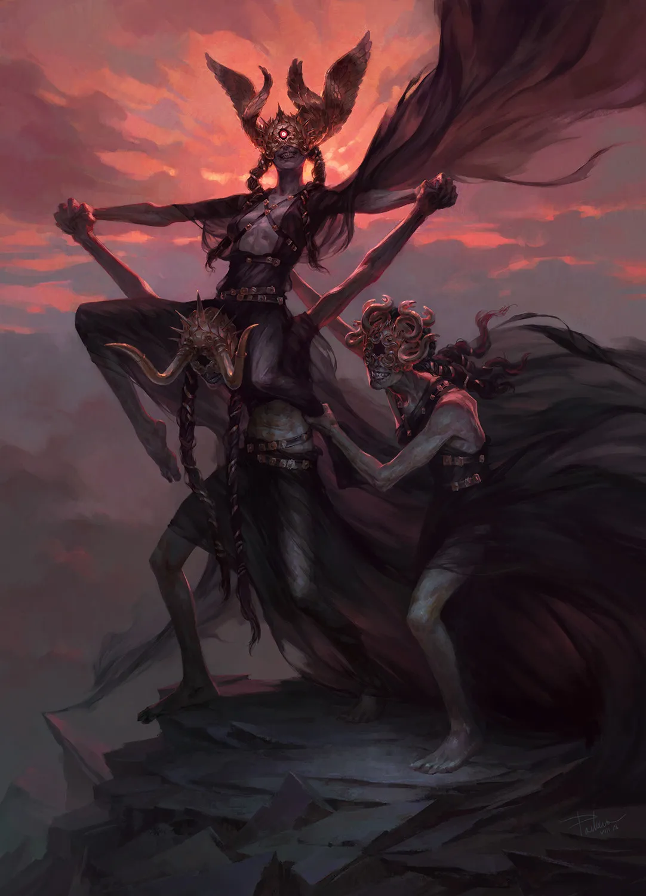
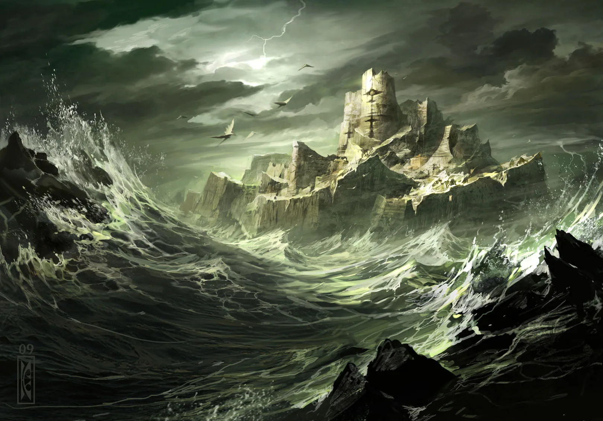
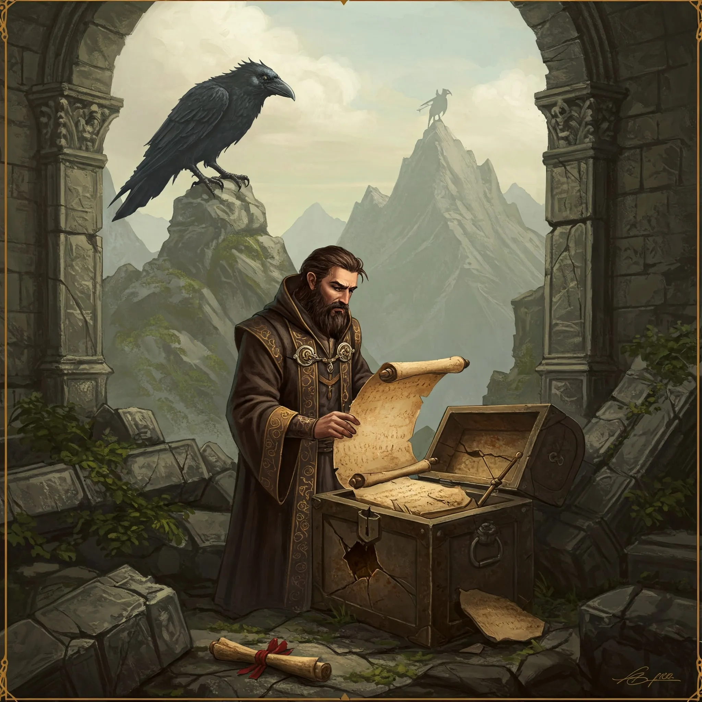
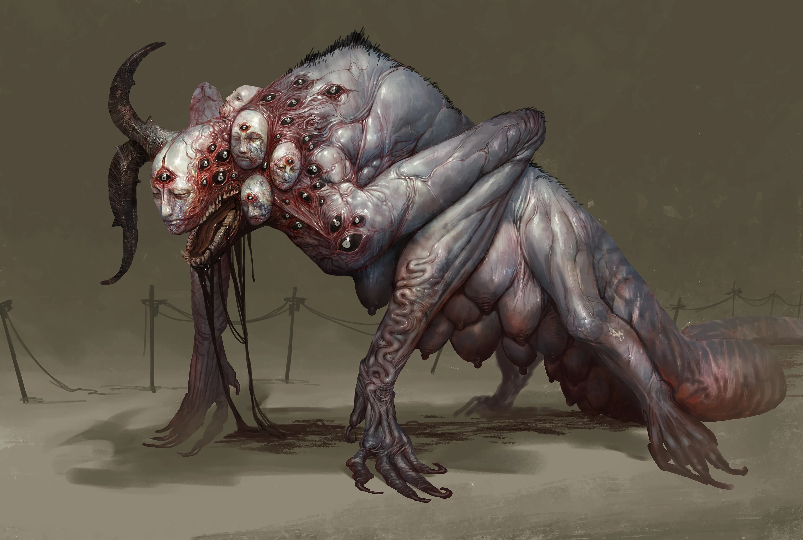
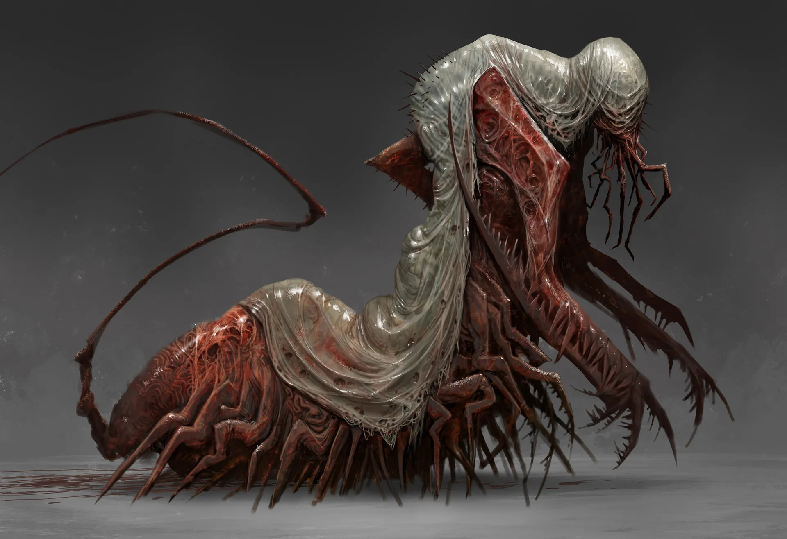
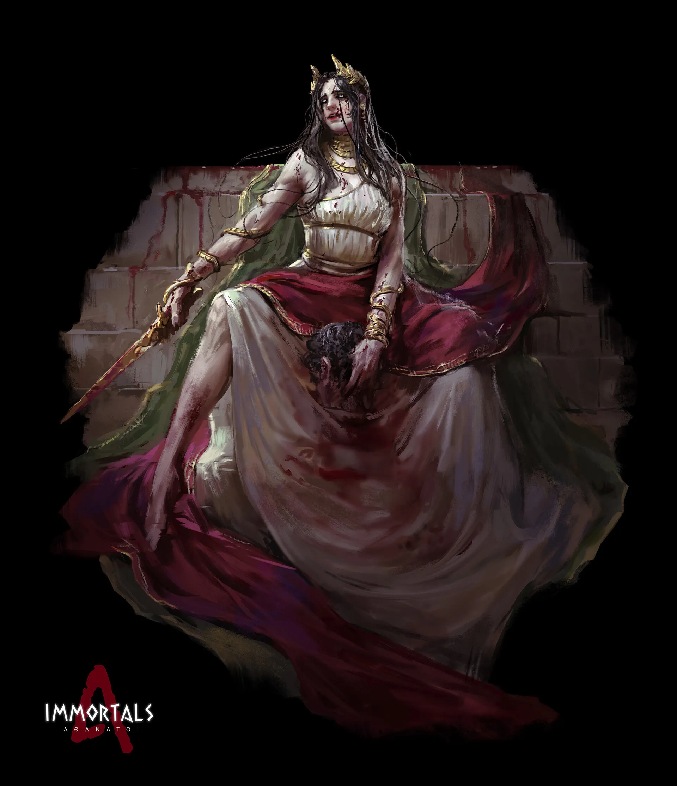
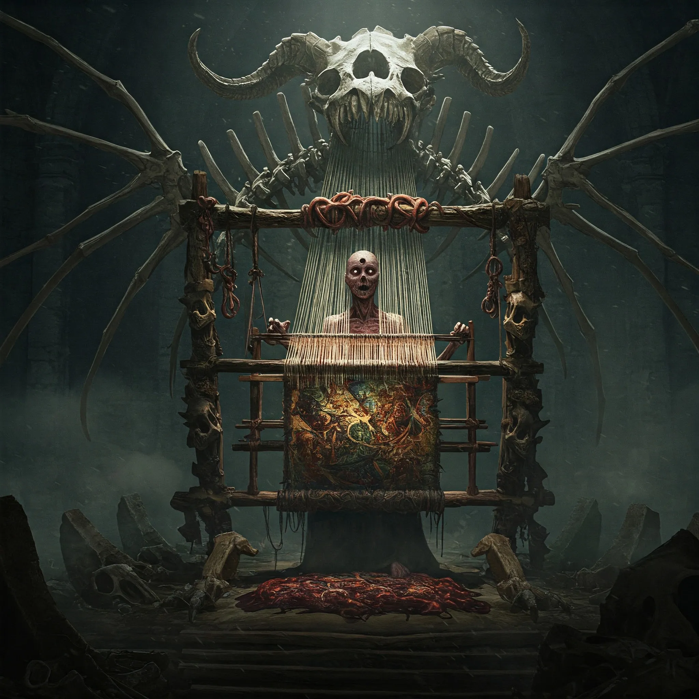
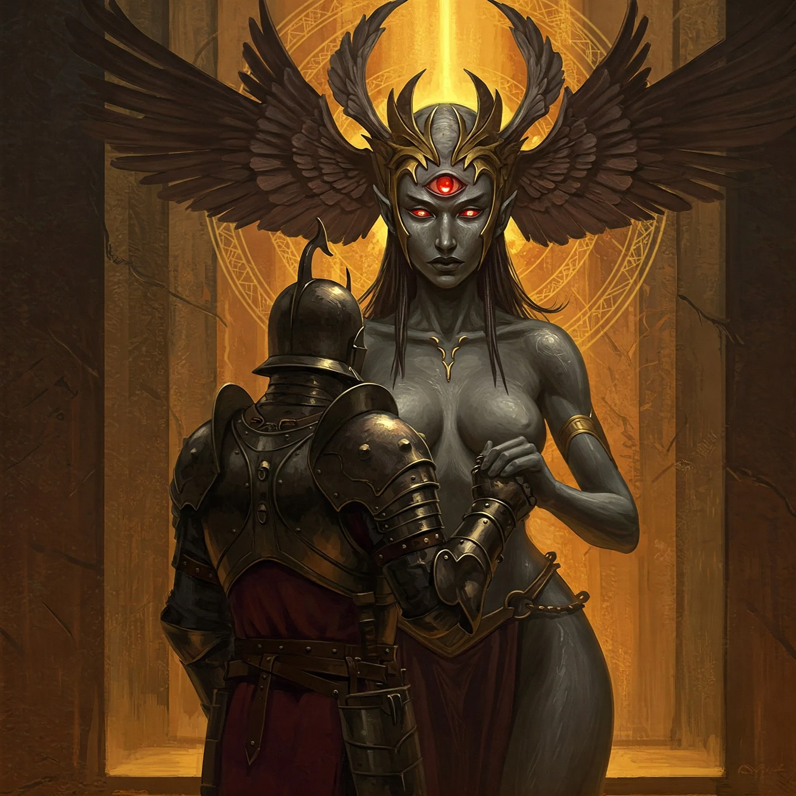

**Data:** 13.05.2024

## Podsumowanie

Pośród szalejącej nawałnicy, która targała statkiem [[Ultros]] niczym zabawką, zza zasłony deszczu i mgły, wyłonił się wreszcie cel ich morskiej podróży – ponura, skalista wyspa, nad którą dominowały zrujnowane blanki prastarej wieży. Wiatr i deszcz smagały bezlitośnie oblicze bohaterów, gdy ich dzielny statek, mimo bohaterskich wysiłków [[Arevon Elorrenthi|Arevona]], z trudem przebijał się przez rozszalałe fale. Dla [[Orestes|Orestesa]], minotaura nękanego przez fatum, widok ten był niczym powrót do koszmarnego snu, gdyż sylwetka wyspy, jej poszarpane klify i złowieszcza aura, były mu aż nazbyt dobrze znane z proroczych wizji. Choć skaliste wybrzeże wydawało się nieprzystępne, wprawne oko elfa druida dojrzało niewielką zatoczkę, dającą nadzieję na bezpieczne przybicie do brzegu.

Gdy [[Ultros]] ostrożnie zbliżył się do wyspy, [[Kyrah]], boska muza o głosie czystym jak kryształ, podeszła do kapitana [[Orestes|Orestesa]] i zgromadzonych przy nim bohaterów. Jej twarz, zwykle promieniująca łagodnym uśmiechem, teraz ukazywała napięcie. „Wygląda na to, że dotarliśmy do [[Wyspa Mojr|Wyspy Mojr]],” oznajmiła, jej głos ledwo przebijał się przez huk fal i zawodzenie wiatru. „Zanim zejdziemy na ląd, dobrze byłoby omówić nasze następne kroki.” Słowa te zawisły w powietrzu, ciężkie od niewypowiedzianych obaw i oczekiwania na to, co przyniesie spotkanie z prastarymi Paniami Losu.

W kajucie kapitana, przy chybotliwym świetle magicznej lampy, która rzucała tańczące cienie na znużone twarze, zebrali się [[Bohaterowie Przepowiedni]] wraz ze swoimi najwierniejszymi towarzyszami. [[Orestes]], barbarzyńca o sercu równie wielkim co jego topór, pierwszy zabrał głos, jego niski baryton wypełnił niewielkie pomieszczenie. „Naszym głównym celem,” zagrzmiał, uderzając lekko pięścią w stół, „jest zdjęcie przekleństwa ciążącego na smoczych jajach. Musimy przywrócić tym istotom ich dziedzictwo!” Jednogłośna zgoda potwierdziła jego słowa; los smoków leżał na sercu każdemu z nich. Wówczas [[Versi]], wyrocznia o oczach skrywających wiedzę wieków, podzieliła się swoją wiedzą na temat tajemniczych mieszkanek wyspy. „[[Mojry]]…” zaczęła cicho, a jej głos, choć spokojny, niósł w sobie echo prastarych tajemnic. „To istoty starożytne, to sama [[Thylea]], Matka Bogini, sprowadziła je do tego świata, by strzegły nici losu, by pilnowały porządku przeznaczenia. Z czasem jednak ich służba przybrała inny charakter. Uznały, że za swą pracę należy im się zapłata.” Westchnęła, spoglądając na zatroskane twarze przyjaciół. „[[Mojry]] dosłownie plotą nici przeznaczenia, mają nad nim ogromną władzę. Najchętniej dobijają targów, lecz pamiętajcie, że cena zawsze jest wysoka. Wydają się sprzyjać [[Tytani|Tytanom]], a ich siedziba roi się od przerażających stworzeń – bestii, które, jak wieść niesie, były niegdyś śmiertelnikami, co śmieli złamać dane im słowo.” Zamilkła na chwilę, po czym dodała: „Jest ich trzy: Morta, [[Decima]] i [[Nona]]. Trzy, które są jedną. Jedna, która jest trzema. Mogą być dla nas nieocenionym źródłem informacji, ale spotkanie z nimi niesie ze sobą ogromne ryzyko.”

Po niej głos zabrał [[Chondrus]], „Mówi się,” zaczął powoli, „że [[Nona]] odpowiada za dodawanie nowych nici do krosna losu. Pamiętajcie, by na wyspie niczego nie jeść ani nie pić. Plotki głoszą, iż tutejsze wody są skażone przez [[Morze Otchłani]], a ich spożycie może mieć opłakane skutki.” Jego spojrzenie stało się poważne. „[[Mojry]] słyną z targów. Ich magia pozwala im odebrać to, czego normalnie oddać byście nie mogli. Rozumieją, co cenicie najbardziej: wasze nadzieje, miłość, dumę. Tego właśnie będą pożądać. Mogą również zażądać wykonania zadania w zamian za usługę, zadania, które sprawi, że zakwestionujecie własną moralność i to, za co walczycie. Bądźcie ostrożni, bohaterowie. Zdążyłem was polubić i nie chciałbym, aby stało się wam coś złego.”

Dyskusja rozgorzała na nowo. [[Orestes]], wierny swemu kupieckiemu instynktowi i miłości do dobrego trunku, obstawał przy pomyśle zaoferowania [[Mojry|Mojrom]] wybornego piwa. [[Arevon Elorrenthi|Arevon]] wyraził obawy co do zabierania [[Pholon|Pholona]], centaura o potężnej posturze, w potencjalnie ciasne i zdradliwe jaskinie. [[Orestes]] wspomniał również o własnej klątwie i radzie wiedźmy Lotosu, która przestrzegała go przed przyjmowaniem ofert od istot takich jak [[Mojry]]. Ostatecznie ustalono skład drużyny desantowej: bohaterowie – [[Arevon Elorrenthi|Arevon]], [[Felicjan Janus Twardowski|Felicjan]], [[Orestes]], [[Orion Xul|Orion]] i [[Versir]] – a wraz z nimi [[Kyrah]], [[Chondrus]], [[Corinna]], [[Astra]] i [[Versi]], która mimo początkowych wahań, zgodziła się towarzyszyć śmiałkom, świadoma, że [[Mojry]] mogą postrzegać ją jako rywalkę w dziedzinie przepowiedni i losu.

Drużyna wyruszyła na ląd, zabierając ze sobą niezbędny ekwipunek. [[Orestes]], nie bacząc na przestrogi, dźwigał na plecach niewielką, acz cenną beczułkę swojego najlepszego piwa. Skalista, niegościnna wyspa powitała ich chłodem i milczeniem, przerywanym jedynie przez zawodzenie wiatru. Wąska, ledwo widoczna ścieżka wiła się wśród ostrych skał, prowadząc w głąb lądu, w kierunku górującej nad okolicą zrujnowanej wieży – tej samej, którą [[Orestes]] widywał w swoich snach. Wspinaczka po wykutych w skale, olbrzymich stopniach, przeznaczonych dla istot znacznie większych niż ludzie, była męcząca, lecz nie złamała ich determinacji. U stóp wieży powitał ich makabryczny widok: porozrzucane kości gigantów, istot o jednym centralnym oczodole i sześciu ramionach, dawnych mieszkańców tej przeklętej budowli. [[Arevon Elorrenthi|Arevon]], przeszukując ruiny, natrafił na rozbitą skrzynię, a w niej na skorodowane pojemniki skrywające zwoje. [[Felicjan Janus Twardowski|Felicjan]], biegły w starożytnych językach, odczytał zapiski w mowie gigantów – była to kronika wojny [[Smoczy Lordowie|Smoczych Lordów]] z Imperium [[Gyganie|Gyganów]], spisana z perspektywy tych drugich, przedstawiająca [[Smoczy Lordowie|Smoczych Lordów]] jako bezlitosnych agresorów. Była to gorzka pigułka prawdy, ukazująca drugą, mroczniejszą stronę legendy.

Gdy schodzili z powrotem ku ścieżce, ich uszu dobiegło głośne, złowieszcze krakanie. Na pobliskiej skale przysiadła olbrzymia, dziwacznie wyglądająca wrona, obserwując ich nieruchomym, inteligentnym spojrzeniem. Próby nawiązania kontaktu spełzły na niczym; ptak jedynie odpowiadał kolejnym krakaniem, nie spuszczając z nich oka. Kontynuowali podróż, a ścieżka doprowadziła ich do krawędzi wąwozu. Przed nimi rozciągało się płytkie, cuchnące jezioro, z którego wznosiły się liczne wejścia do jaskiń. Jednak to nie widok jeziora przykuł ich uwagę, lecz cztery kamienne statuy, na których zawieszono gobeliny. Gdy [[Versir]] zbliżył się do nich, tkaniny ożyły, ukazując każdemu z bohaterów inne, niepokojące wizje. Dla [[Versir|Versira]] były to obrazy jego własnej śmierci z rąk [[Lutheria|Lutherii]]. [[Arevon Elorrenthi|Arevon]] ujrzał swój statek ginący w sztormie na Eberronie oraz własne martwe ciało w paszczy mosiężnego smoka. Pozostali bohaterowie również stanęli twarzą w twarz ze scenami ze swojej przeszłości i przepowiedniami własnej śmierci, z których każda była bardziej przerażająca od poprzedniej.

Zanim zdążyli otrząsnąć się z szoku, z mroku jaskiń wyłoniły się potworne kreatury. Jedna, o wielu twarzach, oczach i piersiach, przypominająca koszmarnego, giboczącego stwora. Druga, niczym gigantyczna stonoga o niezliczonych odnóżach. Bitwa była nieunikniona. Walka była zaciekła i brutalna. Wielooki stwór emanował aurą szaleństwa, obezwładniając [[Versir|Versira]]. Druga bestia, nazwana później przez bohaterów Bloodskitter Horrorem, okazała się niezwykle odporna na fizyczne ciosy i zionęła żrącym kwasem, oślepiając [[Orestes|Orestesa]] i raniąc [[Orion Xul|Oriona]]. Bohaterowie walczyli z determinacją, wykorzystując swoje umiejętności magiczne i bojowe. [[Arevon Elorrenthi|Arevon]] ciskał świętym ogniem, [[Orion Xul|Orion]] zadawał precyzyjne ciosy włócznią nasyconą mocą błyskawic, a [[Orestes]], przemieniony w dzikiego kozła, szarżował z furią. [[Felicjan Janus Twardowski|Felicjan]], mimo obezwładniających szeptów wroga, zdołał uwięzić jednego z potworów w magicznej sferze, dając drużynie chwilę wytchnienia. [[Kyrah]] wspierała ich pieśnią dodającą otuchy i precyzji. Po długiej i wyczerpującej walce, znaczonej ranami i strachem, udało im się pokonać oba monstra. Ostatni stwór padł przeszyty magicznym pociskiem [[Felicjan Janus Twardowski|Felicjana]], a jego wnętrzności wypłynęły na kamienną posadzkę jaskini. Złowieszcza wrona wciąż obserwowała ich z góry, milczący świadek krwawej potyczki.

Ledwo opadł bitewny kurz, a z głównego wejścia do jaskini wyłoniła się postać. Była to kobieta, od której bił chłód i mroczna potęga – służka [[Mojry|Mojr]]. „Panie nie spodziewały się was tak szybko,” oznajmiła spokojnym, lecz przeszywającym na wskroś głosem. „Ale to niewiele znaczy dla nici, które tkają. Chodźcie. Panie was przyjmą.” [[Orestes]], nie tracąc rezonu, zapytał, czy Panie Losu gustują w piwie, na co odpowiedziało mu jedynie krakanie wrony. [[Versir]], używając swoich boskich zmysłów, potwierdził to, co czuli wszyscy – od postaci kobiety biła aura istoty piekielnej.

Podążyli za służką [[Mojry|Mojr]] w głąb jaskini. Przejście otworzyło się na niewielki przedsionek, którego ściany pokrywały niezliczone, rzeźbione glify i runy w językach dawnych i zapomnianych. Słowa takie jak „czas”, „przeznaczenie”, „przepowiednia”, „los”, „historia” powtarzały się w nieskończoność, nachodząc na siebie. Pośrodku kolejnej komnaty leżała gigantyczna, kamienna twarz, a w jej oczodołach i miejscu trzeciego oka płonęły upiorne płomienie. Z jej skalpu wyrastał dziwaczny, kamienno-grafitowy grzyb. Służka zapowiedziała ich przybycie [[Mojry|Mojrom]]. Z głębi dobiegł głos: „Wspaniale! Zaproś, zaproś!” Zeszli po schodach do rozległej, wysokiej jaskini. W tle majaczyły podejrzanie żółte jezioro. Jednak centralnym punktem tej złowieszczej komnaty były trzy postacie. [[Morta]], stara wiedźma o pusty oczodole, mieszała w ogromnym kotle, roztaczając wokół słodkawy odór rozkładu; jej obnażone, zwisające piersi kołysały się w takt ruchów. Nieopodal [[Nona]], kobieta o młodym wyglądzie i pojedynczym, świetlistym oku na środku czoła, pracowała przy groteskowym krośnie, karmiąc je lśniącymi sznurami ścięgien i wnętrzności. Jej głowę zdobiło nakrycie przypominające ciemne, trzepoczące skrzydła. Z najgłębszych cieni wyłoniła się [[Decima]], potężnie zbudowana kobieta o skórze twardej jak granit i również pustym oczodole, z koroną wijących się metalicznych węży na głowie i metalicznymi zębami.

Mojry powitały ich szyderczym śmiechem. [[Morta]] zadrwiła z ich wiary w możliwość powstrzymania Bliźniaków – [[Sydon|Sydona]] i [[Lutheria|Lutherii]]. [[Nona]] podeszła do [[Orion Xul|Oriona]], biorąc jego dłoń i komplementując jego urodę oraz odwagę, po czym zmysłowo ją oblizała. [[Decima]] rzuciła cierpkie uwagi [[Arevon Elorrenthi|Arevonowi]], pytając, kiedy poszukiwania zaginionej załogi stały się dla niego drugorzędne, oraz [[Orestes|Orestesowi]], wypominając mu jego bierność podczas igrzysk, gdy usłyszał głos swoic rodziców. W końcu [[Morta]] przerwała te igraszki, żądając, by wyjawili cel swojej wizyty.

[[Orestes]], odważnie przedstawił ich żądanie: zdjęcie klątwy z jaj i młodych smoków. Rozpoczęły się trudne negocjacje. [[Versir]] zarzucił [[Mojry|Mojrom]] korupcję i paktowanie z [[Tytani|Tytanami]]. [[Felicjan Janus Twardowski|Felicjan]] i [[Arevon Elorrenthi|Arevon]] podkreślali, że smoki to nie tylko narzędzia wojny, ale inteligentne istoty, którym [[Mojry]] odebrały rozum. Panie Losu nie zaprzeczyły; przyznały, że [[Sydon]] zapłacił im za rzucenie klątwy, ale umowa nie obejmowała jej utrzymania. Były gotowe zawrzeć nowy układ. Próby odwołania się do ich poczucia obowiązku czy neutralności, jaką powinny zachować zgodnie z wolą [[Thylea|Thylei]], spotkały się z drwiną. [[Orestes]] zaoferował swoje piwo, które [[Mojry|Moiry]] skosztowały. [[Morta]] zapytała, czy [[Orestes]] byłby gotów wyrzec się piwa na zawsze.

[[Versir]] zaproponował układ: jeśli udowodnią swoją siłę w starciu z potomstwem Bliźniaków, [[Mojry]] zdejmą klątwę. Oferta została odrzucona. Wówczas [[Mojry]] zażądały w zamian za zdjęcie klątwy wydania im Wyrocznię [[Versi]], którą postrzegały jako rywalkę. [[Arevon Elorrenthi|Arevon]] oskarżył je o manipulowanie wydarzeniami [[Thylea|Thylei]]. Zaproponowały [[Versir|Versirowi]] roczną służbę w zamian za zdjęcie klątwy, co ten odrzucił. Następnie [[Versir]] zaoferował artefakt pochodzący od [[Sydon|Sydona]]; [[Mojry]] były zainteresowane, ale uznały to za zbyt niską cenę za zdjęcie klątwy.

[[Orestes]], po chwili wahania, zaoferował, że wyrzeknie się piwa na zawsze. [[Mojry|Moiry]] rozważyły propozycję i dodały kolejny warunek: jedno z jego żyć (wiedziały, że ma ich trzy). [[Orestes]], mimo początkowej pokusy, ostatecznie odrzucił tę ofertę, nie chcąc zawierać paktu z tak niebezpiecznymi istotami, pamiętając o przestrogach.

[[Mojry]], widząc fiasko negocjacji w sprawie klątwy, zaoferowały ulepszenie indywidualnych artefaktów bohaterów. [[Orion Xul|Orionowi]] zaproponowano wzmocnienie jego włóczni w zamian za spędzenie nocy z [[Nona|Noną]] i zrobieniu jej dziecka. [[Orion Xul|Orion]], po krótkim namyśle i upewnieniu się, że nie wiążą się z tym żadne dalsze zobowiązania, zgodził się na układ, ku mieszanym reakcjom towarzyszy. [[Arevon Elorrenthi|Arevonowi]] zaoferowano dodanie potężnych zaklęć do jego artefaktu w zamian za jego szybkość, co druid odrzucił. [[Felicjan Janus Twardowski|Felicjanowi]] zaproponowano wzmocnienie jego korony w zamian za jego „szczęście”, co czarodziej również odrzucił.

Negocjacje utknęły w martwym punkcie. [[Mojry]] wydawały się rozczarowane, stwierdzając, że być może tylko dzielny [[Orion Xul|Orion]] opuści wyspę usatysfakcjonowany. [[Felicjan Janus Twardowski|Felicjan]], używając daru jasnowidzenia [[Versi]], zapytał, czy jakikolwiek układ z [[Mojry|Mojrami]] dotyczący smoków wyjdzie im na dobre. Odpowiedź brzmiała „tak”, a [[Versi]] dodała, że oferta Moir wydaje się szczera, choć cena może być wysoka. Bohaterowie pozostali jednak nieufni, a widmo poświęcenia kogoś lub czegoś cennego wisiało nad nimi ciężką chmurą. Sesja zakończyła się w atmosferze napięcia i niepewności, gdy bohaterowie musieli podjąć decyzję, czy zaryzykować niebezpieczny pakt, czy opuścić [[Wyspa Mojr]] z pustymi rękami, pozostawiając smoki na pastwę mrocznej klątwy.

## Kluczowe wydarzenia / decyzje

* Dotarcie drużyny na [[Wyspa Mojr]] pośród gwałtownej burzy morskiej.
* Narada strategiczna na statku [[Ultros]] dotycząca spotkania z [[Mojry|Mojrami]] i poznanie informacji na ich temat od [[Versi]] i [[Chondrus|Chondrusa]].
* Eksploracja ruin wieży [[Gyganie|gyganów]] na wyspie, odkrycie kroniki wojny [[Smoczy Lordowie|Smoczych Lordów]] z perspektywy Imperium [[Gyganie|Gyganów]].
* Doświadczenie przez bohaterów przerażających wizji własnej śmierci ukazanych przez magiczne gobeliny.
* Zwycięska, lecz wyczerpująca walka z dwoma potwornymi bestiami strzegącymi dostępu do siedziby [[Mojry|Mojr]].
* Spotkanie ze służką [[Mojry|Mojr]], która zaprowadziła bohaterów przed oblicze swoich pań.
* Trudne negocjacje z [[Mojry|Mojrami]] dotyczące zdjęcia klątwy ze smoczych jaj; [[Orion Xul|Orion]] jako jedyny zawiera indywidualny pakt, pozostali odrzucają oferty.

## Postacie Niezależne (NPC)

* [[Kyrah]]
* [[Chondrus]]
* [[Mojry]] ([[Morta]], [[Decima]], [[Nona]]): Trzy prastare istoty tkające nici losu, rezydujące na [[Wyspa Mojr|Wyspie Moir]].
* [[Versi]]

## Lokacje

* Statek [[Ultros]]
* [[Wyspa Mojr]]
* Zrujnowana wieża [[Gyganie|Gyganów]]
* Jaskinie [[Mojry|Mojr]]

## Przedmioty

* Zwoje z kroniką wojny [[Smoczy Lordowie|Smoczych Lordów]] z perspektywy Imperium [[Gyganie|Gyganów]] (znalezione)
