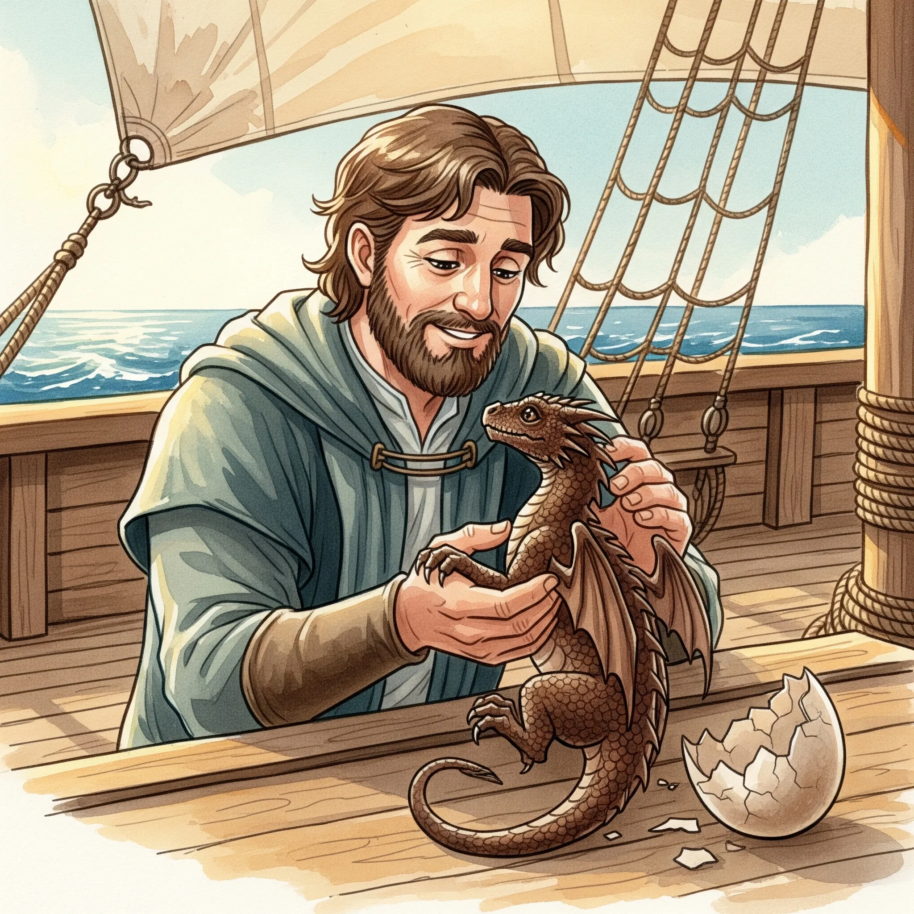
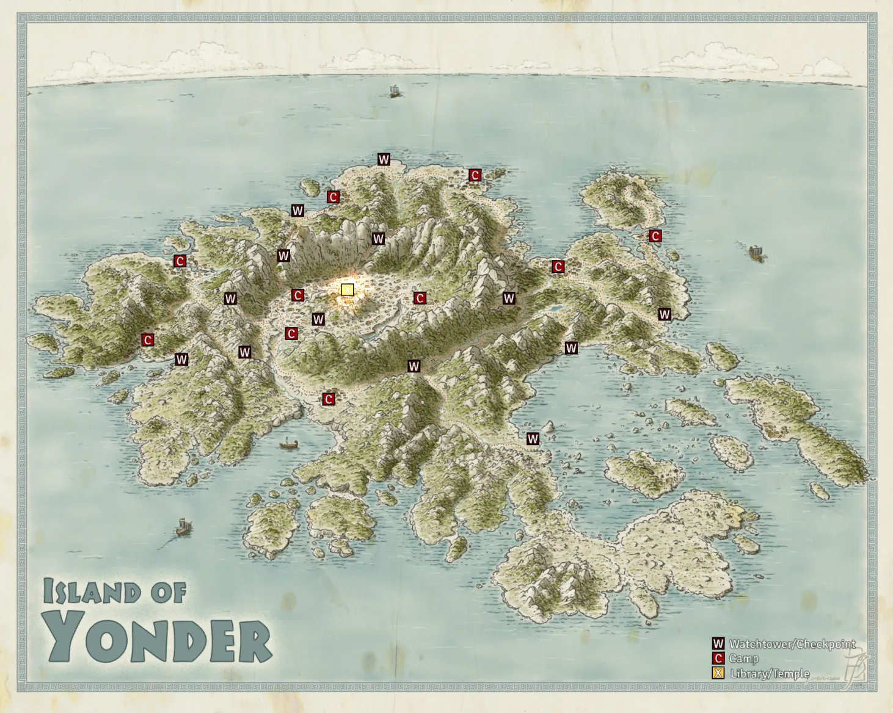
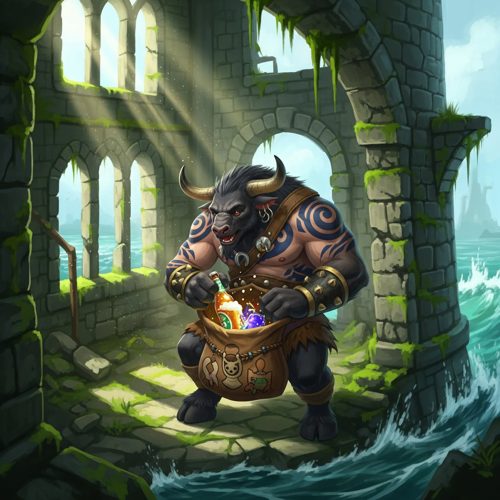
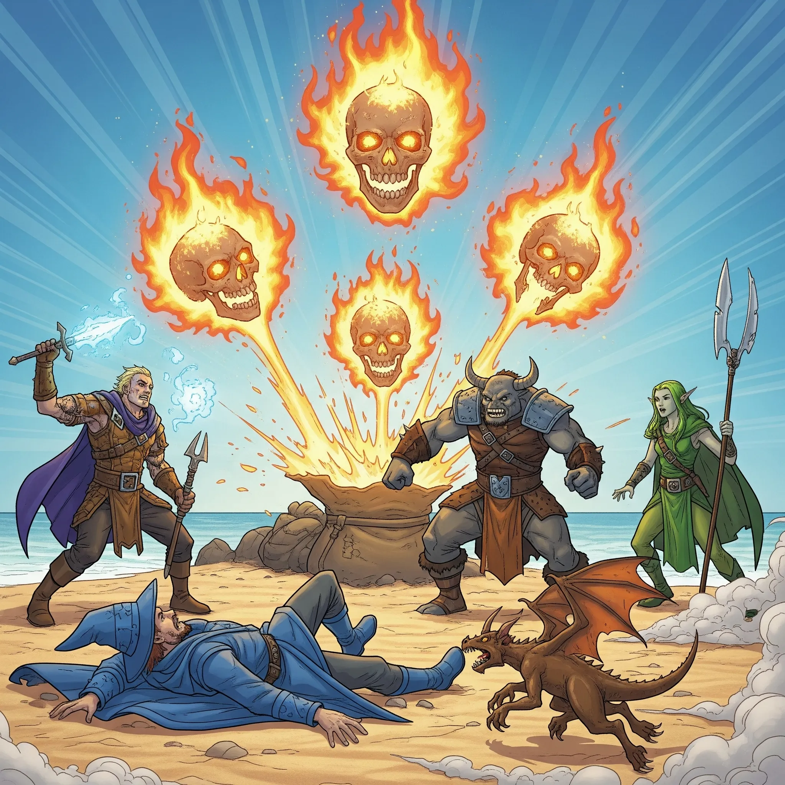

**Data:** 19.05.2025

## Podsumowanie

W komnacie [[Mojry|Mojr]], gdzie nici losu splatały się w widzialne i niewidzialne wzory, a powietrze drżało od starożytnej magii, negocjacje wciąż trwały, choć ich finał zdawał się być bliski. Po tym, jak waleczny [[Orion Xul|Orion]], półbóg o twarzy skrytej hełmem, zgodził się na intymny pakt z lubieżną [[Nona|Noną]] w zamian za wzmocnienie swej włóczni, atmosfera zgęstniała jeszcze bardziej. [[Versir]], z godnością odrzucił propozycję oddania odkupienie fragmentu duszy własnej matki. [[Arevon Elorrenthi|Arevon]], elf druid z odległego Eberronu, w końcu ugiął się pokusie i nie chcąc poświęcić ani wspomnień o swojej zaginionej załodze, poświęcił swoją szybkość, która nieraz ratowała mu życie. [[Orestes]], minotaur-barbarzyńca, choć przez moment kuszony obietnicą ulepszenia artefaktu i pomocy w zdjęciu klątwy [[Lutheria|Luterii]] w zamian za jedno ze swoich cennych żyć, ostatecznie, pomny przestróg, odrzucił ofertę, nie chcąc paktować z tak niebezpiecznymi istotami. Zamiast tego, z gestem godnym kupca i miłośnika dobrego trunku, pozostawił [[Mojry|Mojrom]] beczułkę swego wybornego piwa, być może w nadziei, że złagodzi to ich rozczarowanie.

Wówczas spojrzenia trzech wiedźm spoczęły na [[Felicjan Janus Twardowski|Felicjanie Januszu Twardowskim]], człowieku-czarodzieju, w którego - jak się wkrótce miało okazać - żyłach płynęła krew tytanów i dawnych bohaterów. [[Mojry]], niczym wytrawne handlarki, przedstawiły mu wachlarz propozycji, każda bardziej kusząca i niebezpieczna od poprzedniej. Oferowały mu potęgę w zamian za jego „szczęście”, za jego „ostatni oddech”. [[Felicjan Janus Twardowski|Felicjan]], przez chwilę rozważający nawet tę ostatnią, makabryczną cenę, ostatecznie przystał na inną, z pozoru mniej dotkliwą, lecz wciąż znaczącą ofiarę. W zamian za ulepszenie jego korony, symbolu jego dziedzictwa i mocy, zgodził się oddać [[Mojry|Mojrom]] swoje zdrowie. Od tej pory każde leczenie, czy to magiczne, czy naturalne, miało przynosić mu jedynie połowę zwyczajowej ulgi. Był to pakt, który miał odcisnąć piętno na jego przyszłych losach, czyniąc go bardziej podatnym na trudy i niebezpieczeństwa. Gdy umowa została przypieczętowana, [[Nona]], ta o młodzieńczym obliczu i pojedynczym, świdrującym oku, podeszła do czarodzieja, ujęła jego dłoń i z niepokojącym uśmiechem oblizała ją, jakby pieczętując pakt w sobie tylko znany, plugawy sposób. „Dokonało się,” wyszeptała, a jej głos odbił się echem w mrocznej jaskini.

Jednak to nie był koniec rewelacji, jakie [[Mojry]] miały dla [[Felicjan Janus Twardowski|Felicjana]]. [[Morta]], najstarsza i najbardziej złowroga z sióstr, wpatrując się w jego amulet, zaczęła snuć opowieść o jego prababce. [[Despina]] miała być siostrą wielkiego [[Adonis Neurdagon|Adonisa Neurdagona]], jednego ze [[Smoczy Lordowie|Smoczych Lordów]], przybyła do [[Thylea|Thylei]] wraz z nimi, lecz zdradziła ich ideały. Pełna arogancji i żądzy władzy, zażądała od [[Sydon|Sydona]], Pana Burz, by uczynił ją swoją królową. Ten jednak wyśmiał jej roszczenia, wygnał ją i skazał na śmierć. Choć przez pewien czas udawało jej się ukrywać, ostatecznie dosięgła ją sprawiedliwość z ręki [[Talieus|Talieusa]]. Była to gorzka prawda, kolejny cień rzucony na legendę [[Smoczy Lordowie|Smoczych Lordów]], ukazujący, że nawet wśród nich zdarzały się jednostki spaczone ambicją.

Po tych osobistych paktach i bolesnych odkryciach, nadszedł czas na główny cel wizyty bohaterów. [[Mojry]], zgodziły się zdjąć klątwę ciążącą na smoczych jajach. W zamian zażądały poświęcenia dwóch potężnych artefaktów: Kostura [[Sydon|Sydona]], który dzierżył [[Versir]], oraz magicznej różdżki [[Felicjan Janus Twardowski|Felicjana]], stworzonej ze smoczego rogu. W rytualnym geście, babuszka [[Morta]] ujęła oba przedmioty. Skupiła swą starożytną moc, mamrocząc słowa w niezrozumiałym języku. Artefakty w jej dłoniach straciły swój blask, po czym rozpadły się w pył, który opadł na kamienną posadzkę jaskini. „Klątwa została zdjęta,” oznajmiła [[Morta]] z krzywym uśmiechem. „[[Sydon]] będzie… niezadowolony.” [[Nona]] zaś, żegnając się z bohaterami, rzuciła [[Orestes|Orestesowi]] niepokojącą obietnicę: „Nie martw się, byczku. Jeszcze się spotkamy. Odwiedzimy cię jeszcze w twoich snach.” Z tymi słowami, służka [[Mojry|Mojr]] wyprowadziła drużynę z mrocznych jaskiń, z powrotem na niegościnną powierzchnię wyspy, gdzie wciąż czekała na nich złowieszcza, milcząca wrona.

Powróciwszy na pokład [[Ultros|Ultrosa]], bohaterowie, choć zmęczeni i naznaczeni spotkaniem z Paniami Losu, poczuli nową determinację. Klątwa smoków została zdjęta, co otwierało przed nimi nowe możliwości. Jednak zanim mogli w pełni cieszyć się tym zwycięstwem, [[Chondrus]], były doradca króla [[Acastus|Akastusa]], rozłożył przed nimi mapę kolejnego, znacznie bardziej niebezpiecznego celu – [[Wyspa Yonder|Wyspy Yonder]], twierdzy [[Zakon Sydona|Zakonu Sydona]]. Opisał im potęgę Zakonu Pana Burz: tysiące żołnierzy, pozostałości [[Gyganie|Gyganów]], ufortyfikowane obozy i centralną świątynię z legendarną biblioteką. Rozgorzała dyskusja nad strategią. [[Arevon Elorrenthi|Arevon]] proponował wojnę podjazdową, nękanie sił Zakonu z morza przez wiele dni, by osłabić ich obronę przed głównym atakiem. [[Versir]] z kolei skłaniał się ku bardziej subtelnej infiltracji, przebraniu się za żołnierzy i przeprowadzeniu dywersji. Obawy budził smok [[Gaius|Gaiusa]], potężnego dowódcy Zakonu. Bohaterowie odłożyli te plany na później i rozpoczęli głosowanie nad kolejnym kierunkiem wyprawy. Ostateczny głos przypadł [[Orion Xul|Orionowi]]. Wskazał na mapie, tajemniczą wyspę, spowitą mgłą niepewności – [[Wyspa Forlorn|Wyspę Forlorn]]. To tam, jak zdecydował, skierują swe następne kroki.

Podróż [[Ultros|Ultrosa]] przez wzburzone fale Morza Zapomnianego była pełna napięcia i oczekiwania. Jeszcze niedaleko od [[Wyspa Mojr|Wyspy Mojr]], ich oczom ukazały się ruiny prastarej wieży, wystającej z morza niczym złamany ząb. Drużyna desantowa – [[Arevon Elorrenthi|Arevon]], [[Versir]], [[Orestes]] i [[Felicjan Janus Twardowski|Felicjan]] – postanowiła zbadać to miejsce. Wśród omszałych kamieni i zniszczonych murów, [[Orestes]], kierowany swoim instynktem, odnalazł starą, skórzaną torbę, która, jak się okazało, była magicznym workiem bez dna – Bag of Holding. Ku uciesze minotaura, pierwsze, o czym pomyślał – piwo – materializowało się w jego dłoni. [[Felicjan Janus Twardowski|Felicjan]], myśląc o skarbach, wyciągnął garść złotych monet. Magiczna torba zdawała się spełniać pragnienia tych, którzy sięgali do jej wnętrza z „czystym sercem”, jak z przymrużeniem oka wyjaśnił czarodziej.

W trakcie dalszej podróży, gdy [[Ultros]] zmierzał ku [[Wyspa Forlorn|Wyspie Forlorn]], bohaterowie byli świadkami cudu narodzin. Jajo brązowego smoka, które [[Felicjan Janus Twardowski|Felicjan]] nosił przy sobie, zaczęło pękać. Z wielkim trudem, maleńkie smoczątko wydostało się ze skorupy. Był to samiec, którego czarodziej nazwał [[Kairos|Kairosem]]. Wzruszony i dumny, [[Felicjan Janus Twardowski|Felicjan]] natychmiast przystąpił do rytuału tworzenia więzi, wypowiadając słowa starożytnej przysięgi [[Smoczy Lordowie|Smoczych Lordów]]. Jego głos, choć drżący z emocji, niósł w sobie moc i determinację. Narodziny smoka podniosły morale na statku; [[Pythor]], bóg bitwy, był szczególnie zachwycony, widząc w tym znak odrodzenia dawnej chwały.

Wreszcie, po kilku dniach żeglugi, na horyzoncie zamajaczyła [[Wyspa Forlorn]]. Piaszczysta plaża łagodnie opadała ku turkusowym wodom, a w głębi lądu wznosiły się wzgórza, porośnięte pojedynczymi drzewami. Nad wszystkim górowała samotna, skalista góra. Gdzieś wśród tej scenerii kryły się ruiny dawnych zabudowań. Załoga [[Ultros|Ultrosa]], zabobonna i nieufna, z lękiem spoglądała na nowy ląd. Bohaterowie, wraz ze swoimi najwierniejszymi towarzyszami przygotowali się do zejścia na brzeg.

Gdy tylko drużyna wylądowała na plaży, [[Felicjan Janus Twardowski|Felicjan]], być może wciąż podekscytowany nowo nabytą torbą, postanowił opróżnić ją całkowicie, by zobaczyć, jakie jeszcze skarby kryje. Ustawił ją na niewielkiej skale i odwrócił do góry dnem. Jednak zamiast kolejnych kosztowności czy magicznych przedmiotów, z worka wysypały się… cztery płonące czaszki! Złowrogie, lewitujące kości, z oczodołów których buchał piekielny ogień, natychmiast rzuciły się na bohaterów.

Walka była gwałtowna i brutalna. Czaszki, z przerażającą szybkością, zaczęły ciskać kulami ognia. Pierwsze eksplozje wstrząsnęły plażą, raniąc dotkliwie drużynę. [[Felicjan Janus Twardowski|Felicjan]], trafiony bezpośrednio, padł nieprzytomny na piasek, a jego nowo narodzony smok, [[Kairos]], spłoszony hukiem i ogniem, szczęśliwie odskoczył. [[Versir]], widząc swego przyjaciela w niebezpieczeństwie, rzucił się na ratunek, używając swej mocy, by osłonić towarzyszy. [[Orion Xul|Orion]], mimo bólu i chaosu, z zimną krwią stawił czoła zagrożeniu, jego wzmocniona włócznia śmigała w powietrzu, niszcząc dwie czaszki precyzyjnymi pchnięciami. [[Arevon Elorrenthi|Arevon]], ciskając świętym ogniem, zadał rany kolejnemu przeciwnikowi, podczas gdy [[Orestes]], wpadłszy w barbarzyński szał, z potężnym rykiem rzucił się na jedną z czaszek, roztrzaskując ją swoim toporem w epickim wyskoku. [[Felicjan Janus Twardowski|Felicjan]], balansujący na krawędzi śmierci, dzięki magicznemu wsparciu [[Arevon Elorrenthi|Arevona]], zdołał zdać rzut obronny.

Gdy kurz bitewny opadł, a na plaży zaległa chwilowa cisza, bohaterowie, poobijani i zmęczeni, zaczęli przeszukiwać to, co pozostało z wysypanej zawartości torby. Niestety, oprócz potłuczonych butelek po nieznanych trunkach, nie znaleźli niczego wartościowego. Wtem, ich uwagę przykuł niespodziewany gość – zwykła, acz niezwykle ciekawska gęś, która bez lęku podeszła do grupy, badając wzrokiem pobojowisko. Gdy bohaterowie zaczęli opatrywać rany i zbierać siły po krótkim, acz intensywnym odpoczynku, z ruin dawnego miasteczka, majaczących w oddali, dobiegł ich uszu nowy, tajemniczy dźwięk – czysty, kobiecy śpiew, niosący ze sobą obietnicę kolejnych zagadek i niebezpieczeństw na tej przeklętej wyspie. Sesja zakończyła się, pozostawiając bohaterów w napięciu, z nową zagadką do rozwiązania i świadomością, że [[Wyspa Forlorn]] dopiero zaczyna odkrywać przed nimi swoje mroczne sekrety.

## Kluczowe wydarzenia / decyzje

* Bohaterowie negocjują z [[Mojry|Mojrami]], zawierając osobiste pakty: [[Orion Xul|Orion]], [[Felicjan Janus Twardowski|Felicjan]], [[Arevon Elorrenthi|Arevon]]. [[Versir]] i [[Orestes]] odrzucają propozycje.
* [[Mojry]] zdejmują klątwę ze smoczych jaj w zamian za Kostur [[Sydon|Sydona]] (należący do [[Versir|Versira]]) oraz magiczną różdżkę [[Felicjan Janus Twardowski|Felicjana]].
* Prawda [[Mojry|Mojr]] o pochodzeniu [[Felicjan Janus Twardowski|Felicjana]]
* [[Chondrus]] przedstawia plan ataku na [[Wyspa Yonder|Wyspę Yonder]], twierdzę [[Zakon Sydona|Zakonu Sydona]].
* Podczas podróży, drużyna desantowa bada ruiny wieży i znajduje Bag of Holding.
* Jajo brązowego smoka, które nosił [[Felicjan Janus Twardowski|Felicjan]], wykluwa się. Czarodziej nazywa smoczątko [[Kairos]] i tworzy z nim więź.
* Po dotarciu na [[Wyspa Forlorn|Wyspę Chimery]], [[Felicjan Janus Twardowski|Felicjan]] opróżnia Worek Bez Dna, z którego wyskakują cztery płonące czaszki, atakując drużynę.
* Sesja kończy się usłyszeniem tajemniczego kobiecego śpiewu dobiegającego z ruin na [[Wyspa Forlorn|Wyspie Chimery]].

## Postacie Niezależne (NPC)

* [[Mojry]] ([[Nona]], [[Morta]] i [[Decima]])
* [[Chondrus]]
* [[Pythor]]
* [[Kyrah]]
* [[Versi]]
* [[Kairos]] (Nowo narodzony brązowy smok)

## Lokacje

* Jaskinia [[Mojry|Mojr]]
* Statek [[Ultros]]
* Ruiny wieży
* [[Wyspa Forlorn]]

## Przedmioty

* Włócznia [[Orion Xul|Oriona]] (ulepszona przez [[Nona|Nonę]])
* Korona [[Felicjan Janus Twardowski|Felicjana]] (ulepszona przez [[Mojry|Mojry]] kosztem zdrowia)
* Kostur [[Sydon|Sydona]] (należący do [[Versir|Versira]], poświęcony [[Mojry|Mojrom]])
* Magiczna różdżka [[Felicjan Janus Twardowski|Felicjana]] (ze smoczego rogu, poświęcona [[Mojry|Mojrom]])
* [[Worek Bez Dna]] (Bag of Holding, znaleziony w ruinach wieży)
