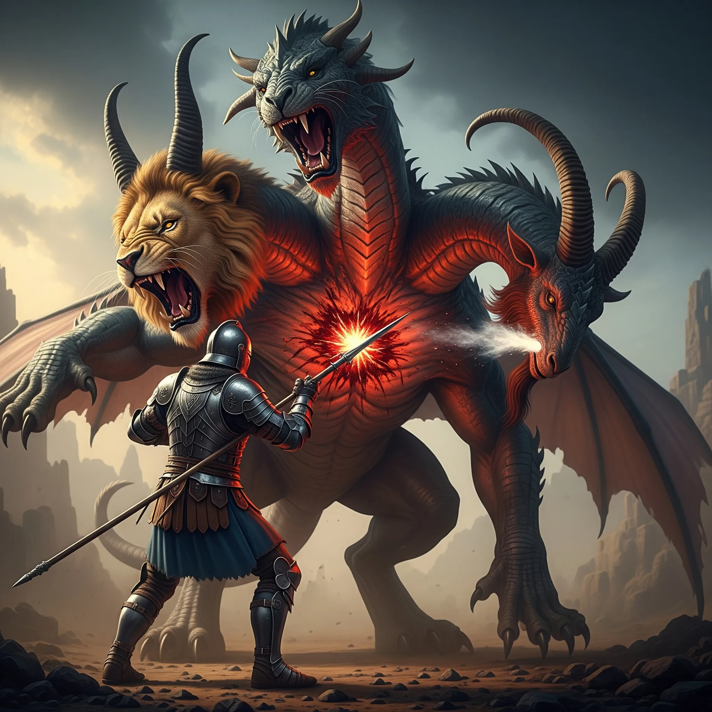

**Data:** 26.05.2025

## Podsumowanie

Pośród złowieszczej ciszy, jaka zaległa na plaży [[Wyspa Forlorn|Wyspy Forlorn]] po niedawnej, gwałtownej potyczce z płonącymi czaszkami, uszy bohaterów dosięgnął nowy, zagadkowy dźwięk. Z ruin dawnego miasteczka, majaczących w oddali niczym widmowe szkielety zapomnianej przeszłości, dobiegał czysty, kobiecy śpiew – melancholijna melodia, która zdawała się jednocześnie zapraszać i ostrzegać. Niosła w sobie obietnicę kolejnych zagadek i, być może, niebezpieczeństw czyhających na tej niegościnnej, przeklętej wyspie. Bohaterowie, choć poobijani i zmęczeni, wiedzieli, że muszą podążyć za tym zewem.

Powoli, z bronią w pogotowiu, drużyna zagłębiła się w opuszczone miasteczko. Kamienne budynki, zrujnowane i porośnięte dziką roślinnością, świadczyły o dawnej świetności, która przeminęła, pozostawiając jedynie echo minionych dni. Wydawało się, że nikt nie mieszkał tu od dziesięcioleci, a jednak pośród ruin kręciły się grupki zdziczałych, lecz nie całkiem dzikich zwierząt – gęsi dreptały z godnością, świnie ryły w ziemi, a krowy przeżuwały trawę, nie zwracając uwagi na przybyszów. Sam [[Pythor]], bóg bitwy towarzyszący herosom, zauważył z aprobatą, że można by tu uzupełnić zapasy dla załogi [[Ultros|Ultrosa]], co spotkałoby się z pewnością z entuzjazmem głodnych marynarzy. [[Orestes]], minotaur-barbarzyńca, którego serce zawsze radowało się na myśl o dobrym trunku i sytym posiłku, przez chwilę rozważał nawet zaproszenie części załogi na brzeg, by rozpoczęli polowanie, lecz roztropny [[Arevon Elorrenthi|Arevon]], elf-druid, powstrzymał go, sugerując, że zwierzęta te mogą należeć do kogoś, kto wciąż zamieszkuje wyspę. W międzyczasie, minotaur, być może chcąc dodać sobie animuszu lub po prostu umilić drogę, nastroił swoje dudy i zaczął wygrywać melodię, która, choć w jego mniemaniu zapewne wspaniała, spotkała się z mieszanymi reakcjami. Jedna z gęsi, być może krytyk muzyczny w poprzednim wcieleniu, podeszła i zaczęła dziobać go w nogę, wyrażając w ten sposób swoją dezaprobatę.

Śpiew prowadził ich coraz głębiej, aż wreszcie, w samym sercu miasteczka, ich oczom ukazała się świątynia – budowla najlepiej zachowana spośród wszystkich ruin, jakby nietknięta zębem czasu. To stamtąd dobiegała zagadkowa melodia. Gdy podeszli bliżej, śpiew umilkł, a z wnętrza świątyni wyszła postać. Była to młoda, urodziwa kobieta o lekko skośnych uszach, co sugerowało półelfie pochodzenie. Przedstawiła się jako [[Althaia]] i z lekkim zdziwieniem, a może i nutą niepokoju w głosie, zapytała przybyszów, co sprowadza ich na jej wyspę. [[Versir]], z wrodzoną sobie dyplomacją, odparł, iż przybyli w poszukiwaniu chwały, pragnąc zmierzyć się z legendarną Chimerą, o której słyszeli pogłoski. Zapytał również o los mieszkańców osady. [[Althaia]], z melancholią malującą się na twarzy, wyjaśniła, że mieszkańcy opuścili wyspę blisko pięćdziesiąt lat temu, uciekając przed bestią zamieszkującą górę. Ona jedna została, znajdując ukojenie w samotności i towarzystwie zwierząt. Świątynia, jak zauważył czujny [[Arevon Elorrenthi|Arevon]], poświęcona była [[Narsus|Narsusowi]], bogu piękna, czczonemu w Arezji. [[Felicjan Janus Twardowski|Felicjan]], człowiek-czarodziej, nie był jednak przekonany opowieścią [[Althaia|Althai]]; jej słowa brzmiały dla niego jak bajka, mająca na celu odstraszenie nieproszonych gości. Mimo to, [[Althaia]] zdawała się szczera, choć jej oczy kryły głęboki smutek. Zaprosiła bohaterów na kolację, a [[Orestes]], korzystając z okazji, poczęstował ją swoim piwem z dodatkiem soku, co spotkało się z jej aprobatą.

Drużyna, wciąż pełna podejrzeń, postanowiła zbadać okolicę, szczególnie doki, o których wspomniała [[Althaia]], mówiąc, że poprzedni goście odpłynęli stamtąd w pośpiechu. Wśród wielu zniszczonych wraków, jeden statek, noszący dumną nazwę "Ostatnia Nadzieja", wydawał się być w stosunkowo dobrym stanie, choć już nosił ślady zaniedbania. [[Arevon Elorrenthi|Arevon]], wraz z częścią drużyny, wszedł na pokład. W kabinie kapitana znaleźli mapę konstelacji, niepościeloną koję oraz skrzynkę zawierającą odzież i mieszek z niewielką ilością pieniędzy. Dziennika pokładowego jednak nie było. Najciekawszym znaleziskiem okazał się mały, brązowy amulet w kształcie ośmiornicy, który [[Felicjan Janus Twardowski|Felicjanowi]] natychmiast skojarzył się z Krakenem – legendarnym morskim potworem. W ładowni zaś, ku zdumieniu [[Orestes|Orestesa]], znajdowała się na wpół opróżniona beczka jego własnego piwa, choć trunek był już niestety zepsuty. Wszystko na statku wyglądało tak, jakby załoga opuściła go, z zamiarem szybkiego powrotu, lecz nigdy tego nie uczyniła.

Podejrzenia wobec [[Althaia|Althai]] rosły. [[Arevon Elorrenthi|Arevon]] snuł mroczne teorie: być może współpracowała z Chimerą, dostarczając jej ofiary; być może sama była Chimerą, przybierającą ludzką postać; a może była po prostu wiedźmą, polującą na nieostrożnych podróżników. [[Felicjan Janus Twardowski|Felicjan]] dorzucił jeszcze jedną, niepokojącą możliwość – [[Althaia]] mogła zamieniać ludzi w zwierzęta, które teraz swobodnie kręciły się po wyspie. [[Versir]], używając swych zmysłów, sprawdził świątynię, lecz nie wykrył w niej żadnej nieświętej obecności. Jednak gdy [[Felicjan Janus Twardowski|Felicjan]] rzucił czar wykrywający magię, skupiając go na [[Althaia|Althai]], jego magiczne zmysły zarejestrowały aurę iluzji otaczającą kobietę. To odkrycie utwierdziło ich w przekonaniu, że [[Althaia]] skrywa mroczną tajemnicę.

Postanowili jednak najpierw zmierzyć się z Chimerą. [[Althaia]], z uśmiechem, który teraz wydawał się podejrzanie słodki, życzyła im powodzenia, jednocześnie ostrzegając przed potęgą bestii. Droga na górę była stroma i zdradliwa. Im wyżej się wspinali, tym roślinność stawała się rzadsza i bardziej wysuszona. [[Arevon Elorrenthi|Arevon]] bacznie rozglądał się za śladami potwora. Wkrótce natknęli się na spłoszone stado kóz; jedna z nich miała wyraźnie przypalony tył, co było złowieszczym znakiem. Nieopodal znaleźli zniszczone gniazdo jakiegoś ogromnego, nienaturalnie wielkiego ptaka, a wokół niego porozrzucane kości – ptasie, krowie, a nawet ludzki piszczel. Wiele z nich było ponadgryzanych i przypalonych. [[Orestes]], ze swoim wyostrzonym węchem, wyczuł w powietrzu zapach świeżej krwi. Nagle, z góry dobiegł ich potężny ryk – bez wątpienia ryk lwa. Kontynuując wspinaczkę, znajdowali coraz więcej kości i pojedyncze, porozrzucane monety.

W końcu dotarli do wejścia jaskini, która zdawała się być legowiskiem Chimery. Wnętrze było mroczne i wilgotne, a w centralnej części znajdowało się nienaturalnie ukształtowane pomieszczenie z kolumnami. Gdy [[Arevon Elorrenthi|Arevon]] spojrzał w górę, jego serce zamarło – pod samym sufitem czaiła się ogromna Chimera, która w tej samej chwili rzuciła się na nich z furią.

Walka była brutalna i bezpardonowa. [[Orestes]], korzystając z mocy swej magicznej peleryny, wzbił się w powietrze i z barbarzyńskim okrzykiem rzucił się na bestię, zwalając ją na ziemię potężnym pchnięciem. Chimera jednak szybko otrząsnęła się z szoku, odpowiadając serią zaciekłych ataków – jej trzy głowy: lwia, kozia i smocza, kąsały i ziały, a ostre pazury rozdzierały powietrze. [[Orestes]], mimo swej siły, został ciężko ranny. [[Arevon Elorrenthi|Arevon]] wspierał towarzyszy, używając magicznych pnączy, by spętać potwora, podczas gdy [[Felicjan Janus Twardowski|Felicjan]] ciskał w niego niszczycielskimi kulami chromatycznej energii. [[Orion Xul|Orion]], niczym posąg wykuty z determinacji, stawił czoła bestii, jego włócznia raz po raz znajdowała drogę do jej cielsk. [[Versir]], lawirując między ciosami, leczył rany towarzyszy, przywracając im siły do dalszej walki. Chimera była jednak niezwykle wytrzymała i zdeterminowana. W pewnym momencie, jej ognisty oddech powalił [[Orestes|Orestesa]], który balansował na krawędzi śmierci. Jednak dzięki heroicznemu wysiłkowi [[Orion Xul|Oriona]], który z furią godną półboga rzucił się do ostatniego ataku, bestia w końcu padła martwa. Seria precyzyjnych ciosów włócznią, zakończona potężnym pchnięciem, które przebiło jej serce, położyła kres jej terrorowi. Lwia głowa ryknęła po raz ostatni, smocza zgasła niczym zdmuchnięty płomień, a kozia, z wywalonym językiem, beczała jeszcze przez chwilę, zanim i ona znieruchomiała.

Po ciężkiej walce, bohaterowie, choć wyczerpani, przystąpili do opatrywania ran i zbierania trofeów. Legowisko Chimery skrywało prawdziwy skarb – mnóstwo złota, drogocennych klejnotów i kunsztownej biżuterii, które z pewnością wzbogaciłyby ich sakwy.

Zmęczeni, ale usatysfakcjonowani zwycięstwem, postanowili odpocząć w jaskini. [[Felicjan Janus Twardowski|Felicjan]], przezornie, rzucił magiczny alarm u wejścia. Noc jednak nie przyniosła im ukojenia. Podczas ostatniej warty, którą pełnił [[Orestes]], wszyscy bohaterowie zapadli w dziwny, głęboki sen, jakby jakaś niewidzialna siła omamiła ich zmysły. Obudzili się gwałtownie, oszołomieni i zdezorientowani, znajdując się na zewnątrz jaskini, kompletnie nadzy. Ku swojemu przerażeniu odkryli, że zostali przemienieni w… gęsi! Mogli ze sobą rozmawiać, choć ich głosy przypominały teraz gęganie, a próby wzbicia się w powietrze kończyły się niezdarnym podskakiwaniem.

Wkrótce spotkali inną grupę gęsi. Jedna z nich, ku ich zdumieniu, przemówiła do nich ludzkim, choć gęgającym głosem. Był to [[Nersus|Kapitan Nersus]], ten sam, którego statek, "Ostatnia Nadzieja", badali wcześniej. Wyjaśnił, że on i jego załoga również padli ofiarą klątwy rzuconej przez [[Althaia|Althaię]] – wiedźmę, która pod postacią pięknej kobiety zwodziła nieostrożnych. Według Nersusa, jedynym sposobem na zdjęcie klątwy było zabicie wiedźmy. [[Arevon Elorrenthi|Arevon]] wpadł na szalony pomysł – skoro [[Orestes]] miał kilka żyć, może powinni go zabić, by sprawdzić, czy odrodzi się jako minotaur. [[Orestes]], co zrozumiałe, kategorycznie odmówił.

Zjednoczeni w swoim nieszczęściu i gęsiej postaci, bohaterowie, wraz z Nersusem i jego załogą, ruszyli w stronę miasteczka, by stawić czoła [[Althaia|Althai]]. Zastali ją płaczącą przed świątynią. W tym samym czasie, w miasteczku pojawili się podejrzani osobnicy, odziani w czerń i noszący maski – jak się wkrótce okazało, ludzie [[Taran Neurdagon|Tarana Neurdagona]], bogatego kupca z Mytros. Przeszukiwali ruiny, jakby czegoś szukali. [[Felicjan Janus Twardowski|Felicjan]], wykazując się niezwykłą jak na gęś inteligencją, napisał dziobem na ziemi "Wiedźma Klątwa", a następnie "Pomocy". Ludzie Tarana zauważyli napisy i podeszli do stada gęsi. Potwierdzili, że [[Althaia]] jest potworem skrywającym się pod iluzją i że jej zabicie powinno zdjąć klątwę. Zaproponowali układ: gęsi odwrócą uwagę wiedźmy, a oni zaatakują ją od tyłu.

Plan został wprowadzony w życie. Gęsi, z bohaterami na czele, ruszyły w stronę [[Althaia|Althai]]. Ta, zaskoczona ich natarczywością, zaczęła je odganiać, mamrocząc coś o gościach, którzy ją porzucili. [[Felicjan Janus Twardowski|Felicjanowi]] i [[Orestes|Orestesowi]] udało się wślizgnąć do wnętrza świątyni, gdzie znaleźli duże, zasłonięte materiałem lustro, posłanie i kilka dziecinnych zabawek. Wtem, jeden z ludzi Tarana podbiegł do [[Althaia|Althai]] i dotknął ją dziwnym kamieniem. Iluzja pryskła, ukazując jej prawdziwą postać – kobietę, której włosy składały się z dziesiątek małych, gęgających gęsich głów. [[Althaia]], a raczej Gęguza, jak ją teraz można było nazwać, wydała z siebie przeraźliwy krzyk. Rozpoczęła się kolejna, choć zgoła inna, walka. Gęsi, mimo swych niewielkich rozmiarów, rzuciły się na Gęguzę z zaskakującą furią. [[Orestes]], jako gęś, użył swojego "Dziobiącego Gęgnięcia", wprawiając Gęguze w przerażenie. Ludzie Tarana atakowali ją bronią. Sama Gęguza również nie była bezbronna – jej gęsie włosy rzucały czary, a ona sama ciskała przekleństwa na swoich wrogów, w tym na Tarana i [[Lutheria|Lutherię]]. W chaosie bitwy, [[Arevon Elorrenthi|Arevon]] i jedna z gęsi padli ofiarą magicznego snu. Ostatecznie jednak, połączone siły gęsi i ludzi Tarana pokonały [[Althaia|Althaię]]. Padła martwa na ziemię.

Jednak ku rozczarowaniu wszystkich, klątwa nie zniknęła natychmiast. Bohaterowie wciąż byli gęśmi. [[Arevon Elorrenthi|Arevon]] ocknął się ze snu. Ludzie Tarana, niewiele myśląc, odcięli głowę Gęguzy i, nie interesując się resztą, opuścili wyspę. [[Versir|Versirowi]] udało się jednak ukradkiem wyjąć list z kieszeni jednego z nich. Był to list od Tarana, adresowany do jego ludzi, zawierający instrukcje dotyczące [[Althaia|Althai]]. Taran chciał pozyskać jej głowę. W tym momencie, pojawił się [[Pythor]] w swojej normalnej postaci, a po chwili [[Kyrah]] odmieniła się, ujawniając, że mogła to zrobić w każdym momencie. Dwójka bogów pomogła drużynie przeszukać świątynię. W skrzyni, którą siłą otworzył [[Pythor]], znaleźli klucz, trochę złota oraz mały portret przedstawiający młodego mężczyznę i kobietę, którzy wyglądali na szczęśliwych – prawdopodobnie rodziców [[Althaia|Althai]]. Klucz pasował do drzwi prowadzących do piwnicy. Tam, wśród starych beczek i skrzyń, odnaleźli pamiętnik [[Althaia|Althai]] oraz małe, drewniane pudełko.

Pamiętnik rzucił nowe światło na tragiczną historię wyspy. [[Althaia]] opisywała w nim swoje przybycie na wyspę wraz z ojcem, rodzącą się miłość do Kyrosa, syna miejscowego rolnika, a następnie pojawienie się [[Taran Neurdagon|Tarana Neurdagona]]. Taran, potomek [[Smoczy Lordowie|Smoczych Lordów]], był zafascynowany [[Althaia|Althaią]] i publicznie ogłosił, że zostanie jego żoną. Gdy odrzuciła jego zaloty, wpadł w furię. W przypływie złości, [[Althaia]] krzyknęła, że wolałaby spędzić życie z jedną z gęsi Kyrosa niż z nim. To właśnie te słowa, wypowiedziane w gniewie, stały się przyczyną jej nieszczęścia. Ostatnie wpisy były chaotyczne, pełne rozpaczy i samotności. W drewnianym pudełku znajdował złoty symbol [[Lutheria|Lutherii]].

W ciągu następnych godzin, klątwa zaczęła stopniowo ustępować. Bohaterowie, jeden po drugim, wracali do swoich prawdziwych postaci. [[Arevon Elorrenthi|Arevon]], korzystając z odzyskanych mocy druidzkich, przemienił się w gigantycznego orła i poleciał na górę, by odzyskać ich porzucony ekwipunek. Po tych wszystkich traumatycznych, a zarazem nieco komicznych przeżyciach, bohaterowie stanęli przed kolejnym wyborem: czy skierować [[Ultros|Ultrosa]] w stronę ostatniej niezbadanej konstelacji na mapie, czy też przygotować się do konfrontacji z [[Zakon Sydona|Zakonem Sydona]] na [[Wyspa Yonder|Wyspie Yonder]]. [[Wyspa Forlorn]], zwana też Wyspą Chimery, a teraz miejsce Wielkiego Powstania Gęsi, na zawsze pozostanie w ich pamięci jako świadectwo mrocznych knowań, złamanych serc i niezwykłej odporności ducha, nawet w najbardziej pierzastej postaci.

## Kluczowe wydarzenia / decyzje

* Odkrycie opuszczonego miasteczka na [[Wyspa Forlorn|Wyspie Forlorn]] i spotkanie z tajemniczą półelfką [[Althaia|Althaią]].
* Zbadanie wraku statku "Ostatnia Nadzieja", znalezienie amuletu Krakena i odkrycie, że [[Althaia]] jest otoczona iluzją.
* Drużyna wspina się na górę, pokonuje potężną Chimerę w jej legowisku i zdobywa jej skarb.
* Bohaterowie padają ofiarą klątwy [[Althaia|Althai]], zostają przemienieni w gęsi i spotykają innych zaklętych, w tym kapitana [[Nersus|Nersusa]].
* Sojusz z ludźmi [[Taran Neurdagon|Tarana Neurdagona]], konfrontacja z prawdziwą, potworną postacią [[Althaia|Althai]] (Gęguzą) i jej pokonanie.
* Odnalezienie pamiętnika [[Althaia|Althai]], który ujawnia jej tragiczną historię, miłość do Kyrosa i klątwę spowodowaną najprawdopodobniej przez mściwego [[Taran Neurdagon|Tarana Neurdagona]].

## Postacie Niezależne (NPC)

* [[Althaia]] / Gęguza
* [[Pythor]]
* [[Kyrah]]
* [[Kapitan Nersus]]
* Ludzie [[Taran Neurdagon|Tarana Neurdagona]]

## Lokacje

* [[Wyspa Forlorn]]
* Samotna Góra

## Przedmioty

* Amulet w kształcie ośmiornicy (Kraken)
* Skarb Chimery (złoto, klejnoty, biżuteria)
* List od [[Taran Neurdagon|Tarana Neurdagona]] do jego ludzi
* Pamiętnik [[Althaia|Althai]]
