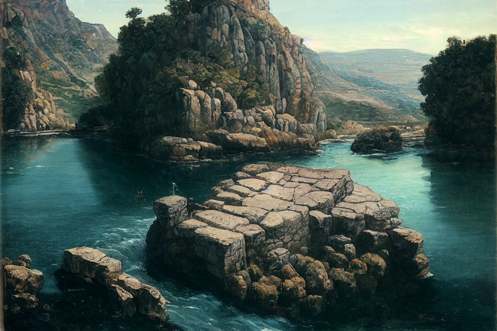

# Sesja 5: Skała Estora

**Data:** 12.02.2024

## Podsumowanie

W tej sesji poznaliście historię przybycia [[Smoczy Lordowie|Smoczych Lordów]] do [[Thylea|Thylei]] i ich wpływu na losy wyspy. Odwiedziliście [[Karczma Smoczy Ząb|tawernę "Smoczy Ząb"]] w [[Estoria|Estorii]], gdzie zebraliście informacje o aktualnych wydarzeniach, w tym o kontrowersyjnym [[Zakon Sydona|Zakonem Sydona]] i planowanej ofierze z córki [[Pythor|Pythora]]. Byliście świadkami przybycia srebrnego smoka [[Argyn|Argyna]] z jeźdźcem, [[Gaius|Commanderem Gaiusem]]. Podjęliście decyzję o uratowaniu córki [[Pythor|Pythora]], [[Anora|Anory]], i rozpoczęliście przygotowania do walki z [[Bazyliszki|bazyliszkiem]].

## Kluczowe wydarzenia / decyzje

* Poznanie legendy o przybyciu [[Smoczy Lordowie|Smoczych Lordów]] do [[Thylea|Thylei]].
* Wizyta w [[Karczma Smoczy Ząb|tawernie "Smoczy Ząb"]] i zebranie informacji.
* Przybycie srebrnego smoka [[Argyn|Argyna]] z [[Gaius|Commanderem Gaiusem]].
* Decyzja o uratowaniu [[Anora|Anory]], córki [[Pythor|Pythora]].
* Przygotowania do walki z [[Bazyliszki|bazyliszkiem]].

## Postacie Niezależne (NPC)

* [[Aesop]]
* [[Delphion]]
* [[Lyssis Arkelander]]
* [[Anora]]
* [[Gaius|Commander Gaius]]
* [[Argyn]] (srebrny smok)
* [[Pythor]]

## Lokacje

* [[Estoria]]
* [[Karczma Smoczy Ząb|Tawerna "Smoczy Ząb"]]
* [[Skała Estora]]
* [[Gniazdo Bazyliszków]]

## Szczegółowy opis wydarzeń

Podczas sesji poznaliście historię [[Thylea|Thylei]] i wydarzeń, które doprowadziły do przybycia [[Smoczy Lordowie|Smoczych Lordów]]. Dowiedzieliście się o ich wpływie na losy wyspy i konflikcie między rdzennymi rasami a cywilizowanymi przybyszami. 

Następnie udaliście się do [[Estoria|Estorii]], gdzie odwiedziliście [[Karczma Smoczy Ząb|tawernę "Smoczy Ząb"]]. Tam zebraliście informacje o aktualnych wydarzeniach, w tym o [[Zakon Sydona|Zakonie Sydona]], który domaga się zniszczenia [[Świątynia Pięciu|świątyni Pięciu]], oraz o planowanej ofierze z córki [[Pythor|Pythora]].

Przy [[Skała Estora|skale Estora]] byliście świadkami przybycia srebrnego smoka [[Argyn|Argyna]] z jeźdźcem, [[Gaius|Commanderem Gaiusem]]. Dowiedzieliście się o planowanej ofierze z [[Anora|Anory]], córki [[Pythor|Pythora]]. Postanowiliście ją uratować i rozpoczęliście przygotowania do walki z [[Bazyliszki|bazyliszkiem]], który strzeże wejścia do jaskini.
