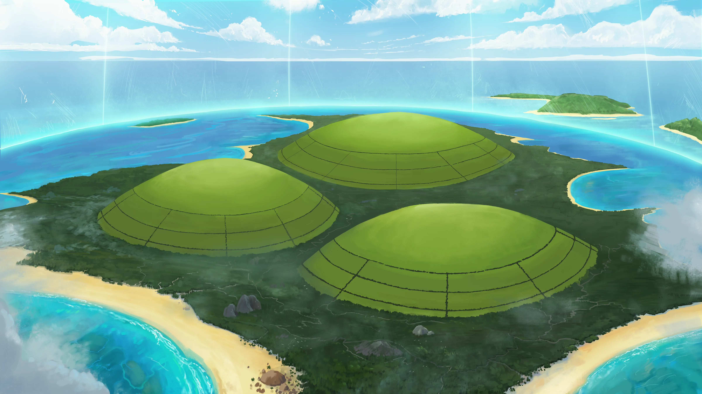
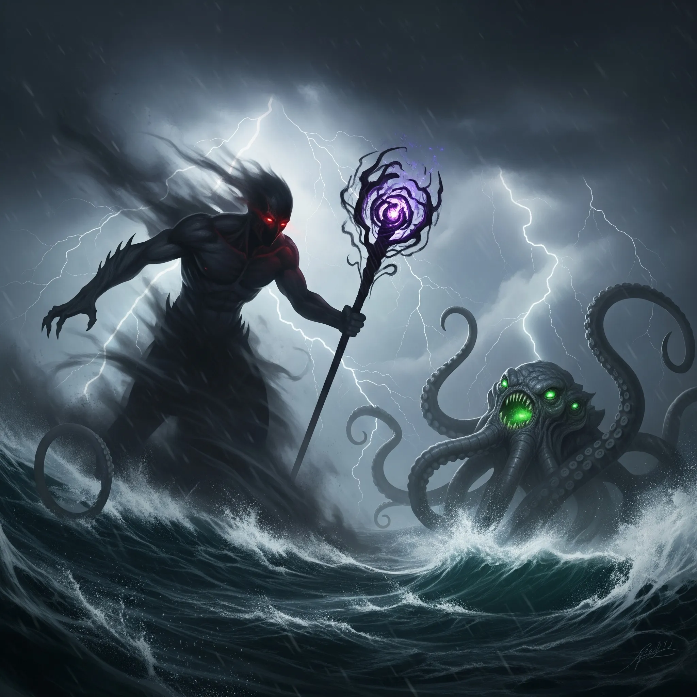
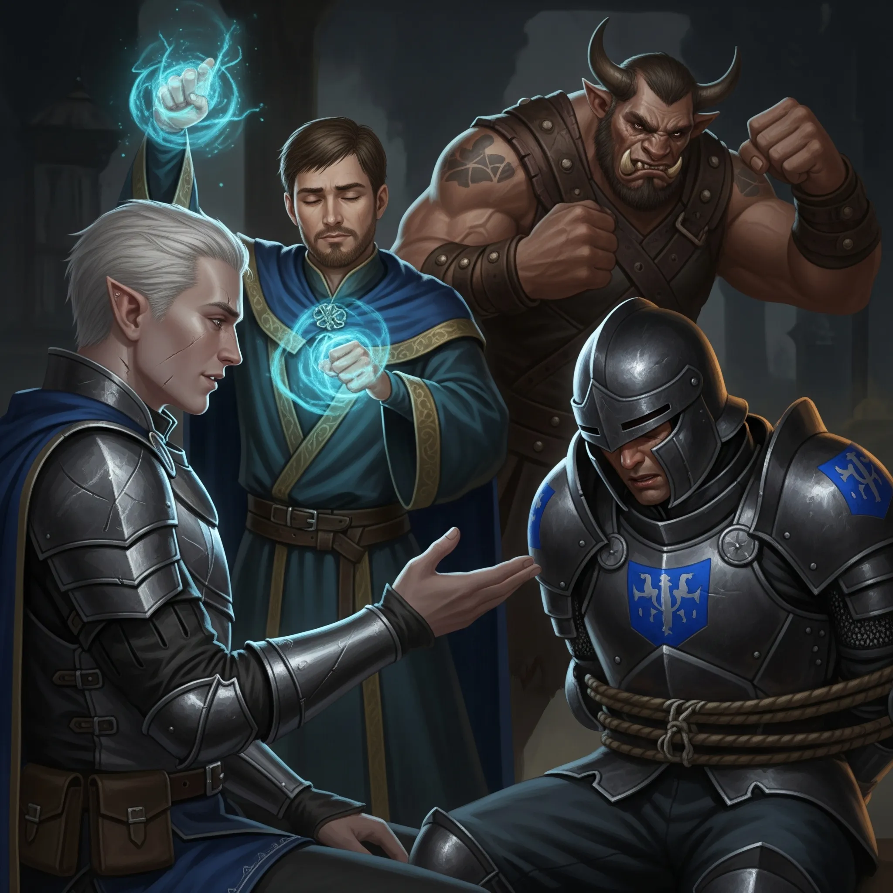
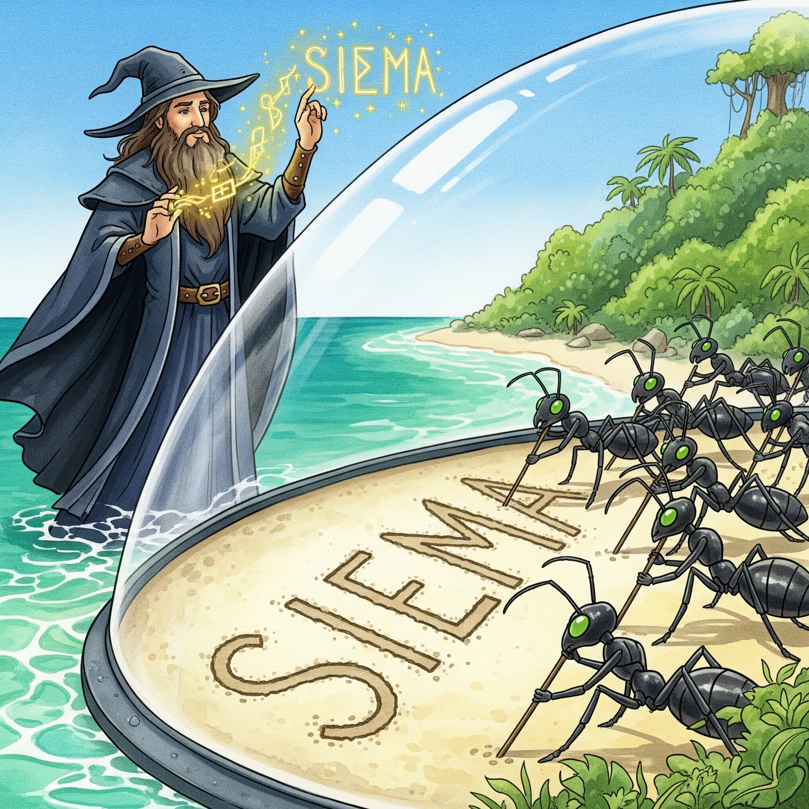
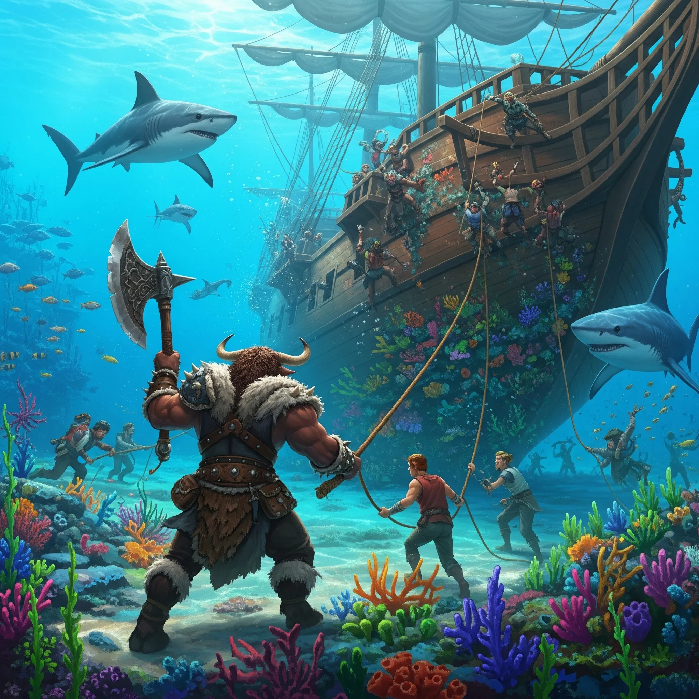

**Data:** 09.06.2025

## Podsumowanie

Pośród morskiej bryzy, która zdawała się zmywać z pokładu [[Ultros|Ultrosa]] wspomnienie niedawnych, gęsich perypetii na [[Wyspa Forlorn|Wyspie Forlorn]], bohaterowie przepowiedni obrali kurs ku nowej, niezbadanej konstelacji, ochrzczonej mianem Mrówki. Niepewność malowała się na ich twarzach niczym mgła nad porannym morzem, lecz w sercach tliła się iskierka nadziei na odkrycie kolejnych fragmentów układanki ich przeznaczenia. Podróż zapowiadała się na tyle długa, by każdy mógł oddać się swoim zajęciom – [[Arevon Elorrenthi|Arevon]], elf druid o przenikliwym spojrzeniu, planował wykorzystać ten czas na warzenie uzdrawiających mikstur, podczas gdy [[Felicjan Janus Twardowski|Felicjan]], zamierzał poświęcić się żmudnemu, lecz niezbędnemu zadaniu przepisywania magicznych zwojów, których moc mogła okazać się kluczowa w nadchodzących wyzwaniach.

Pierwsze dni żeglugi upłynęły pod znakiem względnego spokoju. Młody smok [[Kairos]], którego [[Felicjan Janus Twardowski|Felicjan]] przyjął pod swe skrzydła, rozwijał się w zdumiewającym tempie, okazując się być stworzeniem mniej absorbującym niż jego poprzednik, choć równie nienasyconym, gdy przychodziło do posiłków. Jego żarłoczność była jednak pozbawiona tej irytującej natarczywości, która charakteryzowała większego gada; nie wyrywał już kanapek z rąk, co załoga przyjęła z niemałą ulgą. Jednakże idylla nie mogła trwać wiecznie. Drugiego dnia podróży niebo zasnuły ciężkie, ołowiane chmury, a morze, dotąd łagodne, zaczęło marszczyć się gniewnie. Wkrótce rozpętała się gwałtowna burza, a [[Ultros]], miotany falami niczym łupina orzecha, dzielnie stawiał czoła żywiołowi pod pewną ręką kapitana [[Arevon Elorrenthi|Arevona]] i czujnym okiem jego nawigatorów.

W samym sercu nawałnicy, gdy błyskawice rozdzierały mrok niczym płomienne szpony niebiańskiej bestii, a grzmoty wstrząsały posadami świata, oczom bohaterów ukazał się widok mrożący krew w żyłach. Dwa tytaniczne byty toczyły śmiertelny bój pośród wzburzonych fal. Z jednej strony wznosił się [[Goloron]], syn [[Sydon|Sydona]] i [[Lutheria|Lutherii]], postać emanująca złowrogą, nekromantyczną energią, dzierżący plugawą laskę i znikający w kłębach mroku, by po chwili pojawić się w innym miejscu. Z drugiej zaś, z odmętów wynurzał się legendarny [[Kraken]], morski potwór o mackach zdolnych kruszyć statki, plujący toksycznym atramentem i przywołujący własne, morskie pioruny. Starcie było zaiste epickie – [[Goloron]] ciskał mroczne zaklęcia, podczas gdy [[Kraken]] próbował pochwycić go w swe śmiercionośne objęcia. Bohaterowie, świadomi potęgi walczących istot, przez chwilę obserwowali zmagania, rozważając nawet absurdalny pomysł [[Orestes|Orestesa]], by „przypadkowo” trafić [[Goloron|Golorona]] strzałem z balisty, celując w [[Kraken|Krakena]]. Ostatecznie jednak, gdy [[Goloron]], unikając kolejnego ataku, wzbił się w powietrze i odleciał, a [[Kraken]] zanurzył się w otchłani, rozsądek wziął górę. Drużyna postanowiła czym prędzej oddalić się od tego przeklętego miejsca.

Gdy burza w końcu ucichła, a słońce nieśmiało wyjrzało zza chmur, podróż kontynuowano. Jednak nie na długo zapanował spokój. Kolejnego dnia na horyzoncie zamajaczył niewielki statek, dumnie prezentujący banderę [[Sydon|Sydona]]. Ku zdumieniu bohaterów, jednostka była atakowana przez dwie syreny, których śpiew niósł się po falach, mieszając z krzykami załogi. Z pokładu statku [[Sydon|Sydona]] dobiegały rozpaczliwe wołania o pomoc, lecz syreny, unosząc się nad masztami niczym mściwe duchy, krzyczały, iż ludzie ci są mordercami, którzy wyrżnęli ich klan. Stanąwszy przed tym dylematem, bohaterowie, po krótkiej naradzie, podjęli decyzję o interwencji, skłaniając się ku abordażowi statku Zakonu.

Manewr przebiegł sprawnie, a zaskoczeni żołnierze [[Sydon|Sydona]], widząc potęgę [[Ultros|Ultrosa]] i zdeterminowane oblicza jego załogi, szybko złożyli broń. Jedynie jeden z nich, być może zbyt gorliwy lub zbyt przerażony, próbował stawiać opór, co zakończyło się dla niego tragicznie. Pozostałych pojmano. Syreny, lądując na pokładzie [[Ultros|Ultrosa]], zażądały wydania im jeńców, lecz [[Versir]] z dyplomatycznym zacięciem wynegocjował odroczenie wyroku do czasu przesłuchania więźniów, obiecując, że sprawiedliwości stanie się zadość. Przeszukanie zdobytego statku przyniosło pewne korzyści: znaleziono zapasy, mapę z zaznaczonymi tajnymi szlakami morskimi, którymi [[Sydon]] przemieszcza wyspy – informacja potencjalnie bezcenna – oraz rozkazy patrolowe.

Przesłuchanie żołnierzy [[Sydon|Sydona]], prowadzone głównie przez [[Versir|Versira]], przy subtelnym wsparciu [[Felicjan Janus Twardowski|Felicjana]], który swym magicznym darem zaglądał w ich myśli, oraz mniej subtelnym [[Orestes|Orestesa]], którego sama postura i groźne pomruki potrafiły skruszyć najtwardszych, dostarczyło wielu cennych informacji na temat [[Wyspa Yonder|Wyspy Yonder]]. Dowiedzieli się o potężnych siłach obronnych. Potwierdzili, że głównym dowódcą jest [[Gaius]], który często przebywa na wyspie wraz ze swoją smoczycą, [[Argyn]]. Poznali strukturę dowodzenia w jednym z obozów, którym kierował oficer [[Elasus]], oraz systemy komunikacji – race alarmowe i magiczne połączenia między magami. Straże zmieniały się co osiem godzin, a powszechnym powitaniem było „Chwała [[Sydon|Sydonowi]]”. Flota Yonder liczyła ponad dwadzieścia statków. Sama świątynia i nieodległa biblioteka były silnie strzeżone – przez kilkudziesięciu żołnierzy, kilku [[Gyganie|gyganów]], a czasami nawet przez smoka. Najbardziej niepokojące były jednak informacje o ruchomych statuach – golemach, których głowy zastąpiono klatkami z harpiami, mającymi za zadanie wabić intruzów swym śpiewem. W bibliotece, według jeńców, przebywali głównie uczeni, a sam [[Hergeron]], gdy odwiedzał wyspę, miał tam swoją sypialnię. Kluczową informacją, szczególnie dla [[Arevon Elorrenthi|Arevona]], było potwierdzenie, że kapitan [[Tars d’Lyrandar|Tars]], jego dawny znajomy, został schwytany i prawdopodobnie był więziony gdzieś w czeluściach świątyni. Zapytani o zniszczenie wioski syren, żołnierze bez mrugnięcia okiem odparli, że była ona zbyt blisko [[Wyspa Yonder|Yonder]] i stanowiła zagrożenie wywiadowcze, a oni jedynie wykonywali rozkazy.

Po zakończeniu przesłuchania, zgodnie z obietnicą, jeńcy zostali wydani syrenom. Te, nie zwlekając, dokonały brutalnej egzekucji, wrzucając przerażonych żołnierzy do morza, gdzie dokończyły dzieła swymi ostrymi pazurami. Widok ten wywołał mieszane uczucia wśród załogi [[Ultros|Ultrosa]] – dla jednych była to sprawiedliwość, dla innych niepotrzebne okrucieństwo. Syreny, usatysfakcjonowane, skinęły głowami [[Versir|Versirowi]] i odleciały.

Podróż trwała dalej, aż pewnego dnia morze stało się nienaturalnie spokojne. Woda była gładka jak lustro, w powietrzu panowała absolutna cisza, nie było słychać śpiewu ptaków ani plusku ryb. Ten niepokojący spokój zwiastował coś niezwykłego. Wkrótce ich oczom ukazała się ogromna, przezroczysta sfera, delikatnie załamująca światło, a w jej wnętrzu majaczyła [[Wyspa Myrmeków]] z trzema idealnie równymi, niemal identycznymi wzgórzami. [[Arevon Elorrenthi|Arevon]], przeczuwając niezwykłość tego miejsca, rozpoczął badanie bariery. Jego kruk odbił się od niej z góry, a przyzwany łosoś – od dołu. [[Orestes]], dotykając sfery, poczuł jedynie zimną, nieprzenikalną powierzchnię. Spojrzenie przez lunetę ukazało egzotyczną, bujną roślinność, drzewa uginające się pod ciężarem dziwnych owoców, lecz żadnych śladów rozumnych istot. [[Felicjan Janus Twardowski|Felicjan]], używając swej magicznej wiedzy, stwierdził, że sfera wydaje się cienka. Rozpoczęły się gorączkowe dyskusje na temat możliwości przeniknięcia bariery za pomocą teleportacji – Misty Step, Vortex Warp czy Dimension Door – oraz czy nie naruszy to delikatnej równowagi tego miejsca.

Nagle, jakby w odpowiedzi na ich obecność, na wyspie pojawiły się postacie. Były to istoty przypominające mrówki, maszerujące w idealnie równych szeregach. Zaczęły zbierać owoce z drzew. Gdy [[Orestes]], w geście przyjaznym, pomachał do nich, wszystkie mrówkopodobne istoty ([[Myrmeki]]), jak jeden mąż, odwróciły się i również mu odmachnęły. [[Felicjan Janus Twardowski|Felicjan]], chcąc nawiązać kontakt, napisał na piasku w języku Sylvan: "Witajcie". Po chwili [[Myrmeki|mrówki]], używając patyków, ułożyły identyczny napis. Gdy [[Felicjan Janus Twardowski|Felicjan]] zapytał: "Kim jesteście?", odpowiedziały tym samym pytaniem. Następnie, w geście gościnności, zaczęły układać na plaży zebrane owoce, jakby oferując je przybyszom w darze.

Tajemniczość wyspy i jej mieszkańców wzbudziła w bohaterach zarówno ciekawość, jak i niepokój. [[Felicjan Janus Twardowski|Felicjan]] zaproponował, by [[Versir|Versi]] użyła swych proroczych zdolności. Pytanie brzmiało: "Czy teleportując się na tę wyspę w pokojowych zamiarach, spotka nas lub naszych bliskich jakaś krzywda?". Odpowiedź, która spłynęła na [[Versir|Versi]], była niejednoznaczna: ujrzała światło, ale także burzę zbierającą sie na horyzoncie. Sugerowało to, że bezpośrednio po przybyciu nic złego się nie stanie, ale w dalszej perspektywie mogły czekać ich poważne kłopoty. [[Felicjan Janus Twardowski|Felicjan]], chcąc dowiedzieć się więcej o samej barierze, użył czaru Identify. Potwierdziło się, że jest to dzieło "Starej Magii", niezwykle potężnej, i że teleportacja rzeczywiście powinna umożliwić jej przekroczenie.

Mimo pokusy zbadania wyspy, szczególnie dla [[Orestes|Orestesa]], którego kusiły egzotyczne owoce mogące posłużyć do warzenia nowego rodzaju piwa, drużyna, kierując się ostrożnością i niepokojącą przepowiednią, postanowiła opuścić to miejsce. Mieszkańcy wyspy, odprowadzili ich wzrokiem, machając na pożegnanie w ten sam zsynchronizowany sposób.

[[Ultros]] ponownie ruszył w drogę, lecz aby [[Arevon Elorrenthi|Arevon]] mógł precyzyjnie wyznaczyć kurs za pomocą swego magicznego kompasu, musieli przybić do lądu. Znaleźli niewielką, pozornie bezludną wysepkę, na której jedynym śladem cywilizacji był napis wyryty na palmie: "Franek tu był 234" – detal, który wywołał uśmiech na twarzach bohaterów. Po wyznaczeniu kursu na [[Wyspa Yonder|Wyspę Yonder]], zmęczeni podróżą, zasnęli. Sen, który ich nawiedził, był jednak niepokojący. Wielu członków załogi, a także część bohaterów – śniło o [[Wyspa Myrmeków|wyspie Myrmeków]], które zdawały się ich zapraszać. W snach bohaterowie znajdowali tam przedmioty których pragneli.

Spokój został brutalnie przerwany, gdy [[Ultros]] z impetem wpłynął na zdradziecką rafę koralową. Wina mogła leżeć po stronie rozkojarzonego [[Orestes|Orestesa]] grającego na dudach lub [[Versir|Versira]], który na chwilę przejął ster. Rozpoczęła się żmudna akcja uwalniania statku. [[Orestes]], jako pierwszy, skoczył do wody, by ocenić sytuację. Wkrótce dołączyli do niego inni. Ich wysiłki próbowały zakłócić dwa rekiny, które jednak szybko zostały odpędzone przez zdeterminowanych bohaterów. Po ponad godzinie ciężkiej pracy, ciągnięcia lin i usuwania fragmentów rafy, potężny [[Ultros]] w końcu odzyskał wolność, choć jego kadłub nosił ślady nieprzyjemnego spotkania.

Po tych wszystkich perypetiach, drużyna w końcu mogła skupić się na głównym celu – desancie na [[Wyspa Yonder|Wyspę Yonder]]. Rozpoczęła się długa i burzliwa narada, podczas której ścierały się różne strategie i pomysły. Główne cele były cztery: zdobycie planów magicznego kompasu z biblioteki, pozyskanie potężnej zbroi [[Gaius|Gaiusa]] (co wiązało się z konfrontacją z nim), uwolnienie kapitana [[Tars d’Lyrandar|Tarsa]] z więzienia w świątyni oraz zebranie cennych informacji i artefaktów z biblioteki. Rozważano różne podejścia: od szalonego pomysłu Konia Trojańskiego (w formie wielkiej statuy [[Sydon|Sydona]] z bohaterami ukrytymi wewnątrz), przez podszywanie się pod żołnierzy lub zaginionych artystów, aż po frontalny atak na jeden z obozów – ten ostatni szybko odrzucono jako nierealny dla tak małej grupy. Kluczowe miało być wykorzystanie magii: niewidzialności, polimorfii do cichej infiltracji oraz teleportacji do ewentualnej ucieczki. Największe obawy budził smok [[Gaius|Gaiusa]] patrolujący wyspę, groźne golemy i harpie strzegące świątyni oraz ogólna przewaga liczebna wrogich żołnierzy. Trudnością mogła być również sama wspinaczka na strome wzgórze świątynne.

Ostatecznie wykrystalizował się wstępny plan. Zakładał on, że [[Ultros]] pozostanie w bezpiecznej odległości od wyspy, podczas gdy bohaterowie, korzystając z mniejszej łodzi, podpłyną jak najbliżej brzegu, a resztę dystansu pokonają wpław, wykorzystując magiczne zdolności oddychania pod wodą. Następnie mieli przedostać się w górzyste rejony wyspy, skąd przeprowadzić dokładny zwiad za pomocą familiarów. Dopiero na podstawie zebranych informacji mieli podjąć ostateczne decyzje dotyczące sposobu infiltracji świątyni i realizacji poszczególnych celów. Kwestia wspinaczki wydawała się mniej problematyczna, biorąc pod uwagę obecność w drużynie postaci potrafiących latać lub zmieniać kształt.

Sesja zakończyła się na tym etapie planowania. Napięcie rosło, a bohaterowie, pełni obaw, ale i determinacji, przygotowywali się na jedno z najtrudniejszych wyzwań w swojej dotychczasowej podróży.

## Kluczowe wydarzenia / decyzje

* Obserwacja tytanicznej walki [[Goloron|Golorona]], syna [[Sydon|Sydona]] i [[Lutheria|Lutherii]], z [[Kraken|Krakenem]] podczas gwałtownej morskiej nawałnicy.
* Zwycięski abordaż statku [[Zakon Sydona|Zakonu Sydona]], pojmanie żołnierzy i zdobycie mapy tajnych szlaków morskich.
* Przesłuchanie jeńców [[Zakon Sydona|Zakonu Sydona]], ujawniające kluczowe informacje o obronie [[Wyspa Yonder|Wyspy Yonder]], losie kapitana [[Tars d’Lyrandar|Tarsa]] i działaniach [[Gaius|Gaiusa]].
* Odkrycie tajemniczej wyspy ([[Wyspa Myrmeków]]), chronionej magiczną sferą i zamieszkanej przez [[Myrmeki|Myrmeków]].
* Szczegółowe planowanie desantu na [[Wyspa Yonder|Wyspę Yonder]], mającego na celu infiltrację świątyni, biblioteki, uwolnienie więźniów i zdobycie artefaktów.

## Postacie Niezależne (NPC)

* [[Goloron]]: Tytan (syn [[Sydon|Sydona]] i [[Lutheria|Lutherii]])
* [[Kraken]]: Legendarny morski potwór
* Żołnierze [[Sydon|Sydona]]: Słudzy boga mórz, wrogowie (pojmali, przesłuchani, a następnie wydani syrenom).
* [[Syrena z Thylei|Syreny]]: Mściwe mieszkanki morza (zaatakowały statek [[Sydon|Sydona]], negocjowały z bohaterami, dokonały egzekucji jeńców).
* [[Myrmeki]]: Mrówkopodobni, inteligentni mieszkańcy tajemniczej wyspy.
* [[Gaius]], [[Argyn]], [[Elasus]], [[Hergeron]]: Wspomniani (informacje wywiadowcze).

## Lokacje

* [[Ultros|Statek Ultros]]: Główna baza operacyjna bohaterów na morzu.
* [[Wyspa Myrmeków]]: Tajemnicza wyspa otoczona magiczną sferą, zamieszkana przez [[Myrmeki|Myrmeków]].
* Bezimienna wysepka: Miejsce krótkiego postoju z napisem "Franek tu był 234".
* [[Wyspa Yonder]]

## Przedmioty

* Mapa z tajnymi szlakami morskimi Sydona
* Rozkazy patrolowe [[Zakon Sydona|Zakonu Sydona]]
* Magiczna proca
* Moonsickle +2
