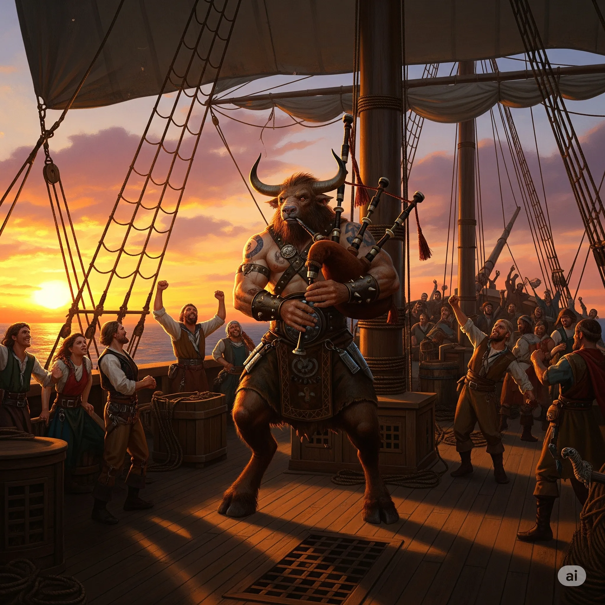
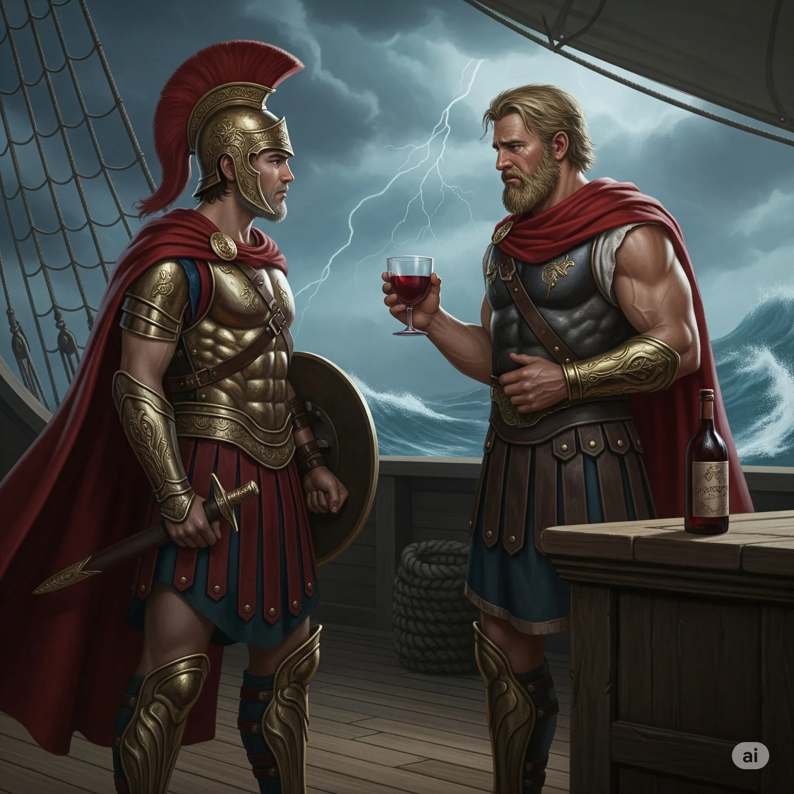
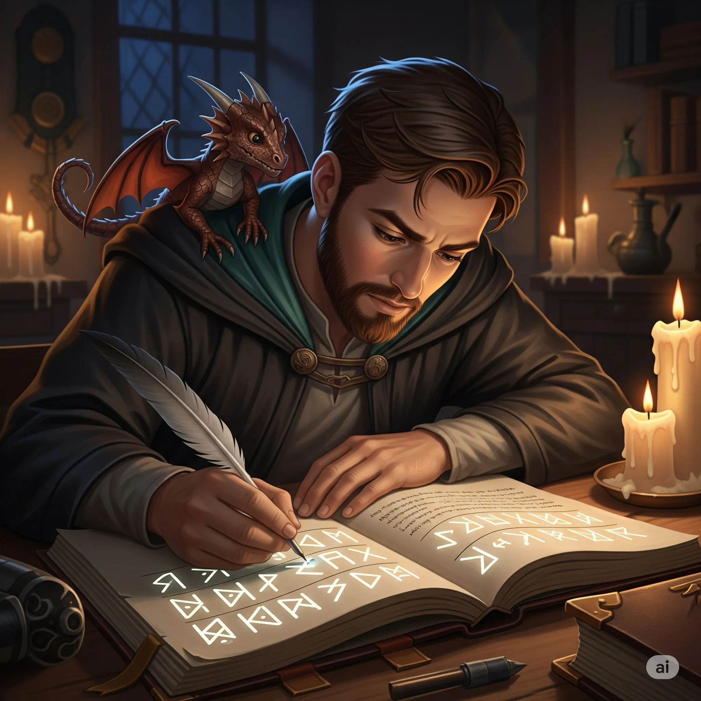
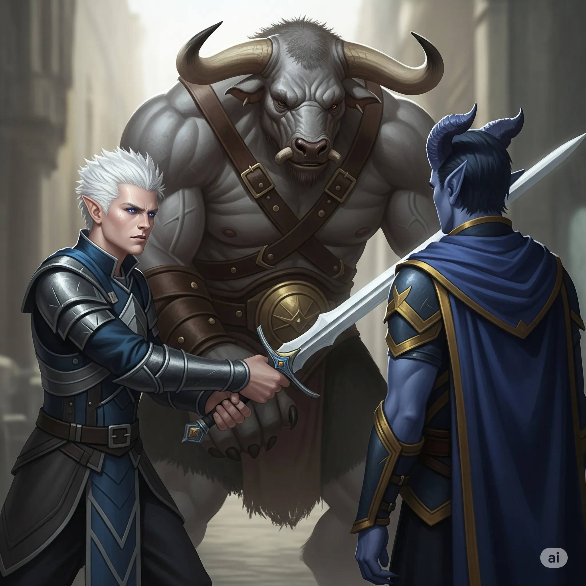
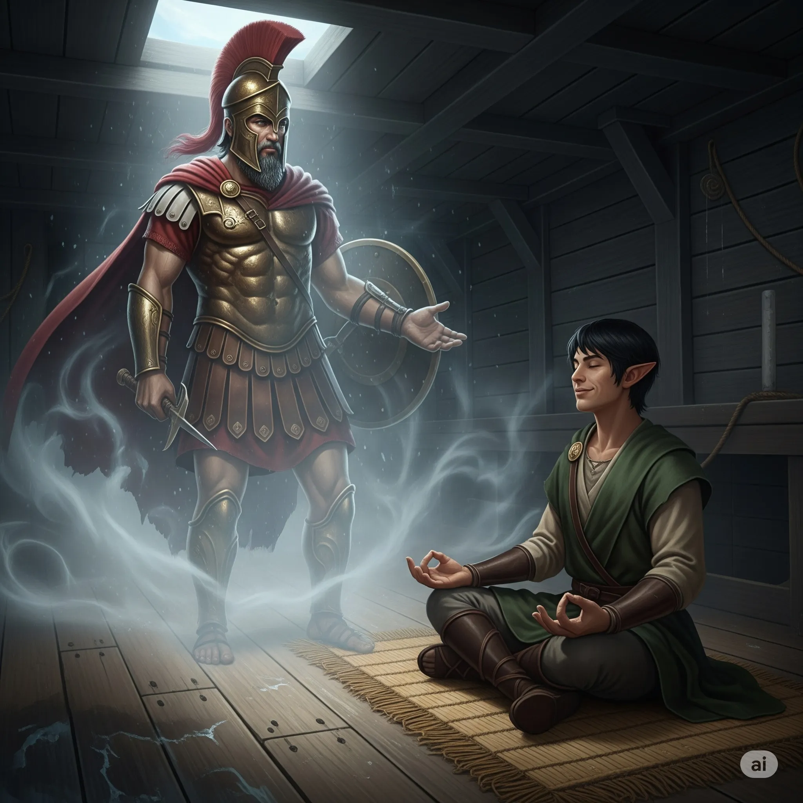

**Data:** 28.07.2025

## Podsumowanie

Na pokładzie legendarnego [[Ultros|Ultrosa]], prującego fale [[Zatoka Cerulańska|Zatoki Cerulańskiej]] w drodze powrotnej do [[Mytros]], panowała atmosfera ulgi zmieszanej z niepokojem. [[Bohaterowie Przepowiedni]], po brawurowej i niezwykle ryzykownej infiltracji [[Wyspa Yonder|Wyspy Yonder]], dzierżyli w dłoniach bezcenny skarb – strategiczny [[Konspekt Strategiczny Tytanów|konspekt wojenny]] samego [[Sydon|Sydona]]. Jednak triumf ten miał gorzki posmak, gdyż na pokładzie statku znajdował się również [[Chondrus]], były doradca króla [[Acastus|Akastusa]] i, jak podejrzewano, sługa mrocznej [[Lutheria|Lutherii]].

Podróż rozpoczęła się od serdecznego powitania załogi, która pod tymczasowym dowództwem [[Pholon|Pholona]] zdołała utrzymać statek w jednym kawałku, choć jego znajomość terminologii morskiej pozostawiała wiele do życzenia. Z opowieści wynikało, że podczas nieobecności bohaterów na horyzoncie zamajaczyła na moment potężna, skrzydlata sylwetka, prawdopodobnie należąca do smoczycy [[Argyn]] i jej jeźdźca [[Gaius|Gaiusa]], lecz nieprzyjaciel nie odważył się zbliżyć.

Wśród radosnych okrzyków i toastów wznoszonych za udaną misję, bohaterowie znaleźli czas na osobiste rozmowy. [[Arevon Elorrenthi|Arevon]] odnalazł [[Tars d’Lyrandar|Tarsa d’Lyrandara]], kapitana swojego zaginionego statku. W oczach półelfa wciąż malował się cień traumy po torturach, jakim poddano go na [[Wyspa Yonder|Yonder]]. Opowiedział [[Arevon Elorrenthi|Arevonowi]] o chaosie, jaki rozpętał się podczas sztormu przy Mgle Mournlandu, o tym, jak wpadł do wody i dryfował, trzymając się kurczowo deski, aż został wyłowiony i uwięziony. Myśl o powrocie do ich rodzinnego Eberronu wciąż płonęła w jego sercu, choć [[Arevon Elorrenthi|Arevon]], z ciężkim sercem, musiał mu wytłumaczyć, że droga powrotna jest, jeśli nie niemożliwa, to z pewnością zagadnieniem o kosmicznej skali trudności, splecionym z boską naturą samej Thylei. Mimo to, widok odzyskanego kapitana i innych członków załogi był dla druida promykiem nadziei.

W tym samym czasie [[Orion Xul|Orion Xul]] stanął twarzą w twarz ze swoim ojcem, [[Pythor|Pythorem]]. Bóg bitwy, pogrążony w oparach alkoholu, z trudem skrywał dumę mieszającą się z rozpaczą. Pogratulował synowi odwagi, lecz jednocześnie przypomniał mu o jego prawdziwej misji – o pokonaniu zielonej smoczycy [[Hexia|Hexii]]. W jego słowach kryła się obietnica wsparcia, choć rozmowa była dla niego niezręczna i bolesna. [[Felicjan Janus Twardowski|Felicjan]] zaś, wykorzystując chwilę spokoju, z zapałem oddał się przepisywaniu potężnych zaklęć z [[Grimuar Chondrusa|grimuaru Chondrusa]], poszerzając swój magiczny arsenał o czary takie jak Polimorfia i Wygnanie. Z dumą obserwował też swojego młodego, miedzianego smoka [[Kairos|Kairosa]], który pod czujnym okiem starszego pobratymca, doskonale integrował się z załogą.

[[Astra]], z troską w oczach, podeszła do [[Versir|Versira]], przypominając mu o ciężarze, jaki na nim spoczywa. Niegdyś pragnący jedynie anonimowości, teraz stał się symbolem, jednym z filarów przepowiedni. Prosiła go, by o siebie dbał, gdyż jego los nierozerwalnie splótł się z losem całej misji. Nawet [[Kyrah]], bogini muzyki, znalazła chwilę dla [[Orestes|Orestesa]], oferując mu lekcje gry na dudach. Pod jej mistrzowskim okiem, minotaur zdołał wydobyć z instrumentu melodię, która, ku zdumieniu wszystkich, była nie tylko znośna, ale wręcz przyjemna dla ucha.

Spokój podróży został gwałtownie przerwany drugiego dnia. Niebo nad [[Ultros|Ultrosem]] pociemniało, zasnute przez setki trupio bladych ptaków, przypominających mewy. Poruszały się w nienaturalnej, grobowej ciszy, bez jednego trzepotu skrzydeł czy krzyku. [[Felicjan Janus Twardowski|Felicjan]], rozpoznając w nich [[Stygijska Mewa|stygijskie mewy]] – legendarne oczy i uszy [[Lutheria|Lutherii]] – nie wahał się ani chwili. Wierny swemu pragmatycznemu i nieco porywczemu podejściu, posłał w sam środek stada ognistą kulę. Deszcz przypalonych ptasich ciał spadł na pokład i do morza, a złowrogi omen rozpierzchł się na wszystkie strony.

Wieczorem nadszedł czas na ostateczną konfrontację. W sali narad, w obecności [[Kyrah]] i [[Versir|Versi]], bohaterowie zasiedli naprzeciw [[Chondrus|Chondrusa]]. [[Orestes]], z dwiema flaszkami w dłoniach, rozpoczął spotkanie. Pytanie, które zawisło w powietrzu, było proste i brutalne: czy służył [[Lutheria|Lutherii]]? Odpowiedź [[Chondrus|Chondrusa]] była równie bezpośrednia. "Tak. Służyłem... i w pewnym sensie wciąż służę Pani Snów."

To wyznanie rozpętało burzę. [[Chondrus]], ze stoickim spokojem, przedstawił swoją wizję Tytanów. [[Sydon]], w jego oczach, był tępym, żądnym władzy tyranem, którego zwycięstwo oznaczałoby koniec Thylei, jaką znają – koniec chaosu, namiętności i tragedii, które tak fascynowały jego panią. [[Lutheria]], jak twierdził, nie pragnęła totalnej wojny. Była obserwatorką, czerpiącą przyjemność ze złożoności śmiertelnego życia. Jego zdaniem, jej cele nie musiały być sprzeczne z celami bohaterów, a ona sama mogłaby stać się cennym sojusznikiem w walce z własnym bratem.

Słowa te uderzyły w [[Versir|Versira]] niczym grom. Z trudem powstrzymując gniew, oddał swój miecz [[Orestes|Orestesowi]], by nie posunąć się do czynów, których mógłby żałować. Dla niego [[Chondrus]] był niczym więcej jak ślepym fanatykiem, sługą potwora odpowiedzialnego za cierpienie jego rodziny. [[Arevon Elorrenthi|Arevon]] jednak, jak zawsze pragmatyczny, studził jego zapał. Argumentował, że wojna na dwa fronty, z [[Sydon|Sydonem]] i [[Lutheria|Lutherią]] jednocześnie, byłaby samobójstwem. [[Sydon]] był bezpośrednim, palącym zagrożeniem, podczas gdy z [[Lutheria|Lutherią]], być może, dałoby się negocjować. Utrzymanie jej neutralności, a nawet pozyskanie jej jako sojusznika przeciwko bratu, mogło być kluczem do zwycięstwa.

[[Felicjan Janus Twardowski|Felicjan]] przypomniał, że wróg na pewno wie już o wykradzionych planach, co czyni sytuację jeszcze bardziej nieprzewidywalną. Ostatecznie, to [[Versir]] podjął decyzję. Nie mogąc znieść obecności szpiega na pokładzie, zakuł [[Chondrus|Chondrusa]] w kajdany i odprowadził go do celi, konfiskując jego magiczne komponenty i księgę czarów. Kapitan [[Orestes]] poparł tę decyzję, uznając, że choć [[Chondrus]] może się przydać, nie można mu ufać na tyle, by swobodnie poruszał się po statku.

Tej nocy, gdy większość załogi spała, [[Arevon Elorrenthi|Arevon]] pogrążony był w druidycznej medytacji. Wtem, w półmroku kajuty, zmaterializowała się półprzezroczysta postać [[Estor Arkelander|Estora Arkelandera]]. Duch legendarnego Smoczego Lorda, z podziwem w głosie, pogratulował elfowi sukcesu na [[Wyspa Yonder|Yonder]]. Ponowił swoją ofertę: jego niezrównany geniusz strategiczny i wiedza o lokalizacji zaginionego skarbu Smoczych Lordów w zamian za obietnicę odzyskania jego przeklętego miecza. [[Arevon Elorrenthi|Arevon]], choć nieufny, przedstawił tę propozycję reszcie drużyny. Tym razem, po długiej debacie, szala delikatnie przechyliła się na stronę [[Estor Arkelander|Estora]]. Wizja legendarnych skarbów i taktycznej przewagi nad [[Sydon|Sydonem]] przeważyła nad ryzykiem. W głosowaniu zgodzili się podjąć negocjacje z [[Estor Arkelander|Estorem]].

Ostatniego dnia podróży, bohaterowie wraz z Drużyną B zebrali się, by omówić dalsze kroki. [[Kyrah]], z mądrością bogini, przypomniała im o słowach Wyroczni. Ich przeznaczeniem nie było zostanie generałami broniącymi murów [[Mytros]], lecz stawienie czoła samym Tytanom. [[Ultros]] i [[Antikythera]] były darami losu, które miały ich poprowadzić na [[Zapomniane Morze]], do serca domeny wroga. Plan był jasny: krótki postój w [[Mytros]], by przekazać konspekt wojenny królowej [[Vallus]] i naprawić magiczny kompas, a następnie wyruszyć w nieznane. Celem były tajemnicze wyspy, których położenie wskazywały nowe konstelacje: [[Wyspa Smoka]], legowisko [[Hexia|Hexii]]; enigmatyczna [[Wyspa Czasu]]; oraz mroczna konstelacja Śniącego, wiodąca do królestwa samej [[Lutheria|Lutherii]].

Gdy na horyzoncie zamajaczyły mury [[Mytros]], [[Melania Twardowska|Melania]], żona [[Felicjan Janus Twardowski|Felicjana]], odnalazła go na pokładzie. W jej oczach malował się strach i miłość. Prosiła go, by był ostrożny, przypominając, że choć jest teraz Smoczym Lordem i bohaterem, wciąż jest jej mężem, z którym pragnie wrócić do domu, gdy wojna wreszcie się skończy.

[[Ultros]] wpłynął do portu o zachodzie słońca. Miasto wyglądało tak samo, a jednak w powietrzu czuć było napięcie. Na nabrzeżu nie czekał na nich komitet powitalny. Zamiast tego, w blasku pochodni, stał zwarty oddział centurionów, a nad nimi unosił się miedziany smok. Czekali. Bohaterowie wrócili do domu, lecz ich odyseja dopiero nabierała rozpędu.

## Kluczowe wydarzenia / decyzje

* Powrót z [[Wyspa Yonder|wyspy Yonder]] ze zdobytym konspektem wojennym [[Sydon|Sydona]].
* Konfrontacja z [[Chondrus|Chondrusem]], który przyznaje się do służby [[Lutheria|Lutherii]], co wywołuje zażartą debatę.
* Podjęcie decyzji o uwięzieniu [[Chondrus|Chondrusa]] w celi na [[Ultros|Ultrosie]], mimo jego propozycji sojuszu.
* Pojawienie się [[Stygijska Mewa|stygijskich mew]], zidentyfikowanych jako oczy i uszy [[Lutheria|Lutherii]], które zostają przepędzone przez [[Felicjan Janus Twardowski|Felicjana]].
* Nocna wizyta ducha [[Estor Arkelander|Estora Arkelandera]], który ponawia ofertę pomocy w zamian za odzyskanie jego miecza.
* Dopłynięcie do [[Mytros]] i odkrycie, że na nabrzeżu czeka na nich oddział centurionów.

## Pamiętne Cytaty

* Dungeon Master (jako [[Pythor]]): "Twoja matka byłaby dumna."
* Dungeon Master (jako [[Chondrus]]): "Tak. Służyłem... i w pewnym sensie wciąż służę Pani Snów."
* [[Versir]]: "Zabierz to ode mnie, bo skrócę go o głowę zaraz."
* [[Arevon Elorrenthi|Arevon]]: "Wytaczanie drugiego frontu z Lutherią w momencie, w którym Sydon nas atakuje, jest głupie."
* [[Orion Xul|Orion]]: "No dobra, no to przekonałeś mnie. Dzisiaj cię nie zabiję."
* Dungeon Master (jako [[Melania Twardowska|Melania]]): "Jesteś teraz Smoczym Lordem, Bohaterem Przepowiedni. Ale wciąż jesteś moim mężem. Kiedyś to wszystko się skończy. Chcę żebyśmy wrócili do domu razem."

## Postacie Niezależne (NPC)

* [[Chondrus]] (były doradca Akastusa, sługa Lutherii)
* [[Pythor]] (bóg bitwy, ojciec Oriona)
* [[Kyrah]] (bogini muzyki)
* [[Estor Arkelander]] (duch legendarnego Smoczego Lorda)
* [[Tars d’Lyrandar]] (uratowany kapitan statku Arevona)
* [[Melania Twardowska]]
* [[Pholon]]
* [[Hexia]] (wspomniana)
* [[Kairos]]

## Lokacje

* [[Ultros|Statek Ultros]]
* [[Zatoka Cerulańska]]
* [[Mytros]] (port)

## Przedmioty

* [[Konspekt Strategiczny Tytanów|Konspekt Strategiczny Zmierzchu Piątki]]
* [[Grimuar Chondrusa]]
* [[Antikythera]] (magiczny kompas, wspomniana konieczność naprawy)
* Przeklęty miecz [[Estor Arkelander|Estora Arkelandera]] (wspomniany)

## Filmy

