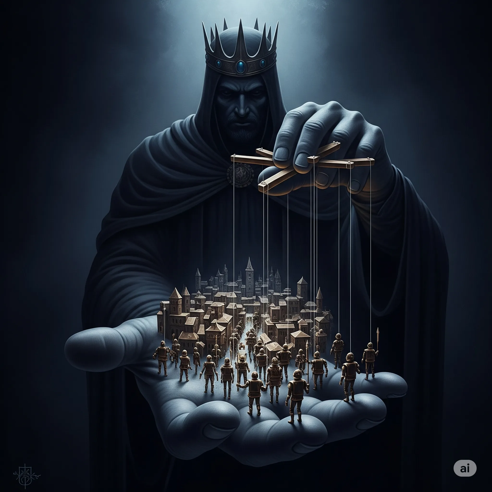
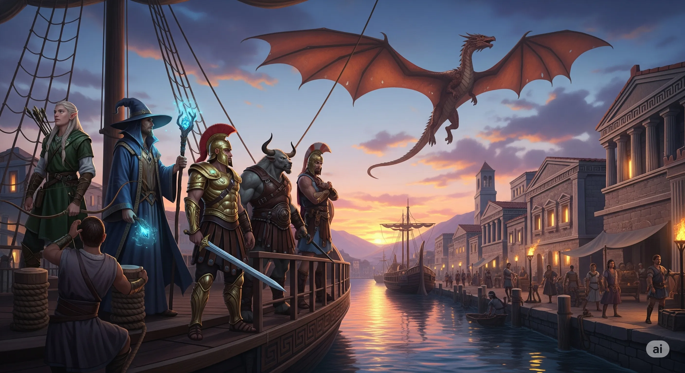
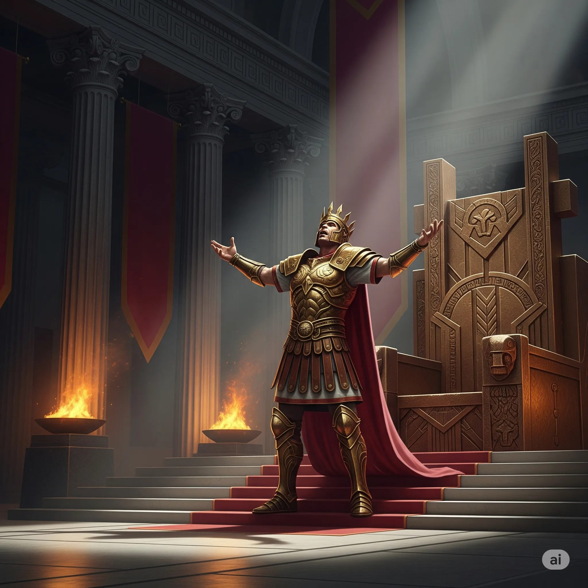
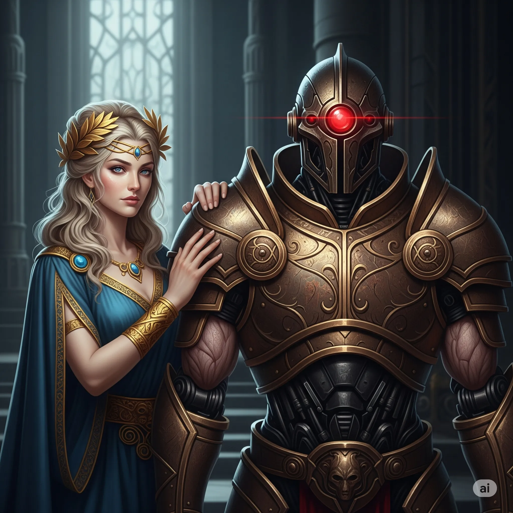
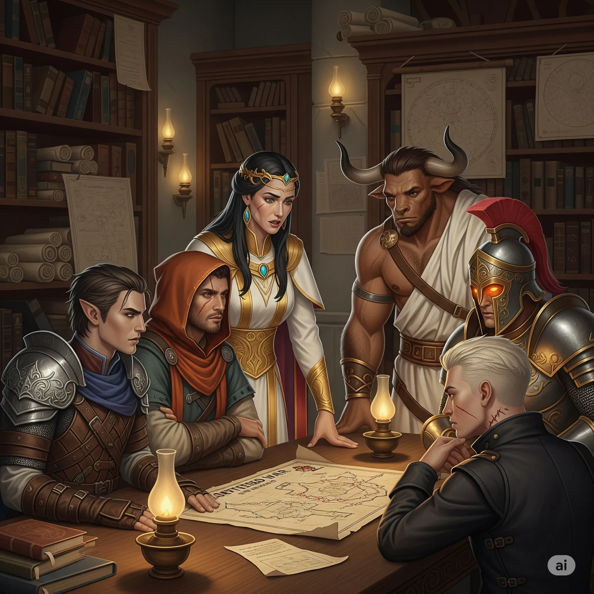
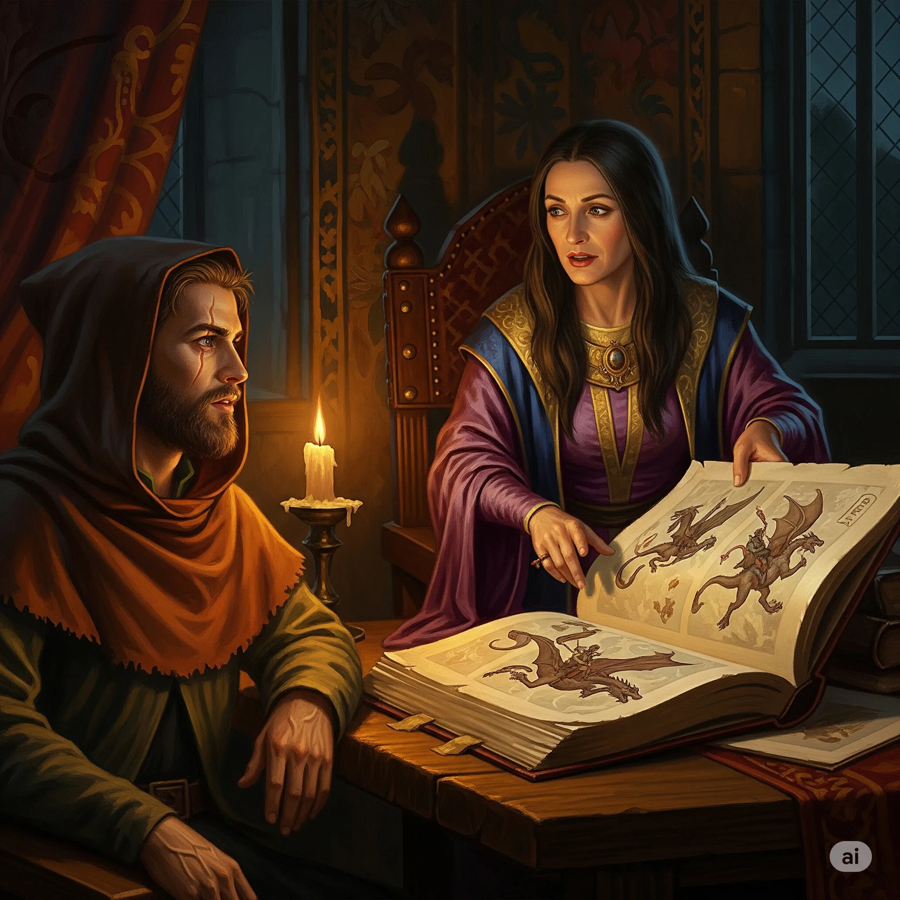
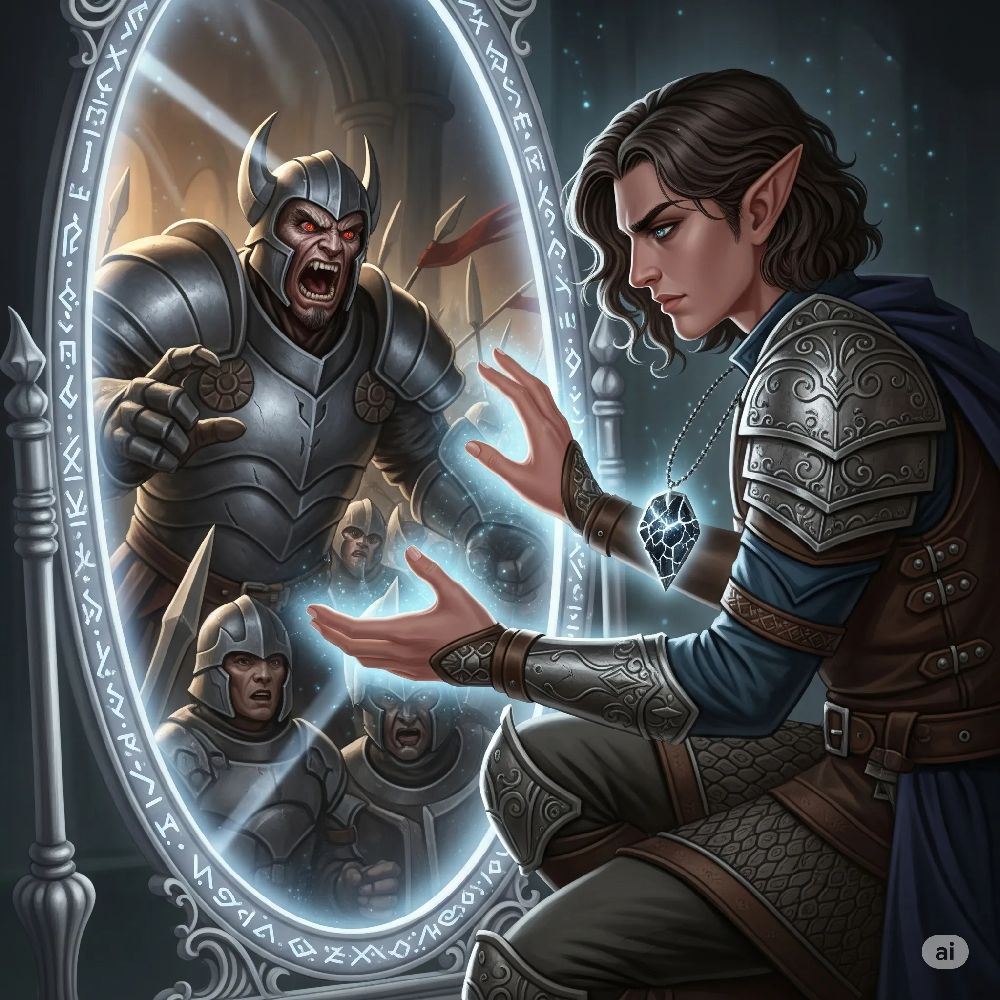
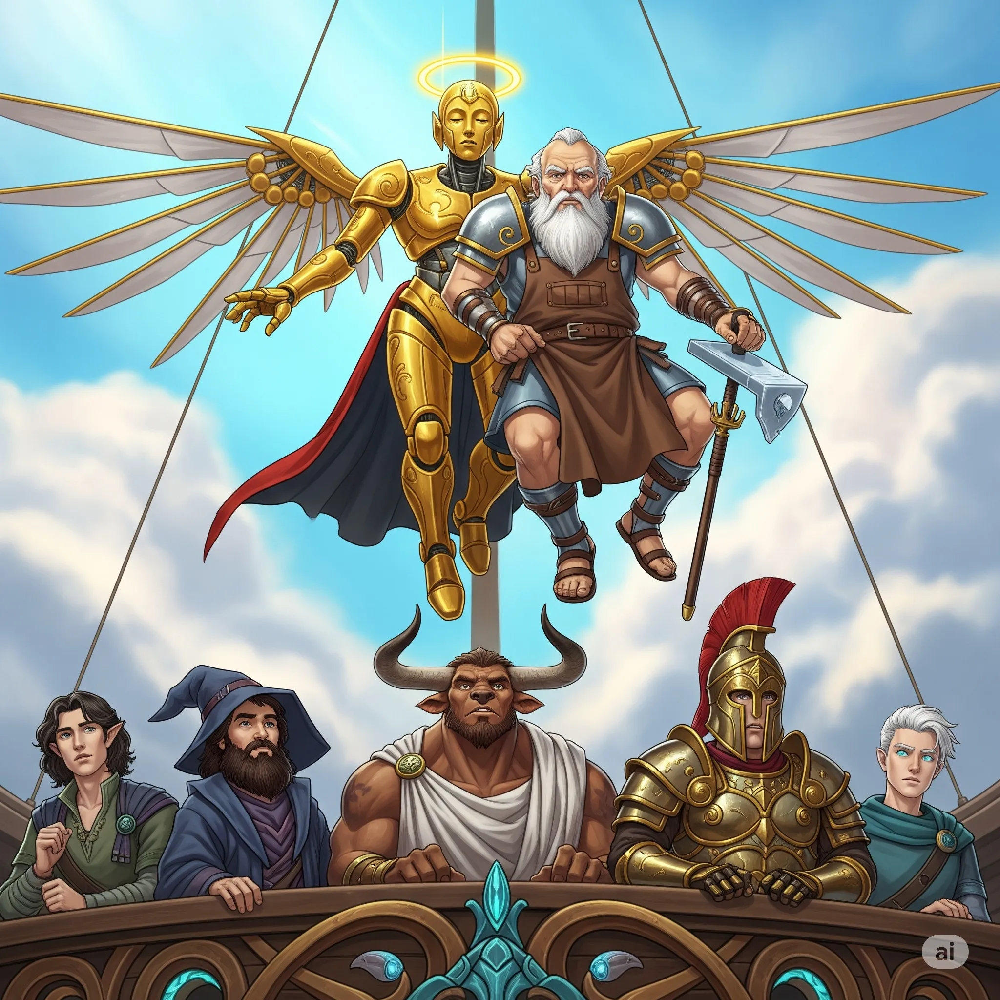
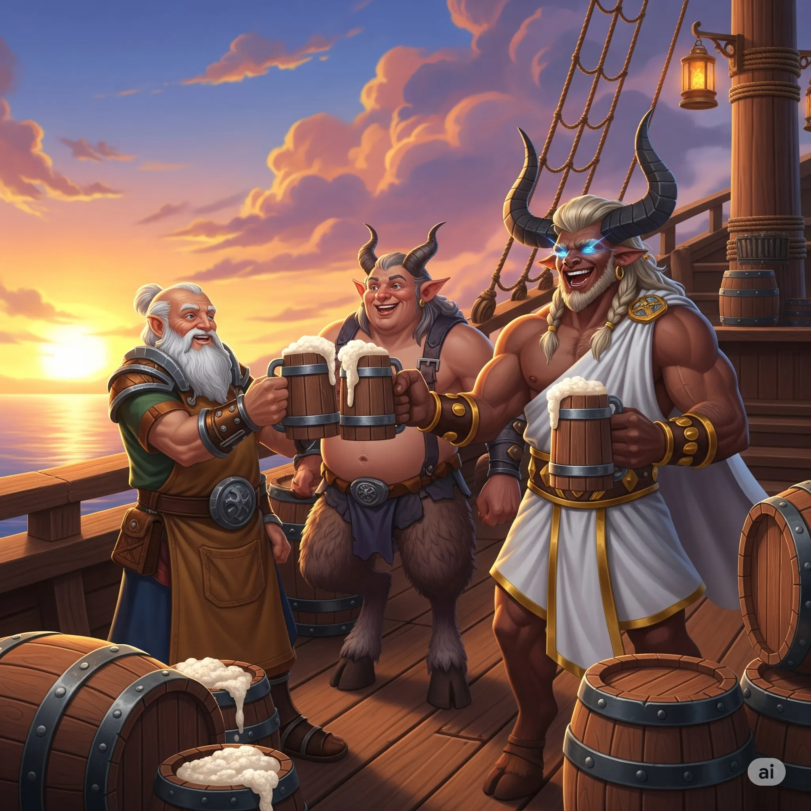

**Data:** 04.08.2025

## Podsumowanie

Na pokładzie legendarnego [[Ultros|Ultrosa]], prującego fale [[Zatoka Cerulańska|Zatoki Cerulańskiej]] w drodze powrotnej do [[Mytros]], panowała atmosfera ulgi zmieszanej z niepokojem. [[Bohaterowie Przepowiedni]], po brawurowej i niezwykle ryzykownej infiltracji wyspy [[Wyspa Yonder|Yonder]], dzierżyli w dłoniach bezcenny skarb – [[Konspekt Strategiczny Tytanów|strategiczny konspekt wojenny]] samego [[Sydon|Sydona]]. Jednak triumf ten miał gorzki posmak, gdyż na pokładzie statku znajdował się również [[Chondrus]], były doradca króla [[Acastus|Akastusa]] i, jak podejrzewano, sługa mrocznej [[Lutheria|Lutherii]], a w sercu miasta czekał na nich nieprzewidywalny król [[Acastus|Akastus]].

Gdy na horyzoncie zamajaczyły mury [[Mytros]], bohaterów nie powitały radosne okrzyki tłumów. Zamiast tego, w blasku zachodzącego słońca, na nabrzeżu czekał na nich zwarty, milczący oddział centurionów, a nad nimi, na tle purpurowego nieba, unosił się miedziany smok, którego łuski lśniły niczym monety w ogniu. Mieszkańcy, choć licznie zgromadzeni, trzymali się w bezpiecznej odległości, szepcząc między sobą z mieszaniną ciekawości, nadziei i strachu. W ich oczach bohaterowie nie byli już tylko herosami z igrzysk – stali się omenem nadciągającej burzy.

Jeszcze zanim [[Ultros]] dobił do brzegu, [[Versir]], z powagą w głosie, poprosił [[Arevon Elorrenthi|Arevona]] o zwrot swojego miecza, który elf przyjął jako zabezpieczenie na wypadek zdrady [[Chondrus|Chondrusa]]. Choć [[Arevon Elorrenthi|Arevon]] oddał broń, nalegał, by los szpiega pozostał w rękach królowej [[Vallus]], a nie stał się przedmiotem pochopnej zemsty. W tym czasie [[Felicjan Janus Twardowski|Felicjan]], widząc siły królewskie, rozkazał, by smoki pozostały na górnym pokładzie, widoczne dla wszystkich – miała to być niema demonstracja siły i niezależności wobec monarchy.

Gdy tylko statek zacumował, na trap wszedł dowódca straży, [[Tarchon]]. Z formalnym, chłodnym tonem przekazał rozkaz króla [[Acastus|Akastusa]]: bohaterowie mieli niezwłocznie stawić się w sali tronowej, by zdać raport, podczas gdy ich statek i załoga zostaną objęci królewską kwarantanną. Na te słowa, z pokładu zeskoczył sam [[Pythor]], bóg bitwy. „Spróbuj mnie zatrzymać,” warknął do [[Tarchon|Tarchona]], a za nim podążyła [[Kyrah]]. Przytłoczony boską obecnością dowódca nie oponował. [[Versir]], wykorzystując sytuację, zręcznie oświadczył, że zanim udadzą się do pałacu, muszą złożyć ofiary w [[Świątynia Pięciu|Świątyni Pięciu]] – religijny obowiązek, którego nikt nie śmiałby kwestionować. Był to zręczny manewr, dający im czas i możliwość spotkania się ze swoją prawdziwą sojuszniczką. [[Felicjan Janus Twardowski|Felicjan]] natychmiast wysłał sowę z wiadomością do królowej [[Vallus]], prosząc o spotkanie w świątyni.

W świątyni, pośród woni kadzideł i ciszy przerywanej jedynie szeptem modlitw, czekała na nich [[Vallus]]. Na jej twarzy malowała się ulga, lecz oczy zdradzały głęboki niepokój. Jej wzrok natychmiast padł na [[Idylla|Idyllę]], matkę [[Acastus|Akastusa]], którą bohaterowie przywieźli z [[Wyspa Wygnańców|Wyspy Wygnańców]]. Chłodne powitanie między dwiema kobietami było wymowniejsze niż tysiąc słów. Bohaterowie, nie tracąc czasu, zdali królowej relację. Gdy [[Arevon Elorrenthi|Arevon]] wręczył jej zdobyty na [[Wyspa Yonder|Yonder]] konspekt strategiczny, jej twarz pobladła. Plan [[Sydon|Sydona]] był przerażająco dobry, zakładał sabotaż od wewnątrz, atak centaurów na Estorię i, co najgorsze, wykorzystanie gigantów z tajemniczego [[Ogród Heliosa|Ogrodu]].

Następnie poruszono drażliwą kwestię [[Chondrus|Chondrusa]]. [[Vallus]] potwierdziła, że [[Acastus|Akastus]] już go poszukuje z powodu niejasności w królewskiej księgowości i kategorycznie odradziła wydawanie go w ręce męża, co skończyłoby się publiczną egzekucją. Zasugerowała, że mimo jego powiązań z [[Lutheria|Lutherią]], może on okazać się cennym źródłem informacji, a utrzymanie Pani Snów w neutralności wobec wojny z [[Sydon|Sydonem]] może być kluczowe. Na koniec ostrzegła ich, że [[Acastus|Akastus]] szykuje dla nich publiczne upokorzenie, trzymając w rękawie jakiegoś niebezpiecznego asa.

Po złożeniu ofiar, bohaterowie, eskortowani przez straż, udali się do sali tronowej. Tam, na tronie, w otoczeniu swej konkubiny [[Bella|Belli]] i królowej [[Vallus]], która zdążyła ich uprzedzić, czekał król [[Acastus|Akastus]]. [[Acastus|Akastus]], niczym wytrawny aktor na scenie, rozpoczął swój spektakl. Oskarżył bohaterów o lekkomyślne sprowokowanie wojny poprzez zabicie [[Gaius|Gaiusa]] i jego smoczycy oraz sprofanowanie świątyni Pana Burz. [[Versir]] odparł te zarzuty z dyplomatyczną precyzją, przedstawiając ich działania jako misję odzyskania skradzionego artefaktu i akt samoobrony.

Lecz król nie słuchał. Wygłosił płomienną mowę do zebranych dworzan, przedstawiając bohaterów jako relikt przeszłości, a siebie jako wizjonera nowej ery. Z dumą zaprezentował swoją nową doradczynię, [[Ismene Neurdagon|Ismene Neurdagon]], oraz owoc jej pracy – Egidę Mytros. Na jego znak, do sali wmaszerowało dziesięć przerażających postaci: fuzja brązu i ludzkiego ciała, bio-automatyczni żołnierze, którzy mieli bronić miasta bez przelewania krwi jego obywateli. Tłum wybuchł aplauzem. W jednej chwili [[Acastus|Akastus]] ukradł bohaterom ich chwałę, przedstawiając ich jako niebezpiecznych awanturników, a siebie jako zbawcę.

Na tym jednak nie skończył się jego teatr. Gdy [[Tarchon]] szepnął mu coś na ucho, król był chwilowo zaskoczony, a następnie z udawaną radością odkrył obecność swej matki, [[Idylla|Idylli]]. Odegrana scena radosnego, rodzinnego pojednania była mistrzowskim posunięciem, które ostatecznie scementowało jego pozycję w oczach dworu i ludu.

Po tym upokarzającym spektaklu, bohaterowie zostali zaproszeni do prywatnych komnat królowej [[Vallus]], gdzie kontynuowali rozmowę. [[Vallus]] nie kryła pogardy dla „zabawek” swojego męża, nazywając Egidę pomnikiem jego pychy. Rozmowa zeszła na ich liczne podróże: opowiedzieli o sojuszu z Amazonkami, uwolnieniu [[Chalcia|Chalcii]] na [[Wyspa Ognia|Wyspie Ognia]], wizji na [[Wyspa Złotego Serca|Wyspie Złotego Serca]], spotkaniu z [[Wiedźma Lotosu|Wiedźmą Lotosu]] i [[Mojry|Mojrami]], a także o tragikomicznej przygodzie na [[Wyspa Forlorn|Wyspie Forlorn]], gdzie zostali zamienieni w gęsi. Te opowieści, szczególnie te dotyczące historii [[Tytani|Tytanów]], wstrząsnęły [[Vallus]], która z pokorą przyznała, że przez wieki walczyli z wrogiem, którego natury w pełni nie rozumieli.

Przed wyjściem, [[Vallus]] zatrzymała [[Felicjan Janus Twardowski|Felicjana]] na prywatną rozmowę. Opowiedziała mu o starym Zakonie [[Smoczy Lordowie|Smoczych Lordów]], o tym czym był, a także czym powinien być nowy Zakon. Mówiła, że smoki nie są tylko narzędziem wojny. Smoki są partnerami, przyjacielami [[Smoczy Lordowie|Smoczych Lordów]]. Zasugerowała również [[Felicjan Janus Twardowski|Felicjanowi]], że nie może on dosiadać wszystkich smoków - powinien znaleźć dla nich jeźdźców.

Po audiencji nadszedł czas na załatwienie zaległych spraw w [[Mytros]]. Bohaterowie udali się na zakupy, zaopatrując się w liczne mikstury lecznicze i magiczne komponenty. [[Felicjan Janus Twardowski|Felicjan]] odwiedził swoją rodzinę, a [[Orestes]], ku uciesze załogi, uzupełnił zapasy piwa, konsultując interesy z wujaszkiem [[Silenos|Silenosem]]. [[Arevon Elorrenthi|Arevon]] podjął się szpiegowania [[Hergeron|Hergerona]] za pomocą zaklęcia __Scrying__. Okazało się, że tytan przejął bezpośrendią władzę nad [[Zakon Sydona|Zakonem Sydona]], żąda zmiany planów wojennych oraz zemsty na [[Bohaterowie Przepowiedni|Bohaterach Przepowiedni]].

Jednak [[Acastus|Akastus]] nie zamierzał dać za wygraną. Wezwał do siebie [[Felicjan Janus Twardowski|Felicjana]], próbując go zmanipulować i przekonać do oddania jego smoków pod kontrolę nowo formowanego, królewskiego zakonu. Oferował mu stanowisko generała, lecz czarodziej, pomny rad [[Vallus]] i własnego instynktu, z godnością odrzucił tę propozycję.

W końcu nadszedł wyczekiwany moment. Na pokładzie [[Ultros|Ultrosa]] wylądował się [[Keledone]], mechaniczny posłaniec, niosąc w swych ramionach, niczym worek ziemniaków, samego [[Volkan|Volkana]]. Bóg kuźni, z miną wyrażającą skrajne niezadowolenie z tej formy transportu, przekazał [[Arevon Elorrenthi|Arevonowi]] naprawioną i ulepszoną [[Antikythera|Antikyterę]]. [[Felicjan Janus Twardowski|Felicjanowi]] zaś wręczył nową, różdżkę, wykutą ze smoczego rogu. [[Volkan]] następnie wprosił się na piwo do [[Orestes|Orestesa]] na które dołączył również wujaszek [[Silenos|Silenus]].

Z naprawionym kompasem i uzupełnionymi zapasami, bohaterowie byli gotowi do dalszej drogi. Pożegnali się z sojusznikami, pozostawiając obronę [[Mytros]] w rękach [[Vallus]], i o świcie, pod osłoną porannej mgły, [[Ultros]] podniósł kotwicę. Obierając kurs na tajemniczą [[Konstelacja Nimfy|konstelację Nimfy]], wypłynęli na nieznane wody [[Zapomniane Morze|Zapomnianego Morza]], niosąc na swych barkach ciężar przepowiedni i los całej Thylei. Ich odyseja trwała.

## Kluczowe wydarzenia / decyzje

* Powrót [[Ultros|Ultrosa]] do [[Mytros]] i konfrontacja z eskortą królewską, na czele której stoi dowódca [[Tarchon]] i miedziany smok.
* Spotkanie z królową [[Vallus]], przekazanie jej zdobytych planów wojennych [[Sydon|Sydona]] i omówienie zdrady w [[Mytros]] oraz problemu [[Chondrus|Chondrusa]].
* Napięta audiencja u króla [[Acastus|Acastusa]], który umniejsza dokonania bohaterów i przedstawia Egidę Mytros – swoją nową armię automatonów.
* Publiczne, teatralne pojednanie [[Acastus|Acastusa]] z matką, [[Idylla|Idyllą]], którą bohaterowie sprowadzili z [[Wyspa Wygnańców|Wyspy Wygnańców]].
* Prywatne rozmowy i załatwianie spraw w mieście: [[Felicjan Janus Twardowski|Felicjan]] rozmawia z [[Acastus|Acastusem]] i [[Vallus]] o przyszłości smoków, [[Arevon Elorrenthi|Arevon]] szpieguje [[Hergeron|Hergerona]], a reszta zaopatruje się w zapasy.
* Wizyta boga [[Volkan|Volkana]], który dostarcza naprawioną [[Antikythera|Antikyterę]] oraz nową, potężną różdżkę dla [[Felicjan Janus Twardowski|Felicjana]].
* Podjęcie decyzji o wyruszeniu w dalszą podróż na [[Zapomniane Morze]], obierając kurs na wyspę wskazaną przez [[Konstelacja Nimfy|konstelację Nimfy]].

## Pamiętne Cytaty

* [[Pythor]] (Dungeon Master): "Spróbuj mnie zatrzymać."
* [[Orestes]]: "Znaczy, zdefiniujmy profanację."
* [[Acastus]] (Dungeon Master): "Czas bohaterów, czy legendarnych pojedynków dobiega końca. Czas na nową erę. Erę innowacji i potęgi, jakiej Thylea jeszcze nie widziała."
* [[Felicjan Janus Twardowski|Felicjan]]: "A może królu powiesz skąd twoja matka wróciła?"
* [[Idylla]] (Dungeon Master): "Nauczył się wiele o teatrze podczas mojej nieobecności. Niestety mniej jeśli chodzi o samo rządzenie."
* [[Volkan]] (Dungeon Master): "Czy ty masz w ogóle pojęcia o aerodynamice? Turbulencje. Mój żołądek prawie wylądował w gardle. Następnym razem idę na piechotę, choćby miało to zająć trzy tygodnie."
* [[Orestes]]: "Oczywiście! Dla mojego ulubionego boga! Zapraszam, zapraszam."

## Postacie Niezależne (NPC)

* [[Acastus|Król Acastus]]
* [[Vallus|Królowa Vallus]]
* [[Idylla]] (matka Acastusa)
* [[Ismene Neurdagon]] (doradczyni króla)
* [[Tarchon]]
* [[Pythor]]
* [[Kyrah]]
* [[Volkan]]
* [[Hergeron]] (widziany w wizji)
* [[Chondrus]] (uwięziony na statku)
* [[Silenos]] (wuj Orestesa)

## Lokacje

* [[Mytros]]
* Pokład statku [[Ultros]]
* [[Świątynia Pięciu]]
* Sala tronowa w pałacu w [[Mytros]]
* Prywatne komnaty królowej [[Vallus]]
* Prywatne komnaty [[Idylla|Idylli]]

## Przedmioty

* [[Konspekt strategiczny Tytanów|Konspekt strategiczny Tytanów]] (przekazany [[Vallus]])
* Dziennik [[Hergeron|Hergerona]] i [[Gaius|Gaiusa]] (przekazane [[Vallus]])
* [[Antikythera|Antikytera]] (naprawiona przez [[Volkan|Volkana]])
* Różdżka ze smoczego rogu
* Egida Mytros (nowe automaty bojowe [[Acastus|Acastusa]])
* Mikstury lecznicze i komponenty magiczne (zakupione w mieście)

## Filmy

