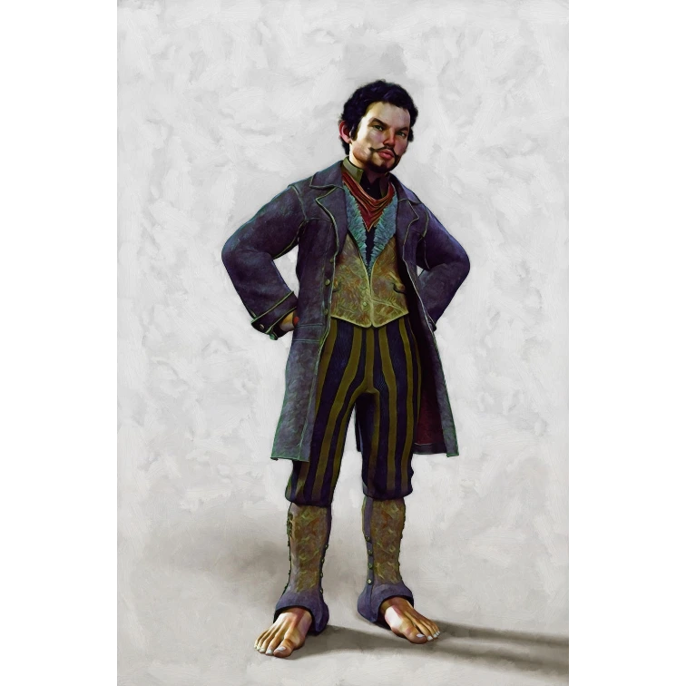

# Sesja 6: Problemy w Woodhike

**Data:** 21.02.2024

## Podsumowanie

W tej sesji bohaterowie czekali na [[Bazyliszki|bazyliszki]], by ocenić ich liczebność i czas ich nieobecności w jaskini. Zostali jednak zaatakowani przez watahę wilków. W tawernie usłyszeli plotkę o zaginionych zwierzętach i ściętych drzewach w [[Woodhike]]. [[Orestes]] przegrał zawody z [[Pholon|Pholonem]] i nie został jego jeźdźcem. W [[Woodhike]] spotkali burmistrza [[Thobos|Thobosa]] i dowiedzieli się o podejrzanych ludziach kręcących się w nocy. Pokonali bandytów pod wodzą [[Korteva|Kortevy]], a także spotkali [[Przyjazny Cyklop|przyjaznego cyklopa]].

## Kluczowe wydarzenia / decyzje

* Atak wilków podczas obserwacji [[Bazyliszki|bazyliszków]].
* [[Orestes]] przegrał zawody z [[Pholon|Pholonem]].
* Spotkanie z burmistrzem [[Thobos|Thobosem]] w [[Woodhike]].
* Rozmowa z duszkami [[Ari]] i [[Eli]] o podejrzanych ludziach.
* Walka z bandytami [[Korteva|Kortevy]].
* Spotkanie z [[Przyjazny Cyklop|przyjaznym cyklopem]].

## Postacie Niezależne (NPC)

* [[Thobos]] (burmistrz Woodhike)
* [[Ari]] (duszek)
* [[Eli]] (duszek)
* [[Korteva]] (przywódczyni bandytów)
* [[Pholon]]
* [[Anora]]
* [[Pythor]]
* [[Przyjazny Cyklop]]

## Lokacje

* [[Gniazdo Bazyliszków|Jaskinia bazyliszków]]
* [[Woodhike]]
* [[Estoria]]

## Szczegółowy opis wydarzeń

Bohaterowie, kontynuując misję uratowania [[Anora|Anory]], córki [[Pythor|Pythora]], czekali na [[Bazyliszki|bazyliszki]], aby móc opracować plan działania. Niespodziewanie zostali zaatakowani przez watahę wilków, co utrudniło im zadanie. 

Po dotarciu do [[Woodhike]], spotkali burmistrza [[Thobos|Thobosa]], który opowiedział im o niepokojących wydarzeniach w okolicy - zaginionych zwierzętach i ściętych drzewach. Przyjazne duszki, [[Ari]] i [[Eli]], poinformowały bohaterów o podejrzanych ludziach kręcących się w nocy wokół [[Woodhike]]. 

Wkrótce bohaterowie natknęli się na grupę bandytów dowodzonych przez [[Korteva|Kortevę]]. Po zaciętej walce, pokonali bandytów, ale odkryli, że w grupie był również [[Przyjazny Cyklop|przyjazny cyklop]], którego postanowili oszczędzić. 

W trakcie tych wydarzeń naszyjnik od babci, który nosi jeden z bohaterów, stał się chłodniejszy, co może zwiastować nadchodzące niebezpieczeństwo lub magiczne wydarzenia.
