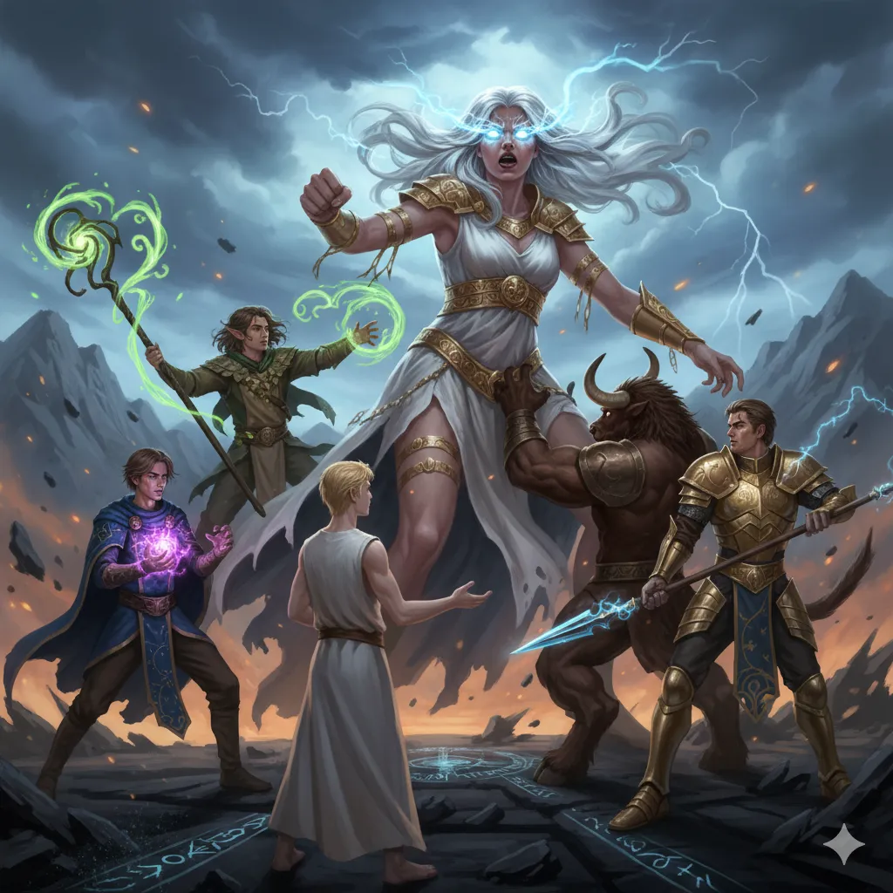
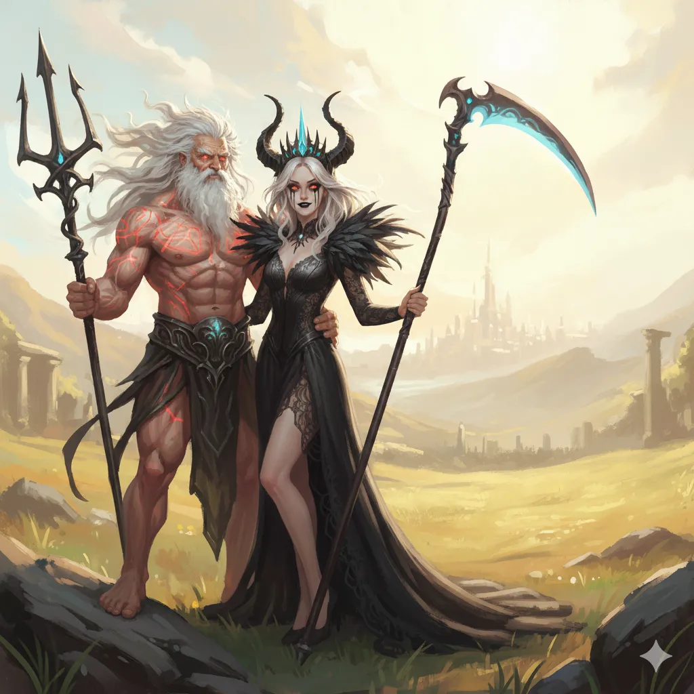
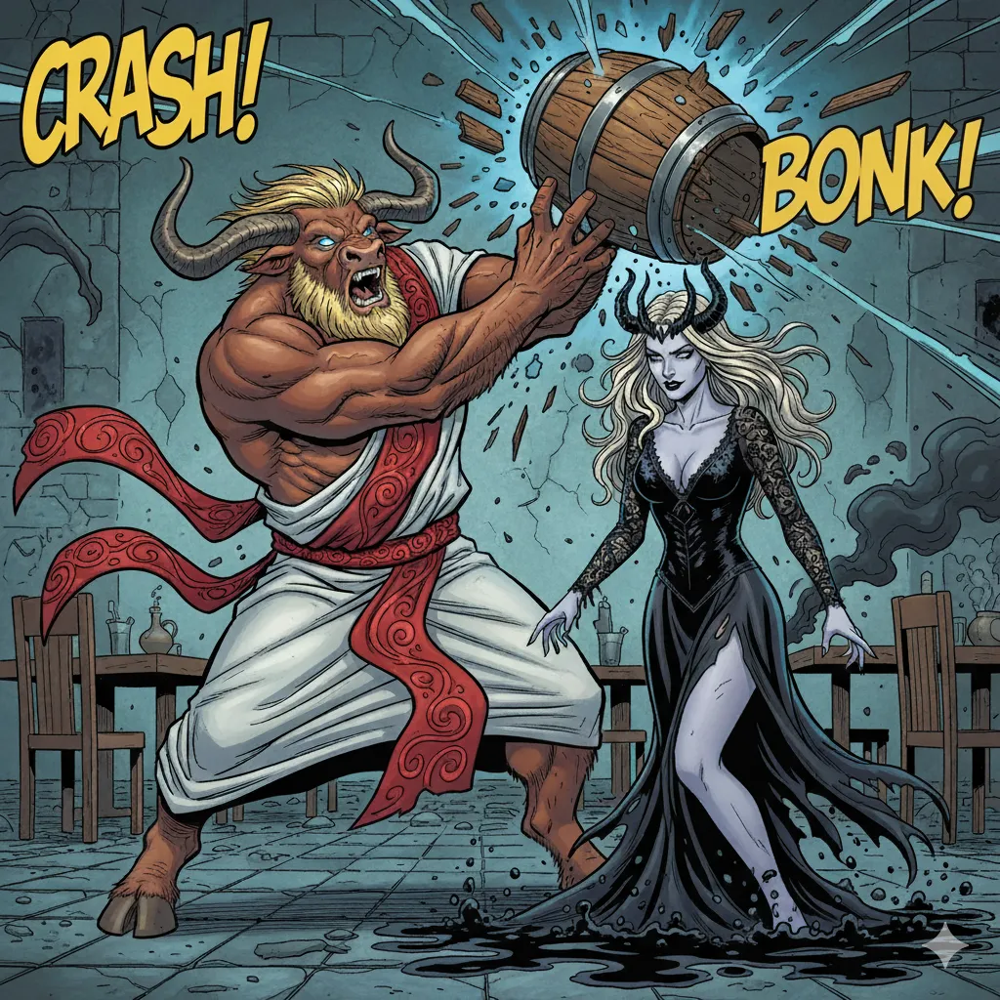
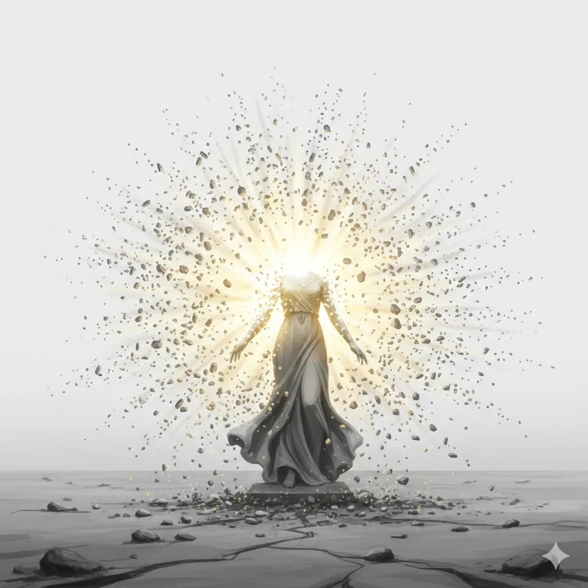
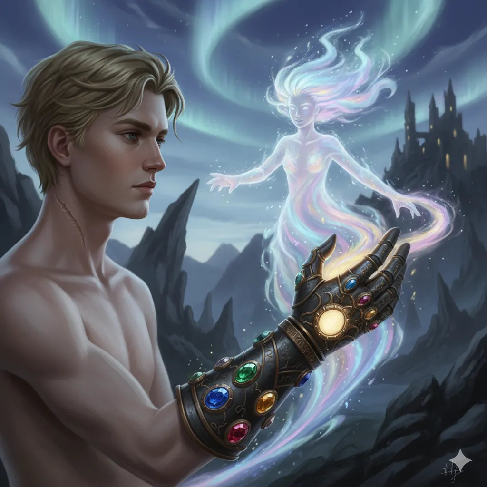
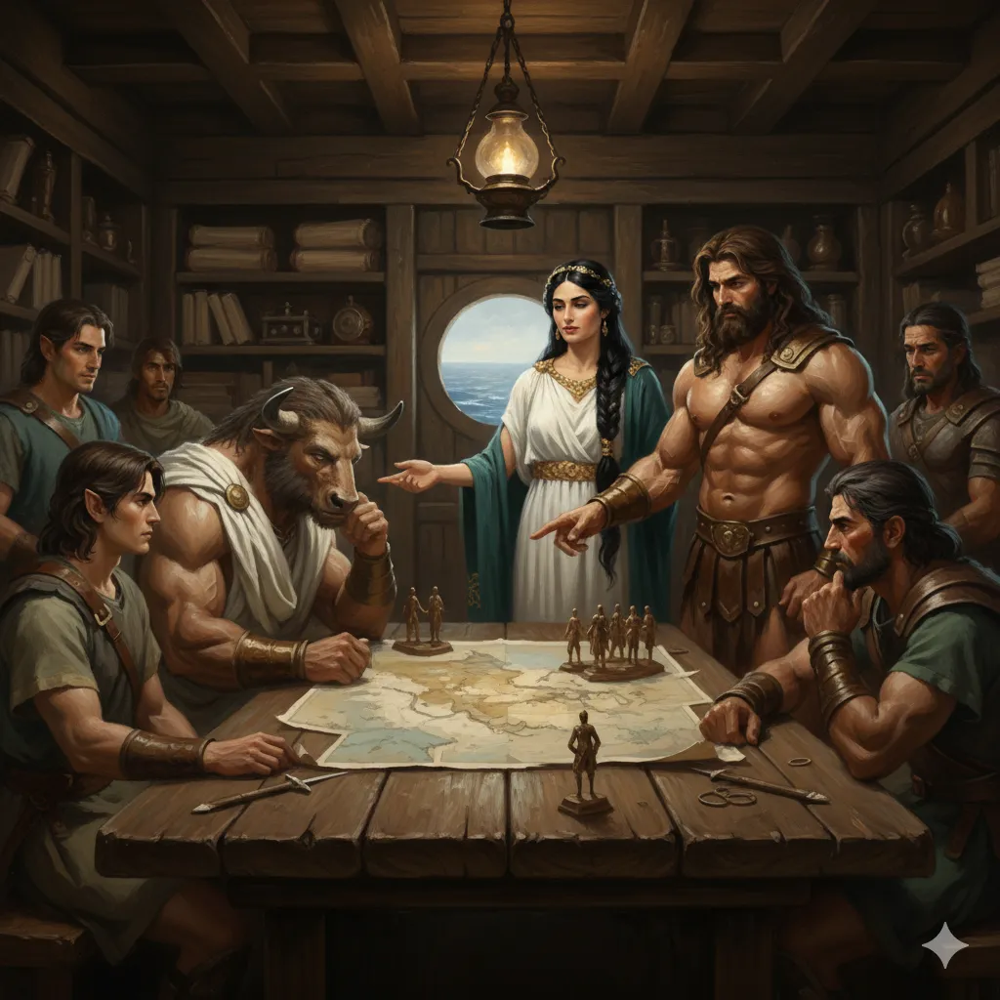
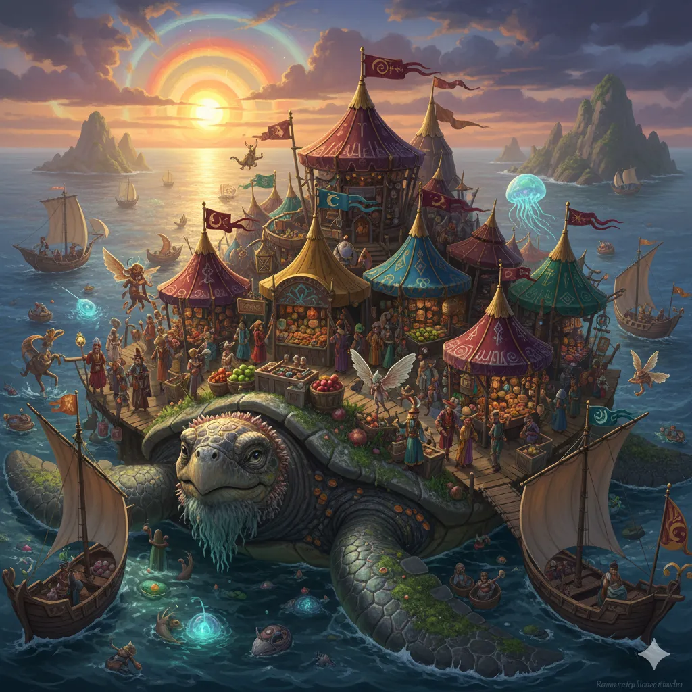

**Data:** 03.11.2025

## Podsumowanie

W  złowieszczej ciszy, jaka spowiła brzegi oleistej, czarnej rzeki [[Styks]],  Bohaterowie Przepowiedni stanęli w obliczu bezkresnej, szarej krainy  umarłych, [[Hades|Hadesu]]. Pod niebem z wirującego popiołu, w lodowatym powietrzu  pozbawionym wszelkich barw, wiła się niekończąca się kolejka  dusz, apatycznie oczekujących na przewoźnika. Pośród  nich, z pustką w oczach, stała znajoma postać – [[Gaius]], fanatyczny sługa  [[Sydon|Sydona]], którego niedawno pozbawili życia. Jego przezroczysta postać,  pozbawiona lśniącej zbroi i autorytetu, drżała z widmowej wściekłości, a  twarz, wciąż naznaczona fanatyzmem, teraz wykrzywiona była także  goryczą zdrady. W zaciśniętej dłoni ściskał monety dla [[Charon|Charona]].  „Powinienem był zostać wskrzeszony!” – jego głos był jedynie lodowatym  szeptem, pozbawionym dawnej mocy. „Albo chociaż trafić do [[Pola Elizejskie|Pól Elizejskich]], a nie do tego przeklętego [[Hades|Hadesu]]!”. [[Felicjan Janus Twardowski|Felicjan]], z szyderczym  spokojem, uniósł brew. „Kto ci to obiecał? [[Sydon]]?”. Pytanie zawisło w  martwym powietrzu, a [[Gaius]], nie potrafiąc na nie odpowiedzieć, jedynie  zgrzytnął zębami. „Nie minie wiele czasu, a [[Sydon]] zbuduje sobie tron z  waszych kości” – wysyczał, lecz jego groźba brzmiała pusto i żałośnie.  [[Orestes]] parsknął śmiechem. „Na kurwich dupach dopłyniemy do raju, a  kurwią dupą będziesz ty, kolego Gaiusie”. Zignorowawszy impotentny gniew  upadłego dowódcy, bohaterowie skupili się na prawdziwym celu. W oddali  majaczył kamienny posąg [[Yala Pierwsza|Yali]], Tytanki Piękna, zamrożonej w pozie  wiecznego przerażenia. [[Versir]], prowadzony niewidzialną nicią  przeznaczenia, ruszył w jej stronę. Blask bijący od jego rękawicy był  jedynym źródłem ciepła i koloru w tej ponurej krainie. Gdy dotknął  zimnego kamienia, szara rzeczywistość [[Hades|Hadesu]] rozprysła się w  kalejdoskopie migoczących obrazów i zniekształconych dźwięków.

Ich świadomości zostały gwałtownie przeniesione do idyllicznej, skąpanej w słońcu krainy, która zdawała się być wspomnieniem dawno utraconego raju. Ujrzeli tam ósemkę tytanich dzieci [[Thylea|Thylei]] w czasach niewinności: kontemplującą [[Versi Pierwsza|Versi]], [[Hergeron|Hergerona]] i [[Goloron|Golorona]] siłujących się w braterskiej zabawie, roześmianą [[Chalcia|Chalcię]] ścigającą się z [[Talieus Pierwszy|Talieusem]], a nawet [[Sydon|Sydona]] i [[Lutheria|Lutherię]], na których twarzach gościł uśmiech, a nie zawiść, gdy obserwowali radosne igraszki rodzeństwa. Wszechogarniające poczucie spokoju i błogości zaczęło sączyć się w ich serca, kusząc obietnicą wiecznego odpoczynku w tym idealnym świecie. Każdy z nich odnalazł tu coś dla siebie: [[Orestes]] natrafił na beczkę najprzedniejszego piwa, jakiego kiedykolwiek kosztował, [[Felicjan Janus Twardowski|Felicjan]] odkrył potężny grymuar pełen nieznanych, niemożliwych wręcz zaklęć, a [[Orion Xul|Orion]] odnalazł legendarną zbroję płytową +2. Jednak w tym raju coś zgrzytało. [[Arevon Elorrenthi|Arevon]], druid o bystrym oku, zauważył, że cienie padają pod złym kątem, a słońce migocze niczym gasnąca żarówka. [[Orestes]], koneser trunków, uznał, że piwo jest aż *zbyt* idealne, by mogło być prawdziwe. W końcu, to właśnie minotaur, w akcie pijackiej brawury, przełamał iluzję. Podszedł do widmowej [[Lutheria|Lutherii]], wylał na nią resztkę piwa i z okrzykiem „Ty stara kurwo, zdejmij ze mnie klątwę!” uderzył ją pustą beczką. W tym momencie postać tytanki rozpłynęła się w kałużę, a cały idylliczny krajobraz zaczął się rozpadać.

Ich dusze ponownie zostały porwane, tym razem do sali treningowej, gdzie byli świadkami innej, bolesnej sceny z przeszłości. Potężny [[Hergeron]] ćwiczył z zaciętością, podczas gdy [[Yala Pierwsza|Yala]] stała z boku, a jej brat i siostra, [[Sydon]] i [[Lutheria]], szeptali jej do uszu zatrute słowa, wmawiając jej, że jest tylko piękna i delikatna, i nigdy nie dorówna siłą bratu. Gdy wizja dobiegła końca, z mroku wyłoniły się upiorne, cieniste istoty o karykaturalnych twarzach bliźniaków, gotowe do ataku. Rozpętała się walka, podczas której bohaterowie musieli stawić czoła nie tylko fizycznemu zagrożeniu, ale i szeptom zwątpienia, które sączyły się w ich umysły przy każdym chybionym ciosie. Mimo to, zgranie i determinacja drużyny przeważyły – ostatni z upiorów rozpłynął się w nicość pod gradem ciosów [[Orion Xul|Oriona]].

Wtedy zostali zauważeni. Yala, odziana w strój treningowy, z obdartymi knykciami i szaleńczą energią w oczach, uśmiechnęła się do nich. „Więcej treningu. Tym razem mi się uda. Będę perfekcyjna” – oznajmiła, po czym rzuciła się na nich z furią uwięzionej bestii. Rozpoczęło się starcie, które od początku wydawało się być niemożliwe do wygrania. Każdy cios, mimo że zadawany z pełną mocą, zdawał się jedynie drażnić tytankę. Orestes, w desperackiej próbie, zdołał ją schwytać w potężnym uścisku, próbując ją unieruchomić, podczas gdy Versir błagał ją, by się ocknęła. Walka była brutalna i wyczerpująca; bohaterowie przyjęli na siebie potężne ciosy, które posłałyby na tamten świat każdego śmiertelnika. W kulminacyjnym momencie, gdy Orestes zadał potężny, krytyczny cios, który napełnił jego topór nową mocą, a Versir ostatkiem sił przemówił do ciotki, coś w niej pękło. Szaleństwo w jej oczach ustąpiło miejsca zmęczeniu i zrozumieniu.

„Strach i zwątpienie to dziwne uczucia” – wyszeptała, ledwo łapiąc oddech. „Musisz wiedzieć, że jeśli kiedykolwiek będziesz czuwał strach, musisz pozwolić mu przejąć kontrolę. Dajesz mu tylko pięć sekund. To wszystko, co mu dajesz. Potem bierzesz rzeczy w swoje ręce. Zrozumiałeś?”. Po tych słowach podziękowała im i zadeklarowała, że jej esencja dołączy do [[Chalcia|Chalcii]] w rękawicy Versira, by wesprzeć go w walce. W tym momencie w świecie materialnym, na brzegu [[Styks|Styksu]], kamienny posąg [[Yala Pierwsza|Yali]] pokrył się siecią pęknięć. Z ogłuszającym zgrzytem, jej kamienne więzienie eksplodowało deszczem nieszkodliwych odłamków, a z jego wnętrza buchnęło oślepiające, złote światło. Eteryczna postać tytanki spojrzała na [[Versir|Versira]] z wdzięcznością, po czym jej esencja wpłynęła do rękawicy, wypełniając jedno z pustych wgłębień przezroczystym kryształem wirującym feerią barw.

Po wykonaniu misji, bohaterowie, nie bez trudu, opuścili [[Hades]], mijając wciąż stojącego w kolejce, zrezygnowanego [[Gaius|Gaiusa]]. Powróciwszy na [[Ultros|Ultrosa]], zostali przywitani owacjami przez załogę, podziwiającą ich za sam fakt powrotu z przeklętego [[Typhon|Typhona]]. Po krótkim świętowaniu, na pokładzie odbyła się narada wojenna. [[Pythor]] i [[Kyrah]], z ciężkim sercem, opowiedzieli im historię [[Arezja|Arezji]] – o zdradzie ich brata [[Narsus|Narsusa]], boga piękna, który sprzymierzył się z jednym ze [[Tytani|Tytanów]], [[Karpathos|Karpathosem]], dowódcą smoczych jeźdźców, i pomógł mu w ucieczce po zabójstwie [[Xander|Xandera]]. Dowiedzieli się o militarystycznym ustroju miasta, rządzonym przez radę mistrzów świątyń-szkół walki, oraz o obecnej władczyni, [[Królowa Helena|Królowej Helenie]], kobiecie o specyficznych upodobaniach, otaczającej się wyłącznie męską służbą i gwardią, której rekrutacja, jak z przekąsem zasugerowała [[Kyrah]], nie opierała się wyłącznie na umiejętnościach bojowych.

W trakcie dalszej podróży, na horyzoncie zamajaczyła dziwna, niezaznaczona na żadnej mapie wysepka. Okazała się ona być grzbietem gigantycznego, prastarego żółwia morskiego, na którym swój wędrowny bazar rozbił ekscentryczny, lewitujący kupiec imieniem [[Shazum]]. Przedstawił się jako podróżnik między światami, oferujący cuda z najdalszych zakątków multiwersum. Bohaterowie, korzystając z okazji, uzupełnili zapasy mikstur leczniczych i zakupili unikatowy magiczny przedmiot. Ku zdumieniu [[Arevon Elorrenthi|Arevona]], [[Shazum]] wspomniał, że bywał w jego rodzinnym świecie, [[Eberron|Eberronie]], choć nie przypadł mu on do gustu. Klientami [[Shazum|Shazuma]] byli również marynarze z [[Arezja|Arezji]], bohaterowie zrozumieli, że los podsuwa im idealną okazję, by wybadać sytuację i dowiedzieć się czegoś więcej o [[Królowa Helena|Królowej Helenie]], zanim sami staną u jej bram.

## Kluczowe wydarzenia / decyzje

* Drużyna przybywa do [[Hades|Hadesu]], gdzie widzi duszę pokonanego [[Gaius|Gaiusa]] i spetryfikowany posąg tytanki [[Yala Pierwsza|Yali]].
* Po dotknięciu posągu, bohaterowie zostają przeniesieni do iluzorycznego wspomnienia o idyllicznym dzieciństwie tytanów.
* [[Orestes]], dzięki podejrzanie idealnemu piwu, przełamuje iluzję, atakując widmową [[Lutheria|Lutherię]].
* Bohaterowie stają do walki z cienistymi upiorami w wizji sali treningowej, symbolizującymi zwątpienie zasiane w [[Yala Pierwsza|Yali]] przez jej rodzeństwo.
* Drużyna toczy wyczerpującą walkę z oszalałą [[Yala Pierwsza|Yalą]], której celem nie jest jej zabicie, lecz przebudzenie jej świadomości.
* Uwolniona od szaleństwa esencja [[Yala Pierwsza|Yali]] dobrowolnie wstępuje do rękawicy Versira, niszcząc swoje kamienne więzienie w świecie materialnym.
* Po powrocie na [[Ultros|Ultrosa]], [[Pythor]] i [[Kyrah]] opowiadają o historii [[Arezja|Arezji]] i zdradzie ich brata, [[Narsus|Narsusa]].
* Podczas podróży drużyna natrafia na wędrowny bazar na grzbiecie gigantycznego żółwia, prowadzony przez ekscentrycznego, międzywymiarowego kupca [[Shazum|Shazuma]].

## Pamiętne Cytaty

* Orestes: "Ty stara kurwo, zdejmij ze mnie klątwę."
* Yala: "Strach i zwątpienie to dziwne uczucia. [...] dajesz mu tylko pięć sekund. To wszystko, co mu dajesz. Potem bierzesz rzeczy w swoje ręce. Zrozumiałeś?"
* Yala: "Więcej treningu. Tym razem mi się uda. Będę perfekcyjna."
* Orestes: "To nie jest normalne piwo. Normalne piwo nie jest tak dobre.."
* Orestes: "Na kurwich dupach dopłyniemy do raju, do tych pól elizejskich, a kurwią dupą będzie właśnie tutaj nasz kolega Gaius."

## Postacie Niezależne (NPC)

* [[Gaius]] (jako dusza w [[Hades|Hadesie]])
* [[Yala Pierwsza|Yala]] (Tytanka Piękna)
* [[Sydon]] (we wspomnieniu i jako cienisty upiór)
* [[Lutheria]] (we wspomnieniu i jako cienisty upiór)
* [[Pythor]]
* [[Kyrah]]
* [[Narsus]] (wspomniany)
* [[Królowa Helena]] (wspomniana)
* [[Shazum]] (międzywymiarowy kupiec)

## Lokacje

* [[Hades]] (brzegi [[Styks|Styksu]])
* Iluzoryczne wspomnienie [[Yala Pierwsza|Yali]] (idylliczna kraina i sala treningowa)
* [[Typhon]]
* Statek [[Ultros]]
* [[Arezja]] (w opowieściach)
* [[Wędrowny Bazar Shazuma]] (na grzbiecie żółwia morskiego)

## Przedmioty

* Rękawica Versira (wypełniona esencją [[Yala Pierwsza|Yali]])
* Iluzoryczne przedmioty (beczka idealnego piwa, potężny grymuar, legendarna zbroja)
* Mikstury lecznicze (zakupione u [[Shazum|Shazuma]])
* [[Różdżka Absorpcji Wody]] (Wand of Aqueous Absorption)
