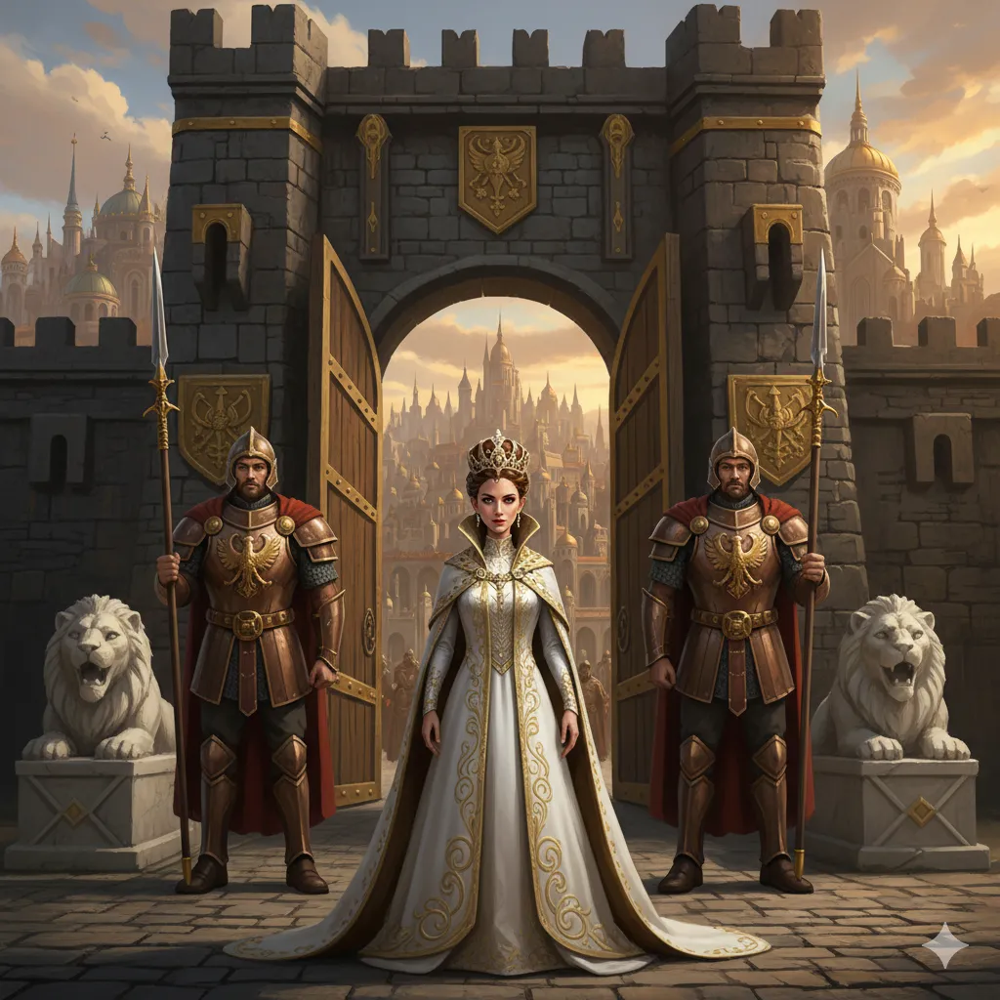
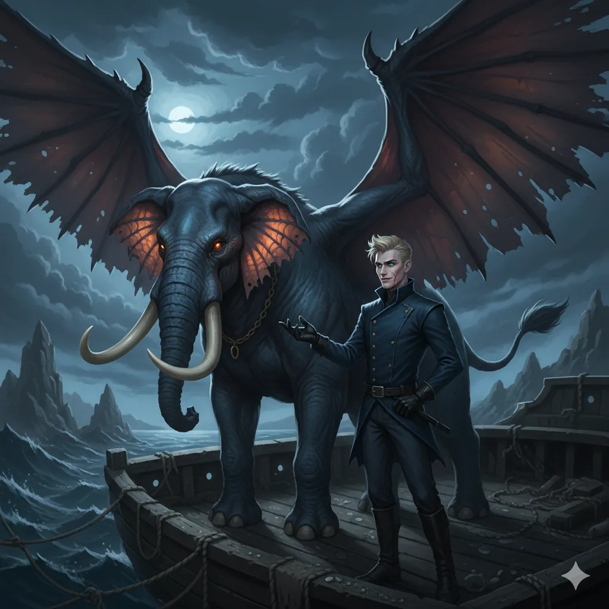
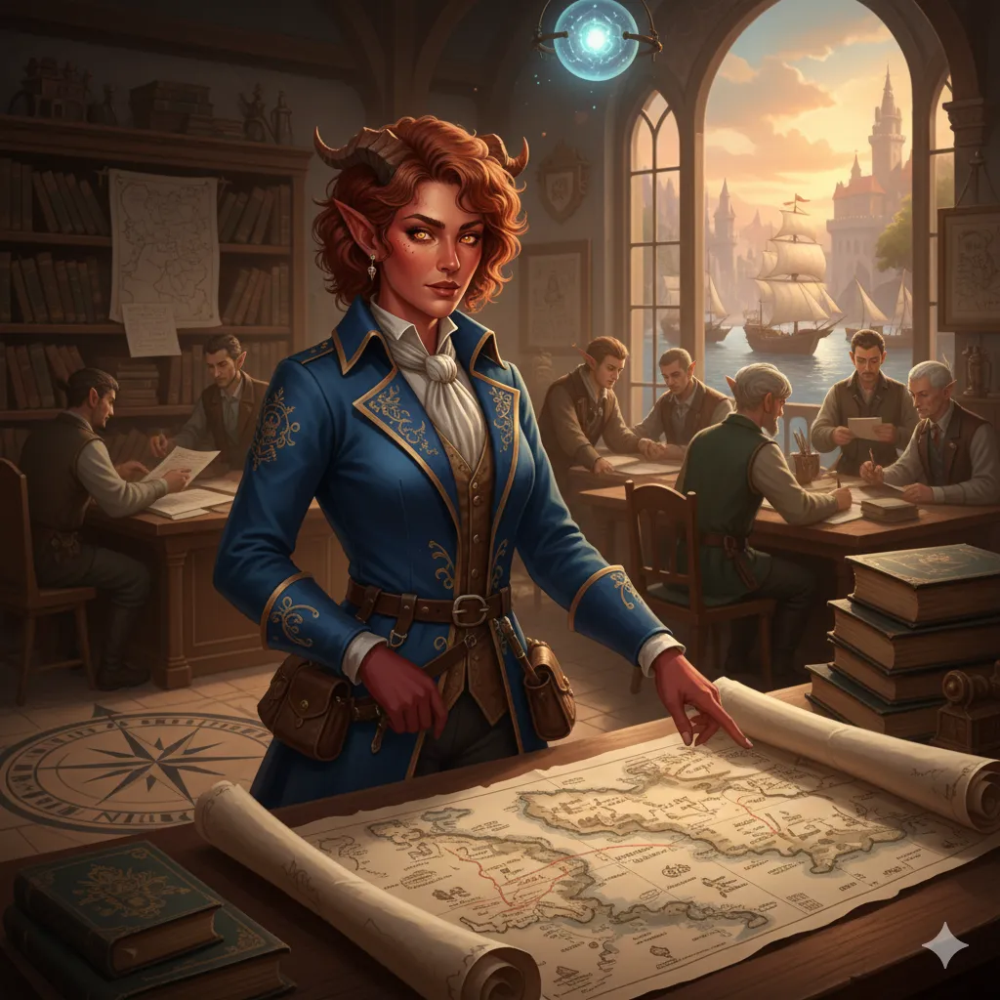
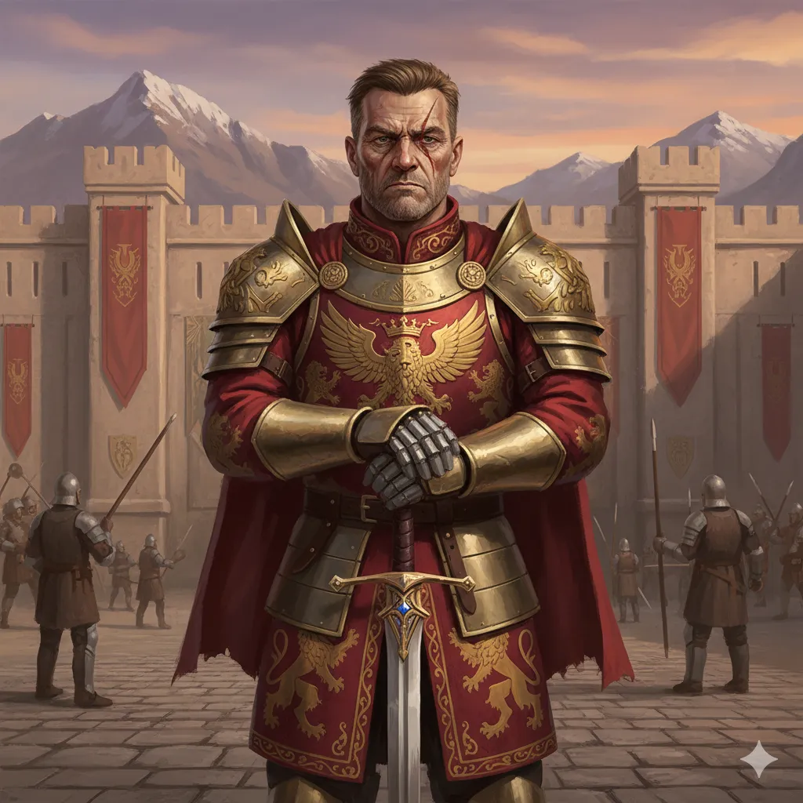
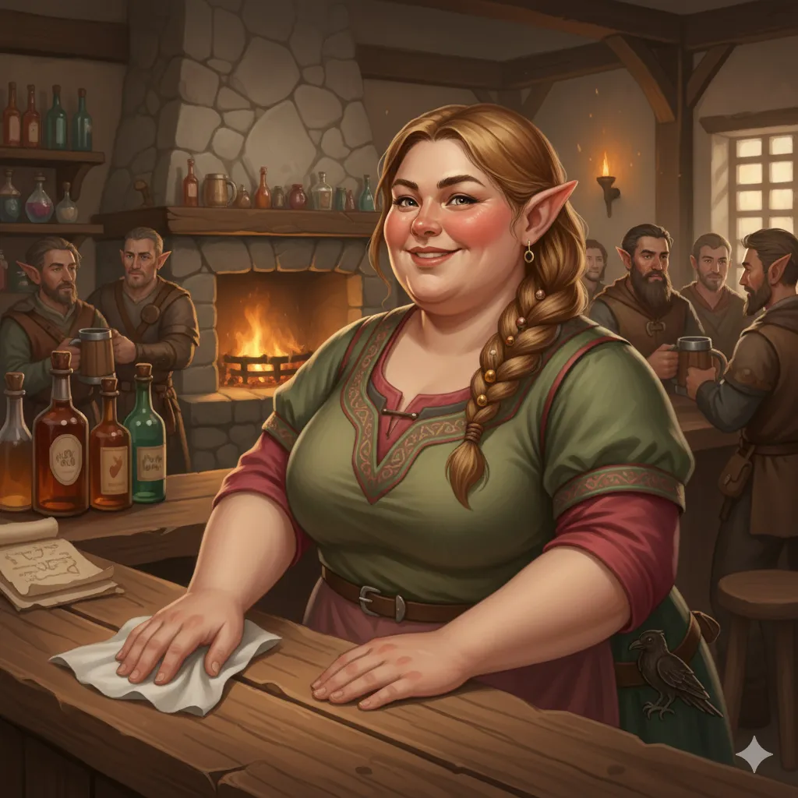
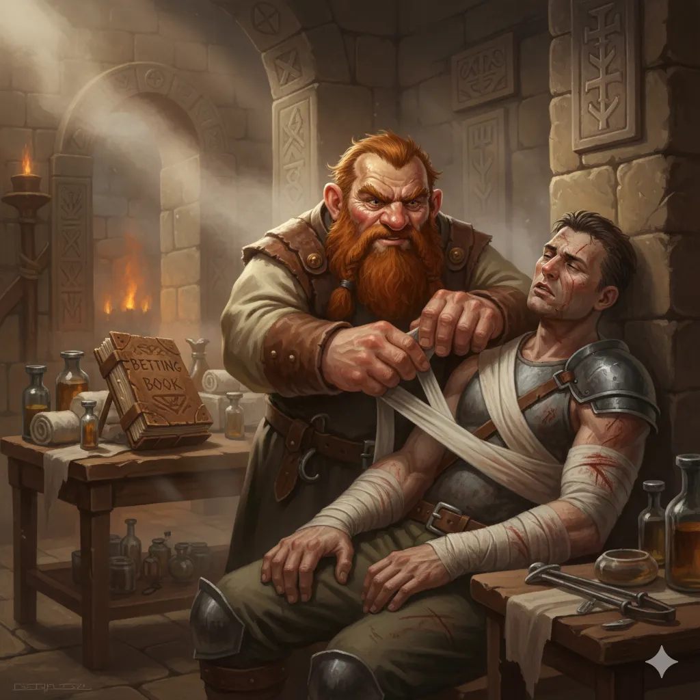
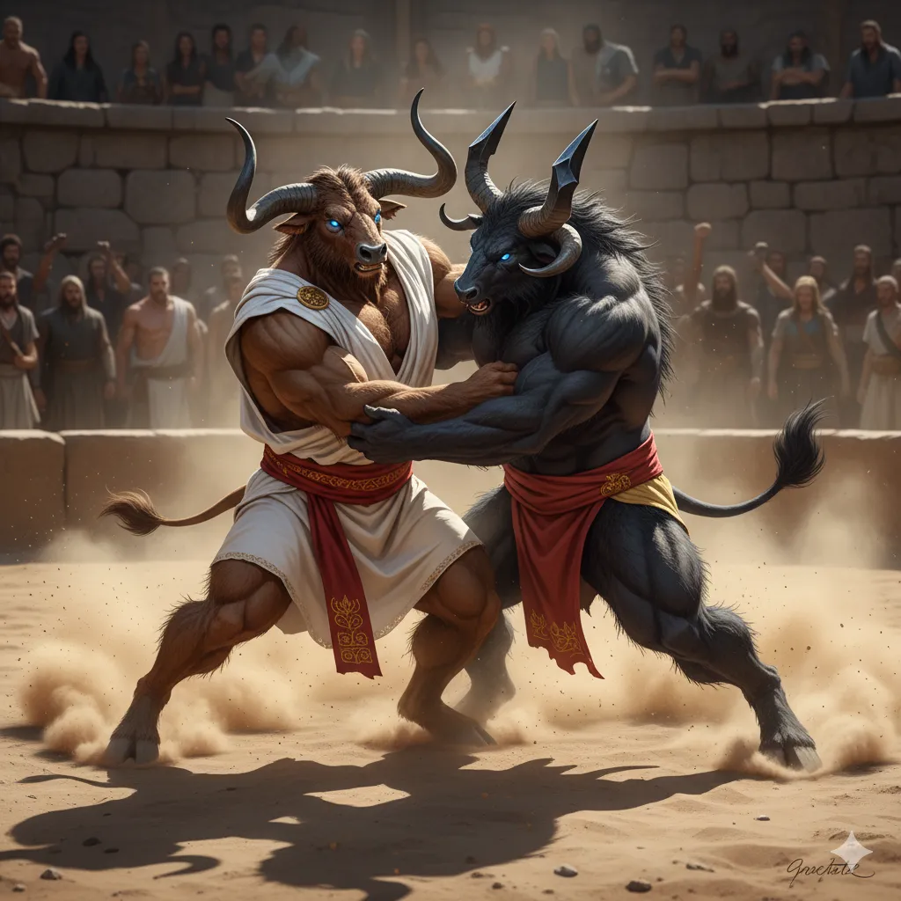
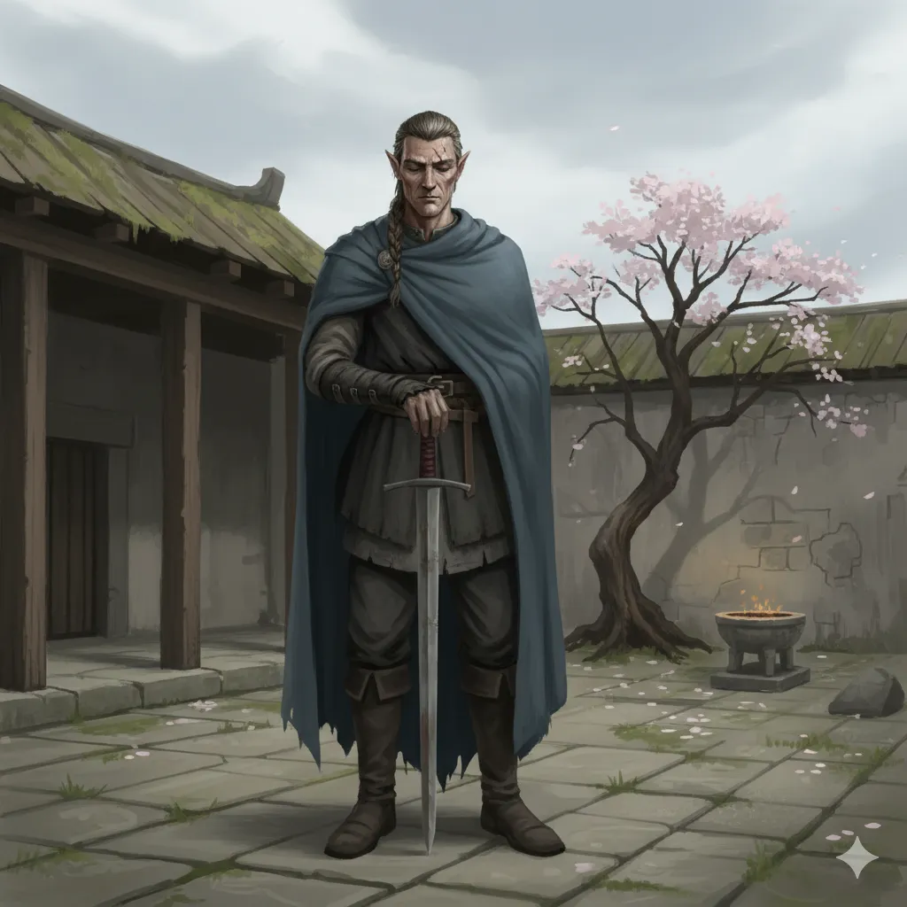
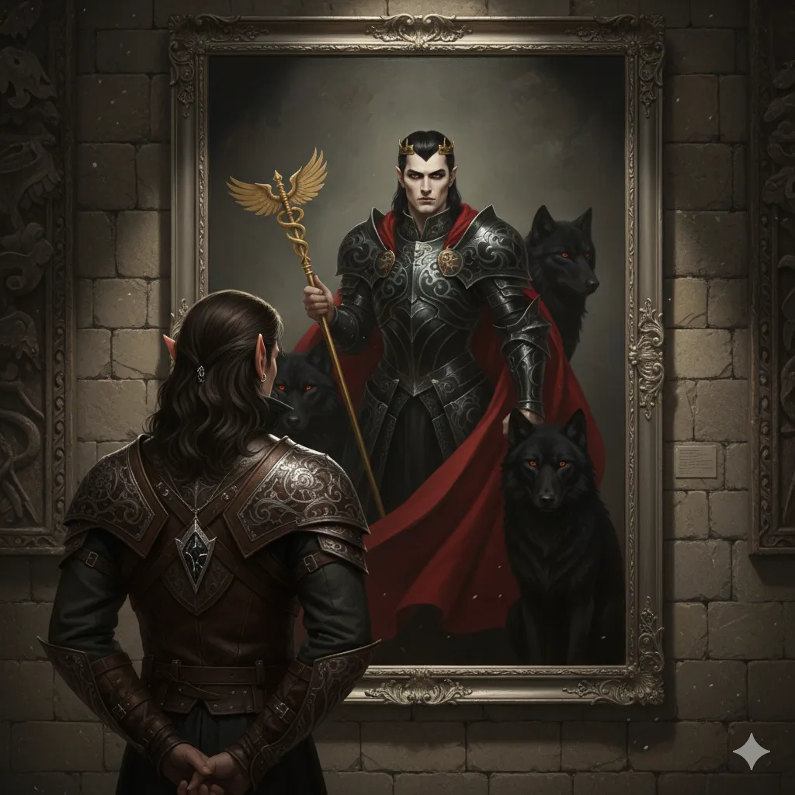
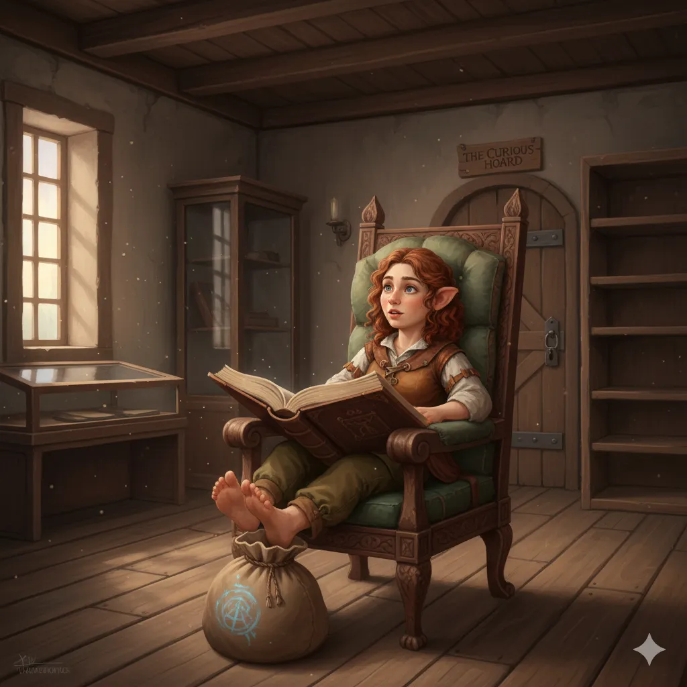

**Data:** 17.11.2025

## Podsumowanie

Na pełnym morzu bohaterowie natrafili na gigantycznego żółwia morskiego, na którego grzbiecie swój kram rozłożył międzywymiarowy kupiec [[Shazum]]. Bohaterowie, korzystając z okazji, nie tylko uzupełnili zapasy, ale przede wszystkim zasięgnęli języka na temat celu swojej podróży u marynarzy z [[Arezja|Arezji]], którzy również handlowali z kupcem. Jeden z nich ostrzegł ich, że [[Arezja]] to kraj surowy i pragmatyczny. [[Królowa Helena]] gardzi kłamstwem i pochlebstwami, ceniąc jedynie siłę i konkretne korzyści dla swojego miasta. Aby zyskać jej przychylność, drużyna musiałaby przekonać do swojej sprawy Radę Pięciu Mistrzów oraz samego boga [[Narsus|Narsusa]], co zapowiadało się na zadanie dyplomatycznie karkołomne.

Zbliżając się do ujścia rzeki Thrake prowadzącej do [[Arezja|Arezji]], bohaterowie podjęli decyzję o ostrożności. Zamiast wpływać do portu potężnym [[Ultros|Ultrosem]] i lewitującą fortecą, co mogłoby zostać odebrane jako akt agresji, zakotwiczyli okręty na niedaleko ujścia rzeki i wsiedli do szalup. [[Versir]], chcąc dodać drużynie nieco splendoru, przyzwał magicznego wierzchowca – skrzydlatego słonia o imieniu [[Trąba]]. Ich przybycie nie uszło uwadze strażników. Drogę zastąpiła im syrena – dumna wysłanniczka [[Arezja|Arezji]], która z pogardą odniosła się do ich tytułów, nakazując oczekiwanie na pozwolenie wpłynięcia. Po dłuższej chwili, wypełnionej nerwowym oczekiwaniem i próbami reklamy piwa przez [[Orestes|Orestesa]], otrzymali zgodę na dobicie do portu rzecznego, pod warunkiem pozostawienia statku i fortecy z daleka.

Na nabrzeżu powitał ich komitet pod wodzą [[Aketa|Akety]], wpływowej tiefling i szefowej Koalicji Kupców. Kobieta, mówiąca z mytrosjańskim akcentem, okazała się konkretna i rzeczowa. [[Orestes]], nie tracąc czasu, próbował nawiązać z nią relacje handlowe, promując piwo ze swojego rodzinnego browaru, co spotkało się ze szczerym zainteresowaniem. Podczas marszu pod mury miasta, [[Arevon Elorrenthi|Arevon]] i [[Felicjan Janus Twardowski|Felicjan]] dostrzegli w pobliskim lesie gigantyczne ślady stóp, sugerujące obecność potężnego konstruktu – legendarnego [[Talos|Talosa]], strażnika [[Arezja|Arezji]], o którym krążyły legendy. Same mury miasta, wznoszące się na trzydzieści metrów i zbudowane z idealnie dopasowanego białego kamienia, robiły kolosalne wrażenie. Nad bramą górował posąg [[Narsus|Narsusa]], przedstawionego jako mężczyzna o nieludzkim pięknie.

Pod bramami doszło do pierwszego, chłodnego spotkania z [[Królowa Helena|Królową Heleną]], która obserwowała przybyszów ze szczytu murów. Władczyni, okazała się osobą oschłą i niewzruszoną, przez większość czasu nie zwracała się bezpośrednio bo bohaterów. Jej głosem był [[Leandros]], dowódca jej gwardii. Argumenty o nadciągającej wojnie z Tytanami i zagrożeniu dla całej Thylei zostały zbyte stwierdzeniem, że mury [[Arezja|Arezji]] i [[Talos]] są wystarczającą ochroną. Nie zamknęła jednak przed nimi bram ostatecznie. Dała bohaterom ultimatum: zostaną wpuszczeni do miasta, ale aby uzyskać audiencję i jakiekolwiek wsparcie, muszą najpierw przekonać do swojej sprawy Wielkich Mistrzów poszczególnych świątyń. Jeśli Mistrzowie uznają, że sojusz leży w interesie [[Arezja|Arezji]], królowa rozważy ich prośbę.

Po zakwaterowaniu w mieście, drużyna niezwłocznie przystąpiła do działania, zbierając plotki i informacje. Dowiedzieli się o tajemniczych tunelach łączących pałac ze świątyniami, o duchu nawiedzającym królewski skarbiec oraz o magicznym obrazie w galerii. [[Jocasta]] - barmanka z gospody  [[Czerwony Lotos]], przybliżyła im sylwetki Mistrzów: [[Halcyon]] (Mistrzyni Tarczy), [[Taureus|Taureusa]] (Mistrza Żywiołów – minotaura gardzącego Mytros), [[Hiero]] (Mistrza Miecza), [[Laertes|Laertesa]] (Mistrza Spokoju, obsesyjnie szukającego idealnej oliwki) oraz tajemniczego [[Jocasta|Mistrza Cieni]].

Pierwsze kroki skierowali do [[Sanktuarium]], pełniącego rolę łaźni, szpitala i świątyni. Spotkali tam krasnoluda [[Lennicus|Lennicusa]], który opatrywał rannych i jednocześnie przyjmował zakłady na walki. [[Arevon Elorrenthi|Arevon]] zaimponował mu, magicznie lecząc rannego gladiatora. W sanktuarium bohaterowie zauważyli, że posągi bogów, z wyjątkiem zadbanej statuy [[Kyrah]] i złotego posągu [[Narsus|Narsusa]], są w opłakanym stanie, co świadczyło o braku wiary w Pięciu Bogów w tym regionie.

Następnie udali się do [[Świątynia Tarczy|Świątyni Tarczy]], domeny Mistrzyni [[Halcyon]]. Wśród ćwiczących hoplitów w czerwonych płaszczach, [[Versir]] rzucił wyzwanie, proponując próby siły jako dowód ich wartości. [[Halcyon]] wystawiła swojego czempiona, potężnego minotaura [[Keteus|Keteusa]], do walki zapaśniczej z [[Orestes|Orestesem]]. Starcie było zacięte, ale [[Orestes]], wykorzystując swoją brutalną siłę i technikę, powalił przeciwnika, a na koniec z zadziwiającą łatwością cisnął nim pod nogi Mistrzyni. Mistrzyni Tarczy, widząc siłę i honor bohaterów, obiecała zwrócić się do królowej w ich imieniu.

Kolejnym celem była skromna [[Świątynia Miecza]], gdzie rezydował mistrz [[Hiero]], półelf o stoickim spokoju. [[Hiero]], wyznający zasadę, że słowa są tanie jak liście na wietrze, zażądał dowodu ich czynów. Bohaterowie opowiedzieli o pokonaniu [[Gaius|Gaiusa]], dowódcy Zakonu Sydona, i jego smoka, a także o innych przygodach, gdzie na szali było ich własne życie. [[Hiero]], uznając wagę ich dokonań, zgodził się poprzeć ich sprawę przed królową.

W międzyczasie drużyna odwiedziła lokalną [[Galeria Sztuki|Galerię Sztuki]]. Ich uwagę przykuł emanujący magią transmutacji i nekromancji portret pierwszego króla [[Arezja|Arezji]], [[Karpathos|Karpathosa Wilczego Lorda]]. Plotki głosiły, że w [[Portret Karpathosa|obrazie]] uwięziona jest dusza samego króla, co czyniło dzieło niepokojącym i bezcennym. Podobno ktoś z Mytros zaoferował za niego 30 tysięcy sztuk złota. Bohaterowie dowiedzieli się również od sprzedawcy oliwek, że sekret „idealnej oliwki”, której poszukuje Mistrz [[Laertes]], posiadać ją maja druidzi centaurów pod wodzą króla Agriusa.

Dzień zakończył się wizytą w sklepie magicznym prowadzonym przez niziołkę [[Haidee]]. Bohaterowie wpadli w szał zakupów, nabywając szereg magicznych przedmiotów. Transakcja opiewała na tak dużą sumę, że zachwycona [[Haidee]] natychmiast zamknęła sklep i udała się na długie wakacje, zostawiając bohaterów z lżejszą sakiewką, ale lepiej wyposażonych na nadchodzące wyzwania. Z dwoma Mistrzami po swojej stronie, drużyna zaczęła planować kolejne kroki w walce o sojusz z [[Arezja|Arezją]].

## Kluczowe wydarzenia / decyzje

* Przybycie do ujścia rzeki Thrake i oczekiwanie na zgodę na przybicie do lądu.
* Odkrycie przez [[Arevon Elorrenthi|Arevona]] i [[Felicjan Janus Twardowski|Felicjana]] śladów gigantycznego konstruktu [[Talos|Talosa]] w pobliżu murów.
* Otrzymanie ultimatum od [[Królowa Helena|Królowej Heleny]]: zdobycie poparcia Pięciu Mistrzów warunkiem prywatnej audiencji.
* [[Orestes]] wygrywa pojedynek zapaśniczy z czempionem [[Keteus|Keteusem]], zdobywając poparcie Mistrzyni Tarczy [[Halcyon]].
* Przekonanie stoickiego Mistrza Miecza [[Hiero]] opowieścią o pokonaniu [[Gaius|Gaiusa]] i jego smoka.
* Wizyta w [[Galeria Sztuki|Galerii Sztuki]] i odkrycie emanującego nekromancją [[Portret Karpathosa|portretu Karpathosa Wilczego Lorda]].
* Wykupienie większości asortymentu w sklepie magicznym u niziołki [[Haidee]], która po zarobieniu fortuny zamyka interes.

## Pamiętne Cytaty

* Dungeon Master (Syrena): "Każdy ruch w głąb rzeki bez mojego pozwolenia zostanie potraktowany jako akt agresji."
* [[Versir]]: "Jeżeli przegramy, możesz skorzystać z siły przegranego przez jeden dzień... Będzie Twoim służącym."
* Dungeon Master ([[Hiero]]): "Słowa są jak liście na wietrze. Obietnice jak cienie."
* [[Orestes]]: "Gaius potwierdziłby, gdyby mógł jeszcze potwierdzać."
* [[Arevon Elorrenthi|Arevon]]: "Gaius nie żyje... Więc już nie wróci."
* Dungeon Master (o [[Haidee]]): "Pani Niziołek [[Haidee]] jest bardzo zadowolona. Jak wychodzicie ze sklepu od razu zamyka, już jest zamknięte, wraca za miesiąc."

## Postacie Niezależne (NPC)

* [[Shazum]] (międzywymiarowy kupiec)
* [[Trąba]] (magiczny skrzydlaty hefalump [[Versir|Versira]])
* [[Aketa]] (tiefling, szefowa koalicji kupców)
* [[Królowa Helena]] (Władczyni [[Arezja|Arezji]])
* [[Lennicus]] (krasnolud, zarządca [[Sanktuarium]])
* [[Halcyon]] (Mistrzyni Tarczy)
* [[Keteus]] (minotaur, czempion [[Halcyon|Halcyon]])
* [[Hiero]] (Mistrz Miecza)
* [[Haidee]] (niziołka, właścicielka sklepu magicznego)

## Lokacje

* Ujście rzeki Thrake
* Mury [[Arezja|Arezji]]
* [[Sanktuarium]] (łaźnie i szpital)
* [[Świątynia Tarczy]]
* [[Świątynia Miecza]]
* [[Galeria Sztuki]]
* Sklep Magiczny [[Haidee]]

## Przedmioty

* [[Portret Karpathosa|Portret Karpathosa Wilczego Lorda]]
