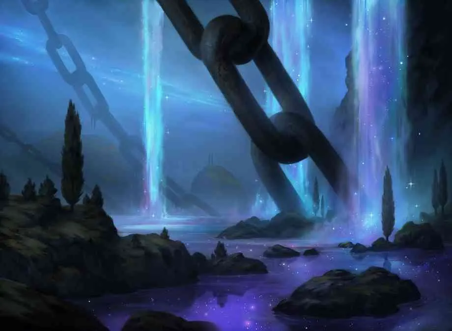
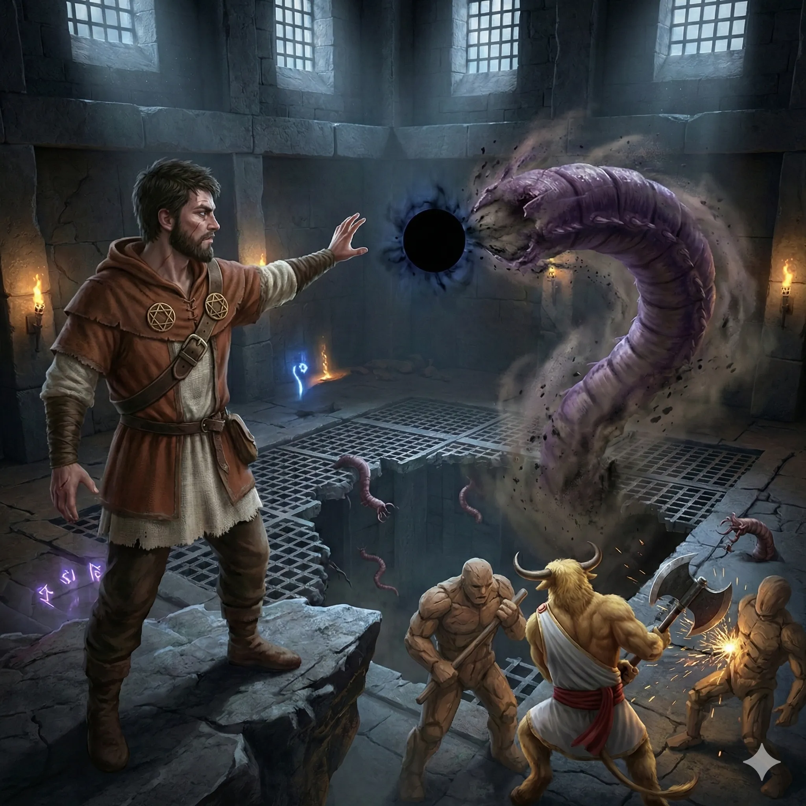
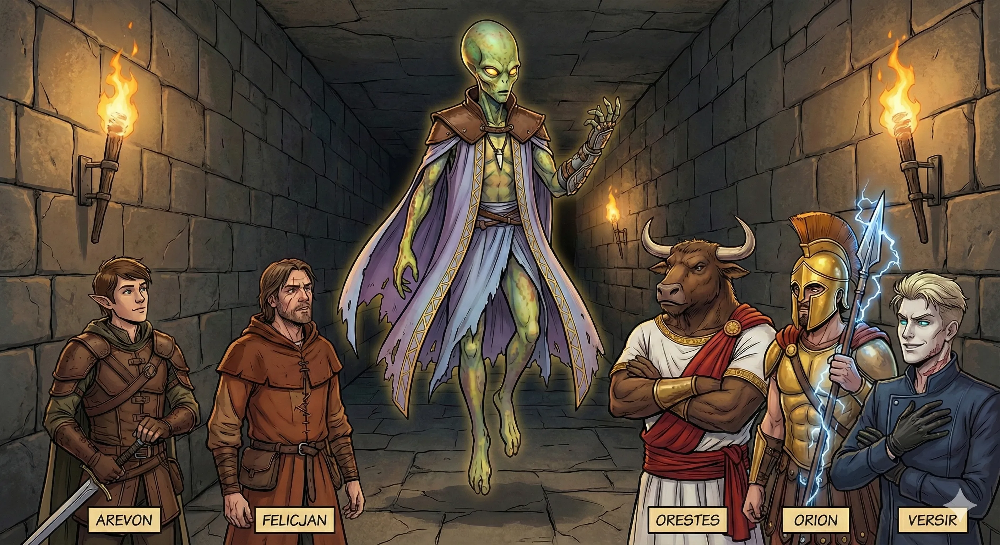
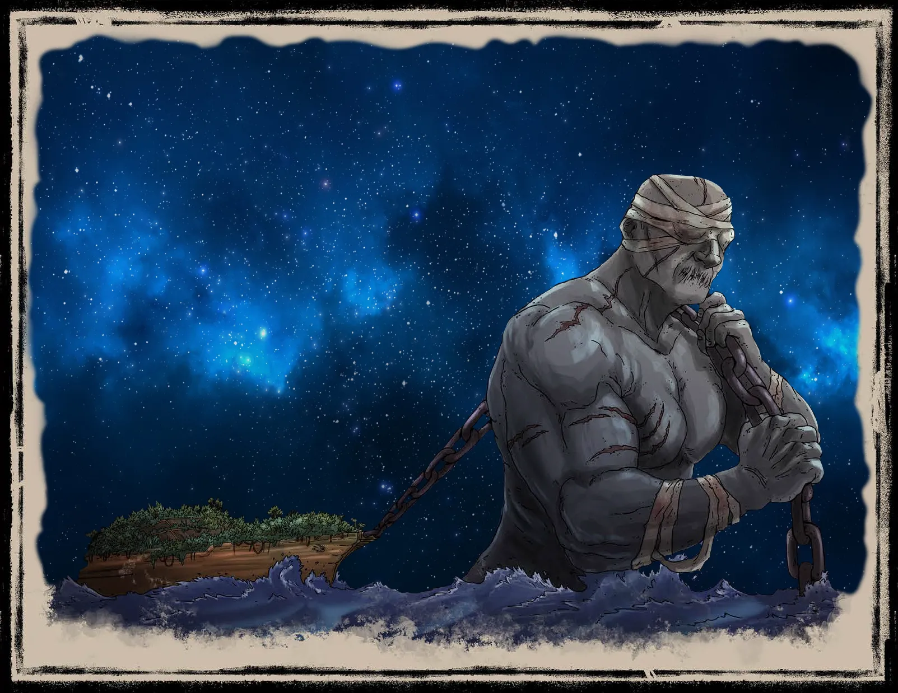
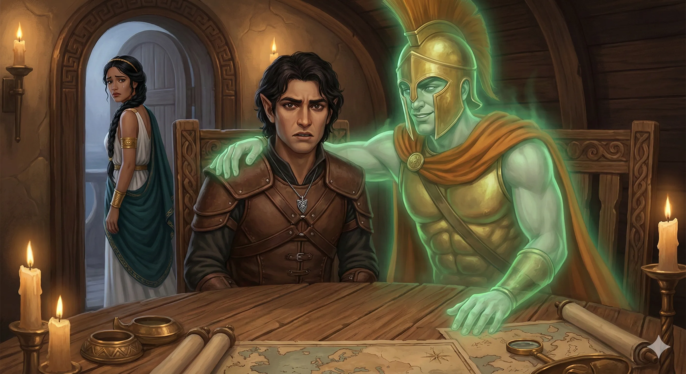
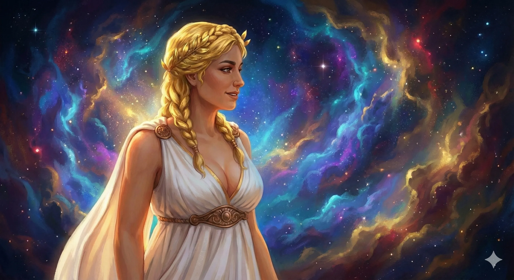

**Data:** 2026-01-14

## Podsumowanie

### Taniec ze Sferą i Przebudzenie Bestii

Drużyna kontynuowała mordercze starcie z konstruktami i gigantycznymi czerwiami wewnątrz [[Sześcian Więzienny|Sześcianu Więziennego]]. **[[Versir]]**, wciąż cierpiący po makabrycznej utracie dłoni, musiał polegać na defensywnej magii i unikach, podczas gdy **[[Orestes]]**, napędzany furią, ciskał się na wrogów z siłą giganta wzgórz. Kluczowym momentem starcia okazał się jednak czyn **[[Felicjan Janus Twardowski|Felicjana Janusa Twardowskiego]]**. Czarodziej, ryzykując własnym umysłem, nawiązał mentalną więź z przerażającą **Sferą Anihilacji** – tym samym bytem, który wcześniej okaleczył jego towarzysza. Z nienaturalną precyzją Felicjan zaczął sterować kulą czystej nicości, przesuwając ją po polu bitwy. Efekt był piorunujący: cielska gigantycznych czerwiów, dotknięte przez sferę, znikały w niebycie, dezintegrowane na poziomie atomowym, co ostatecznie przechyliło szalę zwycięstwa na stronę bohaterów. **[[Arevon Elorrenthi|Arevon]]**, wykorzystując potęgę druidzkiej magii, przywołał księżycowe światło, dobijając wrogów.

Gdy bitewny kurz opadł, bohaterowie przystąpili do eksploracji złowrogiego kompleksu. Odkryli pomieszczenie ze zbiornikiem wypełnionym kwasową trucizną. **Felicjan**, powodowany ostrożnością i ciekawością, wysłał magiczne oko w dół odpływu, by zbadać, dokąd prowadzą rury. Uwolniony kwas spływałby do gigantycznej komory poniżej, gdzie spoczywał uśpiony **[[Tarrasque]]** – legendarny pożeracz światów. Drużyna ruszyła dalej, trafiając do kolejnego, oddzielnego pomieszczenia strzeżonego przez golema przy dźwigniach. Na widok intruzów, konstrukt pociągnął za jedną z wajch, otwierając boczną kratę, przez którą do środka zaczęła wlewać się fala wijących się, młodych czerwi.

W obliczu zagrożenia zalaniem przez potwory, **Felicjan** użył telekinezy, by pociągnąć za drugą dźwignię. Podłoga otworzyła się, a masa wijących się bestii runęła w przepaść, prosto do leża Tarrasque’a. Wtedy **[[Orion Xul|Orion]]**, chcąc dobić pozostałych wrogów, uderzył w swą magiczną tarczę, wyzwalając potężną falę gromu (*Thunderwave*). Huk eksplozji, w połączeniu z zapachem świeżych czerwi spadających na pysk uśpionej bestii, doprowadził do katastrofy. Potężne wstrząsy targnęły całym sześcianem, a ryki dobiegające z głębin nie pozostawiały złudzeń – **[[Tarrasque]]** został obudzony.

### Pakt z Zarządcą i Cień Lutherii

Gdy fundamenty więzienia drżały, z cienia wyłoniły się trzy brązowe automatony, a za nimi lewitująca postać o wydłużonej głowie bez ust. Nie był to jednak kolejny bezmyślny konstrukt, lecz **[[The Keeper]]** (Ultroloth) – demoniczny zarządca tego przybytku. Istota ta, komunikując się telepatycznie, okazała się znużonym i cynicznym urzędnikiem, a nie fanatycznym sługą. Poinformował on bohaterów, że **[[Lutheria]]**, Pani Snów, jest już w drodze, zaalarmowana hałasem. Zaproponował jednak układ: jeśli bohaterowie w przyszłości dostarczą mu Kosę Lutherii, on pomoże im w ostatecznym rozwiązaniu problemu uwolnionego Tarrasque'a.

Bohaterowie, rozumiejąc, że dalsza obecność w sześcianie grozi śmiercią z rąk Tytanki lub Pradawnej Bestii, rzucili się do ucieczki na powierzchnię. **Felicjan** pozostawił za sobą magiczne oko na schodach, by obserwować rozwój wydarzeń. Zobaczył jedynie, jak The Keeper opuszcza sześcian i wita się z nowo przybyłą postacią, lecz wizja nie zdradziła szczegółów rozmowy. W pośpiechu drużyna odbiła od brzegu na pokładzie **[[Ultros|Ultrosa]]**, wiosłując ile sił w rękach, by oddalić się od epicentrum nadchodzącego gniewu Pani Snów.

### Złamany Tytan i Drugi Sześcian

Płynąc przez surrealistyczne wody [[Morze Otchłani|Morza Otchłani]], **Orion** dostrzegł na horyzoncie gigantyczną sylwetkę brodzącą w czarnych wodach. Był to **[[Talieus Pierwszy|Talieus]]**, dawny Tytan Rzemiosła, z oczami przesłoniętymi bandażami, ciągnący na potężnych łańcuchach okręt Luterii ([[Hypnos]]) niczym niewolnicze zwierzę pociągowe. Widok ten wstrząsnął **[[Versir|Versirem]]**, który jest spokrewniony z Tytanami. Wykorzystując magię, wysłał do Talieusa wiadomość: *"Witaj wujku. Jesteśmy na morzu otchłani, żeby cię odbić. Jakie sztuczki czekają na nas na statku? O czym powinniśmy wiedzieć?"*. Odpowiedź, która nadeszła po chwili ciszy, była krótka i łamiąca serce: *"Jestem... złamany"*. Słowa te dobitnie uświadomiły drużynie, jak okrutny los spotkał dawnych władców pod jarzmem Luterii.

Błądząc po morzu w poszukiwaniu bezpiecznej przystani, **[[Ultros]]** natknął się przypadkiem na kolejny lewitujący sześcian, identyczny z poprzednim. **Versir**, mając nadzieję na uwolnienie kolejnych sojuszników lub zdobycie zasobów, podleciał do włazu i wypowiedział hasło *"Thanatos"*, które zadziałało wcześniej. Tym razem jednak mechanizm pozostał niewzruszony – hasło było inne, a sześcian pozostał zamknięty, pozostawiając jego zawartość tajemnicą.

### Upiorna Narada z Estorem

Bezpieczni na chwilę na otwartych wodach, bohaterowie zebrali się w kajucie narad, by ustalić dalszy plan. Niespodziewanie, na jednym z krzeseł zmaterializował się duch **[[Estor Arkelander|Estora Arkelandera]]**. Na widok upiornego kapitana, bogini **[[Kyrah]]** zbladła z przerażenia. Gdy tylko bohaterowie zaczęli paktować ze zjawą, Kyrah, nie mogąc znieść obecności swojego dawnego dręczyciela, opuściła pomieszczenie.

Estor szczegółowo opisał topografię domeny Luterii, wskazując kluczowe cele:
*   **Wyspa Tytanów** – miejsce kaźni rodzeństwa Versira.
*   **[[Wyspa Krzywoprzysięstwa]]** – rządzona przez znudzonego demona, który niegdyś marzył o otwarciu nielegalnej areny walk.
*   **[[Hypnos]]** – osobisty okręt Luterii.
*   **Dawne Więzienie Krakena** – miejsce, które Estor określił jako "wisienkę na torcie".

Duch wyjawił, że w dawnym leżu Krakena spoczywają szczątki Gregora i Hezzebala wraz ze skarbami Smoczych Lordów. To tam znajduje się przedmiot pożądania Estora – jego dawny miecz. W trakcie rozmowy doszło do mrożącej krew w żyłach interakcji. Estor objął **Arevona** swoim niematerialnym ramieniem, przypominając z sadystyczną satysfakcją, że łączy ich specjalna więź, odkąd to on, Estor, brutalnie zamordował elfa na pokładzie tego statku. Zjawa zażądała, by po odnalezieniu miecza, użyć go na nim samym – Estor pragnie ostatecznego końca, którego jako duch nie może zaznać.

### Depresja Wielorybów i Zaproszenie Kalisto

Następnego ranka **Arevon** podjął próbę komunikacji z martwymi wielorybami, które podążały za statkiem. Stworzenia te nie pragnęły śmierci, lecz celu, którego w swojej egzystencji zostały pozbawione. Bohaterowie nie byli jednak w stanie przedstawić im oferty, która wyrwałaby je z letargu.

Niedługo potem do burty Ultrosa zbliżyła się niewielka łódź wiosłowa. Kobieta na jej pokładzie, **[[Kalisto]]**, zachowała bezpieczny dystans i nie weszła na pokład. Przekazała oficjalne zaproszenie od samej **[[Lutheria|Luterii]]**, która, świadoma obecności gości, zaprosiła ich na pokład **[[Hypnos|Hypnosa]]** na ucztę, gwarantując *Prawo Gościnności*. Drużyna, podejrzewając podstęp i nie chcąc wchodzić prosto w paszczę lwa bez przygotowania, zignorowała ofertę przewodnictwa Kalisto. Zamiast tego, obrali kurs na wskazane przez Estora dawne leże Krakena, licząc na zdobycie potężnego oręża przed nieuchronną konfrontacją z Panią Snów.

## Kluczowe wydarzenia
- Walka z konstruktami i gigantycznymi czerwiami w [[Sześcian Więzienny|Sześcianie]].
- [[Felicjan Janus Twardowski|Felicjan]] przejmuje kontrolę nad Sferą Anihilacji, niszcząc wrogów.
- Przypadkowe przebudzenie [[Tarrasque|Tarrasque'a]] przez zrzucenie czerwi i falę gromu.
- Spotkanie z [[The Keeper|The Keeperem]] (Ultrolothem), zarządcą więzienia, i zawarcie wstępnego paktu (Kosa Luterii za pomoc).
- Ucieczka z walącego się więzienia na pokład [[Ultros|Ultrosa]].
- Odnalezienie [[Talieus Pierwszy|Talieusa]], Złamanego Tytana, ciągnącego okręt [[Hypnos]].
- Nieudana próba otwarcia drugiego lewitującego sześcianu.
- Spotkanie z duchem [[Estor Arkelander|Estora Arkelandera]] i uzyskanie informacji o domenie Luterii.
- Próba porozumienia się z martwymi wielorybami przez [[Arevon Elorrenthi|Arevona]].
- Odrzucenie zaproszenia [[Lutheria|Luterii]] przekazanego przez [[Kalisto]].

## Cytaty
- [[Talieus Pierwszy|Talieus]]: "Ja... ...jestem... ...złamany."
- [[The Keeper]]: "Możemy dobić targów przyszłości. Przynieście kosę, pomogę Wam z Tarrasque."
- [[Estor Arkelander]]: "Spróbuję się nim dźgnąć."
- [[Kalisto]]: "Witajcie. Jestem Kalisto. Przybyłam tu w imieniu Pani Snów, która wita was w swojej domenie."
- [[Felicjan Janus Twardowski|Felicjan]]: "Dlaczego, dlaczego ją tu trzymacie w ogóle? Kto trzyma taką bestię gdziekolwiek?"
- [[Estor Arkelander]]: "Mamy tutaj z Arevonem mamy specjalną więź, od kiedy go zarąbałem."

## Postacie
- [[The Keeper]] (Zarządca Więzienia)
- [[Talieus Pierwszy|Talieus]] (Tytan Rzemiosła)
- [[Estor Arkelander]]
- [[Kalisto]]
- [[Lutheria]] (Pani Snów)
- [[Tarrasque]]
- [[Kyrah]]

## Lokacje
- [[Sześcian Więzienny|Sześcian]] (Więzienie Tarrasque'a)
- [[Morze Otchłani]]
- [[Ultros]]
- [[Hypnos]] (Okręt Lutherii)
- [[Wyspa Krzywoprzysięstwa]]

## Przedmioty
- Sfera Anihilacji
- Kosa Lutherii

## Filmy

