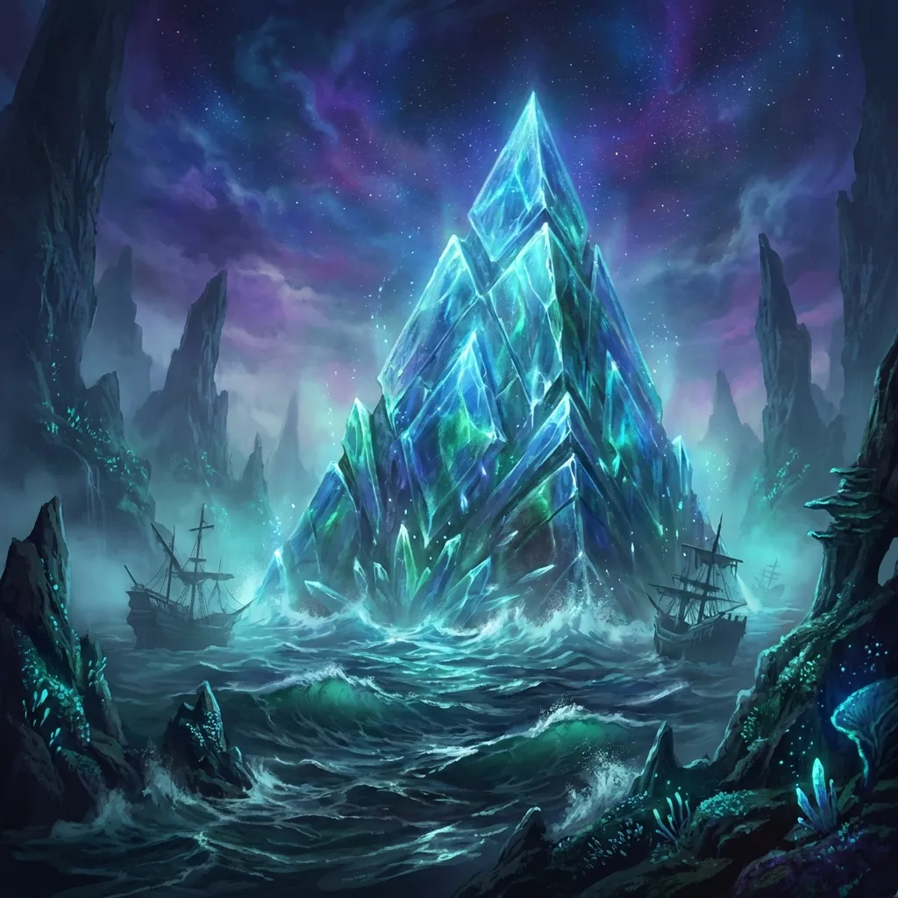

**Data:** 27.01.2026

## Podsumowanie

### Cienie Przeszłości

![Draw young adult female, beautiful ancient Greek goddess, slender build, olive skin, long wavy black hair styled in a braid, loose curls framing her face, captivating green eyes, light freckles across her nose, gentle smile, wearing a white chiton and a dark teal-green himation, adorned with ornate gold jewelry, golden Greek key armband, gold pendant necklace, golden hair clip, dangling gold earrings standing on the wooden deck of a Greek trireme ship at night, looking sad and contemplative while talking to young adult male elf with a slender build, angular face with high cheekbones, sharp jawline, intense dark eyes, and long pointed ears, shoulder-length wavy dark brown hair, wearing layered brown leather armor with intricate silver filigree details. Background: Dark ocean waves and a starry sky. Atmosphere: Melancholic, quiet moment. Style: Watercolor and Ink.](../assets/sessions/067/067_kyrah_arevon.webp)

Atmosfera na pokładzie [[Ultros]]a była gęsta od niewypowiedzianych obaw, gdy bohaterowie zbliżali się do swojego celu. [[Arevon Elorrenthi|Arevon]], dręczony wątpliwościami co do sojuszu z nieumarłym [[Estor Arkelander|Estorem Arkelanderem]], postanowił skonfrontować swoje myśli z [[Kyrah]]. Bogini, choć zazwyczaj pogodna, tym razem nie kryła smutku i rezerwy. W jej oczach czaił się cień dawnych krzywd, gdy wspominała okrucieństwo [[Estor Arkelander|Estora]], które przez wieki nie znalazło równych nawet u [[Sydon]]a czy [[Lutheria|Lutherii]]. Mimo zapewnień drużyny, że jest to zło konieczne, a [[Estor Arkelander|Estor]] jako duch nie stanowi bezpośredniego zagrożenia, [[Kyrah]] pozostała sceptyczna, przypominając, że paktowanie z potworami rzadko kończy się dobrze. [[Orestes]], widząc przygnębienie bogini, w przyjacielskim geście zaproponował jej piwo na poprawę nastroju, starając się choć na chwilę rozwiać mroczną aurę ciążącą nad wyprawą.

Gdy statek pruł fale, na horyzoncie zamajaczyła niezwykła struktura – [[Lustrzane Więzienie|krystaliczna piramida]], częściowo zanurzona w morzu, mieniąca się tysiącem barw w świetle latarni. To tutaj, w tym dziwnym więzieniu, miała zakończyć się historia upiornego kapitana. [[Estor Arkelander|Estor]], materializując się na dziobie, spoglądał na to miejsce z ledwo ukrywanym wyczekiwaniem i chciwością, podczas gdy załoga szeptała między sobą, rozdarta między podziwem dla legendy a strachem przed potworem. [[Versir]], próbując sprowokować ducha, zapytał go o jego dawny pakt z [[Lutheria|Lutherią]], lecz [[Estor Arkelander|Estor]] zbył to uśmiechem, nie zdradzając cienia skruchy.

### Lustrzane Odbicia

![Draw powerful male minotaur with a muscular build, broad shoulders, and brown fur, bovine head with large curved dark grey horns, piercing glowing blue eyes, and a bull snout, stylish thick blonde hair swept back, well-groomed blonde fur beard, dressed in a draped white toga with an ornate red sash featuring carved patterns staring into a large crystal mirror. The reflection shows him as a red-skinned devil with flaming horns. Atmosphere: Psychological horror, magical. Style: Stained Glass illustration.](../assets/sessions/067/067_orestes_reflection.webp)

Drużyna przystąpiła do ostrożnego zwiadu. [[Orestes]], wiedziony ciekawością i chciwością, próbował odłupać fragment kryształu ze ściany budowli, co udało mu się dopiero po serii potężnych uderzeń toporem. [[Arevon Elorrenthi|Arevon]] przyzwał chowańca w postaci kaczki, która zanurkowała w czeluść krystalicznej jaskini. Kontakt z magicznymi wodami [[Morze Otchłani]] odcisnął jednak swoje piętno – ptak powrócił z misji przemieniony w gęś. Wnętrze budowli okazało się labiryntem luster, pokrywających ściany, podłogę i sufit. Odbicia w nich były niepokojące, zniekształcone, ukazujące alternatywne, często przerażające wersje rzeczywistości. W centrum komnaty spoczywał szkielet potężnego mosiężnego smoka, [[Hezzebal]]a, oraz szczątki jego jeźdźca, [[Gregor Huorath|Gregora Huoratha]], których [[Estor Arkelander|Estor]] wysłał tu przed wiekami, by ukryli [[Skarby Smoczych Lordów]].

Gdy drużyna wkroczyła do środka, magiczna aura tego miejsca dała o sobie znać. Spoglądanie w lustra niosło ze sobą ryzyko fizycznej i mentalnej transformacji. [[Orestes]], patrząc w swoje odbicie, przeszedł diaboliczną przemianę – jego futro przybrało krwistoczerwoną barwę, a rogi zapłonęły żywym ogniem, upodabniając go do diabła. [[Versir]] również doświadczył działania luster, tracąc kości i stając się bezwładną masą, na szczęście problem ten został magicznie rozwiązany.

### Przebudzenie Hezzebala

![Draw young adult male human wizard with a lean, rugged build, intense blue-grey eyes, strong jawline, weathered complexion, prominent scar across his right cheek, short messy dark brown hair, full dark brown beard, wearing layered medieval clothing: a rust-brown hooded tunic over a coarse off-white linen shirt, with a thick brown leather shoulder strap and buckle, two bronze circular geometric star emblems on chest, with glowing blue magical energy surrounding his hands, lifting a massive skeletal dragon into the air with telekinesis. The skeleton is struggling. Background: Treasure vault. Style: Vibrant Comic Book Style.](../assets/sessions/067/067_felicjan_telekinesis.webp)

Gdy [[Arevon Elorrenthi|Arevon]] przywrócił [[Versir]]owi jego fizyczną formę potężnym zaklęciem rozpraszającym magię, a [[Orestes]] wciąż walczył z mrocznymi podszeptami, drużyna zbliżyła się do sterty skarbów. Wtedy też ciszę przerwał potężny ryk. Z kości martwego smoka wyłonił się jego duch – [[Hezzebal]], mosiężny smok, niegdyś wierzchowiec jednego ze [[Smoczy Lordowie|Smoczych Lordów]]. Zjawę natychmiast rozwścieczył widok korony na głowie [[Felicjan Janus Twardowski|Felicjana]]. Smok oskarżył Zakon o zdradę i porzucenie, a jego gniew skupił się na "uzurpatorach", którzy śmieli zakłócić jego spoczynek.

Rozpoczęła się brutalna walka, podczas której smok manifestował swoją obecność w dwóch formach jednocześnie: jako eteryczny duch oraz jako ożywiony szkielet. Smok ryknął przeraźliwie, a dźwięk ten zmroził krew w żyłach [[Orion Xul|Oriona]] tak bardzo, że wojownik, sparaliżowany strachem, nie był w stanie zbliżyć się do bestii, atakując z dystansu z marnym skutkiem. Rozpętało się piekło – duchowa forma [[Hezzebal]]a zionęła mroźnym oddechem, podczas gdy jego szkieletowa powłoka wypluwała niszczycielską, nekrotyczną energię.

Walka była chaotyczna i brutalna. [[Felicjan Janus Twardowski|Felicjan]], wykorzystując swój intelekt, pochwycił szkieletową formę smoka telekinezą, unosząc ją w powietrze i unieruchamiając, co dało drużynie bezcenną przewagę. [[Orestes]], wpadając w szał bojowy, rzucił się na przeciwnika, rąbiąc kości swym toporem. [[Versir]], w pełni sprawny, teleportował sojuszników po polu bitwy, ratując ich przed kolejnymi atakami.

W trakcie walki [[Orion Xul|Orion]] dostrzegł jednak coś niepokojącego – nienaturalne poruszenie w górze złota, jakby ktoś niewidzialny przeszukiwał skarbiec. Chwilę później jego obawy się potwierdziły. [[Estor Arkelander]] zmaterializował się tuż obok niego, dzierżąc w dłoni swoje odzyskane ostrze – [[Xiphos of Slaughter]]. "W [[Morze Otchłani]] czuję się trochę silniejszy" – rzucił z upiornym uśmiechem, po czym zaatakował wojownika.

### Smoczy Lord

Pojawienie się [[Estor Arkelander|Estora]] zmieniło dynamikę starcia. [[Hezzebal]], dostrzegając swego dawnego pana i mordercę, wpadł w amok. Smok zignorował bohaterów, skupiając całą swoją furię na duchu kapitana. Rycząc z nienawiści, atakował [[Estor Arkelander|Estora]] mrozem i nekrotyczną energią, jednak ataki te przepływały przez zjawę bez większego efektu.

Bohaterowie wykorzystali szał bestii, by dokończyć dzieła zniszczenia. Wspólnymi siłami roztrzaskali szkieletową formę [[Hezzebal]]a i rozwiali jego ducha, ostatecznie kończąc cierpienie strażnika skarbca. Gdy smok padł, cała uwaga drużyny skupiła się na [[Estor Arkelander|Estorze]]. Sytuacja była krytyczna – [[Xiphos of Slaughter|Xiphos]] w rękach ducha był bronią ostateczną, zdolną zabijać jednym ciosem. [[Estor Arkelander|Estor]] wyprowadzał mordercze ataki, a gdy [[Orestes]] próbował go powstrzymać, duch spojrzał na [[Arevon Elorrenthi|Arevona]] lewitującego w oddali i rzekł z udawanym żalem: "[[Arevon Elorrenthi|Arevon]], myślałem, że coś nas łączyło", po czym niemal zakończył żywot minotaura, gdyby nie magiczna interwencja elfa, ratująca go przed krytycznym ciosem.

Finał starcia był jednak bliski. [[Felicjan Janus Twardowski|Felicjan]] potężną telekinezą wyrwał [[Xiphos of Slaughter|Xiphos]] z rąk [[Estor Arkelander|Estora]], posyłając broń w stronę sojuszników. Gdy wściekły duch zwrócił się ku czarodziejowi, ten pochwycił telekinezą również samego [[Estor Arkelander|Estora]], obracając go w powietrzu do góry nogami. Wykorzystał to [[Orestes]], który w locie pochwycił Ostrze. Minotaur, dzierżąc broń swego wroga, dopełnił przepowiedni [[Lutheria|Lutherii]]. Wbił [[Xiphos of Slaughter|Xiphos]] prosto w krocze [[Estor Arkelander|Estora]], a miecz, łaknący dusz, wchłonął esencję upiora z przeraźliwym krzykiem, kończąc jego egzystencję raz na zawsze.

### Triumf i Bogactwa
![Draw a group of 5 adventurers gathering around a pile of magical items: books, potions, scrolls. First adventurer: young adult male elf with a slender build, angular face with high cheekbones, sharp jawline, intense dark eyes, and long pointed ears. Shoulder-length wavy dark brown hair. Wearing layered brown leather armor with intricate silver filigree details over a dark high-collared tunic, black fingerless leather gloves, and an ornate silver pendant with a large cracked dark gemstone. Second adventurer: young adult male human wizard with a lean rugged build, intense blue-grey eyes, strong jawline, weathered complexion, prominent scar across his right cheek. Short messy dark brown hair and full dark brown beard. Wearing a rust-brown hooded tunic over a coarse off-white linen shirt, with a thick brown leather shoulder strap and two bronze circular geometric star emblems on his chest. Third adventurer: young adult male with a dark fantasy aesthetic, slender build, pale alabaster skin, and short blonde hair styled in a messy quiff. Strong jawline, piercing cyan eyes, and a large jagged scar running along the side of his neck and jaw. Wearing a dark blue or black high-collared jacket and a single black leather glove. Fourth adventurer: powerful male minotaur with a muscular build, broad shoulders, and brown fur. Bovine head with large curved dark grey horns, piercing glowing blue eyes, and a bull snout. Stylish thick blonde hair swept back and a well-groomed blonde fur beard. Dressed in a draped white toga with an ornate red sash featuring carved patterns and a textured grey shoulder strap. Fifth adventurer: male fantasy warrior with an athletic build and elven features. Wearing highly ornate golden plate armor with intricate filigree in a Greco-Roman spartan style. Head covered by a full golden Corinthian helmet with a large yellow and black plume, from which glowing orange eyes peer out. Wearing a dark blue cloth hood and cape, and holding an ornate spear that sparks with lightning. Location: In a crystal cave. Style: Dark Fantasy Oil Painting.](../assets/sessions/067/067_loot_gathering.webp)

Wraz ze śmiercią [[Estor Arkelander|Estora]] i ostatecznym zniszczeniem obu form [[Hezzebal]]a, cisza powróciła do kryształowej komnaty. Bohaterowie, poobijani i wyczerpani, mogli wreszcie odetchnąć. Zwycięstwo smakowało słodko, a łupy, które na nich czekały, były iście królewskie. Góry złota, platyny i klejnotów, rzadkie metale, a przede wszystkim potężne magiczne przedmioty – księgi wiedzy, zwoje z zapomnianymi zaklęciami i legendarny rynsztunek. Jednak najcenniejszym, a zarazem najbardziej niebezpiecznym trofeum był [[Xiphos of Slaughter|Xiphos]] – miecz, który pożarł duszę swego pana, a teraz spoczął w rękach [[Versir]]a, gotów służyć nowemu właścicielowi w nadchodzącej wojnie z [[Tytani|Tytanami]].

## Kluczowe wydarzenia
*   [[Kyrah]] wspomina okrucieństwa [[Estor Arkelander|Estora]] i ostrzega drużynę przed sojuszem z nim.
*   [[Ultros]] dopływa do [[Lustrzane Więzienie|Lustrzanego Więzienia]], miejsca spoczynku [[Hezzebal]]a.
*   Drużyna bada wnętrze budowli, które okazuje się labiryntem magicznych luster.
*   [[Orestes]] i [[Versir]] ulegają tymczasowym, niepokojącym przemianom pod wpływem luster.
*   Pojawia się duch i szkielet mosiężnego smoka [[Hezzebal]], oskarżając bohaterów o kradzież.
*   Wybucha walka ze smokiem; [[Orion Xul|Orion]] zostaje sparaliżowany strachem przez ryk bestii.
*   [[Estor Arkelander]] materializuje się w skarbcu i odzyskuje swój miecz, [[Xiphos of Slaughter]].
*   [[Hezzebal]] wpada w szał na widok [[Estor Arkelander|Estora]] i atakuje go, ignorując pozostałych.
*   [[Felicjan Janus Twardowski|Felicjan]] używa telekinezy, by unieruchomić [[Estor Arkelander|Estora]] i wyrwać mu broń.
*   [[Orestes]] chwyta [[Xiphos of Slaughter|Xiphos]] i wbija go w [[Estor Arkelander|Estora]], a miecz pożera duszę kapitana.
*   [[Estor Arkelander]] zostaje ostatecznie zniszczony.
*   Drużyna zdobywa legendarne [[Skarby Smoczych Lordów]].

## Cytaty
*   [[Felicjan Janus Twardowski|Felicjan]]: "Tak, odchodzi Estor, pierwszy i ostatni tego imienia. Niech pamięć o nim zaginie."
*   [[Kyrah]]: "Wiecie dlaczego szkielety są takie tchórzliwe? Bo nie mają jaj."
*   [[Orestes]]: "To było piękne zwycięstwo."
*   [[Orestes]]: "Już nie będzie ani nieżywy, ani wpółżywy, ani nieumarły. Będzie zdechły."
*   [[Estor Arkelander|Estor Arkelander]]: "W Morzu Otchłani czuję się trochę silniejszy."

## Postacie
*   [[Estor Arkelander]]
*   [[Kyrah]]
*   [[Hezzebal]]

## Lokacje
*   [[Ultros]]
*   [[Lustrzane Więzienie]]
*   [[Morze Otchłani]]

## Przedmioty
*   [[Xiphos of Slaughter]]
*   [[Skarby Smoczych Lordów]]

## Filmy

