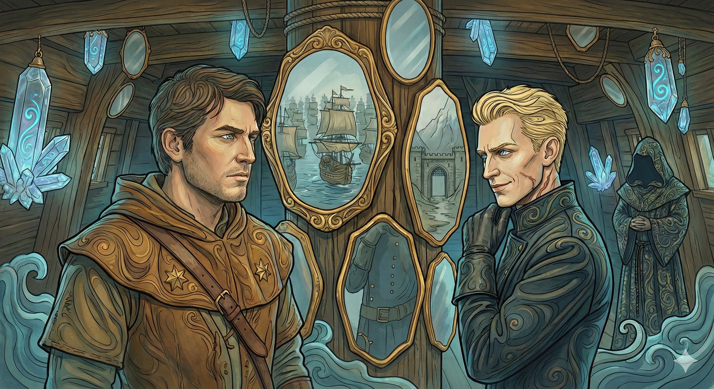

**Data**: 10.02.2026

[Prompt](../assets/sessions/069/069_arena_battle.txt)

## Podsumowanie

### Ostatni Akt na Arenie

[Prompt](../assets/sessions/069/069_orion_kills_ventis_final.txt)

Brama areny na [[Wyspa Krzywoprzysięstwa|Wyspie Krzywoprzysięstwa]] otworzyła się po raz ostatni, odsłaniając przed [[Bohaterowie Przepowiedni|Bohaterami Przepowiedni]] ich ostatecznych przeciwników. Z czeluści niepamięci powrócili dawni wrogowie, by jeszcze raz stanąć do walki. Na piasek wkroczył **[[Jankor]]**, król jaszczuroludzi z Ognistej Wyspy, u jego boku pojawiła się **Meduza** [[Leah]], a w cieniu czaił się **[[Ajax]]**. Jednak największe przerażenie budził **[[Piekielny Dyrygent]]** – upiór z [[Typhon|Typhona]], którego symfonię potępienia drużyna przerwała jakiś czas temu. Tym razem nie dosiadał on jednak swego koszmarnego wierzchowca, lecz potężnej **Miedzianej Smoczycy** [[Ventis]], której łuski lśniły w mroku otchłani.

Bitwa rozpoczęła się od taktycznego uderzenia **[[Versir|Versira]]**, który przyzwał *Barierę Ostrzy* (*Blade Barrier*), odcinając część pola walki i zmuszając wrogów do bolesnych manewrów. **[[Arevon Elorrenthi|Arevon]]**, wykorzystując potęgę swoich mocy, próbował kontrolować przestrzeń za pomocą *Ściany Ognia* (*Wall of Fire*) i *Chwytających Pnączy* (*Grasping Vine*), podczas gdy **[[Felicjan Janus Twardowski|Felicjan]]** siał zniszczenie potężnymi zaklęciami, celując w zgrupowania przeciwników. **[[Piekielny Dyrygent]]** nie pozostał dłużny, wydając z grzbietu smoka przerażający rozkaz (*Terrifying Command*), który miał na celu złamanie woli bohaterów. Ale dzięki wcześniej użytemu rogowi, bohaterowie nie dali się zastraszyć. Sama smoczyca zionęła spowalniającym gazem, próbując unieruchomić drużynę, jednak ich determinacja okazała się silniejsza niż smocza magia.

W ferworze walki, gdy **[[Orestes]]** zmagał się w zwarciu, odmawiając umierania, brutalnie okładał wrogów toporem, **[[Orion Xul|Orion]]**, pod koniec potyczki skupił swoją uwagę na latającej bestii. Wojownik, wspierany magią sojuszników, wyprowadził serię morderczych ciosów włócznią, celując w podbrzusze smoka. Bestia, mimo swojej potęgi, nie wytrzymała naporu Półboga. Przebita włócznią, runęła na ziemię. Widownia, złożona z potępionych dusz i demonów, ryknęła z zachwytu. **[[Lutheria]]**, Pani Snów, wstała ze swego tronu, by osobiście oklaskiwać zwycięzców.

### Zaproszenie i Niespełniona Przysługa

[Prompt](../assets/sessions/069/069_warden_negotiation_final.txt)

Gdy kurz bitewny opadł, **[[Lutheria]]** zwróciła się do bohaterów z uznaniem. "Wspaniałe widowisko, wybrańcy" – rzekła, po czym ponowiła swoje zaproszenie na pokład **[[Hypnos|Hypnosa]]**, swego osobistego okrętu, który cumował przy ujściu rzeki [[Lethe]]. Obiecała rozmowę i bezpieczeństwo pod *Prawem Gościnności*, po czym zniknęła, pozostawiając ich sam na sam z **[[The Warden|Zarządcą]]**.

Wykorzystując moment, drużyna spróbowała negocjować z Zarządcą uwolnienie kolejnego więźnia – **[[Orestia|Orestii]]**, satyrzycy z Mytros. **[[The Warden|Zarządca]]**, znudzony swoją wieczną wartą, wydawał się zaintrygowany propozycją. Bohaterowie oferowali mu potężne magiczne przedmioty, w tym Oathbow, jednak demon szukał czegoś więcej. Zgodził by się na jeden z legendarnych przedmiotów, albo Przysięgę Służby, ale bohaterowie nie byli gotowi na taki koszt. Orestia pozostała w łańcuchach, a drużyna opuściła arenę z poczuciem niedosytu.

W międzyczasie dokonano małego "retconu" wydarzeń z pokonania **[[Talieus|Talieusa]]**. Okazało się, że po walce z Tytanem bohaterowie odnaleźli przy jego szczątkach tajemniczy przedmiot wyglądający jak duża złota moneta, na środku której znajduje się czerwone oko. **[[Felicjan Janus Twardowski|Felicjan]]** zidentyfikował ten przedmiot, który okazał się być jakiegoś rodzaju kluczem. Ale co miał otwierać? Tego nie wiedział nikt.

### Narada na Ultrosie

[Prompt](../assets/sessions/069/069_ultros_briefing.txt)

Gdy **[[Ultros]]** płynął ku swojemu przeznaczeniu, **[[Kyrah]]** zebrała drużynę. Bogini, wyraźnie zaniepokojona nadchodzącym spotkaniem, zapytała każdego z osobna o ich cele podczas audiencji u Pani Snów. Jej pytania miały zmusić bohaterów do refleksji nad stawką tej gry.

*   **[[Arevon Elorrenthi|Arevon]]** przedstawił cel strategiczny: za wszelką cenę należy odwieść **[[Lutheria|Lutherię]]** od wspierania **[[Sydon|Sydona]]** w nadchodzącej wojnie.
*   **[[Felicjan Janus Twardowski|Felicjan]]** skupił się na wywiadzie – pragnął poznać jej intencje i plany, by wiedzieć, czy zamierza pokrzyżować ich szyki, twierdząc, że ma przygotowaną "strategię wyjścia".
*   **[[Orion Xul|Orion]]** z typową dla siebie bezpośredniością stwierdził krótko: "Albo ją przekonać, albo walczyć.".
*   **[[Orestes]]** nie krył nienawiści, wspominając o chęci "zdjęcia z niej skalpu". Jednak pod tą maską brutalności krył się pragmatyzm – był gotów oddać jedno ze swoich żyć w zamian za uwolnienie dusz swoich rodziców.
*   **[[Versir]]**, pamiętający swoją matkę, pragnął odzyskać **[[Talieus Pierwszy|Talieusa]]** i zabrać go ze sobą. Wyraził głęboki sceptycyzm co do jakichkolwiek umów z **[[Lutheria|Lutherią]]**. Wierzy, że po odzyskaniu [[Titansbane]], będzie lepsza okazja do bardziej bezpośredniej konfrontacji z nią.

Rozmowa zeszła również na temat tego, co mogą zaoferować w zamian. Drużyna zdała sobie sprawę, że ich karty przetargowe są skromne, a cena za pakt z Panią Śmierci może być wyższa, niż są gotowi zapłacić.

### Ogród Rozkoszy i Mąk

[Prompt](../assets/sessions/069/069_hypnos_ship.txt)

[[Ultros]] pożeglował w kierunku ujścia rzeki [[Lethe]], gdzie na czarnych wodach unosił się **[[Hypnos]]**. Statek Lutherii okazał się być pływającym ogrodem – gigantyczną konstrukcją z brązu, porośniętą bujną, choć niepokojącą roślinnością. Na pokładzie powitała ich **[[Kalisto]]**, kapłanka Lutherii, oferując owoce i wino na przypieczętowanie *Prawa Gościnności*. Bohaterowie, pomni ostrzeżeń, spożyli posiłek z ostrożnością. **[[Orion Xul|Orion]]**, zgodnie ze starym zwyczajem, ulał nieco wina na pokład dla Pani Domu – w miejscu, gdzie krople spadły na deski, natychmiast wyrosły piękne, lecz drapieżne kwiaty.

Wnętrze okrętu przypominało koszmarnego snu szaleńca. Ogród pełen był roślin, których dotyk groził paraliżem i wiecznymi koszmarami. Fontanny zdobione były rzeźbami przedstawiającymi orgie i akty kanibalizmu, co **[[Felicjan Janus Twardowski|Felicjan]]** skwitował gorzkim porównaniem do "Wyspy Epsteina". Centralną fontannę wieńczyła bezgłowa postać, tryskająca wodą. Fontanny miały być stworzone z wykorzystaniem spetryfikowanych ciał żywych ludzi.

### Sala Wróżenia

[Prompt](../assets/sessions/069/069_divination_room.txt)

**[[Kalisto]]** poprowadziła gości do Sali Wróżenia – pomieszczenia wyłożonego lustrami i kryształami, które pełniło funkcję oczu i uszu Lutherii. To tutaj Pani Snów obserwowała wydarzenia na świecie.

**[[Versir]]** jako pierwszy skorzystał z okazji, prosząc o ujawnienie miejsca pobytu **[[Chalcia|Chalcii]]**. Kryształ ukazał mu obraz bardzo dużego, tajemniczego pomieszczenia. W której Chalcia zabawiała się z ósemką kochanków.

Następnie **[[Felicjan Janus Twardowski|Felicjan]]** poprosił o pokazanie tzw. "Armii Sydona". W lustrach ujrzeli potężną flotę **[[Sydon|Sydona]]**, gotową do inwazji. Widok setek okrętów, cyklopów i gyganów nie pozostawiał złudzeń – wojna była nieunikniona.

Na koniec **[[Felicjan Janus Twardowski|Felicjan]]**, powołując się na obraz z sypialni Lutherii, zapytał o **[[Karpathos]]a**. Zdziwiona **[[Kalisto]]** zgodziła się na "ostatni" obraz. Lustro ukazało wzgórze z bramą strzeżoną przez dwóch wojowników w arezyjskich zbrojach.

Sesja zakończyła się w momencie, gdy drużyna wciąż przebywała w Sali Wróżenia, oczekując na osobiste spotkanie z samą **[[Lutheria|Lutherią]]**.

## Kluczowe wydarzenia
* Ostateczne zwycięstwo na Arenie nad **[[Piekielny Dyrygent|Piekielnym Dyrygentem]]** i **[[Ventis]]**.
* Spotkanie z **[[The Warden|Zarządcą]]** i nieudana próba wynegocjowania wolności dla **[[Orestia|Orestii]]**.
* Przybycie na pokład okrętu **[[Hypnos]]** i zawarcie *Prawa Gościnności* z **[[Kalisto]]**.
* Odkrycie groteskowych "dzieł sztuki" Lutherii przedstawiających kanibalizm i rozpustę.
* Użycie Sali Wróżenia do podglądania floty inwazyjnej **[[Sydon|Sydona]]**.

## Cytaty
* **[[Felicjan Janus Twardowski|Felicjan]]**: "Jesteśmy na wyspie Epsteina, tak?"
* **[[Orestes]]**: "Ja bym bardzo chętnie ściągnął z niej skalp i wcisnął jej go w dupę." (o Lutherii)
* **[[Arevon Elorrenthi|Arevon]]**: "Zielonięcie smoka to nie jest magiczny efekt."
* **[[The Warden|Zarządca]]**: "A potem umrzecie."
* **[[Kalisto]]**: "Tych lepiej nie dotykać... zjedzenie takich może spowodować natychmiastowy paraliż, podczas którego byś doświadczał najgorsze możliwe koszmary."

## Postacie
* **[[Piekielny Dyrygent]]** (z Typhona)
* **[[Jankor]]**
* **[[Ajax]]**
* **[[Lutheria]]**
* **[[The Warden|Zarządca]]**
* **[[Kalisto]]**
* **[[Orestia]]**

## Lokacje
* **[[Wyspa Krzywoprzysięstwa]]** (Arena)
* **[[Hypnos]]** (Okręt Lutherii)
* **[[Rzeka Lethe]]**
* **[[Wyspa Yonder]]** (w wizji)

## Przedmioty
* Tajemniczy klucz po **[[Talieus|Talieusie]]**

## Filmy

