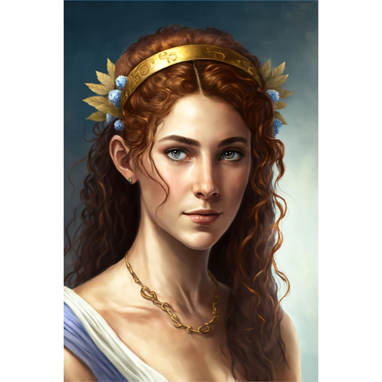

# Sesja 7: Uratować Księżniczkę

**Data:** 04.03.2024

## Podsumowanie

Bohaterowie dowiedzieli się o przynależności [[Korteva|Kortevy]] do [[Kult Węża|Kultu Węża]] i jej misji odbicia minotaurów. [[Versir]], ku zaskoczeniu [[Felicjan Janus Twardowski|Felicjana]], domyślił się magicznej natury jego amuletu, ale zachował tę informację dla siebie. W [[Mytros]] [[Acastus|król Akastus]] wskrzesił [[Smoczy Lordowie|zakon smoczych jeźdźców]], a w okolicy pojawił się huragan. Bohaterowie obejrzeli przedstawienie o upadku [[Estor Arkelander|Estora Arkelandera]], zabili bazyliszki i uratowali córkę [[Pythor|Pythora]], [[Anora|Anorę]]. [[Orion Xul]] otrzymał [[Młot Pythora|młot]] od [[Pythor|Pythora]]. Otrzymał też zadanie pokonania [[Hexia|Hexii]].

## Kluczowe wydarzenia / decyzje

* [[Korteva]] należy do [[Kult Węża|Kultu Węża]].
* [[Versir]] odkrył magiczną naturę amuletu [[Felicjan Janus Twardowski|Felicjana]].
* [[Acastus|Król Akastus]] wskrzesił [[Smoczy Lordowie|zakon smoczych jeźdźców]].
* Huragan uderzył w okolice [[Mytros]].
* Bohaterowie obejrzeli przedstawienie o upadku [[Estor Arkelander|Estora]].
* Bohaterowie zabili bazyliszki i uratowali [[Anora|Anorę]].
* [[Orion Xul]] otrzymał [[Młot Pythora|młot]] od [[Pythor|Pythora]] i dowiedział się o swoim przeznaczeniu by pokonać zieloną smoczycę [[Hexia|Hexię]].

## Postacie Niezależne (NPC)

* [[Korteva]]
* [[Acastus|Król Akastus]]
* [[Hergeron]]
* [[Gaius|Commander Gaius]]
* [[Pythor]]
* [[Anora]]

## Lokacje

* [[Estoria]]
* [[Skała Estora]]

## Szczegółowy opis wydarzeń

Bohaterowie kontynuowali swoją przygodę, dowiadując się o przynależności [[Korteva|Kortevy]] do [[Kult Węża|Kultu Węża]]. [[Versir]], ku zaskoczeniu [[Felicjan Janus Twardowski|Felicjana]], domyślił się magicznej natury jego amuletu, ale zachował tę informację dla siebie. 

W [[Mytros]] [[Acastus|król Akastus]] spełnił swoje przyrzeczenie i wskrzesił [[Smoczy Lordowie|zakon smoczych jeźdźców]]. W okolicy szalał huragan, utrudniając podróżowanie. Bohaterowie obejrzeli przedstawienie o [[Estor Arkelander|Estorze Arkelanderze]], jednym ze [[Smoczy Lordowie|Smoczych Lordów]], który sprzeciwił się woli bogów i ostatecznie zginął. 

Po powrocie do jaskini, bohaterowie zabili bazyliszki i uratowali córkę [[Pythor|Pythora]], [[Anora|Anorę]]. Choć nikt nie przyszedł po nią w nocy, [[Hergeron]], syn [[Bliźniaczy Tytani|Bliźniaczych Tytanów]], obwinił [[Gaius|Commandera Gaiusa]] o porażkę. [[Orion Xul]] otrzymał od [[Pythor|Pythora]] [[Młot Pythora|magiczny młot]] i zadanie pokonania [[Hexia|Hexii]], zielonej smoczycy.
