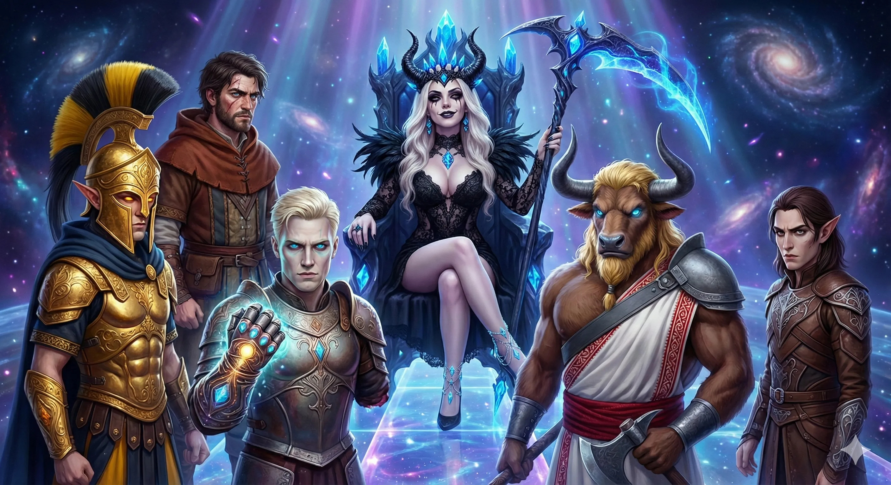
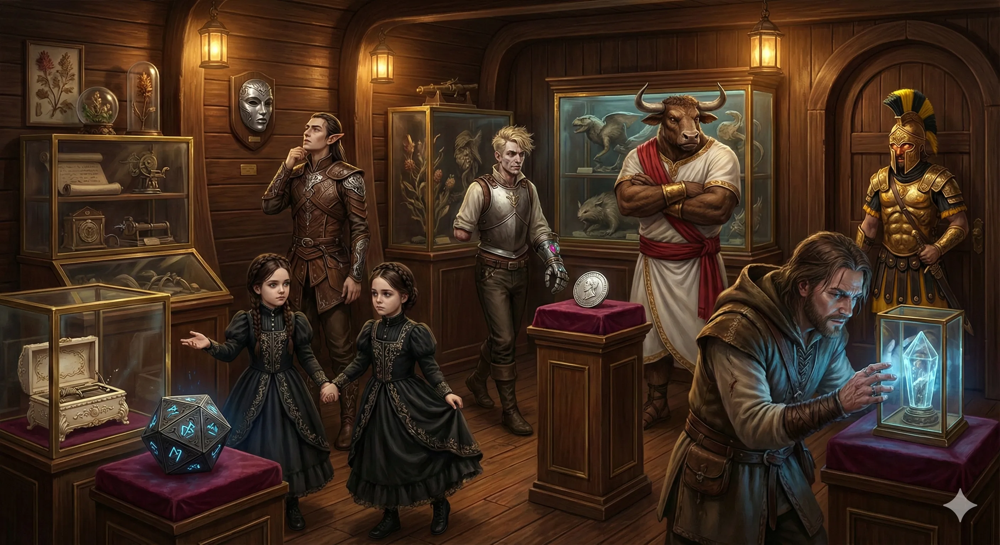
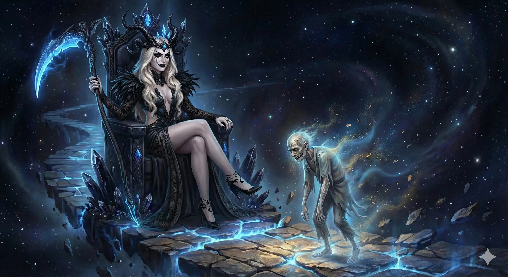
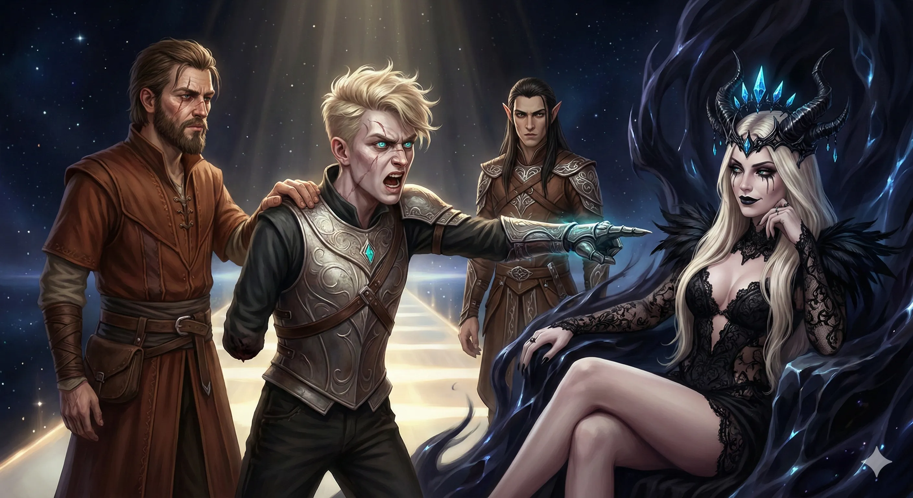
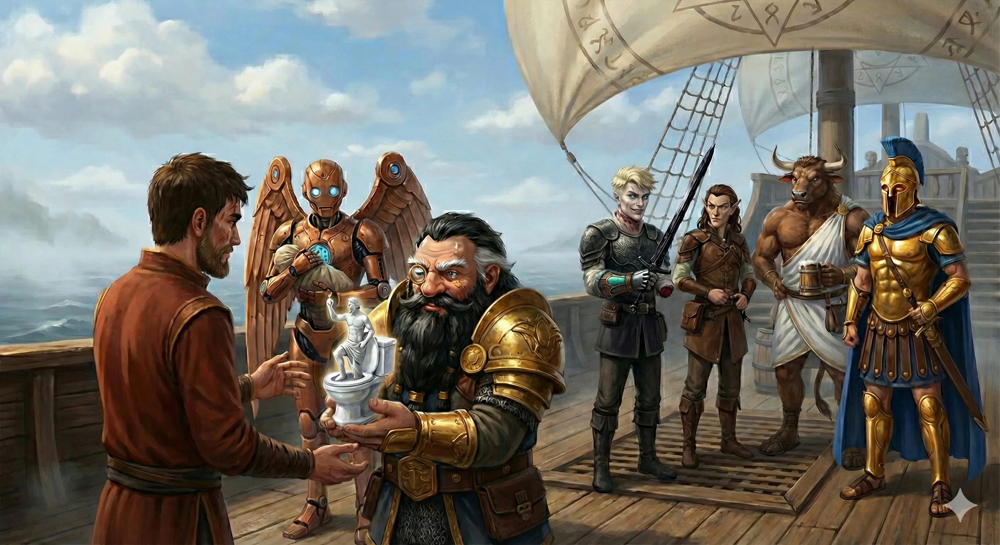

**Data**: 16.02.2026

[Prompt](../assets/sessions/070/audiencja_u_lutherii.txt)

## Podsumowanie

### Goście na Pokładzie Hypnosa

[Prompt](../assets/sessions/070/sala_blyskotek.txt)

Eksploracja okrętu [[Lutheria|Lutherii]], [[Hypnos|Hypnosa]], trwała w najlepsze. [[Kalisto]], pełniąc rolę upiornej przewodniczki, zaprowadziła [[Bohaterowie Przepowiedni]] do komnaty zajmowanej przez [[Furie|Erynie]]. Dwie skrzydlate kobiety o czerwonych piórach, polerujące swój rynsztunek, powitały gości chłodnym, lecz profesjonalnym zainteresowaniem. [[Kyrah]], widząc je, szepnęła do [[Versir|Versira]], że zdecydowanie nie chciałaby, aby Furie śledziły ją tak blisko. Ich obecność tutaj nie była oznaką lojalności wobec Pani Snów, lecz raczej sygnałem, że boginie zemsty patrzą jej na ręce, obserwując każdy ruch. [[Versir]], z typową dla siebie bezpośredniością, próbował wybadać ich nastawienie, dowiadując się, że w razie zdrady [[Lutheria|Lutherii]], Furie bez wahania stanęłyby po stronie prawa. [[Orestes]], wierny swoim obyczajom, zaproponował im piwo, lecz jego gest spotkał się z obojętnością.

Następnym przystankiem była **Sala Błyskotek (Hall of Trinkets)**, przypominająca osobliwe muzeum. Dwie małe, nieco nienaturalnie poruszające się dziewczynki oprowadzały drużynę po zbiorach Pani Snów. Wśród eksponatów znajdowały się przedmioty o niezwykłej mocy i historii: **Pozytywka z kości słoniowej**, z której wnętrza dobiegał szum milionów krzyczących dusz; ciężki **Dwunastościan z Adamantu**, pokryty bolesnymi runami; **Mithralowa Maska** ukazująca wyidealizowaną wersję świata; oraz **Platynowa Moneta Losu**, emanująca aurą pewności. Uwagę przykuło również **Pióro Feniksa**, wciąż żarzące się ciepłem, niegdyś używane do spisania *Kodeksu Nieskończonych Planów*.

Kolejnym, oddzielnym pomieszczeniem była **Zbrojownia (Hall of Armaments)**. W kątach sali siedziało czterech Jackalwere. Na ścianach, w szkieletowych dłoniach, wisiały dary od [[Sydon|Sydona]] – potężny rynsztunek, który jednak niósł ze sobą klątwę szaleństwa. [[Versir]], oglądając te przedmiotów, wyczuł w nich jednak coś innego – cząstkę duszy swojej matki, Versi Pierwszej, zaklętą w gwiezdnym metalu. Zachował kamienną twarz.

Po wizycie w kuchni, gdzie satyry i lamia przygotowywały wykwintne, choć podejrzanie wyglądające potrawy, drużyna udała się do łaźń, by obmyć się przed audiencją. [[Versir]] wybrał oczekiwanie na sucho, podczas gdy reszta zażywała kąpieli. [[Orion Xul|Orion]] początkowo również odmówił, lecz gdy trzy driady zaoferowały mu pomoc w zdjęciu ciężkiej zbroi i "szorowaniu pleców", wojownik uległ pokusie i zniknął z nimi w oparach pary. Atmosfera gęstniała z każdą minutą, a pytania [[Kyrah]] o cele spotkania z Lutherią zmusiły każdego z herosów do refleksji nad tym, co tak naprawdę chcą osiągnąć w jaskini lwa.

### Kres Upiornego Kapitana i Początek Audiencji

[Prompt](../assets/sessions/070/smierc_estora.txt)

Gdy nadszedł czas audiencji, [[Kalisto]] zaprowadziła ich na górny pokład, do sali tronowej, gdzie rzeczywistość zdawała się zacierać. Ścieżka utkana ze światła prowadziła nad nieskończoną otchłanią ku tronowi, na którym zasiadała [[Lutheria]]. Na jej kolanach spoczywała mała, skurczona postać. Ku przerażeniu drużyny, okazał się nią [[Estor Arkelander|Estor Arkelander]]. Pani Snów, nucąc pogodną melodię, zszrywała usta dawnego Smoczego Lorda, który w swej ostatniej chwili wyciągał ku niej błagalnie rękę. Gdy jego ciało opadło na posadzkę, eksplodowało w obłok pyłu, kończąc ostatecznie jego historię. Był to brutalny pokaz władzy, mający uświadomić gościom, z kim mają do czynienia.

Luteria powitała bohaterów z udawaną uprzejmością, nazywając ich "wybrańcami" i komplementując ich odwagę. Jej spojrzenie prześlizgiwało się po każdym z nich, zatrzymując się na moment na trzech małych smokach towarzyszących drużynie. Jednak szczególną uwagę poświęciła [[Despina|Despinie]] – prababce [[Felicjan Janus Twardowski|Felicjana]], której dusza uwięziona jest w amulecie – nazywając ją swoją "czempionką". Atmosfera rozmowy była dziwna, pełna napięcia i groteskowego humoru Pani Śmierci, która próbowała rozbawić gości żartami o martwych niemowlętach.

Zamiast otwartej wrogości, [[Lutheria]] zaproponowała rozmowę, twierdząc, że [[Sydon]] stał się dla niej ciężarem. Wyjawiła jego sekretną słabość: **uczulenie na gwiazdy**. Zdradziła, że na szczycie jego wieży, **[[Praxys]]**, znajduje się jedna z gwiazd z Morza Astralnego, która podtrzymuje całą konstrukcję. Co więcej, fundamentem wieży jest jej brat – **[[Hergeron]]**, który został uwięziony na samym dnie i zmuszony do dźwigania budowli na swoich barkach w morzu. Uwolnienie go mogłoby zachwiać stabilnością siedziby [[Sydon|Sydona]].

Rozmowa zeszła na temat jej dzieci. [[Lutheria]] z chłodnym dystansem przyznała, że większość z nich wybrała ojca. **[[Goloron]]**, Strażnik Elizjum, wciąż ją czasem odwiedza, ale reszta, odwróciła się od niej. Pani Snów zaszokowała drużynę sugestią, by wyeliminowali jej potomstwo pojedynczo w wieży, zamiast mierzyć się z nimi wszystkimi na otwartym polu bitwy. "Dzieci zawsze można zrobić nowe" – skwitowała bezdusznie, dodając, że nie uznaje antykoncepcji.

Szczególnie interesujący był wątek przeklętych przedmiotów ze Zbrojowni. [[Lutheria]] wyjawiła, że [[Sydon]], oskarżając ją o szaleństwo, stworzył te bronie z gwiezdnego metalu, by "wyciągnąć" z niej obłęd. Twierdził, że przelewa w nie swoje sny i miłość, ale w rzeczywistości – jak zauważyła bogini – skoro ona nie była szalona, to oręż ten wypełniony jest **szaleństwem samego [[Sydon|Sydona]]**. Mówiąc o skutecznych broniach przeciwko [[Sydon]]owi, wspomniała również o [[Titansbane]] i Toporze Xandera, potwierdzając, że nie pochodzi on z tego świata.

[[Orestes]], nie mogąc powstrzymać ciekawości, zapytał wprost o zawartość **Kosy [[Lutheria|Lutherii]]** i dusze swoich rodziców. Bogini przyznała, że ich pamięta – "sprzeciwili się w niedogodnym momencie". Wyjaśniła, że dusze uwięzione w kosie są trudne do wydobycia, a jedynym sposobem byłoby zniszczenie broni. Zaoferowała jednak okrutny targ: była gotowa oddać swoją Kosę (wraz z uwięzionymi duszami) za **Glewię [[Sydon|Sydona]]** razem z głową swojego brata-męża. Alternatywnie, wyraziła zainteresowanie duszą **[[Acastus|Acastusa]]** i jego smoka, marząc o własnym "smoczym dziecku", które nazwałaby Penelope. Ostatecznie stanęło na "luźnej umowie po fakcie": jeśli bohaterowie przyniosą jej głowę i glewię [[Sydon|Sydona]], otrzymają to, czego pragną. [[Lutheria]] obiecała również zachować neutralność w nadchodzącym konflikcie.

### Gniew Versira i Pożegnanie z Chondrusem

[Prompt](../assets/sessions/070/gniew_versira.txt)

[[Versir]], nie mogąc znieść gierek [[Lutheria|Lutherii]], przerwał ten teatr uprzejmości. Wygłosił płomienny monolog, oskarżając ją o to, że jej "Prawda" to w rzeczywistości koszmar, z którego nie może się obudzić. Zarzucił jej jałowość i próbę kradzieży "iskry życia" od [[Talieus Pierwszy|Talieusa]], ponieważ sama nie potrafiła tworzyć – jej dzieci były jedynie "martwymi kukłami" i nędznymi imitacjami Tytanów, których zniszczyła, nazwanymi ich imionami. "Powiedz mi, jak to jest wychowywać dzieci na grobach tych, których nie potrafiłaś kochać?" – zapytał z pogardą, sugerując, że zazdrościła [[Sydon]]owi jego zdolności do kochania (nawet jeśli w chłodny sposób) i tworzenia. Jego słowa, pełne gniewu, uderzyły w czuły punkt bogini, niszcząc atmosferę "przyjacielskiej" pogawędki.

Mimo napięcia, [[Lutheria]] nie dała się sprowokować do walki, choć dała do zrozumienia, że [[Versir]] "zepsuł jej humor". Wychodząc, Bohaterowie postanowili zostawić [[Lutheria|Lutherii]] "prezent" – **[[Chondrus|Chondrusa]]**. Arkanista, który do tej pory był więźniem na Ultrosie, został wyprowadzony i poinformowany, że to jego "szczęśliwy dzień". [[Lutheria]] nie była zachwycona – wprost przyznała, że czuła się przy nim niekomfortowo z powodu jego "dziwnej fascynacji" i wcześniej odesłała go do Gaiusa, byle tylko się go pozbyć. Mimo to, drużyna z satysfakcją porzuciła go na Hypnosie, skazując na towarzystwo bogini, która go "nie trawi".

### Ku Praxys i Dary Volkana

[Prompt](../assets/sessions/070/dary_volkana.txt)

Powrót na Ultrosa przyniósł ulgę, ale i nowe wyzwania. Czas Przysięgi Pokoju nieubłaganie dobiegał końca. Kurs został wyznaczony na [[Praxys]] – siedzibę [[Sydon|Sydona]]. Podczas rejsu, na drugi dzień po opuszczeniu [[Charybda|Charybdy]], na horyzoncie pojawił się kształt. Okazało się, że to [[Keledone|Keledon]], niosąc na rękach samego [[Volkan]]a. Bóg Kowali przybył z darami, o które wcześniej prosili bohaterowie. Felicjan otrzymał swoją ekstrawagancką figurkę do zaklęcia Contingency, [[Versir]] – uprząż wydłużającą zasięg broni oraz [[Titansbane]], miecz niegdyś wykuty przez [[Talieus Pierwszy|Talieusa]] Pierwszego, zawierający cząstke duszy matki [[Versir|Versira]], a teraz ukończony przez [[Volkan]]a.

Podczas podróży [[Arevon Elorrenthi|Arevon]] doświadczył potężnej wizji. Przeniósł się w czasie do momentu upadku [[Praxys]], wcielając się w postać [[Telamok Arkelander|Telamoka Arakelandera]]. Poczuł desperację obrońców, widział rzeź swoich ludzi i ostateczne starcie, w którym Glewia [[Sydon|Sydona]] zakończyła życie legendarnego wojownika. Wizja ta, choć bolesna, dała mu wgląd w to, co czeka ich u celu.

Drużyna opracowała plan infiltracji. Zamiast frontalnego ataku, postanowili wykorzystać magię [[Arevon Elorrenthi|Arevon]]a, by zamienić się w obłok (Wind Walk) i niepostrzeżenie zbliżyć się do wieży. Następnie, korzystając z mikstur dających wodną formę (stworzonych z krwi Cetusa, którego walkę z Morskim Wężem obserwowali po drodze), zamierzali wpłynąć do [[Praxys]] przez systemy kanalizacyjne lub wodne, omijając główne zabezpieczenia. Wszystko to miało się wydarzyć tuż przed wygaśnięciem Przysięgi Pokoju, by zaskoczyć [[Sydon|Sydona]] w jego własnym domu.

## Kluczowe wydarzenia
* Zwiedzanie [[Hypnos|Hypnosa]]: spotkanie z Eryniami, wizyta w Sali Kolekcji i Zbrojowni z przedmiotami Matki [[Versir|Versira]].
* Ostateczna śmierć Estora Arkelandera z rąk [[Lutheria|Lutherii]] w jej sali tronowej.
* Audiencja u [[Lutheria|Lutherii]]: poznanie słabości [[Sydon|Sydona]] oraz informcji o konstrukcji [[Praxys]].
* Oferta [[Lutheria|Lutherii]]: głowa i glewia [[Sydon|Sydona]] w zamian za jej Kosę i dusze rodziców [[Orestes]]a.
* Monolog [[Versir|Versira]], próbujący sprowokować Lutherię do walki.
* Przybycie [[Volkan]]a z magicznymi przedmiotami dla drużyny.
* Wizja [[Arevon Elorrenthi|Arevon]]a ukazująca śmierć Telamoka podczas szturmu na [[Praxys]].
* Opracowanie planu infiltracji [[Praxys]] przy użyciu zaklęcia Wind Walk i mikstur wodnej formy.

## Cytaty
* **[[Lutheria]]**: "Powiedz mi, [[Orion Xul|Orion]], jak sprawić, żeby niemowlę raczkowało w kółko? (...) Przebijasz jedną z jego rączek do podłogi."
* **[[Orestes]]**: "Czym się różnią trupy w Hadesie od trupów u mnie w piwnicy? Te u mnie ładnie pachną chmielem."
* **[[Lutheria]]**: "Niegdyś [[Sydon]] był bardzo bystry. Teraz dużym problemem jest to, że on nadal myśli, że jest bardzo bystry. A tak naprawdę jest strasznie głupi."
* **[[Lutheria]]**: "Dzieci zawsze mogę pozyskać więcej. Ja nie uznaję antykoncepcji."
* **[[Versir]]**: "Powiedz mi, jak to jest wychowywać dzieci na grobach tych, których nie potrafiłaś kochać?"
* **[[Volkan]]**: "Klient wymaga, nie zadaję zbędnych pytań." (o figurce [[Felicjan Janus Twardowski|Felicjana]])
* **[[Arevon Elorrenthi|Arevon]]**: "Surprise, motherfucker!" (o planie wyjścia z beczek/chmury w wieży)
* **[[Lutheria]]** (o [[Acastus]]ie): "Poszłam z nim do łóżka podczas Wielkich Igrzysk. Jest całkiem niezłym kochankiem. Ale jest dość obsesyjny na punkcie [[Sydon|Sydona]]."
* **[[Lutheria]]** (do [[Versir|Versira]]): "Chyba czas na ciebie, [[Versir]]."

## Postacie
* [[Lutheria]]
* [[Kalisto]]
* [[Estor Arkelander|Estor Arkelander]]
* [[Chondrus]]
* [[Volkan]]
* [[Talieus Pierwszy|Talieus Pierwszy]]
* [[Telamok Arkelander|Telamok Arakelander]]

## Lokacje
* Hypnos (Okręt [[Lutheria|Lutherii]])
* [[Morze Otchłani]]
* [[Praxys]]

## Przedmioty
* Figurka [[Felicjan Janus Twardowski|Felicjana]] (Contingency)
* Mikstury Wodnej Formy (z krwi Cetusa)
* Glewia [[Sydon|Sydona]]
* Kosa [[Lutheria|Lutherii]]

## Filmy

