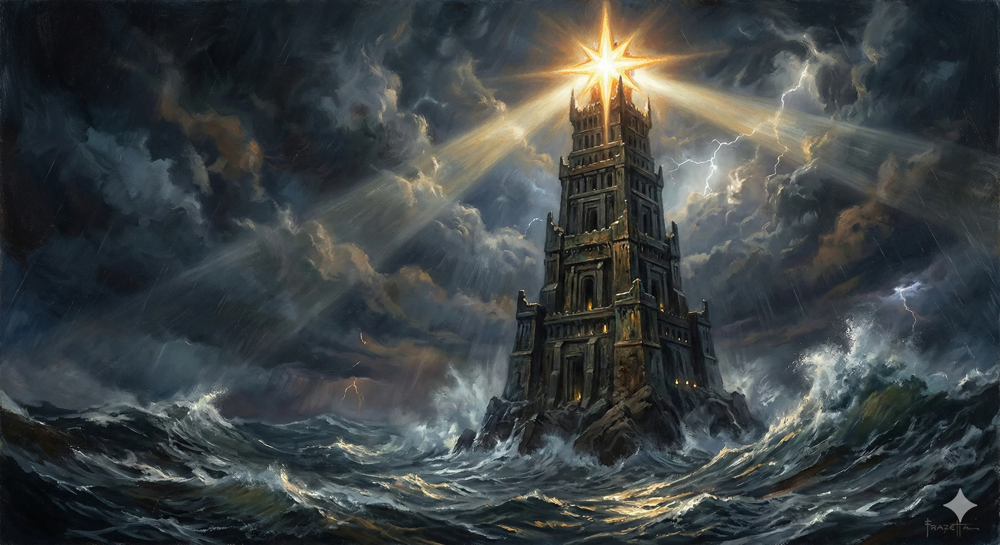
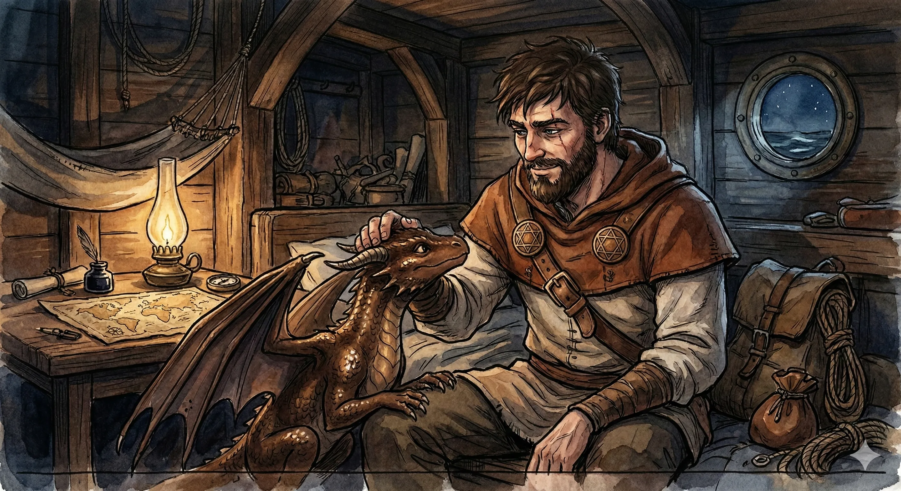
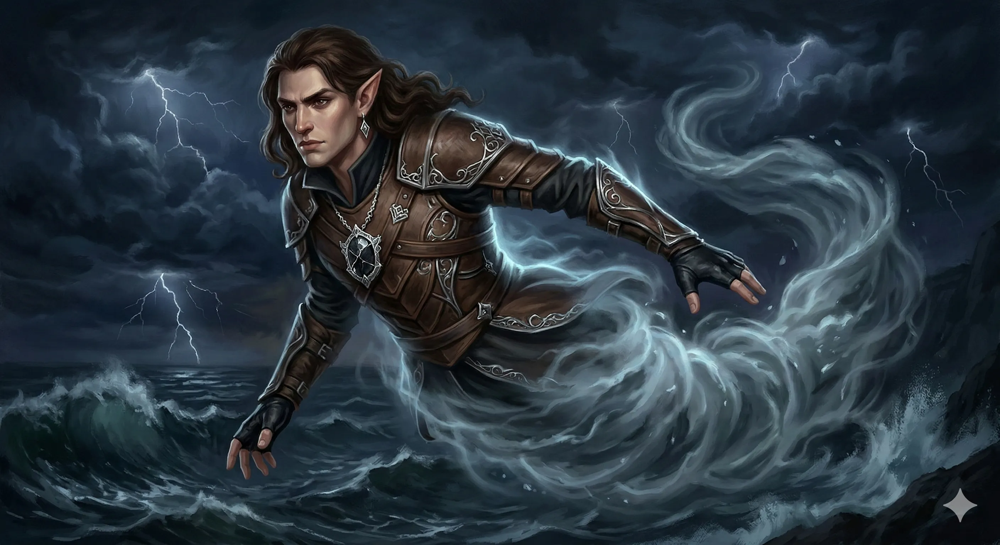
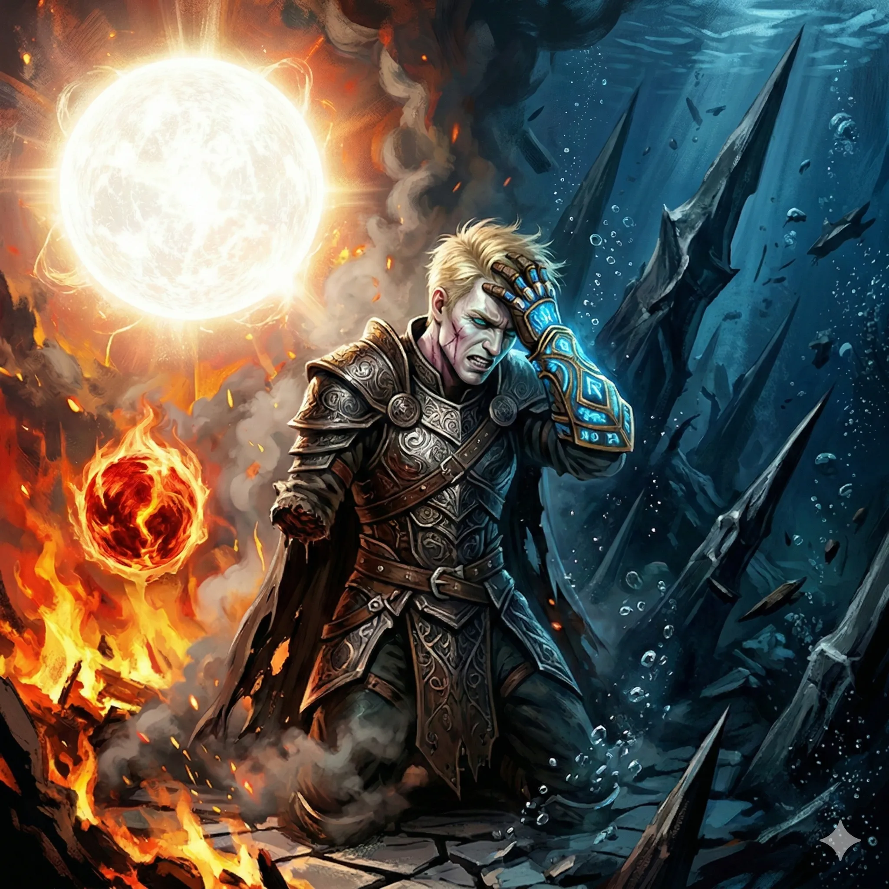
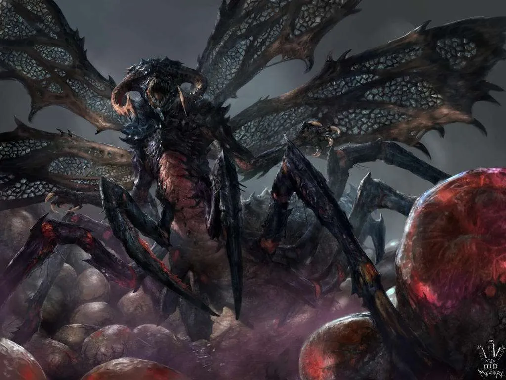

**Data**: 02.03.2026

<!-- Main visuals will be inserted here by rpg-illustrator -->

## Podsumowanie

[Prompt](../assets/sessions/071/071_praxys.txt)

### Przygotowania do Szturmu

[Prompt](../assets/sessions/071/071_kairos.txt)

Na pokładzie legendarnego okrętu Ultros, przecinającego mroczne fale, w sercach Bohaterów Przepowiedni ważyły się losy Thylei. Czas Przysięgi Pokoju nieubłaganie dobiegał końca, a wojna z Sydonem stanowiła ponure widmo na horyzoncie. W kwaterach okrętu odbyła się kluczowa narada. Zespół musiał zdecydować o planie infiltracji, podziale sił oraz ewentualnym udziale smoków. Felicjan, genialny mag, planując swoje magiczne sztuczki, pozyskał od Boga Kuźni Volkana magiczny nawóz. Orestes z kolei, wierny swojemu umiłowaniu do złocistego trunku, próbował pozyskać lojalność smoka Paradoksa, kusząc go obietnicą darmowego piwa oraz ciepłego leża na zapleczu rzemieślniczego browaru. Paradoks zapytał wówczas, czy dla uwarzenia idealnego piwa Orestes byłby skłonny cofnąć się w czasie i celowo namieszać w czasoprzestrzeni. Gdy wojownik bez zawahania potwierdził, zdegustowany smok stanowczo go odrzucił, widząc tak nieodpowiedzialne i mizerne ambicje. Po burzliwych dyskusjach herosi ostatecznie zdecydowali o wyruszeniu w uderzeniowym, skrytym szyku. Felicjan zdecydował się jednak zabrać ze sobą Kairosa – młodego smoka, z którym już jakiś czas temu związał się przysięgą Smoczych Lordów.

### Zwiad pod postacią chmury

[Prompt](../assets/sessions/071/071_wind_walk.txt)

Aby dogłębnie poznać układ niezdobytej i legendarnej fortecy Pana Burz, Arevon Elorrenthi, wykorzystując pierwotną magię wiatru (Wind Walk), dokonał transformacji w bezszelestną, niemalże całkowicie niewidzialną dla postronnych, formę eterycznej chmury. Przemierzając wichry nocy z zawrotną prędkością, ujrzał owiane majestatem Praxys – kolosalną, wzniesioną z kamienia i brązu wieżę wyłaniającą się nieubłaganie z szalejących fal, której wierzchołek wieńczyła wszechwidząca, świetlista gwiazda, omiatająca otoczenie swym przenikliwym blaskiem. Cały obszar powietrzny i wierzch budowli rygorystycznie patrolowały dziesiątki potężnych, przerażających Gryfów. Każde z okien oraz misternie rzeźbionych tarasów zabezpieczone było magiczną barierą – Ścianą Mocy (Wall of Force), uniemożliwiającą tak łatwą i swobodną infiltrację z powietrza. Zbadanie morskich głębin pod fundamentami budowli utwierdziło Arevona w wiedzy, którą drużyna nabyła już wcześniej – cała gargantuiczna i pyszniąca się swą władzą iglica Wieży spoczywała na potężnych barkach zniewolonego i zanurzonego w morskiej toni Tytana, Hergerona Pierwszego. Mijając bystrym spojrzeniem pływające z harpunami podwodne patrole okrutnego gatunku Merrow, Arevon zbadał system wodny struktury. Odkrył, że wieża posiada dwojakiego rodzaju kanały – mniejsze zasysały relatywnie czystą wodę morską, podczas gdy potężne otwory odpływowe wypluwały gęste, cuchnące nieczystości. To właśnie te drugie kanały okazały się być obiecującą ścieżką ominięcia solidnych zabezpieczeń głównego wejścia.

### Wizja Wśród Fal i Przeprawa Przez Ścieki

[Prompt](../assets/sessions/071/071_wizja_versira.txt)

Zgodnie z wynikami zwiadu, drużyna nakreśliła ostateczny, choć ryzykowny plan szturmu na Praxys. Bohaterowie postanowili wślizgnąć się przez rury odprowadzające nieczystości z wieży, by w ten sposób całkowicie ominąć zewnętrzne straże i Ściany Mocy. Przygotowując się do akcji, osłonili się zaklęciem Wind Walk (przyjmując postać eterycznych chmur) i wykorzystali mikstury wodnej formy (Potion of Aqueous Form), by bez problemu poruszać się pod wodą.

W trakcie zbliżania się do wybrzeży Praxys, umysł pół-tytana Versira nawiedziła potężna wizja, zesłana przez jego matkę. Obraz przed jego oczami boleśnie się rozdwoił, symultanicznie ukazując dwie drastycznie inne ścieżki prowadzące do uwolnienia jego wuja, Hergerona. W lewym oku Versir ujrzał siebie na samym szczycie wieży, tuż pod olbrzymią, świetlistą gwiazdą. Wokół niego szalały płomienie, a on sam czuł nieodpartą intencję, by przyciągnąć do wielkiej gwiazdy mnieszą, karmazynową kulę i je scalić. W tym samym czasie, w jego prawym oku rozgrywała się całkowicie inna scena: znajdował się głęboko pod wodą, u podnóża wieży. Z determinacją płynął w stronę zniewolonego Hergerona, by własnoręcznie rozbić utrzymujące go adamantowe kolce. Wizja dała jasno do zrozumienia, że uratowanie Tytana zależy od podjęcia jednej z tych dwóch misji.

Początkowo rury doprowadziły herosów do rozległej, zatopionej w mroku piwnicy z licznymi pompami kontrolującymi całą hydraulikę potężnej wieży. Podczas szybkiego zwiadu dostrzegli patrolujących okolicę Merrowów, odrażającą Wiedźmę Morską (Sea Hag), ogromnego Żywiołaka Wody, a także schody prowadzące na wyższe poziomy. Zamiast otwarcie walczyć, Orion, korzystając ze zmodyfikowanej przez miksturę wodnej formy, podjął się brawurowego zwiadu rurami odpływowymi prowadzącymi w górę. W pierwszej z nich natknął się na wielkiego minotaura, który ku jego nieszczęściu właśnie siadał na muszli, w której nasz wojownik dokładnie pływał pod postacią wody! Szybko ewakuując się z tej niekomfortowej sytuacji, Orion zbadał drugą rurę, upewniając się, że jest bezpieczniejsza, co skłoniło drużynę do podążenia tym cuchnącym szlakiem.

Sama przeprawa przez system kanalizacyjny pod prąd gęstych ścieków stała się prawdziwym testem wytrzymałości. Bohaterowie wynurzyli się z odpływów prosto w monstrualnie wielkiej, marmurowej latrynie. Okazało się, że o "czystość" tej łazienki dbał poczciwy cyklop o imieniu Krok – wyjątkowo zdeformowany, gdyż, ku powszechnemu zaskoczeniu, posiadał dwoje oczu. Zanim Krok na dobre zorientował się w sytuacji, Arevon (wciąż w postaci eterycznej chmury) prześlizgnął się przez latrynę i wykonał błyskawiczny zwiad pobliskich pomieszczeń. Odkrył montownię golemów obsługiwaną przez dziwne, insektoidalne humanoidy, baraki żołnierzy Sydona, oraz kuchnię pod batutą koźlaka imieniem Ramsus. Kiedy Krok zaczął kwestionować dźwięki dochodzące z kabiny, Orion, wykazując się niezwykłym refleksem aktorskim, zaczął głośno jęczeć z zamkniętej kabiny i odgrywać gigantyczne problemy żołądkowe po defekacji. Felicjan momentalnie dopełnił tę szaradę potężną iluzją dźwiękową niekontrolowanej biegunki. Zdezorientowany Krok usłyszał wykrzyczane z kabiny żądanie dostarczenia kolejnych rolek papieru toaletowego i w popłochu oddalił się z latryny w poszukiwaniu kanapki.

### Królowa Myrmeków

Gdy tylko cyklop bezpiecznie zniknął, drużyna ruszyła w stronę szczelnie zamkniętych drzwi, których Arevon wcześniej nie zdołał zbadać z powodu szczelnego zamknięcia. Szybko okazało się, że za pierwszym rzędem drzwi kryły się od razu kolejne – oba masywne zamki zostały jednak sprawnie sforsowane dzięki wybitnym umiejętnościom złodziejskim Arevona i jego drobnym narzędziom. Po otwarciu wrót, ich oczom ukazał się makabryczny widok: olbrzymia Królowa Myrmeków – matka insektoidalnego roju – była spętana sześcioma gigantycznymi łańcuchami. Jej niedoli pilnowało dwóch opancerzonych, bezgłowych strażników z rasy Blemysów. Gdy tylko wrota zostały otwarte, strażnicy natychmiastowo zareagowali na intruzów, jednak zamiast rzucić się na nich, w morderczym szale zaatakowali i zaczęli szlachtować samą Królową. Wielka bestia wyczuła nowo przybyłych i telepatycznie zaczęła błagać bohaterów o uwolnienie, obiecując w zamian gigantyczną nagrodę i wypuszczenie swojego wściekłego pomiotu na wrogą twierdzę, by zniszczyć ją od środka.

Propozycja początkowo wydała się taktycznie niezwykle interesująca, a bohaterowie odpowiedzieli szybką pomocą. Orestes zamaszystym ciosem swojego potężnego topora zdołał nawet zniszczyć i rozerwać jeden z gigantycznych łańcuchów krępujących królową. Drużyna skutecznie powaliła atakujących w amoku Blemysów, jednak tryumfalną ulgę szybko przerwało pojawienie się na tyłach celi licznych, wezwanych na odsiecz Myrmeków, gotowych rozprzestrzeniać hegemonię swojej matki. W tym krytycznym momencie Versir podjął gwałtowną, samodzielną decyzję. Analizując całą sytuację, uświadomił sobie, że wypuszczenie na wolność tak śmiercionośnej, głodnej i ekspansywnej populacji wrogiej owadziej plagi zagrażałoby ostatecznie nie tylko siłom Tytana, ale całemu biologicznemu ekosystemowi kontynentalnej Thylei. Telepatyczne błagania uwolnionej niemalże bestii na nic się zdały.

Widząc, że zmiana planu jest koniecznością dla bezpieczeństwa świata, Versir i pozostali ruszyli do ataku na owady. Orion przebił włócznią pancerz Królowej, zadając jej ostateczny, śmiertelny cios. W międzyczasie Felicjan użył Ściany Ognia (Wall of Fire), by odgrodzić i spalić nadciągający z tyłu rój. Wtedy wydarzyło się coś przerażającego – Myrmeki natychmiast skopiowały tę umiejętność, tworząc własną ścianę płomieni! Bestie błyskawicznie uczyły się ruchów i taktyki walki bohaterów. Na szczęście uczyły się na tyle wolno, że doświadczona drużyna zdołała skutecznie wybić insekty, zanim te zdążyły stanowić prawdziwe wyzwanie. Uświadomienie sobie ogromnego potencjału adaptacyjnego Myrmeków utwierdziło jednak wszystkich w słuszności podjętej przez Versira decyzji.

Bez zbędnej zwłoki, opuszczając martwe insekty za plecami, zespół przemieścił się do pobliskich koszarów i kuźni Tytana. Przeprowadzając pobieżny rekonesans uzyskali dwie cenne nagrody: użyteczną Miksturę Odporności na Ogień (Potion of Fire Resistance) oraz ciężkie stalowe płyty wymontowane z mechanicznych modeli Gorgonów. Przebijając się wzdłuż korytarzy, drużyna dotarła w końcu przed kolejne zamknięte drzwi. Ich uwagę przykuła stojąca nieopodal potężna, wielka złota statua byka, wyposażona w duże siodło. Nagle, zza masywnych rzeźbionych wrót z brązu, dobiegł do nich donośny, zaalarmowany głos: "Kto tam jest?! Co tu się do cholery dzieje?!".

## Kluczowe wydarzenia
* Planowanie infiltracji wieży [[Praxys]] i odrzucenie propozycji [[Orestes]]a przez smoka [[Paradoks]]a.
* Zwiad lotniczy [[Arevon Elorrenthi|Arevon]]a wokół wieży, obserwacja Wszechwidzącej Gwiazdy i znalezienie wejścia przez rury odpływowe.
* Wizja [[Versir]]a, który stanął przed dylematem: zniszczyć adamantowe kolce pod wodą czy połączyć gwiazdy na szczycie wieży, by ocalić Tytana [[Hergeron Pierwszy|Hergerona]].
* Podwodna przeprawa przez cuchnące kanały i uniknięcie konfrontacji z cyklopem [[Krok]]iem za pomocą iluzji stworzonej przez [[Orion Xul|Orion]]a i [[Felicjan Janus Twardowski|Felicjan]]a.
* Odnalezienie spętanej Królowej Myrmeków; po początkowej chęci pomocy, [[Versir]] uznaje potencjalną plagę za zagrożenie dla [[Thylea|Thylei]] i inicjuje atak.
* Walka z rojem adaptujących się owadów, zdobycie mikstury Potion of Fire Resistance i pancerza Gorgona w kuźni, a następnie dotarcie pod drzwi Złotego Cielca.

## Cytaty
* **[[Versir]]**: "Żadnego skradania, żadnych przebrań. Bierzemy smoki i robimy statement. Wychodzimy z kibla i robimy rozpierdol od razu."
* **[[Felicjan Janus Twardowski|Felicjan]]**: "Płyniemy dalej rurą z gównem czy się bijemy?"
* **[[Orestes]]**: "W sumie ciekawe czy moglibyśmy po prostu losowo wpadać od kibla do kibla i zabijać wszystkich co siedzą na kiblach."
  * **[[Felicjan Janus Twardowski|Felicjan]]**: "Być taką legendą... nawiedzony kibel."
* **[[Orion Xul|Orion]]** (do cyklopa Kroka): "Mógłbyś przynieść jeszcze coś do podtarcia? Bo wszystko się skończyło. Już całe łapy mam ubrudzone... Idź zjeść kanapkę!"
* **Królowa Myrmeków** (telepatycznie): "Inne ludy nie są moimi wrogami. Chcemy żyć w spokoju."
  * **[[Orestes]]**: "Nie wiem, rzucam Insight. Disadvantage jeszcze. Ufam jej!"
* **[[Felicjan Janus Twardowski|Felicjan]]**: "Jeśli jej nie zabijemy, to będzie anihilacja kontynentu."
  * **[[Arevon Elorrenthi|Arevon]]**: "Ja zdecydowanie wybieram koniec Thylei. Nigdy mnie nie słuchacie."

## Postacie
* [[Krok]] (Cyklop)
* [[Ramsus]] (Koźlak)
* Królowa Myrmeków
* [[Hergeron Pierwszy]]
* [[Paradoks]]
* [[Kairos]]

## Lokacje
* [[Ultros|Okręt Ultros]] 
* [[Praxys]] (Wieża Sydona)

## Przedmioty
* Potion of Fire Resistance
* Płyty z Pancerza Mechanicznego Gorgona

## Filmy
<!-- Video placeholders or links if any -->
