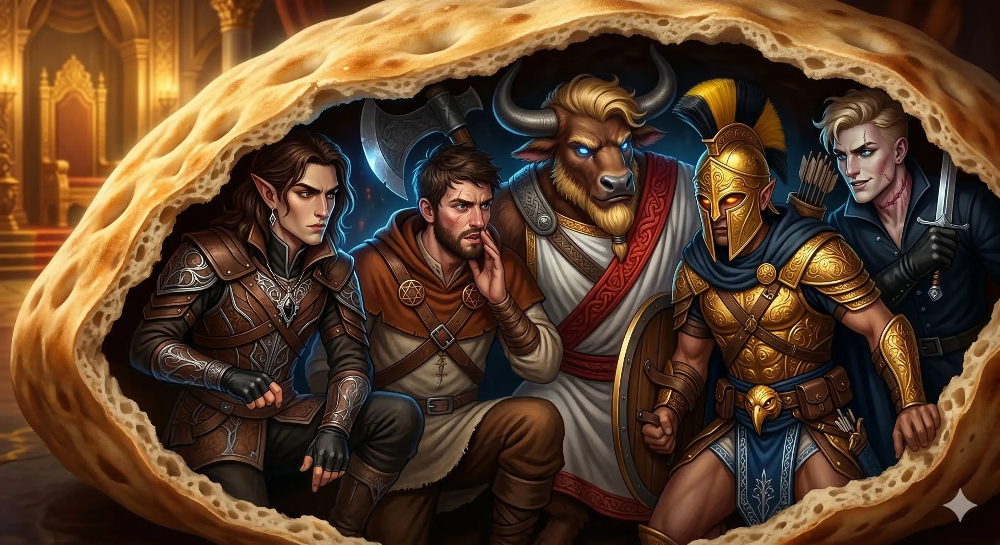
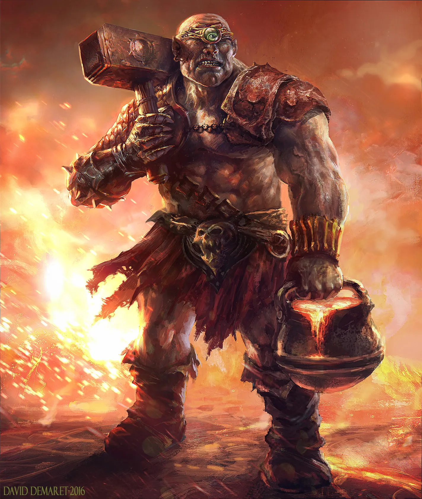
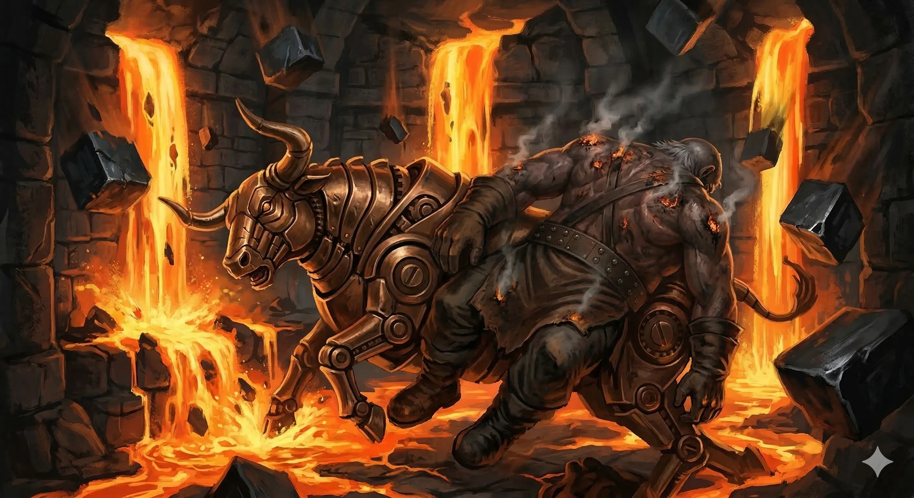
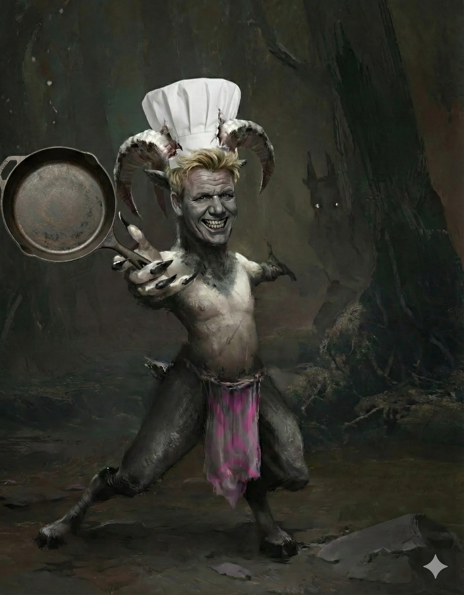
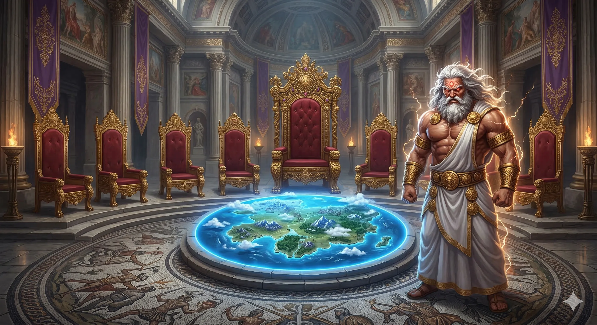
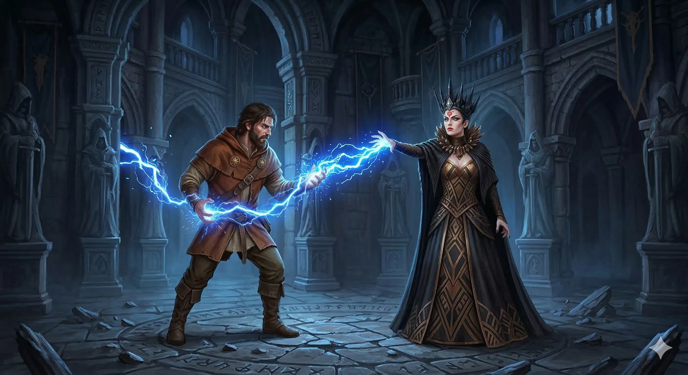
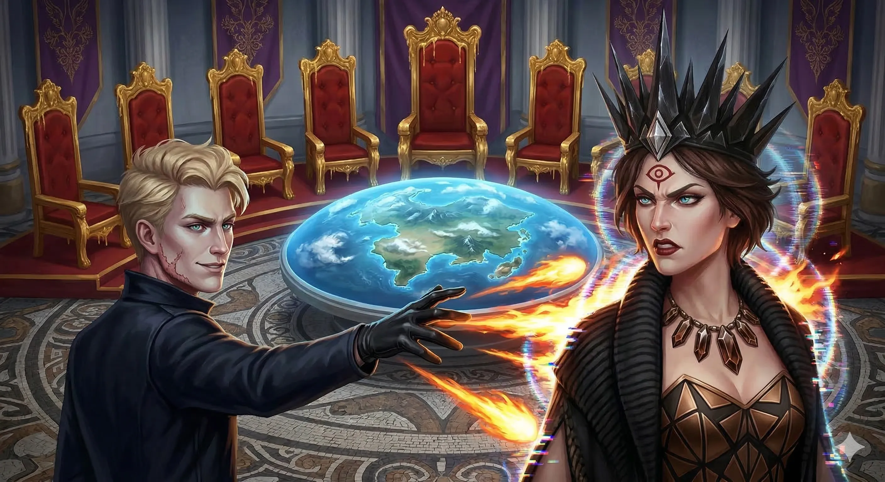

# Sesja 72: Śniadanie u Tytana: Bochenek Przeznaczenia

**Data:** 09.03.2026

## Podsumowanie

[Prompt](../assets/sessions/072/072_main.txt)

### Garzoon

Wnętrze monumentalnej wieży **[[Praxys]]**, ponurej domeny Władcy Burz, powitało Bohaterów Przepowiedni zapachem ozonu i stęchlizny. Drużyna, wciąż ukryta pod płaszczykiem magicznych i fizycznych przebrań, powoli zagłębiała się w korytarze najeżone niebezpieczeństwami. Ich kroki doprowadziły ich pod masywne, wykute z czystego adamantu drzwi. Gdy tylko się do nich zbliżyli, niewielkie okienko w pancernej płycie odsunęło się ze zgrzytem, a w szczelinie ukazało się pojedyncze, podejrzliwe oko cyklopa. Strażnik o imieniu [[Garzoon]], dzierżący potężny kowalski młot, stał na tle zrujnowanego pomieszczenia, w którym walały się truchła owadopodobnych [[Myrmeki|myrmeków]]. **[[Versir]]**, usiłując zachować zimną krew, spróbował przekonać strażnika, że insekty podniosły bunt, a oni zostali wysłani aby posprzątać bałagan.

Cyklop, nieufny i podenerwowany krwawą rzezią, zadecydował o konieczności wszczęcia alarmu. Otworzył drzwi kuźni i szybko skierował się w kierunku innych drzwi prowadzących do centralnej klatki schodowej wieży. Złapał za wielką złotą monetę z wygrawerowanym czerwonym okiem – łudząco podobną do artefaktu noszonego niegdyś przez [[Talieus Pierwszy|Talieusa]] – podniósł ją w geście autoryzacji i pchnął ciężkie wrota. Bohaterowie wiedzieli, że nie mogą pozwolić, by dźwięk dzwonów rozniósł się po wieży. Zanim strażnik zdążył ruszyć w stronę schodów, **[[Orestes]]** z potępieńczym rykiem rzucił się naprzód, a jego potężny topór z chrzęstem wbił się w potylicę Gygana, kładąc go trupem na miejscu. Nie tracąc cennych sekund, minotaur wciągnął masywne zdala od schodów i z braku lepszego pomysłu, ułożył je w groteskowej pozie na grzbiecie wielkiego, mechanicznego byka, podpierając ciało trzonkiem cyklopiego młota.

### Pułapki, Magma i Ukryty Skarbiec

[Prompt](../assets/sessions/072/072_trap.txt)

Przeczesując pomieszczenie kuźni, drużyna natrafiła na intrygującą dźwignię. Zza jednych z nich dobiegał upiorny szmer i uderzenia dziesiątek odnóży – zwiastun kolejnej fali [[Myrmeki|myrmeków]]. Bohaterowie, licząc na odkrycie tajnego przejścia, pociągnęli za potężną dźwignię. Zamiast drzwi, aktywowali jednak morderczą pułapkę w korytarzu przed kuźnią. Z góry runęły gigantyczne bloki adamantu, trwale pieczętując wyjścia, a z otworów w suficie zaczęła wlewać się wrząca, bulgocząca magma. Po chwili metalowy byk na którym został zaaranżowany [[Garzoon]] zaczął kręcić się i wierzgać. Truchło Gygana zsunęło się wprost w objęcia lawy, płonąc jak pochodnia. Gdy mechanizm ostatecznie odpompował magmę, herosi z ulgą wrócili do eksploracji.

W kolejnym pomieszczeniu trafili na zagadkową ślepią uliczkę. Na ścianach osadzono dziesiątki wymierzonych w intruzów oszczepów, a na samym końcu korytarza dumnie prężyły się dwie kamienne głowy cyklopów. **[[Orestes]]**, wykazując się iście barbarzyńskim sprytem, postanowił "oślepić" posągi. Jedno oko zasłonił brudną chusteczką, a wokół drugiego, przy użyciu kawałka węgla, nabazgrał prymitywny rysunek rakiety. O dziwo, ten absurdalny akt wandalizmu, połączony z popchnięciem obluzowanego fragmentu ściany, otworzył ukryte wrota. Wewnątrz czekał na nich istny skarbiec: wspaniale zdobiony **Kołczan**, trzy magiczne **Oszczepy Błyskawic (Javelins of Lightning)**, trzy różne pary magicznych rękawic spoczywające na manekinie, dwadzieścia cztery białe perły, dwanaście bezcennych czarnych pereł (wartych łącznie fortunę) oraz dwanaście uśpionych, miniaturowych demonicznych insektów, które zaczęły wyłazić ze skrzyni. Bohaterowie szybko zamknęli skrzynię.

### Piekielna Kuchnia i Trojański Chleb

[Prompt](../assets/sessions/072/072_kitchen.txt)

Kontynuując zwiad, herosi trafili do rozległej kuchni wieży, gdzie wpadli prosto na głównego szefa kuchni – wykwalifikowanego gnoma imieniem **[[Ramsus]]**. Choć drużyna nadal nosiła przebrania, bystre spojrzenie koźlaka, natychmiast przejrzało ich maskaradę. Próby kłamstw [[Orestes|Orestesa]] spaliły na panewce, lecz ku ich zaskoczeniu, kucharz nie podniósł alarmu. Zmęczony despotycznymi rządami Władcy Burz i wizją nadchodzącej, wyniszczającej wojny, [[Ramsus]] zaproponował im układ. Opowiedział o nadchodzącym śniadaniu **[[Sydon|Sydona]]** – gigantycznym bochenku chleba, który miał stanowić centrum śniadaniowej uczty na najwyższym piętrze wieży.

Plan był tyleż genialny, co szalony: wydrążyć bochenek i ukryć w nim Bohaterów Przepowiedni. **[[Orestes]]**, zachwycony pomysłem "konia trojańskiego" z pieczywa, wdał się z kucharzem w ożywioną dyskusję na temat parowania regionalnych piw z wykwintnymi daniami. Podczas gdy Gordon zaganiał kuchtów do przygotowania gargantuicznego chleba, drużyna odbyła szybki, krótki odpoczynek. **[[Felicjan Janus Twardowski|Felicjan]]** poświęcił ten czas na identyfikację zdobytych artefaktów magicznych, a **[[Orion Xul|Orion]]** uzbroił się w nowe oszczepy. Z duszami na ramieniu i bronią w pogotowiu, herosi wcisnęli się do dusznego, pachnącego drożdżami wnętrza chleba, czekając na transport prosto w paszczę lwa.

### Śniadanie Mistrzów i Furia Władcy Burz

[Prompt](../assets/sessions/072/072_sydon.txt)

Ogromny półmisek z bochenkiem przebył długą drogę windą towarową, mijając piętra z więzieniami i sypialniami Furii, aż w końcu dotarł do prywatnych komnat Tytana. Pomieszczenie zajmowało siedem ociekających złotem i czerwienią tronów oraz gigantyczną, wypukłą mapę [[Kontynent Thylea|Thylei]] na podłodze. Gdy potężna dłoń **[[Sydon|Sydona]]** sięgnęła po wypiek, by oderwać od niego kęs, bochenek eksplodował od wewnątrz. **[[Orestes]]** wybuchnął z chleba z furią na twarzy. Twarz Tytana wykrzywiła się w komicznym, a po chwili wściekłym szoku.

Rozpoczęła się tytaniczna batalia. **[[Versir]]** jako pierwszy doskoczył do boga, tnąc go magicznym ostrzem. [[Sydon]] odpowiedział natychmiastowym kontratakiem, przywołując niszczycielskie błyskawice, które poparzyły atakujących. Minotaur, wpadając w bitewny szał, uwolnił całą zmagazynowaną moc swojego topora – potężne uderzenie gruchnęło w Tytana z siłą meteorytu, zostawiając na jego ciele głęboką ranę. Władca Burz, nie pozostając dłużnym, zmaterializował w dłoniach glewię i rozciął pierś [[Orestes|Orestesa]]. Wsparciem dla drużyny okazał się **[[Felicjan Janus Twardowski|Felicjan]]**, który wezwał z zaświatów Widmowego Smoka, ziejącego przeraźliwym mrozem, oraz **[[Arevon Elorrenthi|Arevon]]**, ratujący minotaura potężnym zaklęciem uzdrawiającym. **[[Orion Xul|Orion]]**, korzystając z niemal nadludzkiej szybkości, wyprowadził serię precyzyjnych pchnięć swoją włócznią. Otrzymawszy potężne ciosy, [[Sydon]] spojrzał na intruzów ze znudzeniem. Zamiast walczyć do upadłego, wolał zachować siły. "Zepsuliście mi śniadanie. Znużyliście mnie. Zobaczymy się w [[Mytros]]" – rzucił z pogardą, po czym jego głos rozległ się donośnie w całej wieży: "[[Chalcia]], mamy gości na najwyższym piętrze. Zajmij się nimi. Udowodnij, że jesteś godna boskości.". [[Sydon]] po chwili rozpłynął się w powietrzu, zostawiając herosów samych... na ułamek sekundy.

### Meduza, Żelazne Golemy i Chalcia

[Prompt](../assets/sessions/072/072_chalcia.txt)

Nim kurz po ucieczce Tytana zdążył opaść, wejście do komnaty stanęło otworem, a głośne wycie alarmu rozdarło bębenki w uszach. W progu pojawiła się przerażająca meduza z wężowym ogonem. A z cieni sąsiednich korytarzy wyłoniły się dwa kolosalne, ciężko stąpające **Żelazne Golemy**. Po chwili w centrum pomieszczenia, lewitując ujawniła się sama [[Chalcia]], mówiąc, że nie mogła doczekać się tego spotkania. Zaczęła miotać potężnymi czarami. [[Chalcia]] przystąpiła do ofensywy przywołując niszczycielski ogień i pioruny, które spaliły posadzkę i boleśnie raniły drużynę.

**[[Arevon Elorrenthi|Arevon]]**, starając się opanować chaos pola bitwy, wyczarował potężną *Ścianę Ognia (Wall of Fire)*, odcinając część komnaty, i spróbował spętać [[Chalcia|Chalcię]] magicznymi pnączami. **[[Felicjan Janus Twardowski|Felicjan]]**, miotając swoimi *Chromatycznymi Kulami (Chromatic Orb)*, na przemian mroził i raził kwasem nacierające konstrukty. Żelazne Golemy bezlitośnie napierały do przodu. Kiedy [[Chalcia]] przyzwała *Łańcuch Piorunów (Chain Lightning)*, [[Felicjan Janus Twardowski|Felicjan]] szybko zareagował, przekierowując zabójcze pioruny w nią samą.

### Ognisty Kres Dziedziczki Sydona

[Prompt](../assets/sessions/072/072_versir_assassination.txt)

**[[Orestes]]**, napędzany adrenaliną, wykonał manewr, który na zawsze przejdzie do legend (i anegdot o barbarzyńskich pomyłkach). Używając swoich skrzydeł, pochwycił jednego z ważących tony Żelaznych Golemów, wzbił się z nim na wysokość kilkudziesięciu stóp i z triumfalnym okrzykiem zrzucił go prosto w sam środek *Ściany Ognia* [[Arevon Elorrenthi|Arevona]]. Niestety, potworny konstrukt, zbudowany do pracy w magmie, zamiast stopić się, zaabsorbował płomienie, regenerując swoje uszkodzenia. 

Mimo tego taktycznego błędu, drużyna nie ustępowała. Widmowy Smok [[Felicjan Janus Twardowski|Felicjana]] i celne ciosy [[Orion Xul|Oriona]] odciągnęły uwagę wrogów. Ostateczny cios należał jednak do **[[Versir|Versira]]**. Widząc [[Chalcia|Chalcię]] unoszącą się w powietrzu i przygotowującą kolejny czar, inkantował zaklęcie. "Nie miałaś najmniejszych szans" – wysyczał syn [[Versi Pierwsza|Versi Pierwszej]], uwalniając niszczycielski *Ognisty Promień (Scorching Ray)*. Płonące pociski przeszyły ciało córki [[Sydon|Sydona]] w locie. Jej cielsko zajęło się ogniem, a magia niewidzialności prysnęła, gdy zwęglone truchło z głuchym uderzeniem opadło na posadzkę [[Mytros|Mytros]]. Chociaż [[Chalcia]] została pokonana, wycie alarmów w wieży [[Praxys]] nie milkło, a dwa potężne Żelazne Golemy i meduza wciąż stały na drodze do ostatecznego zwycięstwa.

## Kluczowe wydarzenia / decyzje

* Infiltracja wieży [[Praxys]] i powstrzymanie [[Garzoon|Garzoona]] przed uruchomieniem alarmu.
* Odkrycie ukrytego skarbca poprzez kreatywne 'oślepienie' i dewastację posągów cyklopów.
* Zawarcie paktu z szefem kuchni, [[Ramsus|Ramsusem]], i przygotowanie planu 'trojańskiego chleba'.
* Spektakularna zasadzka na Tytana [[Sydon|Sydona]] przeprowadzona z wnętrza gigantycznego bochenka chleba.
* Batalia z [[Sydon|Sydonem]] zakończona jego odwrotem i zapowiedzią spotkania w [[Mytros]].
* Starcie z [[Chalcia|Chalcią]], meduzą i żelaznymi golemami, zwieńczone śmiercią córki Pana Burz z rąk [[Versir|Versira]].

## Pamiętne Cytaty

* [[Arevon Elorrenthi|Arevon]]: "Trzeba było go kurwa zajebać zanim alarm włączył."
* [[Orestes]]: "Wystarczyło rakietę namalować na ścianie i już! Prawdawny rytuał!"
* [[Felicjan Janus Twardowski|Felicjan]]: "Panie Ramsusie, przepraszam, przeszkadzałem, ale proszę mi powiedzieć, sernik to z rodzynkami czy bez?"
* [[Orestes]]: "Suprise, madafaka!"
* Dungeon Master: "Zepsuliście mi śniadanie. A to jest mój ulubiony posiłek dnia."
* [[Versir]]: "Nie miałaś żadnych szans."

## Postacie Niezależne (NPC)

* [[Sydon]] (Tytan, Pan Burz i Mórz)
* [[Ramsus]] (Koźlak, główny szef kuchni w wieży [[Praxys]])
* [[Chalcia]] (Córka [[Sydon|Sydona]] i [[Lutheria|Lutherii]])
* [[Garzoon]] (Cyklop z kuźni)

## Lokacje

* [[Praxys]] (Wieża [[Sydon|Sydona]] na Morzu Zapomnianym)
* Kuźnia w [[Praxys]] (miejsce pułapki z magmą)
* Kuchnia w [[Praxys]]
* Sala Tronowa [[Sydon|Sydona]]

## Przedmioty

* Gargantuiczny bochenek chleba (użyty jako kryjówka)
* Złota moneta z czerwonym okiem (symbol autoryzacji Talieusa i Garzoona)
* Magiczny Kołczan
* Oszczepy Błyskawic (Javelins of Lightning)
* Trzy pary magicznych rękawic

## Filmy

