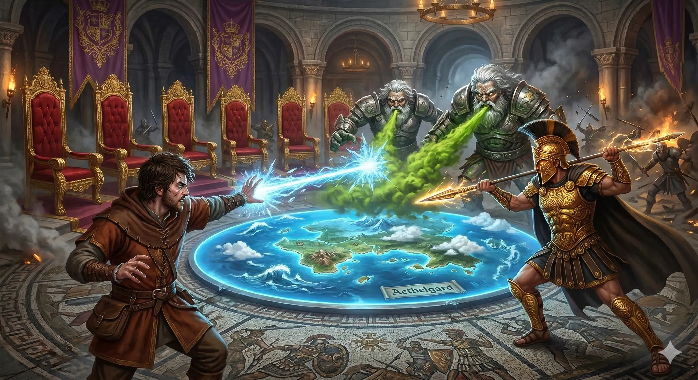
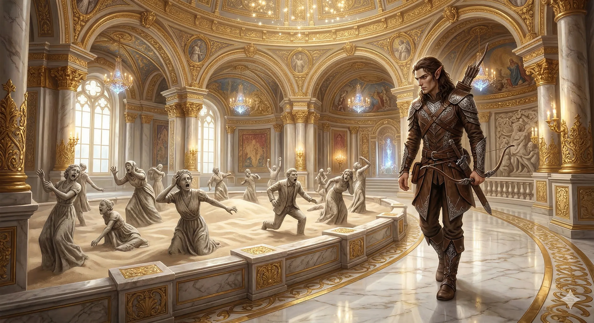
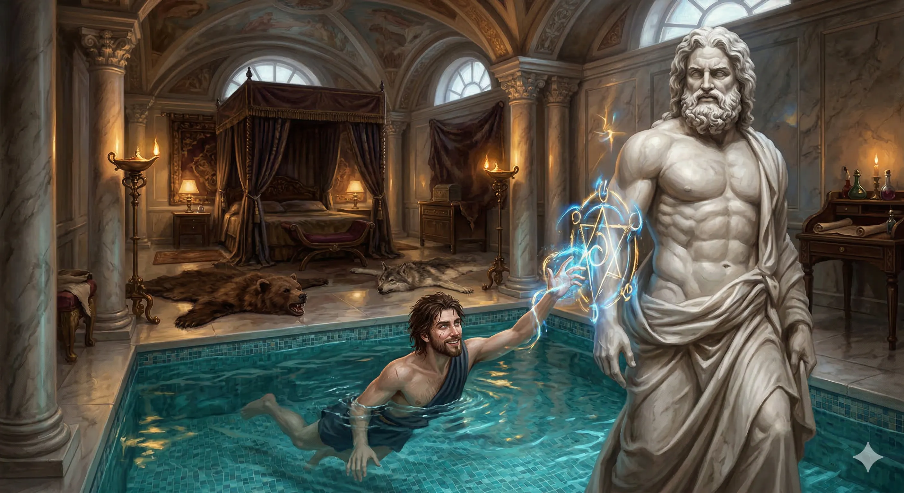
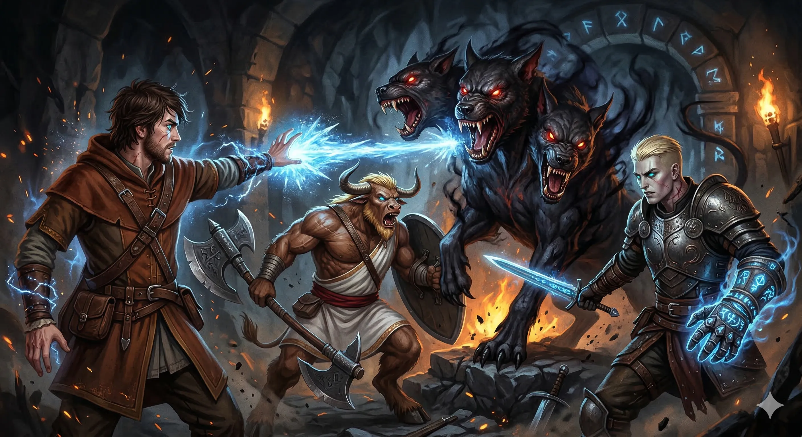
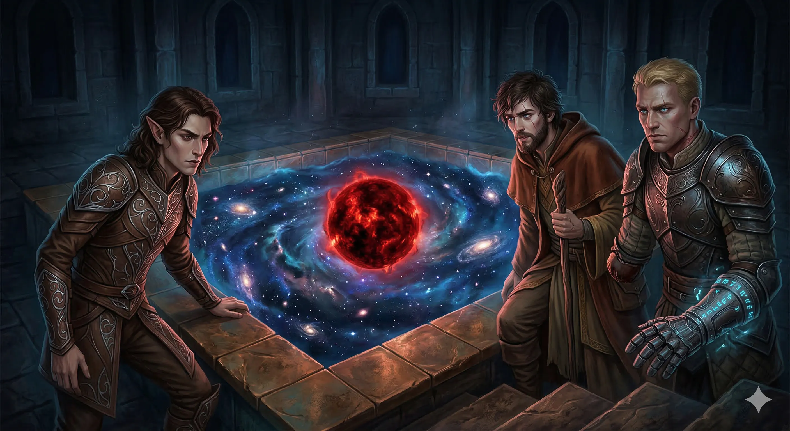
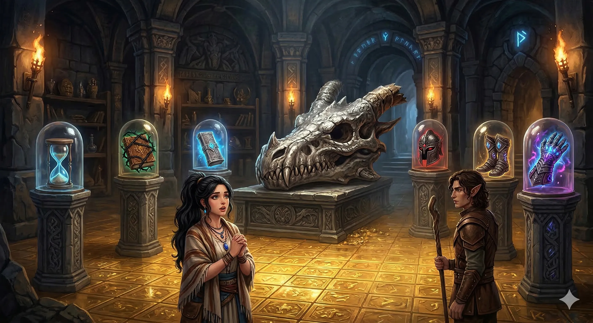
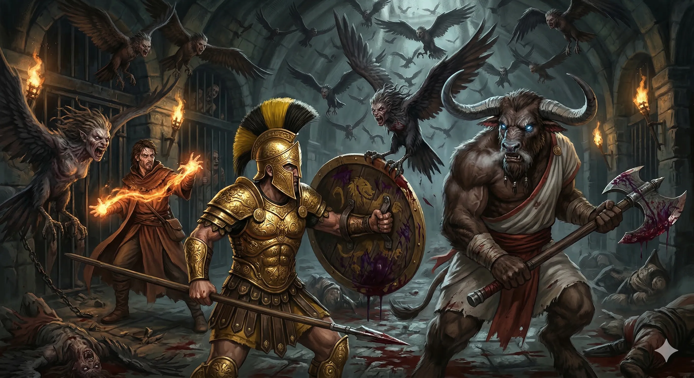
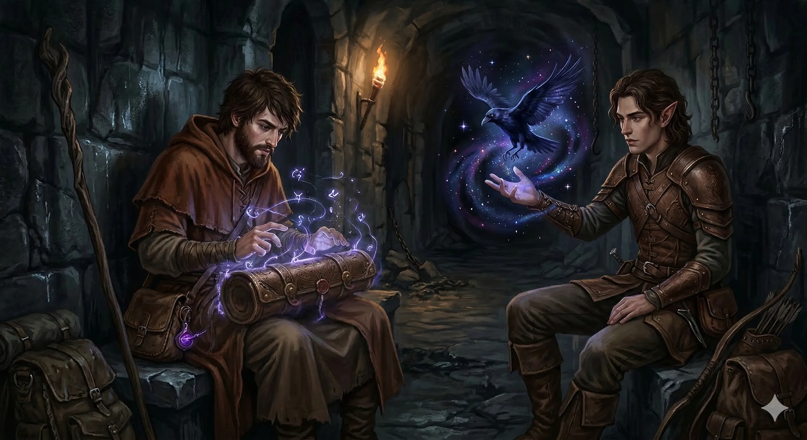
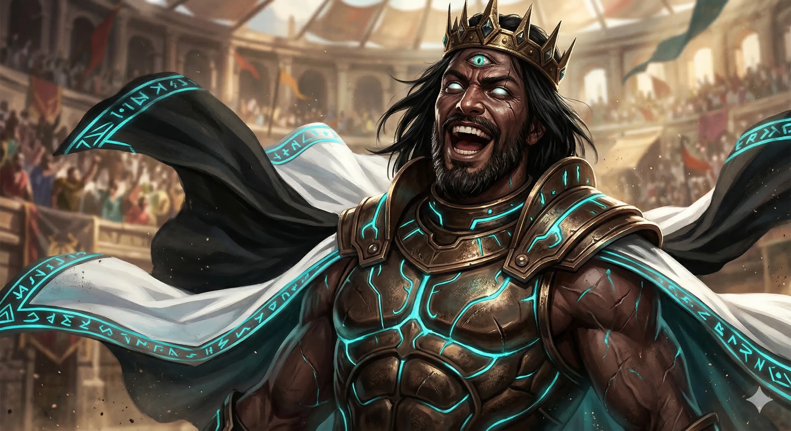

**Data:** 16.03.2026

## Podsumowanie

### Starcie z Golemami

[Prompt](../assets/sessions/073/golem_battle.txt)

Wieża **[[Praxys]]**, mroczna twierdza **[[Sydon|Sydona]]**, Władcy Burz, wznosiła się nad wzburzonym morzem niczym kamienna igła wbita w niebo. Bohaterowie Przepowiedni — **[[Arevon Elorrenthi]]**, **[[Felicjan Janus Twardowski]]**, **[[Orestes]]**, **[[Orion Xul]]** oraz **[[Versir]]** — przebywali już w jej wnętrzu, na prywatnym piętrze samego Tytana. Sesja rozpoczęła się w samym środku zaciekłego starcia z potężnymi **żelaznymi golemami**, mechanicznymi strażnikami wieży, których oblicza przypominały Sydona. Konstrukt, atakujący dotychczas ciosami stalowych pięści i ognistymi bełtami, teraz otworzył swą paszczę nienaturalnie szeroko i zionął strugą **trucizny**. Atak był miażdżący — **55 punktów obrażeń od trucizny** uderzył w bohaterów niczym fala, choć część z nich zdołała zminimalizować skutki dzięki odporności i reakcjom obronnym. Orion, korzystając ze zdolności, odparł część trucizny, podczas gdy Orestes, zahartowany barbarzyńca, w szale bitewnym zdawał się nawet nie zauważyć tego ataku. Felicjan, czarodziej o bystrym umyśle, uderzył w golema **lodem**, wybierając mroźny żywioł jako najskuteczniejszy przeciwko metalowemu przeciwnikowi. Jego **Ray of Frost** okazał się zaskakująco skuteczny — trafienie krytyczne posłało przez golema falę chłodu, która pokryła jego pancerz szronem, a dodatkowe kostki obrażeń z czarodziejskiego kunsztu Felicjana dobiły stworzenie do granicy wytrzymałości. Arevon, druid gwiazd, wspierał drużynę swoimi atakami, a ciosy, które trafiły golema, ostatecznie rozbiły jego metalowy kadłub na kawałki. Zwycięstwo było pewne, lecz kosztowne — bohaterowie zużyli niemało zasobów na pokonanie obu mechanicznych bestii.

### Eksploracja Komnat Wieży

[Prompt](../assets/sessions/073/praxys_exploration.txt)

Po pokonaniu golemów drużyna przystąpiła do metodycznego przeszukiwania piętra. Korytarze **[[Praxys]]** okazały się labiryntem drzwi — niezliczonych, masywnych drzwi, co skłoniło Orestesa do trafnej obserwacji, że **[[Sydon]]**, w czasach swej największej mądrości, kazał zamontować ich tak wiele, aby ewentualni intruzi wyczerpali się samym ich otwieraniem. Za jednym z nich Arevon odkrył sporą komnatę, w której środku znajdowała się zagłębienie przypominające piaskownicę, otoczoną marmurowym chodnikiem. W drobnym, delikatnym piasku stały **kamienne posągi** w pozach pełnych przerażenia — ewidentne dzieło meduzy, z którą dopiero co się rozprawili. Te zastygłe w kamieniu ofiary patrzyły pustymi oczami na przybyszów, milcząc o swojej tragedii.

Istotnym odkryciem okazał się **mechanizm alarmowy** przy schodach. Felicjan i Arevon podjęli próbę jego rozszyfrowania, lecz choć elf zrozumiał zasadę działania, czegoś brakowało — jakiegoś klucza, drugiego składnika uwierzytelnienia, jak żartobliwie zauważył czarodziej. Wówczas Arevon wpadł na pomysł, by użyć sporej złotej monety z czerwonym okiem, znalezionej przy [[Chalcia|Chalcii]]. Próba okazała się **sukcesem**: alarm został wyłączony, a drużyna mogła kontynuować eksplorację bez obawy o natychmiastowe wykrycie.

### Sypialnia Sydona — Narcyzm, Baseny i Ukryte Skarby

[Prompt](../assets/sessions/073/sydon_statue.txt)

Ciekawym pomieszczeniem na tym piętrze okazała się **prywatna sypialnia Sydona**. Bohaterowie wkroczyli do przestronnej komnaty wyłożonej luksusowymi kanapami, pokrytej gigantyczną skórą jakiejś pradawnej bestii. Znajdował się tu **prywatny basen**, nad którym górował nagi, marmurowy posąg Sydona — naturalnej wielkości i, jak z rozbawieniem odkryli bohaterowie, obdarzony proporcjonalnie imponującym atrybutem męskości. Felicjan, nie tracąc czasu, zanurzył się w basenie, kąpiąc się pod czujnym, choć nieruchomym spojrzeniem kamiennego Tytana. Używając **Prestidigitation**, narysował na posągu obsceniczny rysunek — mały akt buntu wobec bóstwa, które zamierzali pokonać.

Przeszukiwanie komnaty przyniosło **cenniejsze odkrycia**. Arevon, wspomagany przez kolegów, znalazł pod łóżkiem **pięknie namalowany obraz**, przedstawiający stopy [[Lutheria|Pani Snów]] zawinięty w materiał — najwyraźniej na tyle wartościowy lub intymny, że [[Sydon]] chował go przed wzrokiem gości. Felicjan natomiast, przeszukując biurko i półki z przyciemniałymi księgami, odnalazł **księgę zaklęć**, nigedyś należącą do jego prababki [[Despina|Despiny]] — cenny spellbook zawierający czary ósmego poziomu, który z pewnością wzbogaci jego magiczny arsenał. Arevon odkrył też **niedawno ruszany pergamin** — dokument, którego treść zawierała przemyślenia Sydona na temat jego dzieci. Versir, rozmyślając nad dalszą drogą, zauważył, że z **kominka** w sypialni prowadzi w górę szyb wentylacyjny — na tyle duży, by zmieścił się w nim nawet dorosły człowiek, a być może i droga do gwiazdy na szczycie wieży.

### Starcie z Cerberem

[Prompt](../assets/sessions/073/cerber_battle.txt)

Za masywnym drzwiami, za którymi unosił się charakterystyczny **smród odchodów** — rozpoznany przez Felicjana jako „psie gówno i siarka" — czaiło się przerażające stworzenie. Gdy bohaterowie otworzyli zamknięte drzwi, z metalowej, pokrytej runami kuli wyłonił się **[[Cerber]]** — trójgłowy piekielny pies o potężnych szczękach i telepatycznych zdolnościach. Stworzenie przemówiło do ich umysłów z złowrogą uprzejmością: *„Ale miło z waszej strony, że mnie tutaj uwolniliście. Teraz możemy się zabawić."*

Walka okazała się brutalna. [[Cerber]] natychmiast pogrążył pomieszczenie w **magicznej ciemności**, która uczyniła większość bohaterów ślepymi — jedynie Versir, obdarzony zdolnością wyczuwania wibracji, mógł dostrzec kontury bestii. Orestes, który nie zdążył włączyć swojego **Rage'a** przed pierwszym atakiem, przyjął potężne ugryzienie wprost na swoją zbroję — **25 punktów obrażeń** wstrząsnęło minotaurem, a kolejne ataki legendarnymi akcjami bestii systematycznie odzierały go z punktów życia. Cerber uwziął się na Orestesa z zaciekłością godną piekielnego psa, gryzac go raz za razem, choć **Shield Wall** Oriona parował część ciosów. Versir walczył **Booming Blade'em**, zadając potężne 57 obrażeń jednym trafieniem, natomiast Felicjan manewrował w ciemności, próbując znaleźć odpowiedni kąt do ataku. Ostatecznie to właśnie rzucony na ślepo **Ray of Frost** Felicjana okazał się śmiertelnym ciosem — mroźny promień przebił się przez odporności Cerbera i powalił bestię na zimny kamień. Zaskoczony własnym sukcesem, czarodziej jedynie mruknął z niedowierzaniem.

Po walce drużyna **zebrała materiały z ciała Cerbera** — serce i skórę, z których rzemieślnik mógłby wykuć potężne przedmioty: **Fearsome Boon** oraz **Cloak of Magic Immunity**.

### Kosmiczny Basen i Pulsująca Gwiazda

[Prompt](../assets/sessions/073/cosmic_pool.txt)

Tuż po pokonaniu Cerbera, bohaterowie dostrzegli w pomieszczeniu niezamknięte drzwi. Znaleźli za nimi dziwny basen, jednak ku ich zaskoczeniu, nie był on wypełniony wodą. Zamiast tego wyglądał jak dosłowne **rozdarcie w tkance rzeczywistości** – okno z widokiem prosto w odmęty **[[Nyx]]**, pełne mgławic i gwiezdnej pustki. Zaklęcie *Detect Magic* Arevona wykazało potężną aurę magii Przywołań (*Conjuration*), sugerującą portal teleportacyjny. Co więcej, sadzawka nie posiadała grawitacji – wrzucony przez elfiego druida kamień bezwładnie uniosł się i odleciał w kosmiczną otchłań.

W tej przestrzeni unosił się jeden zatrważający, ciemnoczerwony i pulsujący świetlisty obiekt. **Arevon**, dzięki swemu połączeniu z kosmosem jako druid gwiazd wyczuł, że owa "gwiazda" nie jest ciałem niebieskim, lecz żywym stworzeniem, którego kosmicznej natury nie potrafił pojąć, dostrzegł jednak w niej smutek i desperację. **Versir** bezskutecznie próbował wciągnąć niezbadany obiekt do swojej Rękawicy, napotykając całkowity brak reakcji. **Felicjan**, na bieżąco wymieniając myśli ze swoją babką [[Despina|Despiną]], dokonał najgroźniejszego odkrycia – pulsujący proces i odcień gwiazdy przypominały mu zaklęcie *Fireball* tuż przed iście niszczycielską detonacją. Gwiazda wyglądała dosłownie jak tykająca bomba. Stwierdziwszy, że okazyjna eksplozja może zniszczyć całe pomieszczenie, drużyna postanowiła wycofać się i zostawić obiekt w spokoju, z zamiarem ponownego zajęcia się nim, gdy będą już gotowi na opuszczenie i ewentualne zniszczenie wieży [[Praxys]].

### Skarbiec Sydona

[Prompt](../assets/sessions/073/sydon_vault.txt)

Za pomieszczeniem Cerbera kryły się jeszcze jedne, najsilniej strzeżone **drzwi skarbca** — masywne, przypominające sejf, wykonane z adamantytu. Arevon, wykorzystując swoje umiejętności złodziejskie i magię, zdołał je w końcu otworzyć. Wnętrze skarbca zapierało dech w piersiach. Na kamiennych filarach, pod szklanymi kopułkami, spoczywało **sześć cennych przedmiotów**: tajemnicza **klepsydra**, **księga owinięta cierniami** ([[Traktat o Prawach i Zobowiązaniach Krwi]]), **scroll case** (zabezpieczony potężnym, wzmocnionym **Arcane Lockiem**), **złowieszczy hełm**, **para magicznych butów**, a także magiczna **rękawica** (identyczna z tą, którą nosił Versir, lecz posiadająca uzupełnione wszystkie kliny). Na honorowym miejscu, pośrodku pomieszczenia, leżała gigantyczna **smocza czaszka** z nadłamanym rogiem. Towarzysząca drużynie kapłanka **[[Melania Twardowska|Melania]]** zareagowała na nią z głęboką zadumą — rozpoznała w niej szczątki **[[Balmytria|Balmytrii]]**, legendarnej srebrnej smoczycy. Pokrywało się to z domysłami bohaterów i uświadomili sobie, że magiczny róg, który Felicjan nosi przy sobie, idealnie pasuje do ubytku w tej czaszce.

Druga z kolei klepsydra, już po jej zidentyfikowaniu, okazała się **legendarnym przedmiotem** o tak potężnych właściwościach, że nawet po wielu przygodach doświadczony Arevon określił ją jako *„najbardziej pojebany item, jaki widział w życiu”*. Bohaterowie z duszą na ramieniu zabrali **wszystkie sześć przedmiotów** ze szklanych gablotek — o dziwo nic nie miało pułapki i nie wybuchło, co przyjęto z ulgą i niemałym niedowierzaniem. Z powodu gabarytów i ciężaru smoczej czaszki, jej transport powierzono centaurowi, [[Pholon|Pholonowi]], który posłużył za wierzchowca dla tego niecodziennego znaleziska przed ostatecznym opuszczeniem komnat skarbca.

### Więzienie Praxys

[Prompt](../assets/sessions/073/praxys_prison.txt)

Winda napędzana przez **harpie na linach** — widok, który zrobił wrażenie na wszystkich poza Arevonem, przyzwyczajonym do wind w Eberronie — zawiozła drużynę na **poziom więzienny**. Ciemne, ponure korytarze wypełnione były celami, w których za kratami jęczeli więźniowie. Harpie, pełniące rolę strażniczek, natychmiast zaatakowały bohaterów. Walka z hordą harpii, choć nie stanowiła zagrożenia porównywalnego z Cerberem, okazała się wyczerpująca ze względu na ich liczebność — kolejne fale skrzydlatych bestii nadlatywały z ciemnych korytarzy. Orion, chroniony swoim imponującym **pancerzem**, stał jak mur nie do przebicia — harpie nie potrafiły przebić się przez jego zbroję nawet jednym trafieniem. Orestes, ledwie żywy po walce z Cerberem, walczył z determinacją, rąbiąc toporem jedną harpię za drugą. Versir leczył minotaura **Lay on Hands**, podtrzymując go przy życiu, podczas gdy Arevon eliminował bestie swoimi atakami na odległość, aż w końcu Felicjan zdecydował się wykorzystać **Fireball** na większe zgrupowanie wrogów.

Wśród uwolnionych więźniów drużyna odnalazła **[[Stavros|Stavrosa]]**, dawnego samozwańczego króla **[[Wyspa Wygnańców|Wyspy Wygnańców]]**, który po przybyciu sług Sydona odmówił dołączenia do jego armii i za karę trafił do lochów. Arevon odnalazł również **[[Lia Amakiir]]**, członkinie jego dawnej załogi z Eberronu. Lia wyjaśniła, że [[Sydon]] zabezpieczył resztki statku **Tranquility** w dokach, choć ten nie nadawał się wtedy do podróży. Reszta więźniów, pod wodzą Stavrosa, miała czekać na powrót bohaterów po oczyszczeniu wieży. Orion, z typową dla siebie bezpośredniością, zagroził jednemu z narzekających więźniów powrotem do klatki — argument ten okazał się wystarczająco przekonujący.

### Odpoczynek, Identyfikacja i Plany na Przyszłość

[Prompt](../assets/sessions/073/heroes_rest.txt)

Drużyna zarządziła **krótki odpoczynek** na poziomie więziennym, wykorzystując czas na leczenie ran, odnawianie zasobów i identyfikację zdobycznych przedmiotów. Felicjan, rytuałem **Identify**, zbadał zamknięty scroll case, odkrywając, że jest on zabezpieczony wzmocnionym **Arcane Lockiem** — rzuconym na wyższym niż zwykle poziomie. **Hełm** zdobyty w skarbcu okazał się potężnym artefaktem zdolnym do wywoływania **Darkness** — przydatnym, lecz, jak zauważył Arevon, „bardzo samolubnym" przedmiotem. **Buty** również posiadały użyteczne właściwości. Najbardziej intrygująca okazała się druga **rękawica** — identyczna z tą, którą nosił Versir, z tymi samymi funkcjami.

Arevon przywołał swojego **familiara** — kruka z ciemnym widzeniem — zużywając na to Wild Shape, a następnie odzyskując slot zaklęcia pierwszego poziomu dzięki rzadko używanej zdolności druida gwiazd. Drużyna przedyskutowała dalszy plan: wieża **[[Praxys]]** miała jeszcze poziom **Heavens**, gdzie miał czekać na nich **[[Goloron]]** — jeden z potężnych dzieci Tytanów — oraz **Nobles** piętro z prywatnymi komnatami dzieci Bliźniaków.

### Arena Golorona

[Prompt](../assets/sessions/073/goloron_arena.txt)

Winda zawiozła bohaterów na piętro **Heavens**. Minotaury patrolujące korytarze spoglądały na bohaterów z lekkim zaciekawieniem, po krótkiej konfrontacji z [[Orestes|Orestesen]] wzruszały ramionami i odchodziły w swoją stronę — przebranie i pewność siebie drużyny robiły swoje. Niedługo wkroczyli do ogromnej komnaty przypominającej **arenę**. Na podłodze widniały plamy wyschniętej krwi, a w powietrzu unosił się zapach przeszłych walk. Tajemniczy głos powitał ich telepatycznie, zapraszając do środka. Gdy drużyna weszła na arenę, krata za nimi **zapadła się**, odcinając drogę ucieczki. Śmiech rozległ się echem po kamiennych ścianach: *„Ha, ha, ha, wpadliście w moją śmiertelną pułapkę!"* Orestes, z typową dla siebie pewnością siebie, odparował: *„On chyba jeszcze nie wie, że to nie tak, że my jesteśmy zamknięci z nim, tylko on jest zamknięty tutaj z nami."*

Magiczna ciemność opadła, odsłaniając widownię, na której siedział **[[Goloron]]** we własnej osobie, w towarzystwie **dwóch cyklopów** i kilku koźlaków, oddzielony od areny **Wall of Force**. A ze skrytek areny wyłonił się **trzy smoki**, gotowe do walki. Goloron, z sadystyczną radością, ogłosił: *„Niech igrzyska się zaczną!"*

Na tym dramatycznym cliffhangerze — z trzema smokami naprzeciw wyczerpanej, lecz niezłomnej drużyny — sesja dobiegła końca, pozostawiając bohaterów Przepowiedni w obliczu kolejnego śmiertelnego wyzwania w samym sercu wieży [[Sydon|Sydona]].

## Kluczowe wydarzenia / decyzje

* Ostateczne pokonanie żelaznych golemów.
* Eksploracja prywatnych komnat Sydona, w tym znieważenie posągu tytana przez Felicjana.
* Pokonanie strażnika skarbca - [[Cerber|Cerbera]].
* Odkrycie kosmicznej wyrwy z widokiem na Morze Astralne oraz tajemniczej, pulsującej gwiazdy zwiastującej potężną eksplozję.
* Rozbrojenie skarbca Sydona, zdobycie sześciu potężnych artefaktów oraz odzyskanie czaszki legendarnej smoczycy [[Balmytria|Balmytrii]].
* Zmasakrowanie strażniczek-harpii i odnalezienie uwięzionego [[Stavros|Stavrosa]] i [[Lia Amakiir]] na poziomie więziennym.
* Konfrontacja z szalonym [[Goloron|Goloronem]] na krwawej arenie i rozpoczęcie starcia z trzema smokami.

## Pamiętne Cytaty

* Arevon: "To jest najbardziej pojebany item jaki widziałem chyba w życiu."
* Felicjan: "Ja używam Prestigitation i rysuję rakietę na Sydonie."
* Felicjan (o gwieździe): "To mi wygląda na... Jakby to miało pierdolnąć."
* Arevon: "Ostatnio jak otworzyliśmy dwie pary zamkniętych drzwi, to się źle skończyło."
* Orestes: "Mały ale wariat! Idę i walę go po nerach!"
* Arevon: "Windy w Eberronie to normalka, muszę powiedzieć."
* Orestes: "Nie, no on chyba jeszcze nie wie, że to nie tak, że my jesteśmy zamknięci z nim, tylko on jest zamknięty tutaj z nami."

## Postacie Niezależne (NPC)

* [[Goloron]]
* [[Stavros]]
* [[Despina]]
* [[Sydon]]
* [[Balmytria]]

## Lokacje

* Wieża [[Praxys]]

## Przedmioty

* Serce i skóra piekielnego cerbera
* Księga zaklęć Despiny
* Obraz ze stópkami Lutherii zawinięty w sztywny materiał
* Notatka Sydona dotycząca jego dzieci
* Pergamin w tubie z pieczęcią Arcane Lock
* Prastara księga owinięta cierniami
* Magiczna klepsydra
* Złowieszczy hełm
* Para magicznych butów
* Czaszka Balmytrii

## Filmy

